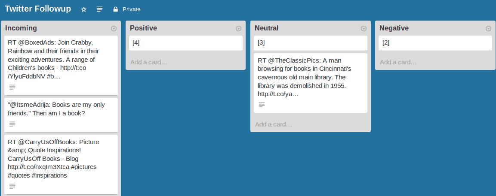

# 用 Ruby 定制 Trello

> 原文：<https://www.sitepoint.com/customizing-trello-ruby/>


Trello 是一个很棒的协作工具。它基于包含卡片列表的纸板。你如何使用它取决于你，因为它是一个有多种用途的简单工具。想要与多人一起计划或协调，或者只是管理自己的待办事项？只需建立一个董事会，并开始行动。

Trello 的所有功能都可以通过其 API 进行控制，而且完全免费，包括使用网络和移动应用程序，以及访问 API。有了 gem，你可以立刻实现电路板的自动化。

## 入门指南

[注册](https://trello.com/signup)，如果你还没有的话，带上你的[开发者密钥](https://trello.com/1/appKey/generate)，因为你将需要这些来进行 API 请求。安装`ruby-trello`宝石

```
gem install ruby-trello
```

并请求一个“成员令牌”,您的全新应用程序可以用它来标识自己

```
TRELLO_DEVELOPER_PUBLIC_KEY="your key" # found at https://trello.com/1/appKey/generate
puts "please visit"
puts "https://trello.com/1/authorize?key=#{TRELLO_DEVELOPER_PUBLIC_KEY}&name=SitepointTutorial&expiration=never&response_type=token&scope=read,write"
puts "and take note of the token"
```

现在我们可以开始设置和使用 Trello API 了

```
require 'trello'

TRELLO_DEVELOPER_PUBLIC_KEY="your key"
TRELLO_MEMBER_TOKEN="the token you just got"

Trello.configure do |trello|
  trello.developer_public_key = TRELLO_DEVELOPER_PUBLIC_KEY
  trello.member_token = TRELLO_MEMBER_TOKEN
end

Trello::Board.all.each do |board|
  puts "* #{board.name}"
end
```

## 积木:木板、列表和卡片

如果一切顺利，您会看到终端中弹出一个现有 Trello 板的列表。电路板是 Trello 中的顶级组织概念，由 Ruby API 包装器中的 [Trello::Board](http://rubydoc.info/github/jeremytregunna/ruby-trello/Trello/Board) 实例表示。

注意`Trello::Board`有一个名为`all`的类方法，就像 ActiveRecord 模型一样。这不是巧合。`ruby-trello`在幕后使用 ActiveModel，使其核心类像 Rails 模型一样行走和嘎嘎叫。这使得这个 API 看起来对 Rails 开发人员来说很熟悉，这意味着您可以将 [Trello::Board](http://rubydoc.info/github/jeremytregunna/ruby-trello/Trello/Board) 、 [Trello::Card](http://rubydoc.info/github/jeremytregunna/ruby-trello/Trello/Card) 或 [Trello::List](http://rubydoc.info/github/jeremytregunna/ruby-trello/Trello/List) 的实例与 Rails 表单助手一起使用。例如，所有这些对象都有一个`valid?`方法，就像 ActiveRecord 实例一样，当无效时,`errors`方法会告诉你问题是什么。

## 建筑在特雷罗的顶部

为了演示如何使用 API，我们将使用 Trello 作为用户界面来实现一个简单的“应用程序”。想象一下，作为一个组织，你想关注人们在 Twitter 上如何谈论你。第一步，你要简单地计算正面、负面和中性推文的数量。为此，我们将建立一个包含四个列表的公告板。对于每一条推文，在“接收”列表中都会弹出一张卡片。友好的客户支持人员可以将每条推文拖到“正面”、“中性”或“负面”列表中。在每个列表的顶部，我们将添加一张卡片，记录添加的卡片数量。我们不时地将所有的卡片存档并更新计数。

在这里你可以看到我们的应用程序在运行，跟踪“书籍”一词的提及。



### 创建公告板和列表

首先，请参考我们的评估板。如果没有找到，就创建它。Trello 已经为我们添加了一些列表(Todo，Done)，但我们更喜欢建立自己的列表。因此，先关闭 Trello 提供的列表，然后添加我们自己的列表。最后，将记录计数的卡片添加到最后三个列表中。

```
BOARD_NAME = 'Twitter Followup'
BOARD_DESC = 'Handling mentions on Twitter'
LIST_NAMES = ['Incoming', 'Positive', 'Neutral', 'Negative']

board = Trello::Board.all.detect do |board|
  board.name =~ BOARD_NAME
end

unless board
  board = Trello::Board.create(
    name: BOARD_NAME,
    description: BOARD_DESC
  )
  board.lists.each(&amp;:close!)

  LIST_NAMES.reverse.each do |name|
    Trello::List.create(name: name, board_id: board.id)
  end

  board.lists.drop(1).each do |list|
    Trello::Card.create(name: '[0]', list_id: list.id)
  end
end
```

请注意 [Trello::Card](http://rubydoc.info/github/jeremytregunna/ruby-trello/Trello/Card) 和 [Trello::List](http://rubydoc.info/github/jeremytregunna/ruby-trello/Trello/List) 如何分别获取封闭实体的`id`，分别是 List 和 board。

对于一个列表来说，`ruby-trello`宝石不会给你更多的选择。对于卡片，你可以更有创意。

```
card = Trello::Card.create(
  name: 'card with memberd and labels',
  list_id: list.id,
  card_labels: [ :yellow, :green ],
  member_ids: [ Trello::Member.find('arnebrasseur').id ]
)
```

更新卡的属性只需简单地设置新值，然后调用`card.save`。

```
card = board.lists[0].cards[0]
card.name = 'First card in the first list, I am'
card.desc += "\n\nThe end of my description, this is."
card.save
```

注意，类似 ActiveRecord 的语法`board.lists.create(...)`不起作用。要将一个列表添加到棋盘上，或者将一张卡片添加到列表中，必须显式地获取棋盘或列表的 id，并将其传递给新对象。

### 跳动的心脏

为了让我们的应用程序“滴答”，我们需要两个不同的后台工作。一个负责将推文推送到板上，另一个负责计数和归档已经分类的卡片。我们将两者结合在一个脚本中，因此我们可以像这样调用它:

```
$ twitter_followup.rb stream sitepoint
```

要获取所有提及 Sitepoint 的推文，请使用 Twitter 的流媒体 API，或者:

```
$ twitter_followup.rb process
```

处理已分类的卡片。

下面的代码块是读取命令行参数并委托给`listen_to_tweets`方法或`process_sorted_cards`的简单方法。`board`已经对我们可用了。`twitter_client`的定义超出了本文的范围，但是你可以看看[的完整脚本](https://github.com/plexus/trello_twitter_followup/blob/master/twitter_followup.rb)，或者在 Sitepoint 上使用 Twitter gem 了解更多关于[的信息。](https://www.sitepoint.com/ruby-social-gems-twitter/)

```
case ARGV[0]
when 'stream'
  topics = ARGV.drop(1)
  listen_to_tweets(board, twitter_client, topics)
when 'process'
  loop do
    process_sorted_cards(board)
    sleep 5
  end
end
```

#### 从推特的消防水管里喝水

对 Twitter 的流媒体 API 的支持是`twitter` gem 的一个相对较新的补充。我们很幸运，因为它让实现`listen_to_tweets`变得短暂而甜蜜。

```
def listen_to_tweets(board, twitter_client, topics)
  incoming_list = board.lists.first

  twitter_client.filter(:track => topics.join(",")) do |object|
    if object.is_a?(Twitter::Tweet)
      Trello::Card.create(
        list_id: incoming_list.id,
        name: object.text,
        desc: object.url.to_s
      )
    end
  end
end
```

该代码将推文的文本设置为卡片的“名称”，这是您在查看纸板时看到的部分。当你打开一张卡片时，你会看到它的描述，这是用来保持一个链接回到最初的推文。在对卡进行归档之前，我们会将这些数据再次提取出来。

#### 把事情加起来

为了完成实际的计数和存档步骤，我们实现了一些辅助方法。第一个函数通过遍历棋盘上的列表返回需要处理的`Trello::List`实例。使用 [Enumerable#find](http://ruby-doc.org/core-2.1.2/Enumerable.html#method-i-find) 返回第一个对象，给定的块为该对象返回一个真值。

```
def score_lists(board)
  LIST_NAMES.drop(1).map do |name|
    board.lists.find { |list| list.name == name }
  end
end
```

类似地，我们需要对保存每一列计数的`Trello::Card`的引用。正则表达式查找只有方括号中的数字的卡片。匹配字符串开头的`\A`和匹配字符串结尾的`\z`是防止误报的重要锚。它们通常比`^`、`$`更受欢迎，因为它们将匹配多行字符串中任何一行的开头和结尾。

```
def find_score_card(list)
  list.cards.find do |card|
    card.name =~ /\A\[\d+\]\z/
  end
end
```

最后，处理已排序的每张卡片，将其存档，并更新记分卡。记分卡的描述保留了所有添加到其中的推文的列表。卡片描述允许[降价](http://daringfireball.net/projects/markdown/)格式。要获得一个要点列表，包括原始推文的链接，我们的标记如下所示

```
* tweet text [↗](http://link.to.the.tweet)`
* next tweet #trelloRuby [↗](http://link.to.the/second/tweet)`
```

`process_card`方法处理准备归档的单个卡:

```
def process_card(card, score_card)
  old_score = score_card.name[/\d+/].to_i
  new_score = old_score + 1

  tweet_text = card.name
  tweet_link = card.desc

  score_card.name = "[#{new_score}]"
  score_card.desc = "* #{tweet_text} [↗](#{tweet_link}) \n" + score_card.desc

  card.closed = true

  [card, score_card].each(&amp;:save)
end
```

请注意，Trello 的 UI 中称为“归档”的操作在 API 中通常称为“关闭”。这也适用于公告板、列表和卡片。Trello 不允许删除任何东西，但是可以存档/关闭任何对象。这意味着它将不再出现，除非明确要求。设置`closed`属性和保存卡片(或列表、板)也可以一步完成，例如`card.close!`。

差不多完成了，我们只需要通过`score_lists`并处理每张卡，除了`score_card`本身:

```
def process_sorted_cards(board)
  score_lists(board).each do |list|
    score_card = find_score_card(list)
    list.cards.each do |card|
      unless card.id == score_card.id
        process_card(card, score_card)
      end
    end
  end
end
```

## 出去玩吧

Trello 有一个漂亮、干净的界面，通过 API，很多事情都是可能的。

*   扩展我们的 Twitter 应用程序，这样写评论会自动回复推文。
*   通过 post-commit 和 web hooks 与 Git 或 Github 集成，为每次提交安排一个代码审查任务。
*   也许周五下午在每张卡片上随机添加动画猫 gif 听起来更像是你的事情。

那你想造什么？请在评论中告诉我们！

## 分享这篇文章