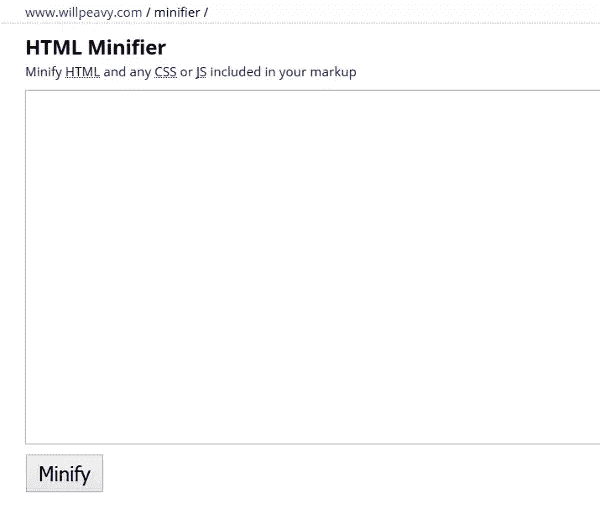

# 用这三个 HTML 缩小工具缩小文件大小

> 原文：<https://www.sitepoint.com/cut-filesize-with-three-html-minification-tools/>

*本文是与 [SiteGround](https://www.siteground.com/go/cut-file-size) 合作创作的系列文章的一部分。感谢您对使 SitePoint 成为可能的合作伙伴的支持。*

虽然对于 HTML 精简的好处还没有明确的一致意见，但是如果你在谷歌的页面速度洞察上测试你的网站，你可能会得到的部分答案是，你应该精简 HTML，CSS 和 JavaScript。

缩小资源意味着去掉多余的元素，也就是浏览器为了正确处理文档而不需要的元素。

将这一概念应用于 HTML 文档，缩小可能包括以下内容:

*   剥离 HTML 注释，以及内联 CSS 和 JavaScript 代码中的注释
*   删除 HTML 代码和内联 CSS 和 JavaScript 中的空白
*   删除不必要的引号、空属性等。
*   摆脱 CDATA 节

这些操作有助于减小文件大小，但也使保持代码整洁和可维护变得更加容易。

## 压缩与缩小资源

如果你使用 GZip，缩小 HTML 仍然值得吗？

反对 HTML 缩小化的一个理由是，压缩 HTML 页面已经消除了空白并减小了文件大小。这使得缩小变得毫无用处。

首先，需要指出的是，这两种操作是不同的，并且不会获得相同的结果。

缩小的结果创建了一个由浏览器可以解析和执行的完全有效的代码组成的文件，就像同一文件的未缩小版本一样。另一方面，

> Gzipping 查找所有重复的字符串，并用指向该字符串第一个实例的指针替换它们。…在网络上，gzipping 是由服务器直接完成的。…服务器压缩文件，然后像这样通过网络发送。浏览器接收文件并在使用前将其解压缩。
> 
> 克里斯·科伊尔谈 [CSS 技巧](https://css-tricks.com/the-difference-between-minification-and-gzipping/#article-header-id-1)

也就是说，使用这两种技术可以让您节省一些字节。例如，在[GZipping 与缩小 HTML 文件的效果](http://madskristensen.net/post/effects-of-gzipping-vs-minifying-html-files)中，Mads Kristensen 讨论了一个小实验，其中包括缩小和 GZipping 四个流行网站的 HTML 文件，即 Amazon.com、cnn.com、twitter.com 和 xbox.com。结果表明，通过压缩和缩小，文件大小减少了 9-16%。

以下工具将为您自动缩小过程。

## 最小化

Minimize 是一个开源的服务器端 HTML5 minifier，基于[节点-htmlparser2](https://github.com/fb55/htmlparser2) 。

该工具:

*   可以缩小 HTML5 代码(不是旧的 HTML 草稿，没有内联 PHP 代码或模板文件)
*   它是高度可配置的
*   能区分条件 IE 评论

…以及更多。更多详情可以访问 GitHub 上的[项目页面](https://github.com/Swaagie/minimize)。

## 威尔·皮维的 HTML 迷你程序

HTML Minifier 是一个用 PHP 开发的在线 HTML 缩小工具。

要使用它，将您的 HTML 粘贴到 textbox 中，包括您可能已经添加到标记中的任何 CSS 和 JavaScript，然后单击 *Minify* 按钮。

为了确保脚本在缩小后仍然工作，Peavy 建议您用分号(；)并使用多行注释(`/* */`)

## Kangax HTML Minifier

Kangax [HTML Minifier](https://github.com/kangax/html-minifier) 是一个基于 JavaScript 的 HTML Minifier，拥有超能力。

这些只是该工具的部分功能:

*   删除 HTML 注释
*   从样式和脚本中移除注释
*   删除 CDATA 节
*   移除属性的引号
*   删除不必要的属性
*   删除空白属性
*   通过 [HTMLLint](https://github.com/kangax/html-lint) 验证输入

您可以根据自己的需要配置每个选项。

要了解更多关于 HTML 迷你器的信息，你可以在 Kangax 的[实验 HTML 迷你器](http://perfectionkills.com/experimenting-with-html-minifier/)和[完美杀死](http://perfectionkills.com/optimizing-html/)中找到所有信息。

## 结论

虽然没有缩小 CSS 和 JavaScript 那么普遍，但 HTML 缩小是谷歌 PageSpeed Insights 建议的一部分。这件事是否值得做仍然是一个悬而未决的问题。

在这篇文章中，我列出了三个工具，它们可以帮助你通过自动化大量的 HTML 缩小任务来减少网页的内容。

你呢，你认为缩小 HTML 是个好主意吗？你最喜欢的 HTML 缩小工具是什么？

## 分享这篇文章