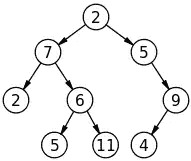

# PHP 开发人员的数据结构:树

> 原文：<https://www.sitepoint.com/data-structures-2/>

在上一篇文章中，我介绍了两种基本的数据结构:堆栈和队列。这篇文章很受欢迎，所以我决定在 SitePoint 上断断续续地分享数据结构。在这篇文章中，我将向你介绍树，软件设计和架构中使用的另一种数据结构。更多的文章和数据结构将随之而来！

## 搜索问题

数据结构管理通常涉及 3 种类型的操作:

*   **插入**–将数据插入结构的操作。
*   **删除**–从结构中删除数据的操作。
*   **遍历**–从结构中检索数据的操作。

在堆栈和队列的情况下，这些操作是面向位置的——也就是说，它们受到项目在结构中的位置的限制。但是，如果我们需要根据数据的值来存储和检索数据呢？

考虑下面的列表(排列不分先后):


显然，堆栈和队列都不合适；如果值是列表中的最后一个或者根本不在列表中，我们可能必须遍历整个结构才能找到特定的条目。假设所需的值在列表中，并且每个项目都同样可能包含所需的值，我们将需要访问平均 n/2 个项目——其中 n 是列表的长度。列表越长，找到我们要找的东西所需的时间就越长。在这种情况下，所需要的是以一种方便搜索的方式安排数据的能力，这就是树的用处。

我们可以通过以下基本操作将这些数据抽象为“表格”:

*   **创建**–创建一个空表。
*   **插入**–向表格中添加一个项目。
*   **删除**–从表格中删除一个项目。
*   **检索**–在表格中找到一个项目。

如果这看起来有点类似于数据库创建、读取、更新、删除(CRUD)操作，那是因为树与数据库以及它们如何在内部表示数据记录密切相关。

我们表示“表”的一种方式是线性实现——这样它就反映了表的平面、列表式外观。线性实现可以是排序的或未排序的，也可以是顺序的(即使用记录分隔符的固定长度记录或可变长度记录)或链接的(使用记录指针)。不管怎样，早期的数据库设计，如 IBM 的索引顺序存取法(ISAM)和遗留文件系统，如 MS-DOS 的文件分配表(FAT)都是基于线性实现的。

顺序实现的缺点是在插入和删除方面开销更大，而链接实现允许动态存储分配。然而，搜索固定长度的顺序实现比链接实现有效得多，因为它可以更容易地实现二分搜索法。

## 树

因此，正如我们所了解的，有时使用非线性搜索实现(如树)可能更有效。树提供了顺序表和链接表实现的最佳特性，并以非常高效的方式支持所有的表操作。由于这个原因，许多现代数据库和文件系统现在使用树来促进索引。比如 MySQL 的 MyISAM 存储引擎用树做索引，苹果的 HFS+，微软的 NTFS，Linux 的 btrfs 都用树做目录索引。



正如您所看到的，树是典型的层次结构，暗示着节点之间的父子关系。没有父节点的节点称为*根节点*，没有子节点的节点称为*叶节点*。同一父节点的子节点称为*兄弟节点*。术语*边*指的是节点之间的连接(用箭头表示)。

你会注意到上图中的二叉树是一个双向链表的变体。事实上，如果我们重新排列节点来展平树，它看起来就像一个双向链表！

最多有两个子节点的节点是树的最简单形式，我们可以利用这一属性将二叉树构造为二进制节点的递归集合:

```
<?php
class BinaryNode
{
    public $value;    // contains the node item
    public $left;     // the left child BinaryNode
    public $right;     // the right child BinaryNode

    public function __construct($item) {
        $this->value = $item;
        // new nodes are leaf nodes
        $this->left = null;
        $this->right = null;
    }
}

class BinaryTree
{
    protected $root; // the root node of our tree

    public function __construct() {
        $this->root = null;
    }

    public function isEmpty() {
        return $this->root === null;
    }
}
```

### 插入节点

向树中添加项目更“有趣”。有几种解决方案——其中许多涉及旋转和重新平衡采油树。事实上，不同的树结构，如 AVL 树、红黑树和 B 树，已经发展到解决与节点插入、删除和遍历相关的各种性能问题。

为简单起见，让我们考虑一个伪代码的基本实现:

```
1\. If the tree is empty, insert new_node as the root node (obviously!)
2\. while (tree is NOT empty):
  2a. If (current_node is empty), insert it here and stop;
  2b. Else if (new_node > current_node), try inserting to the right
      of this node (and repeat Step 2)
  2c. Else if (new_node < current_node), try inserting to the left
      of this node (and repeat Step 2)
  2d. Else value is already in the tree
```

在这个简单的实现中，假设采用分而治之的方法。任何比当前节点值小的都向左移动，任何比当前节点值大的都向右移动，重复的都被拒绝。请注意这种策略是如何立即适用于递归解决方案的，因为在这种情况下，树也可以是子树。

```
<?php
class BinaryTree
{
...
    public function insert($item) {
        $node = new BinaryNode($item);
        if ($this->isEmpty()) {
            // special case if tree is empty
            $this->root = $node;
        }
        else {
            // insert the node somewhere in the tree starting at the root
            $this->insertNode($node, $this->root);
        }
    }

    protected function insertNode($node, &$subtree) {
        if ($subtree === null) {
            // insert node here if subtree is empty
            $subtree = $node;
        }
        else {
            if ($node->value > $subtree->value) {
                // keep trying to insert right
                $this->insertNode($node, $subtree->right);
            }
            else if ($node->value < $subtree->value) {
                // keep trying to insert left
                $this->insertNode($node, $subtree->left);
            }
            else {
                // reject duplicates
            }
        }
    }
}
```

删除节点是另一回事，我们将留待下次讨论，因为这需要比本文更深入的讨论。

### 在树上散步

注意我们是如何从根节点开始，一个节点一个节点地遍历树，找到一个空节点的？有 4 种用于遍历树的一般策略:

*   **预排序**–处理当前节点，然后遍历左右子树。
*   **按序**(对称)–先向左遍历，处理当前节点，再向右遍历。
*   **后序**–先左右遍历，然后处理当前节点。
*   **级别顺序**(广度优先)–处理当前节点，然后在遍历下一级别的节点之前处理所有兄弟节点。

前三种策略也被称为深度优先或深度顺序搜索——在回溯之前，从根(或指定为根的任意节点)开始，沿着分支尽可能远地遍历。这些策略中的每一个都在不同的操作环境和情况下使用，例如，前序遍历适合于节点插入(如在我们的例子中)和子树克隆(嫁接)。有序遍历通常用于搜索二叉树，而后序遍历更适合删除(修剪)节点。

为了说明有序遍历是如何工作的，让我们对我们的例子做一些修改:

```
<?php
class BinaryNode
{
...
    // perform an in-order traversal of the current node
    public function dump() {
        if ($this->left !== null) {
            $this->left->dump();
        }
        var_dump($this->value);
        if ($this->right !== null) {
            $this->right->dump();
        }
    }
}

class BinaryTree
{
...
    public function traverse() {
        // dump the tree rooted at "root"
        $this->root->dump();
    }
}
```

调用`traverse()`方法将从根节点开始以升序显示整个树。

## 结论

嗯，我们已经到终点了！在本文中，我向您介绍了树数据结构及其最简单的形式——二叉树。您已经看到了如何将节点插入树中，以及如何按深度顺序递归遍历树。

下一次我将讨论广度优先搜索，并介绍一些新的数据结构。敬请期待！在此之前，我鼓励您探索其他树类型以及它们各自的插入和删除节点的算法。

图片 via[Fotolia](http://us.fotolia.com/?utm_source=sitepoint&utm_medium=website_link&utm=campaign=sitepoint "Royalty Free Stock Photos at Fotolia.com")

## 分享这篇文章