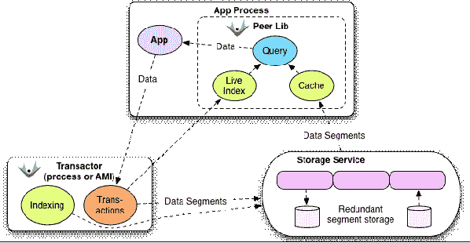

# 原子的

> 原文：<https://www.sitepoint.com/datomic/>

这是一个不定期系列中的第一篇文章，介绍了 SQL 主流之外的有趣的数据库技术。我将向您介绍这些 DBMS 的核心概念，分享一些关于它们的想法，并告诉您在哪里可以找到更多信息。

大部分内容并不打算在你的下一个项目中立即使用:相反，我想提供灵感并交流对该领域问题的有趣的新观点。但是，如果有一天，那些失败者中的一个成为了现状，你可以告诉每个人，在它变酷之前你就知道了…

玩笑归玩笑，我希望你会喜欢这些。让我们开始吧。

## 概观

Datomic 是 Clojure 的创造者 Rich Hickey 的最新成果。它于今年早些时候发布，基本上是一种新型的 DBMS，融合了他关于当今数据库应该如何工作的想法。这是一个可弹性伸缩的、基于事实的、对时间敏感的数据库，支持 ACID 事务和连接。

这项有趣的技术围绕着以下几个核心方面:

1.  新颖的建筑。同行、应用和交易者。
2.  基于事实的数据模型。
3.  一种强大的声明式查询语言“Datalog”。

Datomic 团队希望其 DBMS 提供第一个“真正的”记录实现:计算机出现之前的记录保存了过去的信息，而在今天的数据库中，旧数据只会被新数据覆盖。数据原子改变了这一点，并保存了所有信息，通过使时间成为系统的一个组成部分来区分信息。

## 1.新颖的建筑

Datomic 最具革命性的一点是它的建筑。Datomic 将应用程序的大脑放回客户端。在传统的设置中，服务器处理从查询和事务到实际存储数据的所有事情。随着负载的增加，会添加更多的服务器，数据集也会在这些服务器之间进行分片。正如今天大多数 NoSQL 数据库显示的那样，这种方法非常有效，但正如 Hickey 先生所说，这是以牺牲一些“大脑”为代价的。一致性和/或查询能力的损失是规模的一个众所周知的折衷。

为了实现分布式存储，但是使用强大的查询语言和一致的事务，Datomic 利用现有的可伸缩数据库作为简单的分布式存储服务。所有复杂的数据处理都由应用程序自己处理。几乎就像在本地桌面应用程序中一样(如果你还记得其中一个的话)。

这让我们看到了数据基础设施的第一个基石:

### 对等应用程序

通过将 Datomic 库嵌入到您的客户机代码中，可以创建一个对等体。从那时起，应用程序的每个实例都将能够:

*   ● 与交易者和存储服务通信
*   ● 运行 Datalog 查询，访问数据并处理工作集的缓存

每个对等体在内存中管理自己的工作数据集，并与全局数据集的“动态索引”同步。这使得应用程序可以运行非常灵活的查询，而不需要往返(在“批评”一节中有更多相关内容)。

但到目前为止，我们只恢复了查询能力。为了重新启用一致的事务，Datomic 又进了一步:它将存储服务设置为只读，并强制所有写操作通过一种新的架构组件“事务处理程序”。

### 翻译

交易者将:

*   ● 处理 ACID 交易
*   ● 同步写入冗余存储
*   ● 向同事传达变更
*   ● 在后台索引您的数据集

似乎 Datomic 团队摒弃了使关系型 DBMS 难以在单独的模块中伸缩的所有东西，并试图不对此过于担心。例如，[数据基本原理](http://www.datomic.com/rationale.html)声明:

*“当读取与写入分离时，写入永远不会被查询所阻碍。在数据体系结构中，处理程序专用于事务，根本不需要服务读取！”*

和

*“将查询引擎放在对等点上使得查询功能与应用程序本身一样灵活。此外，将查询引擎放入应用程序本身意味着它们永远不会等待彼此的查询。”*

第一种说法对于某些读操作是正确的，但是我找不到关于 Transactor 如何在事务中处理读操作的提示。虽然提到了*“每个对等体和交易者管理其自己的数据段本地缓存，在内存“*”中，这将需要完美的缓存同步。否则，只保证一个对等体的一致性，坦白地说，这毫无意义。希望这种管理开销不会抵消有前途的 ACID 功能和内存操作的性能增益。

第二句话最初是有道理的，但仍然引起了一些关注:

当一个交易者面临过多负载时会发生什么？Datomic 团队希望避免分片，但在某些时候这难道不是必要的吗？此外，即使我们假设事务的数量不会随着对等体的增加而增加，但是将更改传输到所有对等体所需的时间肯定会增加。

总之，对于较小的数据集来说，处理程序可能是一个令人惊奇的东西，但可能会成为潜在的性能瓶颈或单点故障。

### 存储服务

这些服务处理数据的分布式存储。一些可能性:

*   ● 交易者-本地存储(免费，用于在单机上玩 Datomic)
*   ● SQL 数据库(需要 Datomic Pro)
*   ● DynamoDB(需要 Datomic Pro)
*   ● Infinispan 内存集群(需要 Datomic Pro)

…再加几个。存储服务支持可能是试用 Datomic 的一个重要原因，但不幸的是，只有临时本地存储可供 Datomic 免费用户(也就是不愿意支付 3000 美元以上购买全新 DBMS 的用户)使用。

总而言之，Datomic 架构带来了大量创新的想法和潜在的好处，但它在现实世界中的适用性仍有待证明。

请阅读文档中详细的[架构概述](http://docs.datomic.com/architecture.html)或者观看由希基先生本人制作的[这个 20 分钟的视频](http://www.youtube.com/watch?feature=player_embedded&v=RKcqYZZ9RDY)。

*(原图取自* [此处。)](http://docs.datomic.com/architecture.html)

## 2.基于事实的数据模型

Datomic 不会将数据建模为文档、对象或表格中的行。相反，数据被表示为不可变的事实，称为“Datoms”。它们由四部分组成:

1.  实体
2.  属性
3.  价值
4.  交易时间戳

Datoms 很容易让人联想到 RDF 三元组存储中使用的主谓宾模式。

任何东西都可以是数据:

*“约翰的余额是 12000 美元”→【约翰:余额 12000 <时间戳>*

这些属性定义是数据集中唯一隐含的模式类型。

在关系数据库中，这将在“balance”单元格的“john”行表示为 12000(数据是面向位置的)。如果现在，一个月后，John 的余额变为 6000，这个特定的单元格将被清除，新的值将被放入。约翰一个月前账户上有 12，000 英镑的事实已经一去不复返了。

创建 Datomic 的一个主要原因是这样一种感觉，即今天的硬件终于能够保持数据的真实记录，这是迄今为止其他流行的 DBMS 所不能做到的。Datomic 从不更新数据，它只是写入新的事实并保留旧的事实。这为许多有趣的、对时间敏感的查询铺平了道路。

由于其不可变的、基于事实的性质，Datomic 将通过简单地插入一个新的事实来处理 John 的新平衡:

*【约翰:余额 6000 <时间戳 2>*

事实永远不会丢失。如果 John 对他的当前余额感兴趣，他会查询最近的数据。但没有什么能阻止他随时查询自己的完整资产负债表。此外，Datoms，顾名思义，是原子的，是规范化的最高可能形式。您可以用任意多的实体来表达您的数据模型，更大的画面是通过隐式连接自动构建的。

其他好处

*   ● 支持稀疏、不规则或分层数据

○ 属性值可以是对其他实体的引用

*   ● 多值属性的原生支持
*   ● 没有强制模式
*   ● 无需单独存储数据历史，时间是 datomic 不可分割的一部分

这种灵活性使得 Datomic 几乎可以发挥任何功能，例如一个完整的 [graph API](https://github.com/datablend/blueprints/tree/master/blueprints-datomic-graph) 。

这种方法的一些缺点:

*   ● 不适合大型动态数据

由于更新总是被写成带有较新时间戳的新数据，大的动态数据块将很快填满相当多的空间

*   灵活的方案容易导致轻率

○ 仍应在数据模型上进行一些规划

*   ● 属性冲突

从一开始就应该使用名称间距

## 3.数据日志，遗失事实的发现者

数据查询由“WHERE”、“FIND”和“IN”子句以及一组适用于事实的规则组成。然后，查询处理器在数据库中查找所有匹配的事实，并考虑隐含信息

规则是“事实模板”，数据库中的所有事实都与之匹配。

显式规则可能是这样的:

*【？实体:年龄 42]*

隐式规则看起来像变量绑定:

*【？实体:年龄？一]*

并且可以与类似 LISP/Clojure 的表达式结合使用:

*[ ( <？一个 30)】*

匹配购买了产品 p 的年龄大于 40 岁的客户的规则集如下所示:

*【？顾客:年龄？一] [ ( >？a 40)】[？客户:已购买 p]*

然后，规则集被嵌入到基本查询框架中:

*【找到<变量>:其中<规则>*

<variables>是您希望包含在结果中的变量集。我们只对客户感兴趣，对他的年龄不感兴趣，所以我们的客户查询应该是这样的:</variables>

*【:找？顾客:哪里[？顾客:年龄？一] [( >？a 40)】[？客户:购买了 p]]*

我们现在通过以下方式运行:

*Peer.q(查询)*

这种语法可能需要一些时间来适应(除非你熟悉 Clojure)，但是我发现它可读性很好，而且正如 Datomic 基本原理所承诺的，“意义是显而易见的”。

## 质疑过去

要在事实历史上运行查询，不需要更改查询字符串:

*Peer.q(query，db.asOf( <时间> )*

您还可以在假设的新数据上模拟您的查询。有点像对未来的预测查询:

*Peer.q(query，db.with( <数据>)*

关于查询语法的更多信息，请参考非常好的[文档](http://docs.datomic.com/query.html)和这个[视频](http://www.youtube.com/watch?feature=player_embedded&v=bAilFQdaiHk#at=572)。

## 用例

Datomic 当然不是要消灭所有其他的 DBMS，但是对于某些应用程序来说，它是一个有趣的匹配。我首先想到的是分析:

*   ● 事实是不可改变的，非 ACID 写入应该很快，因为分析系统通常不需要很强的一致性
*   ● 事实是有时效性的。这对于分析来说很有趣。

状态消息、推文或价格也可以根据其动态特性更自然地存储。此外，由于这个 DBMS 被显式地构造为提供“真实”的记录，所以与记录相关的所有内容都应该是合适的。

总的来说，Datomic 的时间敏感图层为现有数据集提供了一个有趣的变化。它可以作为一个普通的数据库管理系统，具有额外的洞察力。想象一下，您的电子商务数据库包括每个商品的完整价格历史和每个客户的参与历史。为复杂的问题找到一个快速的答案不是很有趣吗？“这种产品是什么时候开始流行的？–哦，那是在降价 10 美元之后。”“该客户从什么时候开始每天使用该网站？–这是两个月前的数据，这是他的每日页面时间增长图。

## 批评

革命性的想法，比如 Datomic 所基于的想法，应该总是受到赞赏，但要从多个角度进行分析。这项技术还太年轻，无法做出最终判断，但一些早期的批评包括:

*   ● 数据与处理的分离。
    所有必需的数据都必须移动到客户端应用程序，然后才能进行处理/查询。一旦你使用更大的数据集，这可能会带来一个问题。本地缓存也将不可避免地限制工作集的增长。一旦超过这个上限，到服务器后端的往返将是必要的，甚至会有更大的性能损失。Datomic 团队希望它的方法“适用于大多数常见的用例”，但这在早期阶段无法得到验证。

*   ● 作为单点故障和瓶颈的交易者组件
*   对于只读基础设施来说，分片可能不是必需的，但是一旦事务处理程序必须处理大量负载，它将需要某种类型的分片机制。
*   Datomic Pro 的定价很受限制，而且考虑到 Datomic Free 对任何类型的产品使用都没有好处，构建一些实验项目对一般开发人员来说都很困难。

亚历克斯·波佩斯库在 Datomic 上写了一篇很棒的文章，集中在这些关键点和其他一些地方。

## 结论

我个人认为，Datomic 背后的很多概念和想法，尤其是让时间成为一等公民，都是很棒的，承载了很多潜力。但我看不到我在不久的将来使用它，因为我想为自己证明团队的一些性能声明，这一愿望与我相对于职业许可证的财务状况不相符。

否则，Datomic 的一些高级功能，如全文搜索、多数据源(除了分布式存储服务之外)和仅使用系统进行本地数据处理的可能性，可能会很有用。

请在评论中分享你的想法！

## 潜得更深

○ [基本原理](http://www.datomic.com/rationale.html)

○[Datomic](http://www.google.com/url?q=http%3A%2F%2Fwww.datomic.com%2Fvideos.html&sa=D&sntz=1&usg=AFQjCNFgNhj69yiJCKEAUxqH-_anxfezog)上几个很棒的视频

○ [回到未来带原子](http://architects.dzone.com/articles/back-future-datomic)

○ [Datomic:初始分析](http://thornydev.blogspot.de/2012/06/datomic-initial-analysis.html)(将 Datomic 与其他 DBMS 进行比较)

## 分享这篇文章