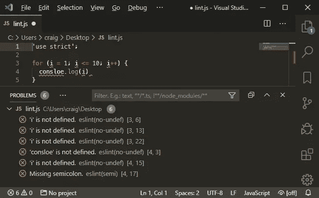
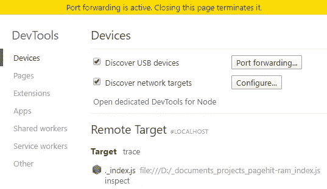
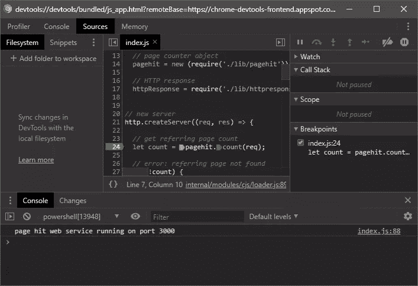
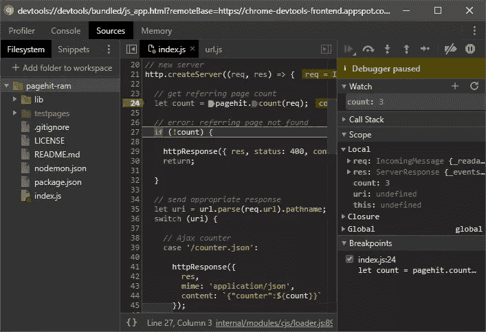
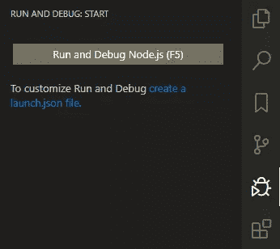
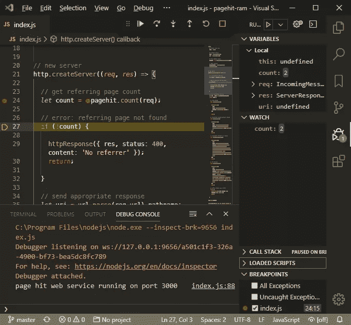
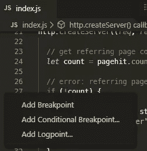
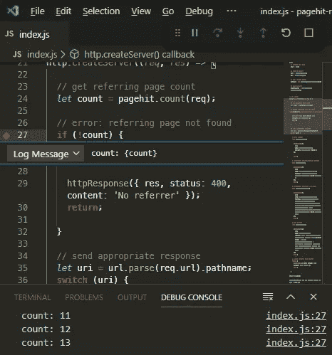
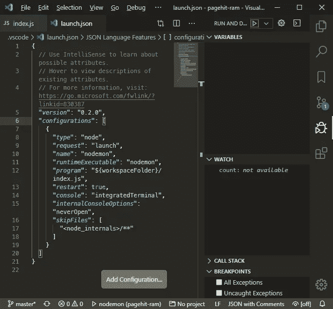
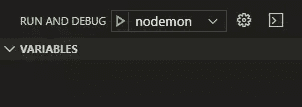

# 如何调试 Node.js 应用程序:提示、技巧和工具

> 原文：<https://www.sitepoint.com/debug-node-app-tips-tricks-tools/>

软件开发是复杂的，在某些时候，你的 Node.js 应用程序会失败。如果你*幸运*，你的代码会崩溃并显示一个明显的错误信息。如果您不走运，您的应用程序将继续运行，但不会产生您期望的结果。如果你真的很不幸，一切都会很好，直到第一个用户发现一个灾难性的磁盘擦除错误。

## 什么是调试？

**调试**是修复软件缺陷的黑艺术。修复一个 bug 通常很容易——一个正确的字符或一行额外的代码就能解决问题。找到那个 bug 是另一回事，开发人员可能会花费很多不愉快的时间试图找到问题的根源。幸运的是，Node.js 有一些很好的工具来帮助跟踪错误。

### 术语

调试有自己的晦涩术语，包括以下术语:

| 学期 | 说明 |
| --- | --- |
| 断点 | 调试器停止程序以便检查其状态的时间点 |
| 调试器 | 一种提供调试功能的工具，例如逐行运行代码来检查内部变量状态 |
| 特征 | 正如声明中所说:“这不是 bug，这是特性”。所有的开发人员都会在他们职业生涯的某个时候说这句话 |
| 频率 | 多久或者在什么条件下会出现一个 bug |
| 它不起作用 | 最常做但最没用的错误报告 |
| 日志点 | 给调试器的一条指令，用来显示执行过程中某一点的变量值 |
| 记录 | 将运行时信息输出到控制台或文件 |
| 逻辑错误 | 该程序运行正常，但没有按预期运行 |
| 优先 | 在计划更新列表中分配一个 bug |
| 竞态条件 | 难以追踪的错误依赖于不可控事件的顺序或时间 |
| 重构 | 重写代码以提高可读性和维护性 |
| 回归 | 之前修复的错误再次出现，可能是由于其他更新 |
| 有关系的 | 与另一种昆虫相似或相关的昆虫 |
| 繁殖 | 导致错误所需的步骤 |
| RTFM 误差 | 伪装成错误报告的用户不称职，通常会有一个“阅读*翻转*手册”的回应 |
| 进入 | 在调试器中逐行运行代码时，单步执行被调用的函数 |
| 走出去 | 逐行运行时，完成当前函数的执行并返回到调用代码 |
| 跨过 | 逐行运行时，完成命令的执行，而不单步执行它调用的函数 |
| 严重 | 一个错误对系统的影响。例如，数据丢失通常被认为比 UI 问题更成问题，除非发生的频率非常低 |
| 堆栈跟踪 | 错误发生前调用的所有函数的历史列表 |
| 句法误差 | 印刷错误，如`console.lug()` |
| 用户错误 | 由用户而非应用程序引起的错误，但仍可能导致更新，这取决于此人的资历 |
| 看 | 调试器执行期间要检查的变量 |
| 观察点 | 类似于断点，只是当变量被设置为特定值时程序会停止 |

## 如何避免 bug

在测试应用程序之前，错误通常是可以避免的…

### 使用好的代码编辑器

一个好的代码编辑器将提供许多功能，包括行号、自动完成、颜色编码、括号匹配、格式化、自动缩进、变量重命名、代码片段重用、对象检查、函数导航、参数提示、重构、不可达代码检测、建议、类型检查等等。

Node.js devs 被免费的编辑器宠坏了，例如 [VS Code](https://code.visualstudio.com/) 、 [Atom](https://atom.io/) 和[括号](http://brackets.io/)，以及大量的商业替代品。

### 使用代码棉签

在保存和测试代码之前，linter 可以报告代码错误，比如语法错误、缩进不当、未声明的变量和括号不匹配。JavaScript 和 Node.js 的流行选项有 [ESLint](https://eslint.org/) 、 [JSLint](https://www.jslint.com/) 和 [JSHint](https://jshint.com/) 。

这些通常作为全局 Node.js 模块安装，因此您可以从命令行运行检查:

```
eslint myfile.js 
```

然而，大多数 linter 都有代码编辑器插件，比如 VS 代码的 [ESLint 和 Atom](https://marketplace.visualstudio.com/items?itemName=dbaeumer.vscode-eslint) 的 [linter-eslint，它们会在你输入时检查你的代码:](https://atom.io/packages/linter-eslint)



### 使用源代码管理

像 [Git](https://git-scm.com/) 这样的源代码控制系统可以帮助保护你的代码和管理修改。发现何时何地引入了 bug 以及谁应该受到指责变得更加容易！像 [GitHub](https://github.com/) 和 [Bitbucket](https://bitbucket.org/) 这样的在线仓库提供免费空间和管理工具。

### 采用问题跟踪系统

如果没人知道，bug 还存在吗？问题跟踪系统用于报告错误、发现重复、记录复制步骤、确定严重性、计算优先级、分配开发人员、记录讨论以及跟踪任何修复的进度。

在线源代码库通常提供基本的问题跟踪，但是[专用的解决方案](https://en.wikipedia.org/wiki/Comparison_of_issue-tracking_systems)可能适合更大的团队和项目。

### 使用测试驱动开发

[测试驱动开发](https://www.sitepoint.com/learning-javascript-test-driven-development-by-example/) (TDD)是一个开发过程，它鼓励开发人员编写代码，在编写之前测试函数的操作——例如，当函数 Y 通过输入 Z 时，*返回 X。*

可以在开发代码时运行测试，以证明功能工作正常，并在进一步更改时发现任何问题。也就是说，你的测试也可能有错误…

### 走开

很容易让人彻夜不眠，徒劳地试图找到令人讨厌的病毒的源头。不要。走开去做别的事情。你的大脑会下意识地处理这个问题，并在凌晨 4 点用一个解决方案叫醒你。即使这种情况没有发生，新鲜的眼睛也会发现明显丢失的分号。

## Node.js 调试:环境变量

[在主机操作系统中设置的环境变量](https://nodejs.org/api/cli.html#cli_environment_variables)可以用来控制 Node.js 应用程序的设置。最常见的是`NODE_ENV`，调试时一般设置为`development`。

可以在 Linux/macOS 上设置环境变量:

```
NODE_ENV=development 
```

窗口`cmd`:

```
set NODE_ENV=development 
```

或 Windows Powershell:

```
$env:NODE_ENV="development" 
```

在内部，应用程序将启用进一步的调试功能和消息。例如:

```
// is NODE_ENV set to "development"?
const DEVMODE = (process.env.NODE_ENV === 'development');

if (DEVMODE) {
  console.log('application started in development mode on port ${PORT}');
} 
```

`NODE_DEBUG`支持使用 Node.js `util.debuglog`调试消息(见下文)，但也可以参考您的主要模块和框架的文档来发现更多选项。

注意，环境变量也可以保存到一个`.env`文件中。例如:

```
NODE_ENV=development
NODE_LOG=./log/debug.log
SERVER_PORT=3000
DB_HOST=localhost
DB_NAME=mydatabase 
```

然后使用 [`dotenv`模块](https://www.npmjs.com/package/dotenv)加载:

```
require('dotenv').config(); 
```

## Node.js 调试:命令行选项

启动应用程序时，各种[命令行选项](https://nodejs.org/api/cli.html)可以传递给`node`运行时。其中最有用的是`--trace-warnings`，它输出进程警告的堆栈跟踪(包括弃用)。

可以设置任意数量的选项，包括:

*   `--enable-source-maps`:启用源地图(实验)
*   `--throw-deprecation`:使用不推荐使用的功能时抛出错误
*   `--inspect`:激活 V8 检查器(见下文)

举例来说，让我们尝试记录加密模块的属性的[，这在节点 v10 中已被否决:](https://nodejs.org/api/crypto.html#crypto_crypto_default_encoding)

```
const crypto = require('crypto');

function bar() {
  console.log(crypto.DEFAULT_ENCODING);
}

function foo(){
  bar();
}

foo(); 
```

现在用下面的代码运行它:

```
node index.js 
```

我们会看到这个:

```
buffer
(node:7405) [DEP0091] DeprecationWarning: crypto.DEFAULT_ENCODING is deprecated. 
```

然而，我们也可以这样做:

```
node --trace-warnings index.js 
```

这会产生以下结果:

```
buffer
(node:7502) [DEP0091] DeprecationWarning: crypto.DEFAULT_ENCODING is deprecated.
    at bar (/home/Desktop/index.js:4:22)
    at foo (/home/Desktop/index.js:8:3)
    at Object.<anonymous> (/home/Desktop/index.js:11:1)
    at Module._compile (internal/modules/cjs/loader.js:1151:30)
    at Object.Module._extensions..js (internal/modules/cjs/loader.js:1171:10)
    at Module.load (internal/modules/cjs/loader.js:1000:32)
    at Function.Module._load (internal/modules/cjs/loader.js:899:14)
    at Function.executeUserEntryPoint [as runMain] (internal/modules/run_main.js:71:12)
    at internal/main/run_main_module.js:17:47 
```

这告诉我们弃用警告来自第 4 行的代码(`console.log`语句)，它是在`bar`函数运行时执行的。在我们的脚本中，第 8 行的`foo`函数调用了`bar`函数，第 11 行的`foo`函数被调用。

注意，同样的选项也可以传递给 [nodemon](https://nodemon.io/) 。

## 控制台调试

调试应用程序最简单的方法之一是在执行期间将值输出到控制台:

```
console.log( myVariable ); 
```

很少有开发人员深入研究这个不起眼的调试命令，但是他们错过了[更多的可能性](https://nodejs.org/api/console.html)，包括这些:

| `console`方法 | 描述 |
| --- | --- |
| [T2`.log(msg)`](https://nodejs.org/api/console.html#console_console_log_data_args) | 向控制台输出消息 |
| [T2`.dir(obj,opt)`](https://nodejs.org/api/console.html#console_console_dir_obj_options) | 使用 [`util.inspect`](https://nodejs.org/api/util.html#util_util_inspect_object_options) 来美化对象和属性 |
| [T2`.table(obj)`](https://nodejs.org/api/console.html#console_console_table_tabulardata_properties) | 以表格格式输出对象数组 |
| [T2`.error(msg)`](https://nodejs.org/api/console.html#console_console_error_data_args) | 输出错误信息 |
| [T2`.count(label)`](https://nodejs.org/api/console.html#console_console_count_label) | 一个已命名的计数器，报告该行已执行的次数 |
| [T2`.countReset[label]`](https://nodejs.org/api/console.html#console_console_countreset_label) | 重置命名计数器 |
| [T2`.group(label)`](https://nodejs.org/api/console.html#console_console_group_label) | 缩进一组日志消息 |
| [T2`.groupEnd(label)`](https://nodejs.org/api/console.html#console_console_groupend) | 结束缩进的组 |
| [T2`.time(label)`](https://nodejs.org/api/console.html#console_console_time_label) | 启动计时器来计算操作的持续时间 |
| [T2`.timeLog([label]`](https://nodejs.org/api/console.html#console_console_timelog_label_data) | 报告计时器启动后经过的时间 |
| [T2`.timeEnd(label)`](https://nodejs.org/api/console.html#console_console_timeend_label) | 停止计时器并报告总持续时间 |
| [T2`.trace()`](https://nodejs.org/api/console.html#console_console_trace_message_args) | 输出堆栈跟踪(所有调用函数的列表) |
| [T2`.clear()`](https://nodejs.org/api/console.html#console_console_clear) | 清空控制台 |

`console.log()`接受逗号分隔值的列表。例如:

```
let x = 123;
console.log('x:', x);
// x: 123 
```

然而， [ES6 析构](https://www.sitepoint.com/es6-destructuring-assignment/)可以用更少的输入工作提供类似的输出:

```
console.log({x});
// { x: 123 } 
```

较大的对象可以通过以下方式输出为压缩字符串:

```
console.log( JSON.stringify(obj) ); 
```

[`util.inspect`](https://nodejs.org/api/util.html#util_util_inspect_object_options) 将格式化对象以便于阅读，但是`console.dir()`为你做了艰苦的工作。

## Node.js `util.debuglog`

Node.js `util`模块提供了一个内置的 [`debuglog`](https://nodejs.org/api/util.html#util_util_debuglog_section) 方法，该方法有条件地将消息写入`STDERR`:

```
const util = require('util');
const debuglog = util.debuglog('myapp');

debuglog('myapp debug message [%d]', 123); 
```

当`NODE_DEBUG`环境变量设置为`myapp`(或通配符，如`*`或`my*`)时，控制台中显示消息:

```
NODE_DEBUG=myapp node index.js
MYAPP 9876: myapp debug message [123] 
```

这里，`9876`是 Node.js 进程 ID。

默认情况下，`util.debuglog`是无声的。如果您在没有设置`NODE_DEBUG`变量的情况下运行上面的脚本，将不会向控制台输出任何内容。这允许您在代码中保留有用的调试日志记录，而不会使控制台变得混乱，无法正常使用。

## 使用日志模块调试

如果您需要更复杂的消息传递级别、详细程度、排序、文件输出、分析等选项，可以使用第三方日志模块。常见选项包括:

*   [船舱](https://www.npmjs.com/package/cabin)
*   [日志级别](https://www.npmjs.com/package/loglevel)
*   [摩根](https://www.npmjs.com/package/morgan) (Express.js 中间件)
*   [皮诺](https://www.npmjs.com/package/pino)
*   [信号](https://www.npmjs.com/package/signale)
*   [故事板](https://www.npmjs.com/package/storyboard)
*   [示踪器](https://www.npmjs.com/package/tracer)
*   温斯顿

## Node.js V8 检查器

在接下来的章节中，在[其他教程](https://www.sitepoint.com/a-beginner-splurge-in-node-js/)中开发的 [pagehit 项目](https://github.com/sitepoint-editors/pagehit-ram)用于说明调试概念。您可以通过以下网址下载:

```
git clone https://github.com/sitepoint-editors/pagehit-ram 
```

或者您可以使用自己的任何代码。

Node.js 是 V8 JavaScript 引擎的包装器，它包括自己的[检查器和调试客户端](https://nodejs.org/api/debugger.html)。首先，使用`inspect`参数(不要与`--inspect`混淆)启动一个应用程序:

```
node inspect ./index.js 
```

调试器将在第一行暂停，并显示一个`debug>`提示:

```
< Debugger listening on ws://127.0.0.1:9229/6f38abc1-8568-4035-a5d2-dee6cbbf7e44
< For help, see: https://nodejs.org/en/docs/inspector
< Debugger attached.
Break on start in index.js:7
  5 const
  6   // default HTTP port
> 7   port = 3000,
  8
  9   // Node.js modules
debug> 
```

您可以通过输入以下命令来逐步完成应用程序:

*   `cont`或`c`:继续执行
*   `next`或`n`:运行下一条命令
*   `step`或`s`:进入被调用的函数
*   `out`或`o`:退出一个函数，返回调用命令
*   `pause`:暂停运行代码

其他选项包括:

*   用 [`watch('myvar')`](https://nodejs.org/api/debugger.html#debugger_watchers) 观看变量值
*   用 [`setBreakpoint()` / `sb()`命令](https://nodejs.org/api/debugger.html#debugger_breakpoints)设置断点(通常在代码中插入一个`debugger;`语句会更容易)
*   `restart`剧本
*   `.exit`调试器(需要初始`.`

如果这听起来非常笨拙，那么*就是*。只有在绝对没有其他选择的情况下，你感到特别自虐，并且你没有使用 Windows(这通常是有问题的)时，才使用内置的调试客户端。

## 使用 Chrome 调试 Node.js

Node.js 检查器(没有调试器客户端)以`--inspect`标志启动:

```
node --inspect ./index.js 
```

*注:必要时可用`nodemon`代替`node`。*

这将启动调试器侦听`127.0.0.1:9229`，任何本地调试客户端都可以连接到它:

```
Debugger listening on ws://127.0.0.1:9229/20ac75ae-90c5-4db6-af6b-d9d74592572f 
```

如果您在另一个设备或 Docker 容器上运行 Node.js 应用程序，请确保端口`9229`是可访问的，并使用以下命令授予远程访问权限:

```
node --inspect=0.0.0.0:9229 ./index.js 
```

或者，您可以使用`--inspect-brk`在第一条语句上设置一个断点，这样应用程序就会立即暂停。

打开 Chrome，在地址栏输入`chrome://inspect`。



*注意:如果 Node.js 应用程序没有作为**远程目标**出现，确保**发现网络目标**被选中，然后点击**配置**添加运行应用程序的设备的 IP 地址和端口。*

点击目标的 **inspect** 链接，启动 DevTools。任何有浏览器调试经验的人都会立即熟悉它。



**+ Add folder to workspace** 链接允许您选择 Node.js 文件在系统中的位置，这样加载其他模块和进行更改就变得更加容易。

单击任何行号都会设置一个断点，由绿色标记表示，当到达该代码时，断点将停止执行:



点击 **+** 图标并输入变量名称，可将变量添加到右侧的**观察**窗格。只要执行暂停，就会显示它们的值。

**调用堆栈**窗格显示了到达这一点时调用了哪些函数。

**范围**窗格显示所有可用的局部和全局变量的状态。

**断点**窗格显示所有断点的列表，并允许启用或禁用它们。

**调试器暂停**消息上方的图标可用于恢复执行、单步执行、单步进入、单步退出、单步通过、停用所有断点以及异常暂停。

## 用 VS 代码调试 Node.js

当您在本地系统上运行 Node.js 应用程序时，无需任何配置就可以启动 VS 代码 Node.js 调试。打开启动文件(通常为`index.js`)，激活**运行调试**窗格，点击**运行调试 Node.js (F5)** 按钮。



调试屏幕类似于 Chrome DevTools，带有一个**变量**、**观察器**、**调用堆栈**、**加载脚本**，以及**断点**列表。



通过单击行号旁边的装订线可以设置断点。您也可以右键单击。



通过右键单击，您可以设置以下内容:

1.  标准断点。

2.  满足条件时停止的条件断点—例如，`count > 3`。

3.  一个 logpoint，实际上是没有代码的`console.log()`！任何字符串都可以用花括号表示的表达式输入——例如，`{count}`显示`count`变量的值。

    

*注意:不要忘记为 VS 代码点击`Return`来创建您的条件断点或日志点。*

顶部的调试图标栏可用于恢复执行、单步执行、单步进入、单步退出、重新启动或停止应用程序和调试。菜单中的**调试**项也有相同的选项。

有关更多信息，请参考 Visual Studio 代码中的[调试。](https://code.visualstudio.com/docs/introvideos/debugging)

### 高级调试配置

当您调试远程服务或需要使用不同的启动选项时，需要进一步的配置。VS 代码将启动配置存储在项目的`.vscode`文件夹中生成的`launch.json`文件中。要生成或编辑文件，点击**运行和调试**窗格右上角的 cog 图标。



可以将任意数量的配置设置添加到`configurations`数组中。点击**添加配置**按钮选择一个选项。VS 代码可以:

1.  **使用 Node.js 本身启动**流程，或者
2.  **将**附加到 Node.js inspector 进程，可能运行在远程机器或 Docker 容器上

在上面的例子中，已经定义了单个 Nodemon 启动配置。保存`launch.json`，从**运行和调试**窗格顶部的下拉列表中选择`nodemon`，点击绿色开始图标。



更多信息，请参见[与代码启动配置](https://code.visualstudio.com/docs/editor/debugging#_launch-configurations)。

## 其他 Node.js 调试工具

[Node.js 调试指南](https://nodejs.org/en/docs/guides/debugging-getting-started/)为其他 ide 和编辑器提供建议，包括 Visual Studio、JetBrains、WebStorm、Gitpod 和 Eclipse。Atom 还有一个[节点调试](https://atom.io/packages/node-debug)扩展。

[ndb](https://github.com/GoogleChromeLabs/ndb) 提供了一种*改进的调试体验*，具有强大的功能，例如附加到子进程和脚本黑盒，以便只显示特定文件夹中的代码。

[IBM report-toolkit for node . js](https://github.com/ibm/report-toolkit)通过分析使用`--experimental-report`选项运行`node`时的数据输出来工作。

最后，诸如 log rocket T1 和 T2 sentry . io T3 这样的商业服务会在客户端和服务器端与你的实时 web 应用程序集成，以记录用户遇到的错误。

## 获取调试！

Node.js 有一系列很棒的调试工具和代码分析器，可以提高应用程序的速度和可靠性。他们是否能诱惑你远离`console.log()`是另一回事！

## 分享这篇文章