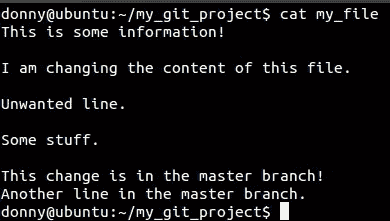
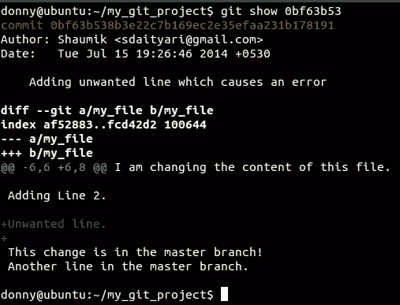
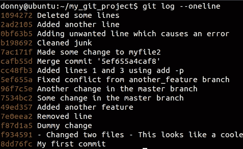
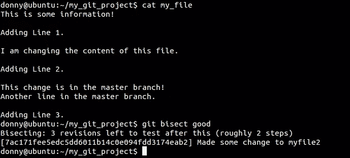

# 在 Git 中使用责备和对分进行调试

> 原文：<https://www.sitepoint.com/debugging-git-blame-bisect/>

当您在处理一个巨大的代码库时，您可能会发现您的代码中的错误(或者更糟，是别人的代码中的错误),这些错误会阻止您继续开发。您可以检查一个旧的提交，看看那里是否存在 bug 但这通常是最糟糕的方法。假设您有一百个提交要检查——会浪费多少时间？

谢天谢地，Git 有两个工具可以帮助您进行调试。我们将看一看这两者，并尝试理解它们的用例。让我们从故意在代码中引入一个 bug 开始:


我已经在文件`my_file`中添加了一行，这是不需要的，并被认为会导致错误。我还在那之后添加了一些提交来隐藏错误的提交。让我们通过运行以下命令来验证错误行是否已被添加到文件中:

```
cat my_file
```



注意可能导致错误的“不需要的行”。

## 带责备调试

一旦您发现了一个错误，您可能知道也可能不知道错误代码的位置。假设你知道。在我们的例子中，假设你知道`my_file`正在引起麻烦。在这种情况下，我们可以运行下面的命令来获取文件中的行的更多信息，以及这些行所属的提交。

```
git blame my_file
```


如果您查看`git blame`的输出，您可以看到提交`0bf63b53`引入了 bug(“不需要的行”)。如果您想检查该提交中的其他更改，或者想了解更多相关信息，可以运行以下命令:

```
git show 0bf63b53
```



这就对了——我们现在知道是哪个提交导致了错误，以及在那个提交中还更改了什么。我们可以着手修复错误。

## 用二分法调试

当您知道是什么导致了问题时，它会帮助您。如果您不知道是什么导致了错误，并且在您可以回到工作状态之前有数百次提交，该怎么办？这就是`git bisect`发挥作用的地方。

我再提一次——对于像我们这种情况的小情况来说是过分的。但是，我只是出于演示的目的来介绍这个过程。

想象一下`git bisect`是一个向导，带你通过提交来找出哪个提交带来了错误。在到达引入错误的提交之前，它执行二分搜索法来检查提交。

首先，我们需要选择一个不存在 bug 的“好的”提交。然后，我们需要选择一个存在 bug 的“坏”提交(理想情况下是包含 bug 的最新提交，因此您可以将其指定为“坏”)。然后 Git 会带您浏览最近的提交，并询问您它们是“好的”还是“坏的”，直到它找到罪魁祸首。它本质上是一个[二分搜索法算法](http://en.wikipedia.org/wiki/Binary_search_algorithm),通过提交数组来发现哪个提交是第一个“坏”提交。

这里需要注意的非常重要的一点是，您应该在这个过程中搜索一个 bug。如果您有多个 bug，您需要对每个 bug 执行二分搜索法。

在`git blame`的情况下处理相同的错误，我们将假设我们不知道哪个文件有错误。为了检查某个提交中是否存在错误，我们将运行`cat my_file`来查看文件的内容是否包含不需要的行。

## 启动`git bisect`向导

我们将运行以下命令，告诉 Git 我们将进入二分搜索法模式来查找一个 bug:

```
git bisect start
```

## 选择一个好的提交

在我们启动向导之后，我们需要通知 Git 关于提交的所有工作。让我们检查提交历史，以找到我们想要的提交。

```
git log --oneline
```



我们选择最古老的一个:

```
git bisect good 8dd76fc
```

## 选择错误的提交

在我们将“good”标签分配给一个好的提交之后，我们需要找到一个坏的提交，以便 Git 可以在这两个提交之间进行搜索，并告诉我们错误是从哪里引入的。因为我们知道最近的提交(`1094272`)有错误，所以我们使用那个:

```
git bisect bad 1094272
```

## 将提交分配为“好”或“坏”

一旦我们分配了好的和坏的提交(作为我们搜索的初始和最终指针), Git 会引导我们完成提交，并询问我们每个提交是否包含 bug。


请注意，在屏幕截图中，7 个修订将包含在大约 3 个步骤中。步骤的数量以对数方式增长[。由于 2<sup>2</sup>6<7<2<sup>3</sup>，我们需要三个步骤。如果有一百个修改，我们大概需要 7 个步骤，如果有一千个修改，我们大概需要 10 个步骤。](http://en.wikipedia.org/wiki/Logarithm)

现在我们看到了提交`cc48fb`,我们需要确定这是一个好的还是坏的提交。在我们的例子中，我们检查文件的内容，看看不需要的行是否存在:



由于该行不存在，我们将其指定为好的提交。

```
git bisect good
```

我们在接下来的几个步骤中继续这个过程，直到`git bisect`找到第一个错误提交:


完成提交后，我们需要退出 Git 二分搜索法模式:

```
git bisect reset
```


你可能想看看 Git bisection 上的这个[不错的截屏](http://randyfay.com/node/55)，它带你经历了我已经讨论过的过程。

## 自动化流程

我们已经在 Git 中交互式地完成了调试过程。如果您熟悉单元测试，您可以编写一个单元测试来识别 bug。如果您想自动运行测试，您需要向 Git 提供您编写的测试脚本。

```
git bisect start
git bisect run [location_to_script_file]
```

用脚本文件的实际位置替换`location_to_script_file`，去掉方括号。

这里有一个关于如何在 PHP 中机械化调试 Git 的教程。

## 结论

我们用一个过于简化的案例来解释一个非常强大的概念。如果你知道哪个文件有坏代码，你应该毫不犹豫地继续使用`git blame`。然而，如果您不知道是什么导致了错误，并且您的存储库相当大，有着很长的历史，那么`git bisect`绝对是正确的选择。

你如何调试你的代码？你喜欢 Git 里的二分搜索法吗？做同样的事情，你有更好的方法吗？请在下面的评论中告诉我们。

## 分享这篇文章