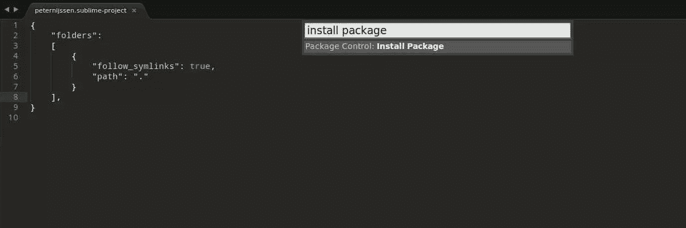
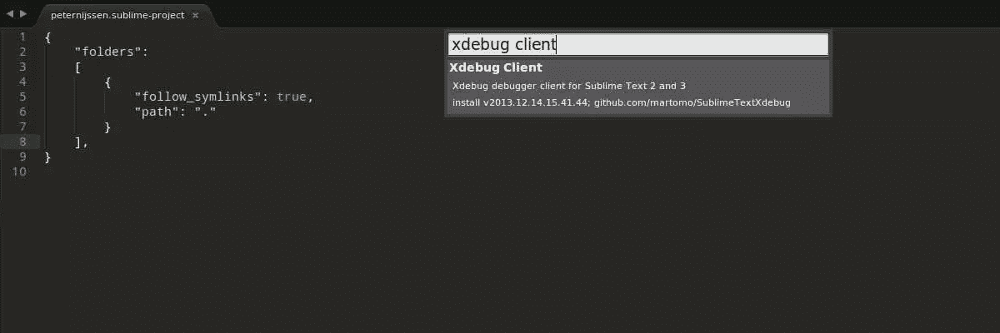
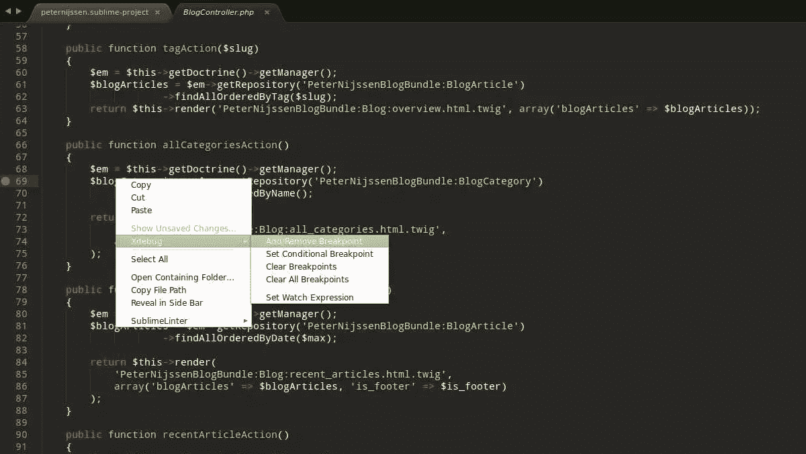
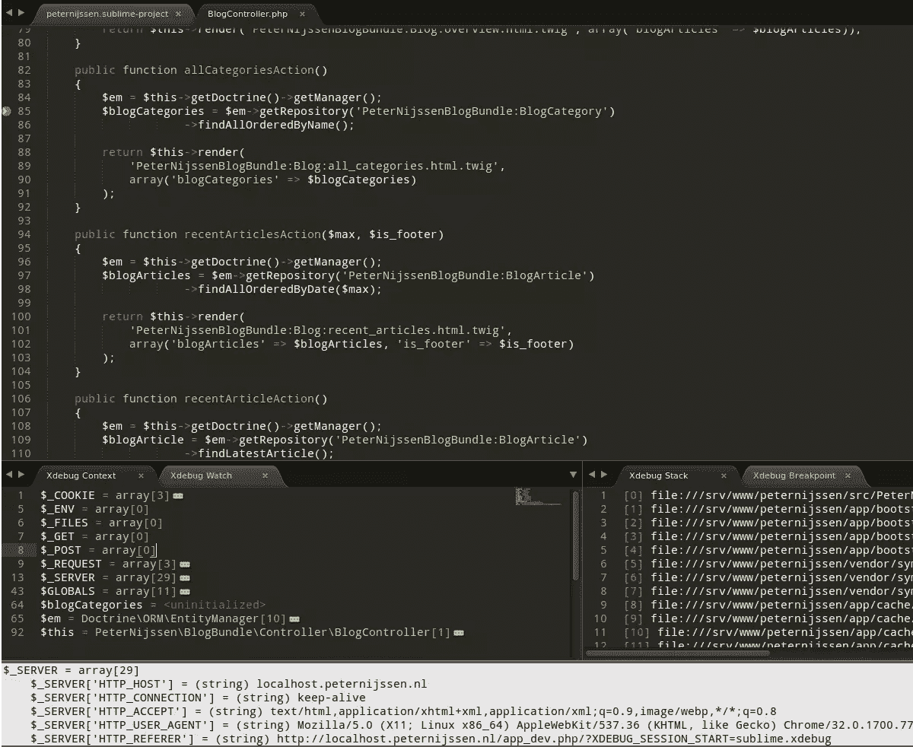

# 使用 Xdebug 和 Sublime Text 3 进行调试

> 原文：<https://www.sitepoint.com/debugging-xdebug-sublime-text-3/>

调试——我们都经常这样做。第一次编写完美的代码是困难的，只有少数人(如果有的话)能够成功。一年多前，Shameer 在 SitePoint 上写了一篇关于如何使用 Xdebug 和 Netbeans 调试应用程序的文章。在本文中，我们将看看如何结合使用 Xdebug 和 Sublime Text 进行调试。

### 入门指南

首先，我们需要安装 PHP Xdebug 扩展。如果你不确定如何做到这一点，请看看介绍中提供的链接。通过检查 Xdebug 是否在您的`phpinfo()`中列出来确保它正在工作。
当然我们也需要崇高的文字。我将使用最新版本:崇高文本 3。它也应该与崇高的文本 2。

### 设置 Xdebug

我们需要通过将以下内容添加到您的`php.ini`文件中来配置 xdebug，或者更好的是，添加到一个`xdebug.ini`文件中，如在 Linux 上的 How-to 中的[这里的](http://wiki.netbeans.org/HowToConfigureXDebug)所述。

```
xdebug.remote_enable=1 xdebug.remote_handler=dbgp
xdebug.remote_host=127.0.0.1 xdebug.remote_port=9000 xdebug.remote_log="/var/log/xdebug/xdebug.log"
```

一般来说，您将使用 127.0.0.1 作为您的主机。然而，如果你正在使用的是比如说，你将会使用类似于 10.0.2.2 的版本，这取决于 Xdebug 在哪里可以找到你的系统。

远程日志不是必需的，但是在出现问题的情况下，您可以在这里找到关于所发生错误的信息。

不要忘记重启你的网络服务器！

### 设置崇高文本 3

Sublime 的优势之一是你可以用包轻松地扩展它。在这种情况下，我们将安装 Xdebug 包。如果您还没有这样做，请确保您可以通过安装[软件包控件](https://sublime.wbond.net/installation)来安装软件包。

一旦你安装了包控件，你应该启动 Sublime Text 3。从工具菜单打开命令面板，搜索“安装包”。


现在你可以搜索任何你喜欢的包。在我们的例子中，我们将搜索包“Xdebug client”。


我们要做的最后一点是在 Sublime 中设置项目。最简单的方法是打开你的应用程序的根目录，进入项目，点击“项目另存为”。我建议您将文件保存在应用程序的根目录下，这样您就可以将它保存在您的版本控制系统中(如果您正在使用的话),并且您可以随时轻松地配置它。

打开刚刚创建的项目文件。内容将如下所示:

```
{  "folders":  [  {  "follow_symlinks":  true,  "path":  "."  }  ]  }
```

我们将再添加几行:

```
{  "folders":  [  {  "follow_symlinks":  true,  "path":  "."  }  ],  "settings":  {  "xdebug":  {  "url":  "http://my.local.website/",  }  }  }
```

如您所见，我只添加了一个 URL 到我的实际 web 应用程序。我可以为 Xdebug 设置更多的设置，但是，这已经足够了。我也可以在 Xdebug 设置本身中设置这个 URL，但是在这种情况下，如果每次都不更改 Xdebug 配置，我就无法处理多个项目。

### 启动 Xdebug 会话

我们现在可以启动 Xdebug 会话，看看是否一切都设置正确。在菜单中，单击工具-> Xdebug，然后单击开始调试(启动浏览器)。你会注意到你的网站被打开了，并且`?XDEBUG_SESSION_START=sublime.xdebug`被添加到了 URL 的末尾。这将启动 xdebug 会话。在 Sublime 中，在您设置了一个或多个断点之后，会出现一些额外的面板，显示调试信息。

### 断点

让我们设置第一个断点。断点基本上是一个标志，当应用程序到达断点时，它将暂停。在它停止的时候，你可以检查所有变量的值，这样你就知道到底发生了什么。

我们可以通过用鼠标右键单击一行来添加断点，转到 Xdebug，然后单击 add/remove breakpoint。一个标记将被添加到行槽中，以指示断点已被设置。



我们再次打开浏览器，继续刚才开始的会话。您会注意到，只要您转到断点所在的页面，该页面就会停止加载。如果你现在打开 Sublime，你会在 Xdebug 面板中看到很多信息。

Xdebug 堆栈和 Xdebug 上下文非常有趣。在堆栈中，您可以看到您的调用经历的整个堆栈跟踪。

在上下文中，您将看到所有的全局变量，但也包括您自己定义的变量。你可以点击这些变量，来查看这些变量的确切值。例如，在下面的截图中，我点击了$_SERVER 变量。



请注意，黄色箭头指向应用程序当前暂停的那一行。

所以我们的应用程序暂停了，现在我们可以查看定义的变量。然而，我们结束了，我们想继续前进。现在怎么办？当您再次单击鼠标右键并将鼠标悬停在 Xdebug 菜单上时，您将看到几个选项:

*   **运行**，这将运行应用程序，直到下一个断点或直到结束。
*   **运行到第**行，该行将一直运行到您点击的那一行。
*   **单步执行**将单步执行当前功能并立即停止。
*   **单步执行**将单步执行当前功能并立即停止。
*   **步出**将步出当前功能并立即停止。
*   **停止**将停止调试。
*   **分离**也会停止调试。

运行和停止很容易理解。步骤方法可能有点混乱。让我们用一个简单的例子来深入探讨这些问题。

```
Class  Foo()  {  public  function bar(Array $arr)  { $arr =  self::fooBar($arr);  // Breakpoint  return $arr;  }  public  function fooBar(Array $arr)  {  return array_values($arr);  }  }
```

假设您在方法栏的第一行添加了一个断点。所以在有断点注释的那一行(`// breakpoint`)。

使用 step into，调试器将单步执行 fooBar 方法，并在第一行停止。所以在这种情况下，调试器将在`return array_values($arr);`行暂停。

单步执行将调用方法，但不会停止。调用方法后，它将停止在下一行。所以在这种情况下，它会停在`return $arr;`

最后，使用 step out，它将运行整个`bar`方法并返回给调用者。在这种情况下，它将走出对象，回到原来的调用者。

如果您只是决定运行，应用程序将继续运行，直到它完成执行或出现另一个断点。

## 结论

在本文中，我们看到了如何将 Xdebug 与 Sublime 集成，并确保我们理解了如何调试。几乎所有适合 PHP 的 IDE 都可以和 Xdebug 集成。如果你对 Netbeans 中这样的调试感兴趣，可以看看简介中提到的文章。你使用断点了吗？或者你是在使用像 var_dump 这样的 PHP 函数来获取你的调试数据吗？请在下面的评论中告诉我们！

## 分享这篇文章