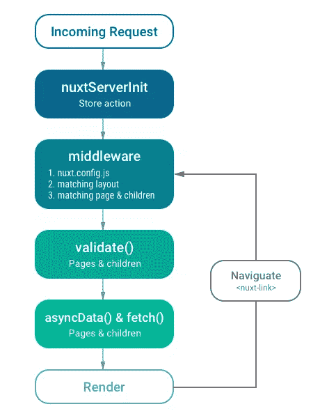
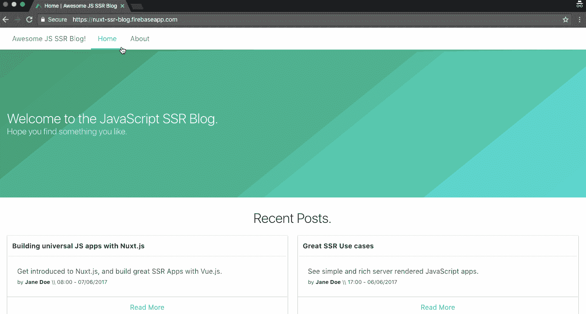

# Nuxt.js:创建通用 Vue.js 应用程序的极简框架

> 原文:# t0]https://www . sitepoint . com/nuxt-js-universal-view-js/

*想从头学起 Vue.js？使用 SitePoint Premium 获得涵盖基础知识、项目、技巧和工具&的 Vue 书籍全集。[现在就加入，每月仅需 14.99 美元](https://www.sitepoint.com/premium/products/Z2lkOi8vbGVhcm5hYmxlL1Byb2R1Y3QvMzE3?utm_source=blog&utm_medium=articles)。*

通用(或同构)JavaScript 是 JavaScript 社区中非常常见的一个术语。它用来描述可以在客户端和服务器端执行的 JavaScript 代码。

许多现代的 JavaScript 框架，如 [Vue.js](https://vuejs.org/) ，都旨在构建单页面应用程序(spa)。这样做是为了改善用户体验，让应用程序看起来更快，因为用户可以即时看到页面的更新。虽然这有很多优点，但也有一些缺点，例如当浏览器检索 JavaScript 包时，最初加载应用程序的“内容时间”很长，一些搜索引擎网络爬虫或社交网络机器人在抓取你的网页时，不会看到整个加载的应用程序。

JavaScript 的服务器端呈现是指在 web 服务器上预加载 JavaScript 应用程序，并发送呈现的 HTML 作为对浏览器页面请求的响应。

构建服务器端呈现的 JavaScript 应用程序可能有点乏味，因为在开始编码之前需要进行大量的配置。这就是 [Nuxt.js](https://nuxtjs.org) 旨在为 Vue.js 应用解决的问题。

## 什么是 Nuxt.js

简单来说，Nuxt.js 是一个帮助你轻松构建服务器渲染的 Vue.js 应用的框架。它抽象了管理异步数据、中间件和路由等事物所涉及的大部分复杂配置。类似于[角度万向](https://universal.angular.io/)对[角度](https://angular.io/)， [Next.js](https://zeit.co/blog/next6) 对[反应](https://facebook.github.io/react/)。

根据 Nuxt.js 文档，“它的主要作用是在抽象出客户机/服务器分布的同时呈现用户界面。”

### 静态生成

Nuxt.js 的另一个很棒的特性是它能够用`generate`命令生成静态网站。它非常酷，提供了与流行的静态生成工具类似的功能，比如 [Jekyll](https://jekyllrb.com/) 。

### 在 Nuxt.js 的引擎盖下

除了 Vue.js 2.0，Nuxt.js 还包括以下: [Vue-Router](https://github.com/vuejs/vue-router) 、 [Vuex](https://github.com/vuejs/vuex) (仅在使用[商店选项](https://nuxtjs.org/guide/vuex-store)时包含)、 [Vue 服务器渲染器](https://ssr.vuejs.org/)和 [vue-meta](https://github.com/declandewet/vue-meta) 。这很棒，因为它消除了开发服务器渲染的 Vue.js 应用程序所需的手动包含和配置不同库的负担。Nuxt.js 开箱即用，同时仍然保持总大小为**57kB min+gzip**(vuex 为 60KB)。

Nuxt.js 还使用 [webpack](https://github.com/webpack/webpack) 和 [vue-loader](https://github.com/vuejs/vue-loader) 和 [babel-loader](https://github.com/babel/babel-loader) 来捆绑、代码拆分和缩小代码。

### 它是如何工作的

当用户访问一个 Nuxt.js 应用程序或者通过`<nuxt-link>`导航到它的一个页面时，就会发生这种情况:

1.  当用户最初访问 app 时，如果商店中定义了 [`nuxtServerInit`动作](https://nuxtjs.org/guide/vuex-store/#the-nuxtserverinit-action)，Nuxt.js 会调用它并更新商店。
2.  接下来，它为被访问的页面执行任何现有的[中间件](https://nuxtjs.org/guide/routing/#middleware)。Nuxt 首先检查`nuxt.config.js`文件中的全局中间件，然后检查匹配的[布局文件](https://nuxtjs.org/guide/views#layouts)(针对请求的页面)，最后检查页面及其子页面中的中间件。中间件按此顺序排列优先级。
3.  如果被访问的路线是一个动态路线，并且有一个`validate()`方法存在，那么[该路线被验证](https://nuxtjs.org/api/pages-validate)。
4.  然后，Nuxt.js 调用`asyncData()`和`fetch()`方法在呈现页面之前加载数据。 [`asyncData()`方法](https://nuxtjs.org/guide/async-data/)用于获取数据并将其呈现在服务器端，而 [`fetch()`方法](https://nuxtjs.org/api/pages-fetch/)用于在呈现页面之前填充存储。
5.  在最后一步，呈现页面(包含所有适当的数据)。

这些动作在这个模式中得到了恰当的描述，它来自 Nuxt 文档:



## 用 Nuxt.js 创建无服务器静态站点

让我们用一些代码来创建一个简单的静态生成的 blog，我们将假设我们的帖子是从一个 API 获取的，并用一个静态 JSON 文件来模拟响应。

为了正确理解，需要 Vue.js 的工作知识。如果你是这个框架的新手，你可以看看 Jack Franklin 的《Vue.js 2.0 入门指南》。我也将使用 ES6 语法，你可以在这里重温一下:sitepoint.com/tag/es6/。

我们最终的应用程序将如下所示:



这篇文章的完整代码可以在 GitHub 上看到[，你也可以在](https://github.com/sitepoint-editors/nuxt-ssr-blog/)这里查看演示[。](https://nuxt-ssr-blog.firebaseapp.com/)

### 应用程序设置和配置

开始使用 Nuxt.js 最简单的方法是使用 Nuxt 团队创建的模板。我们可以使用 [vue-cli](https://cli.vuejs.org/) 将它快速安装到我们的项目(`ssr-blog`)中:

```
vue init nuxt/starter ssr-blog 
```

一旦您运行了这个命令，将会打开一个提示符，询问您几个问题。您可以按`Return`接受默认答案，或者输入您自己的值。

*注意:如果你没有安装 vue-cli，你必须先运行`npm install -g @vue/cli`来安装它。*

接下来，我们安装项目的依赖项:

```
cd ssr-blog
npm install 
```

现在我们可以启动应用程序了:

```
npm run dev 
```

如果一切顺利，您应该能够访问 [http://localhost:3000](http://localhost:3000) 来查看 Nuxt.js 模板起始页面。您甚至可以查看页面的源代码，看到页面上生成的所有内容都呈现在服务器上，并作为 HTML 发送到浏览器。

接下来，我们可以在`nuxt.config.js`文件中做一些简单的配置。我们将添加几个选项:

```
// ./nuxt.config.js

module.exports = {
  /*
   * Headers of the page
   */
  head: {
    titleTemplate: '%s | Awesome JS SSR Blog',
    // ...
    link: [
      // ...
      {
        rel: 'stylesheet',
        href: 'https://cdnjs.cloudflare.com/ajax/libs/bulma/0.7.2/css/bulma.min.css'
      }
    ]
  },
  // ...
} 
```

在上面的配置文件中，我们简单地通过`titleTemplate`选项指定了应用程序要使用的标题模板。在单个页面或布局中设置`title`选项会在呈现之前将`title`值注入到`titleTemplate`中的`%s`占位符中。

我们还引入了我当前选择的 CSS 框架，[布尔玛](http://bulma.io/)，以利用一些预设的样式。这是通过`link`选项完成的。

*注意:Nuxt.js 使用 [vue-meta](https://github.com/declandewet/vue-meta) 来更新我们应用的标题和 HTML 属性。所以您可以看一看它，以便更好地理解如何设置头。*

现在，我们可以通过添加我们博客的页面和功能来采取下一步措施。

### 使用页面布局

首先，我们将为所有页面定义一个自定义的基本布局。我们可以通过更新`layouts/default.vue`文件来扩展主 Nuxt.js 布局:

```
<!-- ./layouts/default.vue -->

<template>
  <div>
    <!-- navigation -->
    <nav class="navbar has-shadow" role="navigation" aria-label="main navigation">
      <div class="container">
        <div class="navbar-start">
          <nuxt-link to="/" class="navbar-item">
            Awesome JS SSR Blog!
          </nuxt-link>
          <nuxt-link active-class="is-active" to="/" class="navbar-item is-tab" exact>Home</nuxt-link>
          <nuxt-link active-class="is-active" to="/about" class="navbar-item is-tab" exact>About</nuxt-link>
        </div>
      </div>
    </nav>
    <!-- /navigation -->

    <!-- displays the page component -->
    <nuxt/>

  </div>
</template>

<style> .main-content {
    margin: 30px 0;
  } </style> 
```

在我们的自定义基本布局中，我们添加了站点的导航标题。我们使用`<nuxt-link>`组件来生成到我们希望在博客上出现的路线的链接。你可以查看`<nuxt-link>` 上的[文档，看看它是如何工作的。](https://nuxtjs.org/api/components-nuxt-link)

在创建布局时，`<nuxt>`组件非常重要，因为它显示页面组件。

还可以做更多的事情——比如定义定制的文档模板和错误布局——但是对于我们简单的博客来说，我们不需要这些。我强烈建议您查看关于视图的 [Nuxt.js 文档，了解所有的可能性。](https://nuxtjs.org/guide/views)

### 简单的页面和路线

Nuxt.js 中的页面被创建为`pages`目录中的[单个文件组件](https://vuejs.org/v2/guide/single-file-components.html)。Nuxt.js 自动将这个目录中的每个`.vue`文件转换成一个应用程序路由。

### 建立博客主页

我们可以通过更新 pages 目录中由 Nuxt.js 模板生成的`index.vue`文件来添加我们的博客主页:

```
<!-- ./pages/index.vue -->
<template>
  <div>
    <section class="hero is-medium is-primary is-bold">
      <div class="hero-body">
        <div class="container">
          <h1 class="title">
            Welcome to the JavaScript SSR Blog.
          </h1>
          <h2 class="subtitle">
            Hope you find something you like.
          </h2>
        </div>
      </div>
    </section>
  </div>
</template>

<script> export default {
    head: {
      title: 'Home'
    }
  } </script>

<!-- Remove the CSS styles --> 
```

如前所述，在呈现页面之前，在这里指定`title`选项会自动将其值注入到`titleTemplate`值中。

我们现在可以重新加载我们的应用程序来查看主页的变化。

### 构建“关于”页面

Nuxt.js 的另一个优点是它会监听`pages`目录中的文件变化，所以添加新页面时不需要重启应用程序。

我们可以通过添加一个简单的`about.vue`页面对此进行测试:

```
<!-- ./pages/about.vue -->
<template>
  <div class="main-content">
    <div class="container">
      <h2 class="title is-2">About this website.</h2>
      <p>Curabitur accumsan turpis pharetra <strong>augue tincidunt</strong> blandit. Quisque condimentum maximus mi, sit amet commodo arcu rutrum id. Proin pretium urna vel cursus venenatis. Suspendisse potenti. Etiam mattis sem rhoncus lacus dapibus facilisis. Donec at dignissim dui. Ut et neque nisl.</p>
      <br>
      <h4 class="title is-4">What we hope to achieve:</h4>
      <ul>
        <li>In fermentum leo eu lectus mollis, quis dictum mi aliquet.</li>
        <li>Morbi eu nulla lobortis, lobortis est in, fringilla felis.</li>
        <li>Aliquam nec felis in sapien venenatis viverra fermentum nec lectus.</li>
        <li>Ut non enim metus.</li>
      </ul>
    </div>
  </div>
</template>

<script> export default {
  head: {
    title: 'About'
  }
} </script> 
```

现在，我们可以访问[http://localhost:3000/about](http://localhost:3000/about)看到 about 页面，而无需重启 app，这太棒了。

### 在主页上显示博客文章

我们当前的主页已经相当光秃秃的了，所以我们可以通过展示博客中最近的博文来使它变得更好。我们将通过创建一个`<posts>`组件并将其显示在`index.vue`页面中来实现这一点。

但是首先，我们必须获得保存的 JSON 博客文章，并将它们放在应用程序根文件夹中的一个文件中。[文件可以从这里](https://github.com/sitepoint-editors/nuxt-ssr-blog/blob/master/posts.json)下载，或者你可以直接复制下面的 JSON，保存在根文件夹中，名为`posts.json`:

```
[
    {
        "id": 4,
        "title": "Building universal JS apps with Nuxt.js",
        "summary": "Get introduced to Nuxt.js, and build great SSR Apps with Vue.js.",
        "content": "<p>Lorem ipsum dolor sit amet, consectetur adipiscing elit, sed do eiusmod tempor incididunt ut labore et dolore magna aliqua. Ut enim ad minim veniam, quis nostrud exercitation ullamco laboris nisi ut aliquip ex ea commodo consequat. Duis aute irure dolor pariatur. Excepteur sint occaecat cupidatat non proident, sunt in culpa qui officia deserunt mollit anim id est laborum.</p>",
        "author": "Jane Doe",
        "published": "08:00 - 07/06/2017"
    },
    {
        "id": 3,
        "title": "Great SSR Use cases",
        "summary": "See simple and rich server-rendered JavaScript apps.",
        "content": "<p>Lorem ipsum dolor sit amet, consectetur adipiscing elit, sed do eiusmod aliquip ex ea commodo consequat. Duis aute irure dolor in reprehenderit in voluptate velit esse cillum dolore eu fugiat nulla pariatur. Excepteur sint occaecat cupidatat non proident, sunt in culpa qui officia deserunt mollit anim id est laborum.</p>",
        "author": "Jane Doe",
        "published": "17:00 - 06/06/2017"
    },
    {
        "id": 2,
        "title": "SSR in Vue.js",
        "summary": "Learn about SSR in Vue.js, and where Nuxt.js can make it all faster.",
        "content": "<p>Lorem ipsum dolor sit amet, consectetur adipiscing elit, sed do eiusmod tempor incididunt ut labore et dolore magna aliqua. Ut enim ad minim veniam, quis nostrud exercitation ullamco laboris nisi in voluptate velit esse cillum dolore eu fugiat nulla pariatur. Excepteur sint occaecat cupidatat non proident, sunt in culpa qui officia deserunt mollit anim id est laborum.</p>",
        "author": "Jane Doe",
        "published": "13:00 - 06/06/2017"
    },
    {
        "id": 1,
        "title": "Introduction to SSR",
        "summary": "Learn about SSR in JavaScript and how it can be super cool.",
        "content": "<p>Lorem ipsum dolor sit amet, consectetur adipiscing elit, sed do eiusmod tempor incididunt ut labore et dolore magna aliqua. Ut enim ad minim veniam, quis nostrud exercitation ullamco laboris nisi ut aliquip ex ea commodo consequat. Duis aute irure dolor. Excepteur sint occaecat cupidatat non proident, sunt in culpa qui officia deserunt mollit anim id est laborum.</p>",
        "author": "John Doe",
        "published": "11:00 - 06/06/2017"
    }
] 
```

*注意:理想情况下，帖子应该从 API 或资源中检索。例如， [Contentful](https://www.contentful.com/) 就是可以用于此的服务。*

组件位于`components`目录中。我们将在那里创建`<posts>`单个文件组件:

```
<!-- ./components/Posts.vue -->
<template>
  <section class="main-content">
    <div class="container">
      <h1 class="title has-text-centered">
        Recent Posts.
      </h1>
      <div class="columns is-multiline">
        <div class="column is-half" v-for="post in posts" :key="post.id">
          <div class="card">
           <header class="card-header">
            <p class="card-header-title">
              {{ post.title }}
            </p>
          </header>
          <div class="card-content">
            <div class="content">
              {{ post.summary }}
              <br>
              
                by <strong>{{ post.author}}</strong>
                \\ {{ post.published }}
              
            </div>
          </div>
          <footer class="card-footer">
            <nuxt-link :to="`/post/${post.id}`"
              class="card-footer-item">
              Read More
            </nuxt-link>
          </footer>
        </div>
      </div>
    </div>
  </div>
</section>
</template>

<script> import posts from '~/posts.json'

  export default {
    name: 'posts',
    data () {
      return { posts }
    }
  } </script> 
```

我们从保存的 JSON 文件中导入文章数据，并将其分配给组件中的`posts`值。然后，我们用`v-for`指令遍历组件模板中的所有帖子，并显示我们想要的帖子属性。

*注意:`~`符号是`/`目录的别名。你可以在这里查看文档[，看看 Nuxt.js 提供的不同别名，以及它们链接到什么目录。](https://nuxtjs.org/guide/directory-structure/#aliases)*

接下来，我们将`<posts>`组件添加到主页:

```
<!-- ./pages/index.vue -->
<template>
<div>
    <!-- ... -->
    <posts />
</div>
</template>

<script> import Posts from '~/components/Posts.vue'

export default {
  components: {
    Posts
  },
  // ...
} </script> 
```

### 添加动态路由

现在我们将为帖子添加动态路由，这样我们就可以访问一个帖子，例如使用这个 URL: `/post/1`。

为了实现这一点，我们将`post`目录添加到`pages`目录，并按如下方式构建它:

```
pages
└── post
    └── _id
        └── index.vue 
```

这将为应用程序生成相应的动态路由，如下所示:

```
router: {
  routes: [
    // ...
    {
      name: 'post-id',
      path: '/post/:id',
      component: 'pages/post/_id/index.vue'
    }
  ]
} 
```

更新单篇文章文件:

```
<!-- ./pages/post/_id/index.vue -->
<template>
  <div class="main-content">
    <div class="container">
      <h2 class="title is-2">{{ post.title }}</h2>
      <div v-html="post.content"></div>
      <br>
      <h4 class="title is-5 is-marginless">by <strong>{{ post.author }}</strong> at <strong>{{ post.published }}</strong></h4>
    </div>
  </div>
</template>

<script> // import posts saved JSON data
  import posts from '~/posts.json'

  export default {
    validate ({ params }) {
      return /^\d+$/.test(params.id)
    },
    asyncData ({ params }, callback) {
      let post = posts.find(post => post.id === parseInt(params.id))
      if (post) {
        callback(null, { post })
      } else {
        callback({ statusCode: 404, message: 'Post not found' })
      }
    },
    head () {
      return {
        title: this.post.title,
        meta: [
          {
            hid: 'description',
            name: 'description',
            content: this.post.summary
          }
        ]
      }
    }
  } </script> 
```

js 向我们的页面组件添加了一些自定义方法，以帮助简化开发过程。看看我们如何在单个帖子页面上使用其中的一些:

*   用`validate`方法验证路线参数。我们的 validate 方法检查传递的路由参数是否是一个数字。如果返回`false`，Nuxt.js 会自动加载 404 错误页面。你可以在这里阅读更多关于它的[。](https://nuxtjs.org/api/pages-validate)
*   `asyncData`方法用于获取数据，并在向浏览器发送响应之前在服务器端呈现数据。它可以通过不同的方法返回数据。在我们的例子中，我们使用回调函数返回与路由参数`id`具有相同属性的帖子。你可以在这里看到使用这个功能[的各种方式。](https://nuxtjs.org/guide/async-data)
*   正如我们之前看到的，我们使用`head`方法来设置页面的标题。在本例中，我们将页面标题改为文章标题，并添加文章摘要作为页面的元描述。

太好了，现在我们可以再次访问我们的博客来查看所有的路由和页面工作正常，还可以查看页面源代码来查看正在生成的 HTML。我们有一个功能服务器渲染的 JavaScript 应用程序。

### 生成静态文件

接下来，我们可以为页面生成静态 HTML 文件。

不过我们需要做一点小调整，因为默认情况下，Nuxt.js 会忽略动态路由。为了生成动态路由的静态文件，我们需要在`./nuxt.config.js`文件中明确指定它们。

我们将使用回调函数来返回动态路由列表:

```
// ./nuxt.config.js

module.exports = {
  // ...
  generate: {
    routes(callback) {
      const posts = require('./posts.json')
      let routes = posts.map(post => `/post/${post.id}`)
      callback(null, routes)
    }
  }
} 
```

你可以点击[这里](https://nuxtjs.org/api/configuration-generate/)查看关于使用`generate`属性的完整文档。

要生成所有路由，我们现在可以运行以下命令:

```
npm run generate 
```

Nuxt 将所有生成的静态文件保存到一个`dist`文件夹中。

### 在 Firebase 主机上部署

最后一步，我们可以利用 Firebase 的[托管功能，让我们的静态网站在几分钟内就可以上线。这一步假设你有一个谷歌账户。](https://firebase.google.com/products/hosting/)

首先，如果您还没有 Firebase CLI，请安装它:

```
npm install -g firebase-tools 
```

要将本地计算机连接到 Firebase 帐户并获得对 Firebase 项目的访问权限，请运行以下命令:

```
firebase login 
```

这将打开一个浏览器窗口，提示您登录。登录后，访问[https://console.firebase.google.com](https://console.firebase.google.com)，点击*添加项目*。在打开的向导中进行相关选择。

项目创建完成后，在`https://console.firebase.google.com/project/<project name>/hosting`进入项目的托管页面，完成*入门*向导。

然后，在您的 PC 上，从项目目录的根目录运行以下命令:

```
firebase init 
```

在出现的向导中，选择“托管”。然后从选项列表中选择您新创建的项目。接下来选择`dist`目录作为公共目录。选择将页面配置为单页应用程序，最后在询问您是否要覆盖`dist/index.html`时选择“否”。

Firebase 会给你的项目写几个配置文件，然后把网站放在`https://<project name>.firebaseapp.com`上。这篇文章的演示应用可以在 nuxt-ssr-blog.firebaseapp.com 看到。

如果你遇到问题，你可以在 [Firebase 的快速启动页面](https://firebase.google.com/docs/hosting/quickstart)上找到完整的说明。

## 结论

在本文中，我们已经了解了如何利用 Nuxt.js 通过 Vue.js 构建服务器渲染的 JavaScript 应用程序。我们还了解了如何使用它的`generate`命令为我们的页面生成静态文件，并通过 Firebase Hosting 之类的服务快速部署它们。

Nuxt.js 框架真的很棒。甚至是官方 Vue.js SSR GitBook 里推荐的[。我真的很期待在更多的 SSR 项目中使用它，并探索它的所有功能。](https://ssr.vuejs.org/en/#about-this-guide)

## 分享这篇文章