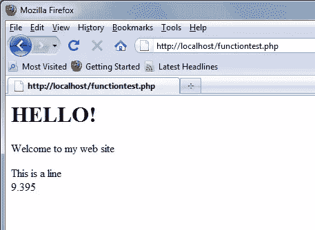

# 在 PHP 中定义和使用函数

> 原文：<https://www.sitepoint.com/defining-and-using-functions-in-php/>

让我们从定义“功能”这个词开始。函数是执行特定任务(或函数)的一段独立的代码！).使用函数的一个主要好处是它们是可重用的；如果你有一个需要多次执行的任务，函数是一个理想的解决方案。它们可以由您定义，也可以由 PHP 定义(PHP 有丰富的内置函数集合)。这篇文章将关注程序员定义的函数，但是将简单地触及 PHP 的函数来完成这个画面。

## 定义函数

那么定义函数的语法是什么样的呢？这里有一个简单的例子:

```
<?php
function addNumbers($num1, $num2) {
    $result = $num1 + $num2;
    return $result;
}
```

关键字`function`让 PHP 知道接下来的是，你已经猜到了，一个函数定义。接下来，`addNumbers`是函数的名字。左括号和右括号包含自变量(有时称为参数)，即调用函数时传递给函数的值。函数不必接受参数，在这种情况下，括号将是空的。在这里，变量`$num1`和`$num2`是任意的名字，虽然在函数中被引用。

请注意，函数中的两个语句行包含在括号中。这些行组成了函数体。这里的语句非常简单:第一个将传递给函数的值作为`$num1`和`$num2`，将它们相加，并将结果值存储在`$result`中。然后第二行使用`return`将`$result`的值传递回调用语句。

与参数一样，函数也不必返回值。例如，它们可以用于执行打印的计算。然而，理解从函数返回值的概念是很重要的，因为你可能会经常返回值。

函数将不会被执行，直到你写一些代码这样做。要调用示例函数，可以使用如下语句:

```
<?php
$total = addNumbers($loanAmount, $interestAmount);
```

这是什么意思？嗯，`=`之后的代码调用或调用函数并使其代码运行。传递给函数的值保存在两个变量`$loanAmount`和`$interestAmount`中。请注意，这些名称与定义函数时使用的参数名称不一致，例如`$num1`和`$num2`。这不重要。重要的一点是，该函数被定义为有两个参数，并且在执行该函数时您提供了两个参数。由于显而易见的原因，变量`$loanAmount`和`$interestAmount`中保存的值应该是数字，因为该函数执行数学运算。

因为函数中已经使用了 return，所以保存在`$result`中的总数将被传递回执行该函数的语句。在这种情况下，该值将被分配给`$total`。

命名函数时，名称应该是唯一的。它可以由字母、数字和下划线组成，但不能以数字开头(与命名变量的规则相同)。因此，`addNumbers`和`add_numbers`是有效的函数名，而`add numbers`不是(嵌入空格)`12add_numbers`也不是(以数字开头)。将您的函数命名为`abc123`在语法上是正确的，但是没有帮助。理想情况下，函数名也应该有意义。

正如我在本文开头提到的，PHP 也定义了一些函数。在编写自己的函数之前，看看 PHP 是否有您想要的功能总是值得的。但是您如何知道您是否需要定义自己的函数，或者 PHP 是否提供了您需要的函数呢？答案是熟悉在线文档。例如，您可能希望设置日期的格式。首先去[www.php.net](http://www.php.net)，在搜索框中输入“日期”。您将看到关于`date()`函数的信息，在左侧是相关日期和时间函数的列表。

## 组织功能

既然已经看到了函数的语法，下一步就是决定应该把函数代码放在哪里。

因为函数只在请求时执行，所以你可以把它们放在代码的开头。这里有一个例子:

```
<?php
function hello() {
    print "<h1>HELLO!</h1>";
    print "<p>Welcome to my web site</p>";
}

function printBreak($text) {
    print "$text<br>";
}

function addNumbers($num1, $num2) {
     return $num1 + $num2;
}

hello();
printBreak("This is a line");
print addNumbers(3.75, 5.645);
```

这段代码在浏览器中显示以下输出:



定义了这三个函数，然后是执行它们的代码。请注意，函数`hello()`没有任何参数，因为它的目的只是打印一条欢迎消息。函数`printBreak()`是一个类似的例子——文本作为参数传递，在函数中作为变量`$text`引用。最后，对之前的`addNumbers()`函数做了一点修改。

此时，这些函数仅在定义它们的脚本中可用。如果您想让所有脚本都可以访问它们，最好将它们放在一个单独的文件中并包含它们。这种方法意味着以后需要对函数进行的任何更改都只能在一个地方进行，而不必修改多个脚本。

将这三个函数移动到它们自己名为`functions.php`的文件中。然后，修改示例以使用`require`。它现在应该是这样的:

```
<?php
require "functions.php";

hello();
printBreak("This is a line");
print addNums(3.75, 5.645);
```

## 接受可变数量的参数

到目前为止，您只处理了接受固定数量参数的函数。如果在需要两个参数时只传递了一个参数，您将看到如下警告消息:

```
Warning: Missing argument 2 for addNumbers() called in C:xampphtdocssitepointfunctions.php on line 17 and defined in C:xampphtdocssitepointfunctions.php on line 9
```

在某些情况下，您可能希望传递可变数量的参数，例如，您可能需要计算一系列数字的平均值。在这种情况下，函数不会定义任何参数；相反，传递的值的数量可以通过使用 PHP 函数`func_num_args()`来确定。另一个 PHP 函数`func_get_arg()`，允许您检索传递给函数的值。

下面是一个带有注释的示例:

```
<?php
function calcAverage() {
    // initialize value to be used in calculation
    $total = 0;							

    // find out how many arguments were given
    $arguments = func_num_args();     	

    // loop to process each argument separately
    for ($i = 0; $i < $arguments; $i++) {
        // add the value in the current argument to the total
        $total += func_get_arg($i);
    }

    // after adding all arguments, calculate the average
    $average = $total / $arguments;		

    // return the average
    return $average;
}

// invoke the function with 5 arguments
echo calcAverage(44, 55, 66, 77, 88);			

// invoke the function with 8 arguments
echo calcAverage(12, 34, 56, 78, 90, 9, 8, 7);
```

函数`calcAverage()`执行两次，每次使用不同数量的参数。在`calcAverage()`中，调用函数`func_num_args()`来确定传入的参数数量。在这个阶段，您可能熟悉或者不熟悉的`for`循环使用`func_get_arg()`依次检索每个参数，并在`$total`中增加总数。当所有的参数都被检索和处理后，使用`echo`计算、返回并打印平均值。

## 摘要

让我们回顾一下函数的一些关键概念:

*   **更容易维护**–使用函数，这样您就不必为常见任务重复编写代码。
*   **可重用性**–函数可以在单个脚本中使用，也可以跨多个脚本使用。
*   **灵活性**–函数是灵活的，接受特定数量的参数，或者使用`func_num_args()`和`func_get_arg()`接受可变数量的参数。
*   **提高可读性**–将功能分解成不同的功能可以简化代码并提高其可读性。

现在，您应该能够创建自己的函数，或者从 PHP 广泛的选择中找到相关的函数。

图片通过[肯托](http://www.shutterstock.com/gallery-168430p1.html) / [快门](http://www.shutterstock.com)

## 分享这篇文章