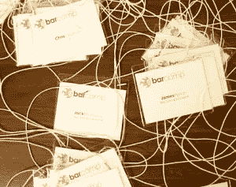

# 形成标签定位的权威指南

> 原文：<https://www.sitepoint.com/definitive-guide-form-label-positioning/>

照片:夜三

谈到表单的设计和开发，最热门的话题之一就是标签的定位。

有一系列不同的选择，但是许多关于这个主题的文章只涉及其中一些选择的一些优点和缺点。

你如何把所有不同的信息放在一起做出一个好的决定，尤其是当你很着急的时候？

显然是时候把所有东西都集中到一个地方了。请继续阅读表单标签定位的不同选项，以及每种选项优缺点的完整列表。

如果你没有时间，你需要知道的主要事情是:

> 最有用和最容易使用的选项是让标签始终可见，并位于字段的上方或旁边。

还有一个[方便的指南](#deciding-on-position)来选择这些选项。

## 定位表单标签的选项

对于基于英语的表单，主要选项 [(1)](#fn:footnote "See footnote") 有:

1.  [字段顶部的标签](#label-on-top-of-the-field)
2.  [标签在字段的左边，向左对齐](#label-to-the-left-of-the-field-and-flush-left)
3.  [标签在字段的左边，向右对齐](#llabel-to-the-left-of-the-field-and-flush-right)
4.  [字段内的标签](#label-inside-the-field)
5.  [标签作为工具提示](#label-as-a-tool-tip)

这些选择中有一些比另一些好得多。下面是每种方法的优缺点的完整列表。

## 1.字段顶部的标签

### 优势

*   在小屏幕上，当焦点在视场内时，仍然可以看到标签(尽管进行了缩放)。
*   用户可能一眼就能看到标签和字段。
*   标签长度可以大于字段长度。
*   当表单被翻译成其他语言时，允许不同的标签长度。
*   与字段旁边有标签相比，表单更窄。
*   较长的包装标签更容易阅读，因为有一个一致的左边缘，眼睛可以返回。
*   标签与它们对应的字段非常接近，因此很容易看出哪一个与哪一个相配。
*   标签是可见的，甚至当它的相应字段被填写时，所以用户不必记住标签是什么，并且可以处理中断。
*   用户可以随时将他们的答案与标签进行比较。
*   容易实现好。
*   在 HTML 中，不需要使用占位符属性作为标签的代理，这有助于维护可访问性。
*   用户很容易看到他们必须在哪里输入信息。
*   适用于任何字段类型(如文本框、单选按钮、复选框或下拉框)。
*   使用触摸界面。

### 不足之处

*   与字段旁边有标签的表单相比，表单的长度是两倍。
*   标签更难扫描，因为它们由字段分隔。

## 2.字段左侧的标签，向左对齐

### 优势

*   与字段上方有标签相比，表单更短。
*   标签长度可以大于字段长度。
*   标签更容易扫描，因为它们没有被字段分开。
*   标签是可见的，甚至当它的相应字段被填写时，所以用户不必记住标签是什么，并且可以处理中断。
*   用户可以随时将他们的答案与标签进行比较。
*   容易实现好。
*   在 HTML 中，不需要使用占位符属性作为标签的代理，这有助于维护可访问性。
*   用户很容易看到他们必须在哪里输入信息。
*   适用于任何字段类型(如文本框、单选按钮、复选框或下拉框)。
*   使用触摸界面。

### 不足之处

*   在小屏幕上，当焦点在视场内时，标签可能不可见(因为缩放)。
*   用户不可能一眼就看到标签和字段。
*   当表格被翻译成其他语言时，标签可能不再适合分配的空间。
*   与字段上方有标签相比，表单更宽。
*   标签可能远离它们对应的字段，因此很难看出哪个与哪个相配([斑马条纹](http://alistapart.com/article/zebrastripingmoredataforthecase)可以帮助最小化这个问题)。

## 3.字段左侧的标签，向右对齐

### 优势

*   用户可能一眼就能看到标签和字段。
*   与字段上方有标签相比，表单更短。
*   标签长度可以大于字段长度。
*   标签更容易扫描，因为它们没有被字段分开。
*   标签与它们对应的字段非常接近，因此很容易看出哪一个与哪一个相配。
*   标签是可见的，甚至当它的相应字段被填写时，所以用户不必记住标签是什么，并且可以处理中断。
*   用户可以随时将他们的答案与标签进行比较。
*   容易实现好。
*   在 HTML 中，不需要使用占位符属性作为标签的代理，这有助于维护可访问性。
*   用户很容易看到他们必须在哪里输入信息。
*   适用于任何字段类型(如文本框、单选按钮、复选框或下拉框)。
*   使用触摸界面。

### 不足之处

*   在小屏幕上，当焦点在视场内时，标签可能不可见(因为缩放)。
*   当表格被翻译成其他语言时，标签可能不再适合分配的空间。
*   与字段上方有标签相比，表单更宽。
*   较长的换行标签更难阅读，因为其左边缘参差不齐，使眼睛更难找到每一行的开头。

## 4.字段内的标签

### 优势

*   在小屏幕上，当焦点在视场内时，仍然可以看到标签(尽管进行了缩放)。
*   用户可能一眼就能看到标签和字段。
*   与字段旁边有标签相比，表单更窄。
*   标签与它们对应的字段非常接近，因此很容易看出哪一个与哪一个相配。
*   使用触摸界面。

### 不足之处

*   标签长度必须小于字段长度。
*   当表格被翻译成其他语言时，标签可能不再适合分配的空间。
*   标签包含在字段中，因此更难扫描。
*   不允许包装更长的标签。
*   如果填写完字段后标签完全消失，用户必须记住标签是什么，并且会被打断。
*   如果填写完字段后标签完全消失，用户以后就不能将他们的答案与标签进行比较。
*   如果标签保持不变，即使在填写字段时，用户输入信息的空间也会大大减少。用户也很难区分标签和答案，也没有真正的节省空间。
*   很难很好的实施。
*   在 HTML 中，使用占位符属性代替标签会降低可访问性。
*   因为字段看起来像是已经填写过的，用户很难看到他们必须在哪里输入信息，所以错误率更高。
*   不适用于除文本框和可能的下拉列表之外的字段类型。

## 5.标签作为工具提示

### 优势

*   当表单被翻译成其他语言时，允许不同的标签长度。
*   与字段旁边有标签相比，表单要窄一些。
*   标签在视觉上与其对应的字段相关联，因此很容易看出哪个与哪个相配。
*   用户很容易看到他们必须在哪里输入信息。

### 不足之处

*   非典型的设计，很容易让用户困惑和沮丧。
*   打破了对成功填写表单至关重要的对话模式:在收集答案之前先提出问题。
*   在小屏幕上，当焦点在视场内时，标签可能不可见。
*   用户不可能一眼就看到标签和字段。
*   当表格被翻译成其他语言时，标签可能不再适合分配的空间。
*   与字段上方有标签相比，表单要宽一些。
*   标签是不可能扫描的，因为它们是隐藏的。
*   如果填写完字段后标签完全消失，用户必须记住标签是什么，并且会被打断。
*   如果填写完字段后标签完全消失，用户以后就不能将他们的答案与标签进行比较。
*   很难很好的实施。
*   降低可访问性。
*   不适用于除文本框和可能的下拉列表之外的字段类型。
*   不适合触摸界面。

## 决定位置

即使你没有真正阅读上面要点中的文字，也可以清楚地看到，*的缺点*比*的优点*要多得多:

*   字段内的标签
*   标签为工具提示。

所以在大多数情况下，这些都是糟糕的选择。相反，请选择以下方式之一:

*   字段顶部的标签
*   字段左侧的标签，向左对齐
*   字段左侧的标签，向右对齐。

要在这三个选项中做出选择，请询问以下问题:

| 关于表格要问的问题 | 答案如何影响标签定位 |
| --- | --- |
| 这个表格会在小屏幕上填写吗？ | 小屏幕的最佳选择是字段上方的标签。 |
| 将通过触摸访问表单吗？ | 避免将标签放在字段内或作为工具提示。 |
| 标签大多是短的吗？ | 当标签很短时，字段旁边的标签效果最好。 |
| 标签是否都是问题(例如，“你希望你的新政策什么时候开始？”)? | 对于完整的问题，标签可以在字段的上方或旁边，但应该靠左对齐。 |
| 表格会被翻译吗？ | 字段上方的标签为翻译提供了最大的灵活性。 |
| 表单有哪些类型的字段？ | 如果有文本框以外的字段，则不能在字段中放置标签。标签作为工具提示也是一个糟糕的选择。 |
| 有哪些可供开发的资源？ | 字段上方的标签花费的开发时间最少，紧随其后的是字段旁边的标签。 |
| 开发人员的技能水平如何？ | 字段内的标签或作为工具提示的标签应该只由有大量时间的专业开发人员来尝试。 |

## 一致性

### 在表单内

像界面设计的所有元素一样，标签定位的一致性有助于用户，减少错误。这是因为大脑是为模式而生的；当定位一致时，大脑将迅速学会在哪里寻找标签。这意味着如果你能坚持每种形式只有一种方法是最好的。

### 跨表单

如果用户可能会遇到来自贵组织的不止一个表单，那么通过在个表单之间使用一致的*定位，可以进一步提高可用性和准确性。有时，这意味着为了整体可用性，要对单个表单进行次优选择。*

例如，字段上方的标签可能是您当前工作的表单的理想选择，但是您组织中的大多数其他表单在字段旁边使用标签会更好。

## 摘要

表单标签定位是一个激烈辩论的话题，许多人很快宣布一种方法是明显的赢家。实际上，情况更加微妙。但这并不意味着决定定位一定很难。使用上面的问题和优点/缺点，你可以很容易地决定什么是最适合你的特殊情况的(并且希望能坚持使用这种方法)。

你对标签定位有什么经验？有没有被遗漏的优点和缺点？请在评论中告诉我们。

### 进一步阅读

*   [表单布局评估中的眼球追踪和可用性测试](http://c.ymcdn.com/sites/www.bfma.org/resource/resmgr/Articles/08_32.pdf "PDF: Eye tracking and Usability testing")
*   [输入字段中的标签不是一个好主意](http://laurakalbag.com/labels-in-input-fields-arent-such-a-good-idea/)
*   不要在文本框里放标签，除非你是卢克·W
*   [输入字段中的标签有问题(tweet)](https://twitter.com/gerrygaffney/status/438830756626841600/photo/1)
*   [移动表单可用性:在字段上方放置标签](http://baymard.com/blog/mobile-form-usability-label-position)
*   [顶部、右侧或左侧对齐的表单标签](http://www.lukew.com/ff/entry.asp?504)
*   [对准](http://formulate.com.au/articles/alignment/)
*   [表单中的标签位置](http://www.uxmatters.com/mt/archives/2006/07/label-placement-in-forms.php)
*   [网页表单设计指南:眼球追踪研究](http://www.cxpartners.co.uk/cxblog/web_forms_design_guidelines_an_eyetracking_study/)
*   [HTML 5 规范–表单–占位符属性](https://www.w3.org/html/wg/drafts/html/CR/forms.html#the-placeholder-attribute)
*   [HTML5 规范–DOM–标题属性](https://www.w3.org/html/wg/drafts/html/CR/dom.html#the-title-attribute)
*   [让内场表单标签吸得更少](http://viget.com/inspire/making-infield-form-labels-suck-less)

* * *

1.  严格地说，其他选项包括:将标签放在字段的右边或下面；和[浮动标签](http://bradfrostweb.com/blog/post/float-label-pattern/)，其中标签从字段内部开始，但是在焦点上浮动到字段顶部。对于从左到右、从上到下阅读的语言，将标签放在字段的右边或下面是没有意义的。这基本上意味着在必须给出答案之后才提出问题。浮动标签方法有*把标签放在字段上面的一些*好处，但是也有*把标签放在字段里面的一些*问题。它也有自己的问题，即:引入不必要的动画；并且漂浮的标签非常小，因此难以读取。 [↩](#fnref:footnote "Return to article")

## 分享这篇文章