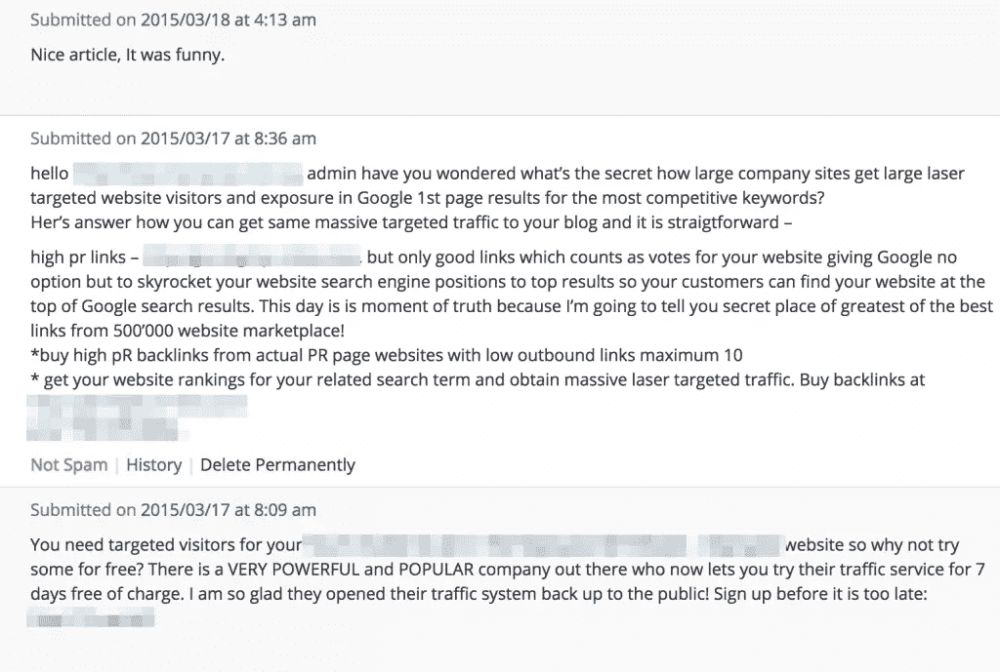
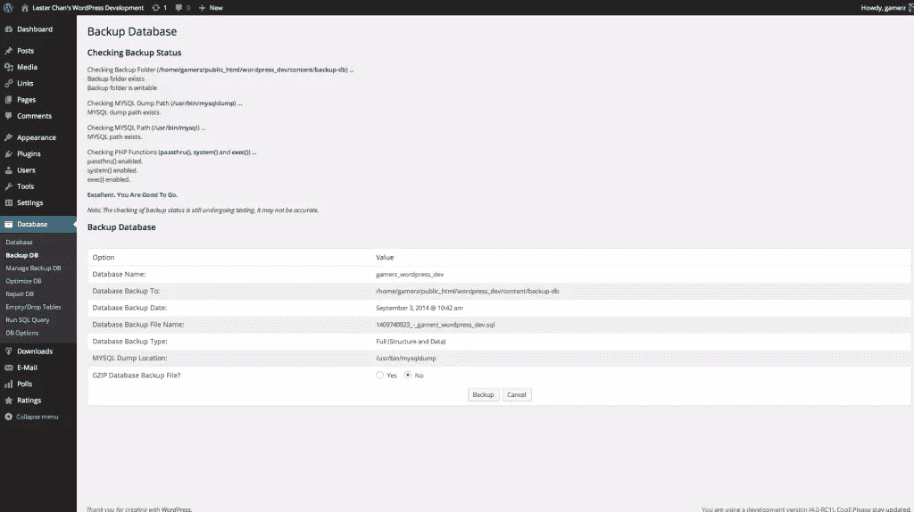
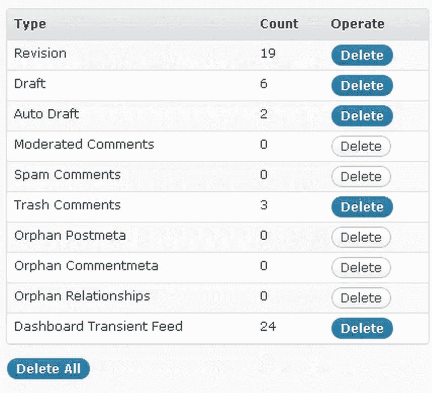
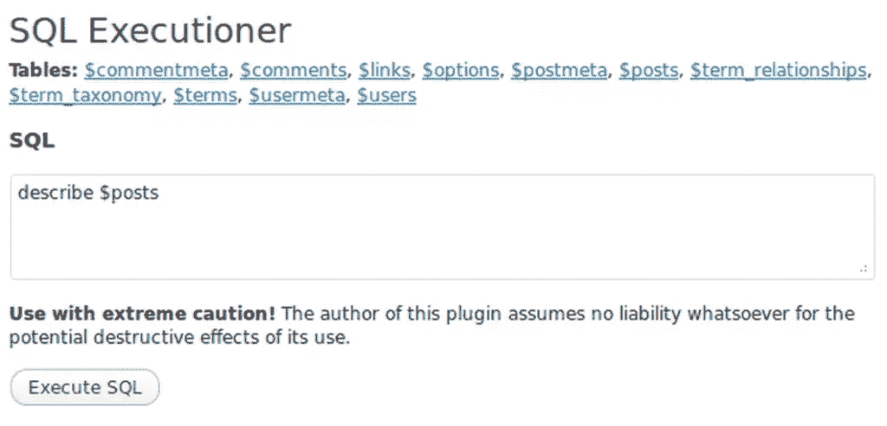
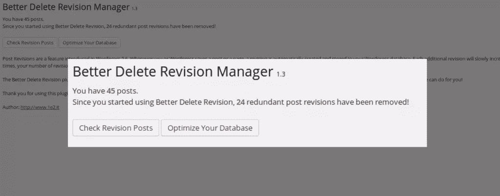
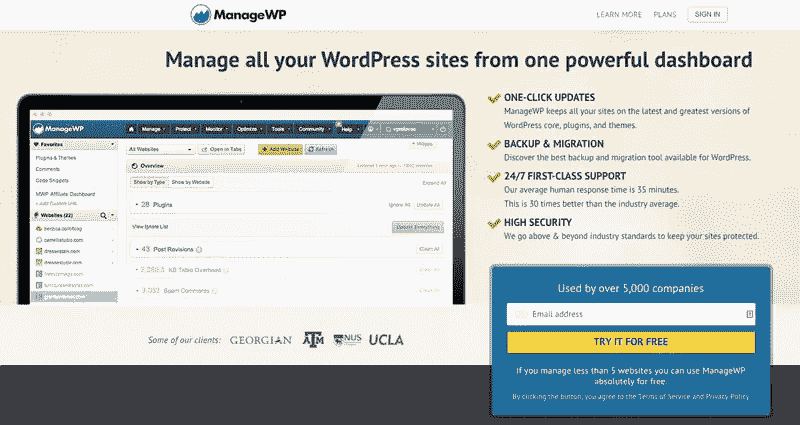
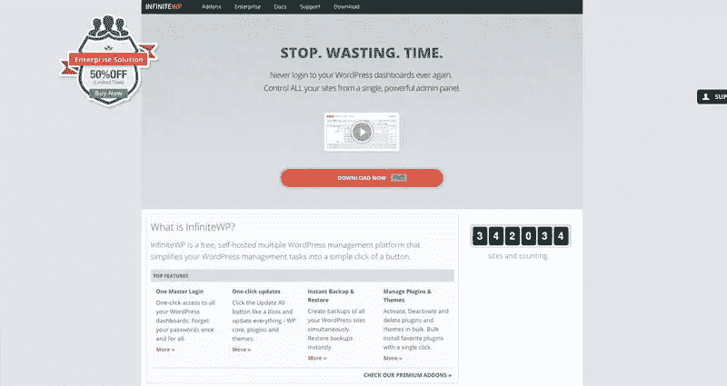
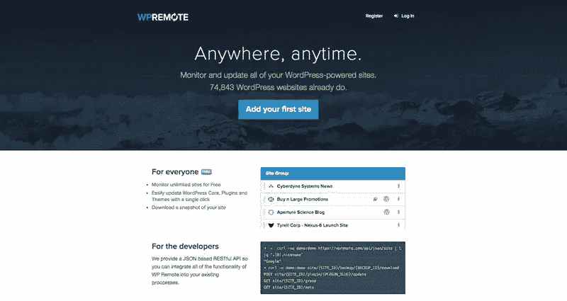
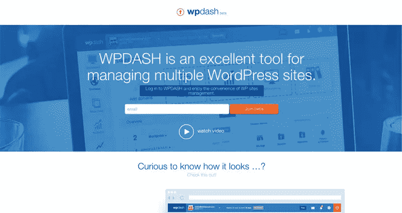
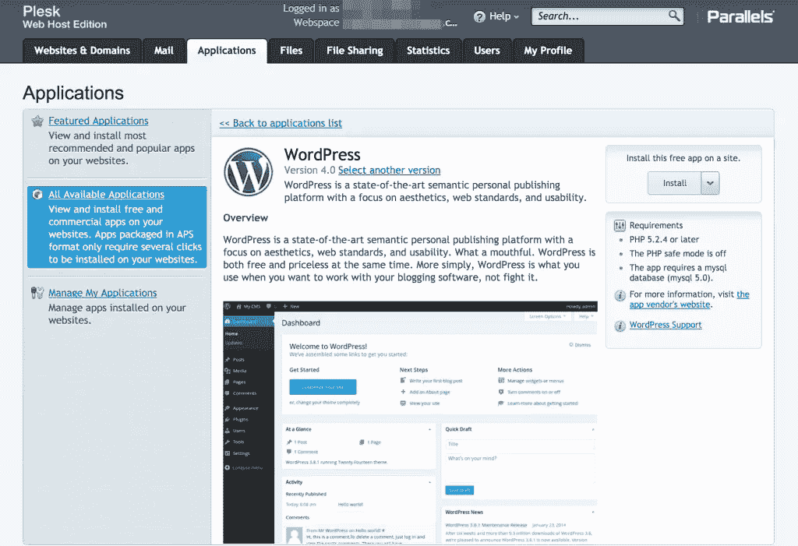

# WordPress 维护权威指南

> 原文：<https://www.sitepoint.com/definitive-guide-to-wordpress-maintenance/>

WordPress 的维护通常被认为是一件苦差事，但是它非常重要。大多数网络平台，如果没有一点额外的关注，会变得缓慢、容易出错和不可靠。从安全的角度来看，维护不善的网站甚至会成为一种负担。不必要的文件和数据会降低网站的速度。垃圾评论等不需要的内容会给你带来伤害，消耗宝贵的资源，影响你在搜索引擎中的排名。安全缺陷会让攻击者利用您的网站实施欺诈、传播恶意软件并发起进一步的攻击。

定期维护对于一个稳定、健康的网站至关重要。

对于本文的大部分内容，我们假设你至少对你的 WordPress 站点有管理员权限。对于一些 WordPress 用户来说，不能访问他们自己的托管环境并不少见，不管是 cPanel、Plesk 还是 shell access。你只需要访问你的 WordPress 仪表盘来安装插件。如果你不是插件类型的人，我理解，所以我确实提到了通过修改你的`wp-config.php`文件来达到相同结果的其他方法。但是，要做到这一点，您需要服务器级别的访问权限。

一如既往，在对您的网站进行任何更改之前，请确保您有可靠的最新备份。理想情况下，您应该在测试环境中测试任何变化。

以下是我们将涉及的内容的简短概述:

*   备份
*   维护模式
*   WordPress 更新
*   垃圾评论
*   数据库维护和优化
*   健康和安全监控
*   集权管理
*   解决纷争
*   日程安排和文件
*   保持消息灵通

## 备份

备份是必不可少的，那是旧的破记录。但它仍然是经常被忽视的东西。

设置自动备份绝对是可行的方法，也是你应该追求的目标，但要确保定期测试。

我甚至建议将手动备份和恢复添加到您的计划中，这个过程非常简单，如果/当时间到了，您将准备好完成恢复过程。以下是一些肯定会帮助你的指南:

*   [如何手动备份你的 WordPress 网站](https://www.sitepoint.com/manually-backup-your-wordpress-website/)
*   [如何将 WordPress 移动到新的服务器上](https://www.sitepoint.com/move-wordpress-new-server-without-losing-anything/)

如果你在寻找备份插件，back pup[是最受欢迎的](https://www.sitepoint.com/wordpress-orgs-most-popular-plugins-for-2014/)之一，有 150 万次下载。

备选方案也很多，比如[备份到 Dropbox](https://wordpress.org/plugins/wordpress-backup-to-dropbox/) 、 [UpdraftPlus](https://wordpress.org/plugins/updraftplus/) 和 [VaultPress](https://wordpress.org/plugins/vaultpress/) 。你的虚拟主机提供商可能也有备份选项，没有对错，只要确保你已经覆盖。不要害怕使用多个备份系统。

## 维护模式

当你在幕后做改变的时候，你应该总是让你的站点离线。如果你必须在一个实时网站上工作，这一点尤其正确。这将有助于减少您的用户在您进行更改时看到或经历任何他们不应该看到或经历的事情的可能性。

WordPress 本身在应用更新时有一个本地维护模式，但是也有一些有用的插件看起来更好，给你更多的选项，你可以随时启用。

这类插件通常也被称为“即将推出”或“维护模式”插件，所以如果你正在寻找其他选项，请包括这些术语。

以下是一些流行的插件:

### WP 维护模式


插件网址:[https://wordpress.org/plugins/wp-maintenance-mode/](https://wordpress.org/plugins/wp-maintenance-mode/)

### 维护


插件网址:[https://wordpress.org/plugins/maintenance/](https://wordpress.org/plugins/maintenance/)

### 即将推出的页面和维护模式


插件网址:[https://wordpress.org/plugins/coming-soon/](https://wordpress.org/plugins/coming-soon/)

## WordPress 维护模式。维护

如上所述，WordPress 在执行更新时将自己置于维护模式。其方法是创建一个. maintenance 文件，在更新完成后删除该文件。您也可以自己创建这个文件。您可以使用默认维护模式做很多事情，例如，可以对其进行定制和样式化。

如果你对更多的信息感兴趣，想要一些例子，我推荐你去看看没有插件的 WordPress 维护模式。

### 手动设置 503 重定向

如果你喜欢在不使用插件或. maintenance 文件的情况下使你的站点离线，另一个选择是在你的。htaccess 到您创建的静态页面。注意，这不是 301 重定向，你可能在谈论出于 SEO 目的重定向 URL 时遇到过这种情况。503 HTTP 响应代码告诉所有客户端该服务不可用。与仅仅激活一个插件相比，这需要更多的工作，但是总有一天会派上用场。

## WordPress 更新

软件更新定期发布，它们需要应用到您的网站，以确保您的网站功能正常。在 WordPress 的上下文中，我们指的是 WordPress 核心、主题和插件。一旦应用了更新，测试站点以确保一切按预期运行并且没有任何冲突总是很重要的。

如果你有一个复杂的网站(有很多插件)，我建议一次更新一个，这样如果有什么东西坏了，你就知道是什么原因了。同样，这也是测试环境的无价之处。

如果你想深入了解，这里有更多关于 WordPress 更新的信息:

*   更新 WordPress、插件和主题的指南
*   [如何在 WordPress 中配置自动更新](https://www.sitepoint.com/configure-automatic-updates-wordpress/)

## 垃圾评论

垃圾评论是一种瘟疫，通常以评论的形式出现，包括只是为了短期 SEO 提升或产生销售线索而存在的链接。



预防总是比治疗好，但是如果你被叫去帮助修复一个被垃圾评论攻击的网站，这种说法并没有真正的帮助。

你应该经常使用反垃圾邮件技术(例如，使用 [Akismet](http://akismet.com/) ，或者在一定天数后关闭评论)，或者如果评论没有被使用，甚至完全关闭评论。然而，如果一个网站已经积累了大量的垃圾评论，你该怎么办？幸运的是，如果出现这种情况，有一些有用的插件应该在你的工具箱中占有一席之地。

### 删除所有评论

这几乎和盒子上说的一样，它删除了所有的评论。如果你正在运行一个偶然允许评论的网站，这是非常有用的。只要安装这个插件，你就可以一次删除所有评论。如果不需要评论，您可以关闭评论，或者启用您最喜欢的垃圾邮件管理系统。我听到你问，如果网站有很多页面和帖子呢？你不想检查每一页。这让我想到了下一个插件！

插件网址:[https://wordpress.org/plugins/delete-all-comments/](https://wordpress.org/plugins/delete-all-comments/)

### 禁用评论

你应该已经知道了 WordPress 中的批量编辑功能，当改变多种内容类型时，它可以节省大量的时间。像 WordPress 中的大多数东西一样，评论也可以这样管理。然而，有一种更简单的方法可以在整个网站范围内关闭评论。这个插件叫做禁用所有评论。同样，它确实做了它所说的事情，但是要确定你将来绝对不需要注释。插件也会要求你确认这一点。

插件网址:[https://wordpress.org/plugins/disable-comments/](https://wordpress.org/plugins/disable-comments/)

## 数据库维护和优化

数据库需要维护。这取决于你的数据库有多大，事情改变的频率和你的服务器环境。如果你正在管理一个繁忙的网站，下面的插件可以帮助修复任何错误，并确保你的数据库得到优化。

这些插件大多做同样的事情，但检查他们，挑选一个你觉得最适合你的需要。有些提供更多的功能，有些可以定期运行。

#### WP 数据库管理器



插件网址:[https://wordpress.org/plugins/wp-dbmanager/](https://wordpress.org/plugins/wp-dbmanager/)

#### WP-优化


插件网址:[http://wordpress.org/plugins/wp-optimize/](http://wordpress.org/plugins/wp-optimize/)

#### WP 清理



插件网址:[https://wordpress.org/plugins/wp-clean-up/](https://wordpress.org/plugins/wp-clean-up/)

#### 大胜


插件网址:[https://wordpress.org/plugins/wp-sweep/](https://wordpress.org/plugins/wp-sweep/)

#### 清理图像


插件网址:[https://wordpress.org/plugins/cleanup-images/](https://wordpress.org/plugins/cleanup-images/)

### WordPress 中的数据库接口

您可能熟悉 MySQL 和 phpMyAdmin 之类的工具，但是您也可以安装几个插件来类似地访问您的数据库。这些插件可用于运行导入、导出、修复和运行查询等操作。

通常我们会使用我们选择的工具来访问 MySQL，但是如果您没有访问权限，这些工具可以成为救命稻草。

#### SQL 执行程序



插件网址:[https://wordpress.org/plugins/sql-executioner/](https://wordpress.org/plugins/sql-executioner/)

#### 爱慕者


插件网址:[https://wordpress.org/plugins/adminer/](https://wordpress.org/plugins/adminer/)

值得注意的是，启用这些工具时应该小心，只有在完全必要的情况下才使用它们。

### 手动关闭回收站和修订历史

在本节中，我们将编辑`wp-config.php`文件。

Autosave 不止一次地拯救了我，如果你在 WordPress 中创建了大量的内容，像修订历史和内置文件比较这样的功能是非常方便的，所以除非你需要，否则我不会改变它。也就是说，在某些情况下，这些更改是有意义的，通过向您的`wp-config.php`文件添加一些简单的条目，可以很容易地关闭这些特性。

注意:当你对你的`wp-config.php`文件进行修改时，你需要确保你把它们添加到最后一节的上面:

```
/* That's all, stop editing! Happy blogging. */

/** Absolute path to the WordPress directory. */
if ( !defined('ABSPATH') )
	define('ABSPATH', dirname(__FILE__) . '/');

/** Sets up WordPress vars and included files. */
require_once(ABSPATH . 'wp-settings.php');
```

有一些注释提醒我们这一点，但是不要忘记将它们添加到文件的最后一行。这个`wp-config.php`文件可以用于许多有用和有趣的事情。对于喜欢冒险的人来说，看看`wp-config.php` 上的[抄本页面，你就会明白我的意思。](http://codex.wordpress.org/Editing_wp-config.php)

#### 废物

当你点击删除时，这是内容，主要是页面和文章的最终位置。默认情况下，内容将在垃圾桶中放置 30 天。将下面一行添加到您的`wp-config.php`文件中可以很容易地改变这一点。下面是我们将它改为 2 天的方法:

```
define( 'EMPTY_TRASH_DAYS', 2 );
```

我们也可以完全关掉垃圾:

```
define( 'EMPTY_TRASH_DAYS', 0 );
```

#### 自动保存和修订历史

自动保存文章修订的默认时间段是 60 秒。每 60 秒，WordPress 会保存编辑器中的内容。这确实很方便，但在某些情况下，它也会创建许多我们不需要的额外记录。


你的修订历史可以在你的内容编辑器下面找到。如果您看不到您的修订，请转到右上角的“屏幕选项”,并确保选中“修订”。

我们可以调整一些自动保存设置，例如，我们可以增加或减少帖子保存的时间间隔:

```
define( 'AUTOSAVE_INTERVAL', 15 );
```

我们还可以限制存储的修订数量:

```
define('WP_POST_REVISIONS',5);
```

我们也可以完全关闭修订:

```
define('WP_POST_REVISIONS',false);
```

#### 修订插件

正如你可能猜到的，如果你不喜欢编辑`wp-config.php`文件，有一堆插件可以改变 Autosave 的行为:

##### 最好删除修订



插件网址:[https://wordpress.org/plugins/better-delete-revision/](https://wordpress.org/plugins/better-delete-revision/)

##### WP 版本控制


插件网址:[https://wordpress.org/plugins/wp-revisions-control/](https://wordpress.org/plugins/wp-revisions-control/)

## 健康和安全监控

重要的是要监控你的网站的健康和性能，以确保你的访问者在访问你的网站时得到最好的体验。这包括正常运行时间监控(告诉你你的网站何时关闭)和对关键网站指标的定期审查，包括来自谷歌分析和谷歌网站管理员工具等工具的信息。诸如此类的工具为您提供了关于性能和网站整体健康状况的信息。

定期监控有助于您在问题出现时就发现问题，通常是在问题变得严重之前。

缓慢加载的页面，破碎的内部和外部链接都会影响用户体验以及你的搜索引擎排名。

在网站维护时，安全监控也非常重要，你能做到什么程度取决于你的要求。有些主机会为你管理安全，或者你可以使用第三方插件和服务，如 [Sucuri](https://sucuri.net/) 、 [Wordfence](http://www.wordfence.com/) 和 [iThemes Security](https://ithemes.com/security/) 。不言而喻，你应该认真对待安全，这是值得花时间，并会帮助你运行一个严密的船。

这里有几篇关于 WordPress 安全性的更深入的文章:

*   [关于 WordPress 安全插件你可能不知道的事情](https://www.sitepoint.com/wordpress-security-plugins/)
*   安全提示

## 集中式 WordPress 管理

我试图从单个用户的角度来看 WordPress 的维护，但是如果没有提到集中的 WordPress 管理，任何关于这个主题的指南都是不完整的。

如果您要管理多个站点，那么您一定要花时间安装一个集中管理工具。

### WordPress 管理仪表板

许多 WordPress 用户已经熟悉了像 ManageWP 和 InfiniteWP 这样的 WordPress 管理面板，但是还有其他几个选择让竞争变得激烈。这些平台都在继续改进，现在我们开始看到它们与托管服务捆绑在一起，即使是 WordPress 的新用户也可以利用一些非常强大的功能。

以下是集中 WordPress 管理的流行选择，它们各有利弊，价格也各不相同。

#### 管理工作



更多信息:[管理 WP](https://managewp.com/)

#### 无限 wp



更多信息: [InfiniteWP](https://infinitewp.com/)

#### WP 遥控器



更多信息: [WP 遥控器](https://wpremote.com/)

#### wpmash



更多信息: [WPDASH](http://en.wpdash.io/)

#### 托管控制面板

一些虚拟主机控制面板现在提供 WordPress 管理功能，例如 [Parallels Plesk 推出他们的 WordPress 工具包](https://www.sitepoint.com/plesk-12-wordpress-toolkit/)。



### WP-CLI

WP-CLI 是一个项目，它为 WordPress 带来了一个很好的命令行界面，有许多与维护任务相关的命令。WP-CLI 允许您通过命令行完成几乎所有在仪表板中可以做的事情。如果你没用过，[一定要查一下](http://wp-cli.org/)。


## 解决纷争

如果你的网站有失败的时候，那就是你应用更新的时候。WordPress 核心更新是无缝的，通常是额外的东西(你的主题或者插件)在上面，在那里你会遇到问题。你的网站越复杂，就有越多的移动部件会损坏。

如果你需要帮助解决或追踪 WordPress 问题，我们有一些方便的文章:

*   [常见的 WordPress 问题以及如何解决这些问题](https://www.sitepoint.com/common-wordpress-issues-and-how-to-fix-them/)
*   [用 P3 优化 WordPress 的性能](https://www.sitepoint.com/optimizing-wordpress-performance-with-p3/)(用于修复性能相关问题)

## 日程安排和文件

众所周知，最好的意图并不总是导致行动。我们大多数人都没有时间，虽然 WordPress 维护可能不是你在周五晚上要做的最有趣的事情，但是养成一种习惯是很重要的。从长远来看，这会节省你的时间。

所以给自己制定一个适合自己的保养计划吧。你多长时间讨论一次以上的话题，取决于你自己和你的网站有多重要。在一天结束时，无论你是自己做还是寻求专业帮助，都要确保这个时间表适合你和你的风险阈值。

## 保持消息灵通

重要的是，当涉及到更新和安全补丁时，你要及时了解情况。Twitter、博客、邮件列表、IRC、Slack groups、脸书、Google+、论坛、播客和 Meetups 都是你可以获得任何重要新闻通知的地方。阅读任何更新的发行说明也是值得的，它可以给你一些提示。

如果你正在使用一个特定的产品，比如会员或者电子商务插件，确保你也选择了这些产品的更新。

## 结论

现在你知道了，我希望我所介绍的这些方面能帮助你在未来节省一些时间，并让你走上一条维护良好、运行顺畅的 WordPress 网站之路。我注意到“网站维护”的定义可以有所不同，所以我很想知道你推荐的其他维护任务或插件，请在评论中告诉我。

## 分享这篇文章