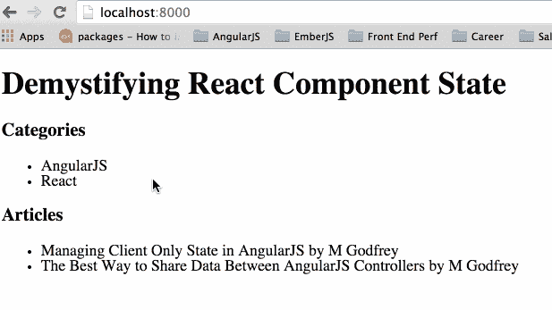
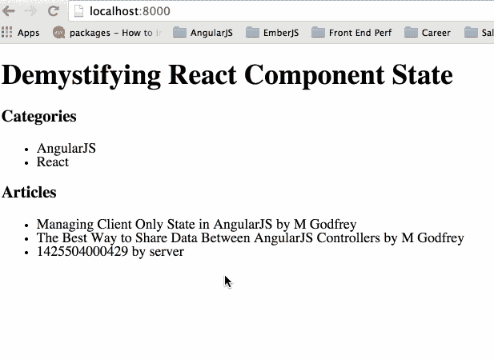

# 揭开反应组件状态的神秘面纱

> 原文：<https://www.sitepoint.com/demystifying-react-components-state/>

[React](http://facebook.github.io/react/) 是这个街区的新成员，这意味着没有多少人有任何用它建造东西的实际经验。本文将关注组件状态以及何时使用它们。

一个例子将作为我们探索的基础。一个简单的博客，有一个类别列表，点击后显示文章列表。数据将首先被硬编码，稍后我们将使用 [Socket。IO](http://socket.io/) 模拟外部文章发布。

## 无状态子代，有状态父代

让我们以引用 [React 文档](http://facebook.github.io/react/docs/interactivity-and-dynamic-uis.html#what-components-should-have-state)关于这个主题的内容开始这篇文章:

> 一种常见的模式是创建几个仅呈现数据的无状态组件，并在它们之上的层次结构中有一个有状态组件，该组件通过`props`将其状态传递给其子组件。

我们如何开始实现这种模式？换句话说，该模式涉及父组件和子组件的层次结构。

每个组件将在一个单独的文件中，以增强模块化。我们将使用[浏览器验证](http://browserify.org/)来:

*   向浏览器交付一个捆绑的 JavaScript 文件
*   防止全局名称空间污染(例如，在浏览器中的`window`对象)
*   支持 [CommonJS](http://www.commonjs.org/) 模块(即我们在 Node.js 代码中看到的`module.exports`)

让我们通过识别无状态子组件的理想候选者来开始我们的例子，看看层次结构的底部。

### 识别无状态子组件

如前所述，这个例子有两个列表:类别和文章。在我们的应用程序中，这些列表的类将分别被称为`CategoryList`和`ArticleList`。它们都是成为子组件的良好候选对象。

`categoryList.jsx`，包含`CategoryList`的文件，包含以下代码:

```
var React = require('react');

var CategoryList = React.createClass({
    render: function() {
        return (
            <ul>
                {this.props.categories.map(function(category) {
                    return (
                        <li key={category.id} 
                            onClick={this.props.onCategorySelected.bind(null, category.id)}>
                            {category.title}
                        </li>
                    );
                }, this)}
            </ul>
        );
    }
});

module.exports = CategoryList;
```

这个组件以及所有其他组件都是使用 JSX 编写的。它是一个 JavaScript 扩展，允许像标记一样嵌入 XML。阅读 React 文档页面可以了解更多信息。

`articleList.jsx`，包含`ArticleList`的文件，包含以下代码:

```
var React = require('react');

var ArticleList = React.createClass({
    render: function() {
        return (
            <ul>
                {this.props.articles.map(function(article) {
                    return (
                        <li key={article.id}>
                            {article.title + ' by ' + article.author}
                        </li>
                    );
                })}
            </ul>
        );
    }
});

module.exports = ArticleList;
```

你会注意到`CategoryList`和`ArticleList`都没有用它们的`render`方法访问`state`，也没有实现`getInitialState()`。我们遵循文档建议的模式，通过`props`从父节点传递数据。

值得注意的是，这些组件是完全解耦的。可以由任何父节点传递一组文章。例如,`ArticleList`可以在作者分组的上下文而不是类别分组的上下文中不加修改地重用。

现在我们有了无状态的子组件，我们需要在层次结构中向上移动一个级别，并创建一个有状态的父组件。

### 创建有状态的父组件

有状态的父组件可以在组件层次结构中的任何级别，也就是说，它也可以是其他组件的子组件。它不一定是最顶层的组件(传递给`React.render()`的组件)。然而，在这种情况下，因为示例相对简单，所以我们的有状态父组件也是最顶层的组件。

我们将这个组件称为`Blog`，并将它放在一个名为`blog.jsx`的文件中。后者包含以下代码:

```
var React = require('react');

var CategoryList = require('./categoryList.jsx');
var ArticleList = require('./articleList.jsx');

var Blog = React.createClass({
    getInitialState: function() {
        var categories = [
            { id: 1, title: 'AngularJS' },
            { id: 2, title: 'React' }
        ];

        return {
            categories: categories,
            selectedCategoryArticles: this.getCategoryArticles(this.props.defaultCategoryId)
        };
    },
    getCategoryArticles: function(categoryId) {
        var articles = [
            { id: 1, categoryId: 1, title: 'Managing Client Only State in AngularJS', author: 'M Godfrey' },
            { id: 2, categoryId: 1, title: 'The Best Way to Share Data Between AngularJS Controllers', author: 'M Godfrey' },
            { id: 3, categoryId: 2, title: 'Demystifying React Component State', author: 'M Godfrey' }
        ];

        return articles.filter(function(article) {
            return article.categoryId === categoryId;
        });
    },
    render: function() {
        return (
            <div>
                <CategoryList categories={this.state.categories} onCategorySelected={this._onCategorySelected} />
                <ArticleList articles={this.state.selectedCategoryArticles} />
            </div>
        );

    },
    _onCategorySelected: function(categoryId) {
        this.setState({ selectedCategoryArticles: this.getCategoryArticles(categoryId) });
    }
});

module.exports = Blog;
```

上面的代码相当冗长。这是由于分别在`getInitialState()`和`getCategoryArticles()`中对`articles`和`categories`进行了硬编码。在本文的开始，我提到数据将被硬编码，但稍后由 Socket.IO 提供。所以请耐心等待，因为这个解决方案很快会变得更有趣。

我们现在有两个子组件和一个父组件。然而，对于一个完全有效的解决方案来说，这还不够。为此，我们需要另外两个文件，一个用于引导`Blog`组件的脚本和一个显示它的 HTML 页面。

`app.jsx`，该文件带有引导程序演示的代码，包含以下代码:

```
var React = require('react');
var Blog = require('./blog.jsx');

React.render(
    <Blog defaultCategoryId="1" />, 
    document.getElementById('blogContainer')
);
```

最后，我们名为`index.html`的 HTML 页面包含以下标记:

```
<!DOCTYPE html>
<html>
  <head>
    <meta charset="UTF-8" />
    <title>Demystifying react-component state</title>
    <meta name="viewport" content="width=device-width, initial-scale=1" />
    <link href="styles.css" rel="stylesheet" />
  </head>
  <body>
    <h1>Demystifying React Component State</h1>

    <div id="blogContainer"></div>

    <script src="bundle.js"></script>
  </body>
</html>
```

您会注意到`index.html`没有加载`app.jsx`。这就是 Browserify 发挥作用的地方。在使用该应用程序之前，您必须运行以下命令:

```
browserify -t reactify browser/app.jsx -o browser/bundle.js
```

Browserify 从`app.jsx`开始，跟随对`require()`的所有调用，以便输出`bundle.js`。`bundle.js`将包含我们的三个组件`app.jsx`和 React 库本身，所有这些都在一个闭包内，以防止全局名称空间污染。

这是一个完全可行的解决方案的演示。



## 丰富

到目前为止，本文一直关注于实现无状态子组件和有状态父组件的模式，正如 [React 文档](http://facebook.github.io/react/docs/interactivity-and-dynamic-uis.html#what-components-should-have-state)所建议的。文档中还有其他方面可以帮助我们改进代码吗？

在接下来的章节中，我们将会看到其中的两个。第一个将使用事件处理程序，第二个将使用计算数据。

### 让事件处理程序引导状态内容

[React 文档](http://facebook.github.io/react/docs/interactivity-and-dynamic-uis.html#what-should-go-in-state)建议:

> 状态应该包含组件的事件处理程序可能更改以触发 UI 更新的数据。

在我们的解决方案中，`Blog`组件的`_onCategorySelected`方法是唯一的事件处理程序，它只改变`state.selectedCategoryArticles`。正因如此，`state.categories`和`state.articles`不应该存在。

我们可以通过将`app.jsx`中的`categories`和`articles`传递给`defaultCategoryId`旁边的`React.render()`来解决这个问题，如下所示:

```
var React = require('react');
var Blog = require('./blog.jsx');

var categories = [
    { id: 1, title: 'AngularJS' },
    { id: 2, title: 'React' }
];

var articles = [
    { id: 1, categoryId: 1, title: 'Managing Client Only State in AngularJS', author: 'M Godfrey' },
    { id: 2, categoryId: 1, title: 'The Best Way to Share Data Between AngularJS Controllers', author: 'M Godfrey' },
    { id: 3, categoryId: 2, title: 'Demystifying React Component State', author: 'M Godfrey' }
];

React.render(
    <Blog defaultCategoryId="1" articles={articles} categories={categories} />, 
    document.getElementById('blogContainer')
);
```

在`blog.jsx`中，我们现在访问来自`props`的文章和类别，如下所示:

```
var React = require('react');

var CategoryList = require('./categoryList.jsx');
var ArticleList = require('./articleList.jsx');

var Blog = React.createClass({
    getInitialState: function() {
        return {
            selectedCategoryArticles: this.getCategoryArticles(this.props.defaultCategoryId)
        };
    },
    getCategoryArticles: function(categoryId) {
        return this.props.articles.filter(function(article) {
            return article.categoryId === categoryId;
        });
    },
    render: function() {
        return (
            <div>
                <CategoryList categories={this.props.categories} onCategorySelected={this._onCategorySelected} />
                <ArticleList articles={this.state.selectedCategoryArticles} />
            </div>
        );

    },
    _onCategorySelected: function(categoryId) {
        this.setState({ selectedCategoryArticles: this.getCategoryArticles(categoryId) });
    }
});

module.exports = Blog;
```

我们要看的第二个改进是计算数据。

### 计算数据

[React 文档](http://facebook.github.io/react/docs/interactivity-and-dynamic-uis.html#what-shouldnt-go-in-state)进一步描述了:

> 应该只包含表示用户界面状态所需的最少量的数据。

`Blog`组件的`state.selectedCategoryArticles`由计算数据组成。文档建议所有的计算都写在组件的`render`方法中。我们可以通过如下更改`blog.jsx`来实现这一点(仅报告了`render()`方法):

```
render: function() {
    var selectedCategoryArticles = this.props.articles.filter(function(article) {
        return article.categoryId === this.state.selectedCategoryId;
    }, this);

    return (
        <div>
            <CategoryList categories={this.props.categories} onCategorySelected={this._onCategorySelected} />
            <ArticleList articles={selectedCategoryArticles} />
        </div>
    );
}
```

虽然在我们的简单示例中，这是一个容易遵循的建议，但是考虑一下 SitePoint 已经发布的文章数量。`render()`中的阵列滤波器可能会变得非常昂贵。对于这个场景，我会考虑模型变更，在每个`category`上引入一个`articles`数组属性。

这最后一个建议完成了我们对 React 文档提示的分析和实现。但是我们还有最后一个变化要做…

## 外部更新

我们将使用[套接字模拟文章发布。IO](http://socket.io/) 。为了简洁起见，我将省略服务器代码。

[在组件 API 页面](http://facebook.github.io/react/docs/component-api.html)中，React 文档描述了:

> 在 React 之外获得 React 组件实例句柄的唯一方法是存储 React.render 的返回值

有了这个知识插座。IO 集成变得微不足道。

`app.jsx`现在包括创建一个 SocketIO 客户端来监听来自服务器的`articlePublished`消息，如下所示(我只展示新代码):

```
var React = require('react');
var Blog = require('./blog.jsx');

var categories = [
    { id: 1, title: 'AngularJS' },
    { id: 2, title: 'React' }
];

var articles = [
    { id: 1, categoryId: 1, title: 'Managing Client Only State in AngularJS', author: 'M Godfrey' },
    { id: 2, categoryId: 1, title: 'The Best Way to Share Data Between AngularJS Controllers', author: 'M Godfrey' },
    { id: 3, categoryId: 2, title: 'Demystifying React Component State', author: 'M Godfrey' }
];

var renderedBlog = React.render(
    <Blog initialCategoryId="1" initialArticles={articles} categories={categories} />, 
    document.getElementById('blogContainer')
);

var socket = require('socket.io-client')('http://localhost:8000/');

socket.on('articlePublished', function(article) {
    renderedBlog._onArticlePublished(article);
});
```

`blog.jsx`通过公开一个额外的事件处理程序进行最后一次更改，如下所示:

```
var React = require('react');

var CategoryList = require('./categoryList.jsx');
var ArticleList = require('./articleList.jsx');

var Blog = React.createClass({
    getInitialState: function() {
        return {
            articles: this.props.initialArticles,
            selectedCategoryId: this.props.initialCategoryId
        };
    },
    render: function() {
        var selectedCategoryArticles = this.state.articles.filter(function(article) {
            return article.categoryId === this.state.selectedCategoryId;
        }, this);

        return (
            <div>
                <CategoryList categories={this.props.categories} onCategorySelected={this._onCategorySelected} />
                <ArticleList articles={selectedCategoryArticles} />
            </div>
        );

    },
    _onCategorySelected: function(categoryId) {
        this.setState({ selectedCategoryId: categoryId });
    },
    _onArticlePublished: function(article) {  
        // we should treat state as immutable 
        // create a new array by concatenating new and old contents 
        // http://stackoverflow.com/a/26254086/305844 
        this.setState({ articles: this.state.articles.concat([article]) });  
    } 
});

module.exports = Blog;
```

你会注意到`state.articles`又被引入了。正因为如此，我在`props`中引入了“初始”变量名来传达它的真实意图。

这是最终工作解决方案的演示。如你所见，服务器只发布 AngularJS 类别的文章，并“创造性地”为每篇文章标题使用时间戳。



## 结论

React 文档非常全面，您可以从中学到很多东西。写这篇文章迫使我遵循并准确地应用其中的一部分。现实世界的应用可能会迫使我们偏离它。当我们遇到这些场景时，我们也许应该努力改变其他应用程序组件(例如，模型或视图结构)。我很想在评论中听到你的想法。

完整的工作示例，包括套接字。IO 服务器代码，可以在[我的 GitHub 账号](https://github.com/crudbetter/demystifying-react-component-state)上找到。

* * *

*如果你想改进你的 React 游戏，看看我们为 SitePoint 会员提供的[React 上手快速入门](https://www.sitepoint.com/premium/courses/react-tips-2959)迷你课程的视频样本。通过从头开始构建 React 组件的出色实践经验，学习 React 的基础和实用部分。*

## 分享这篇文章