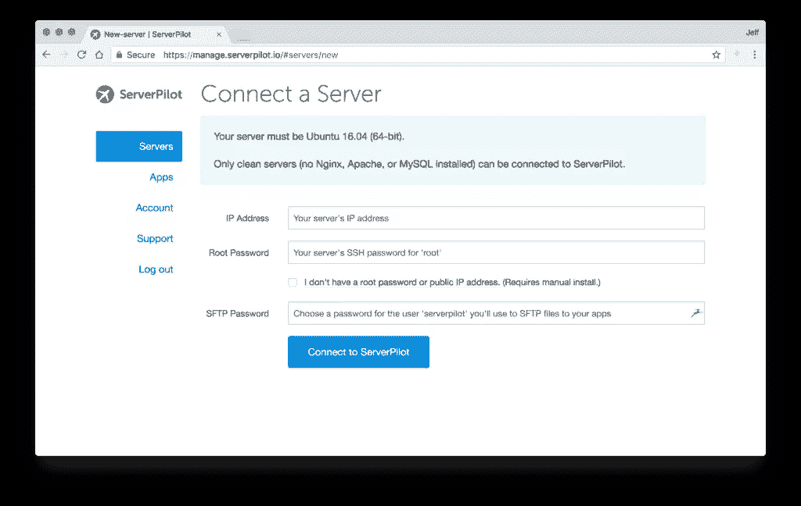
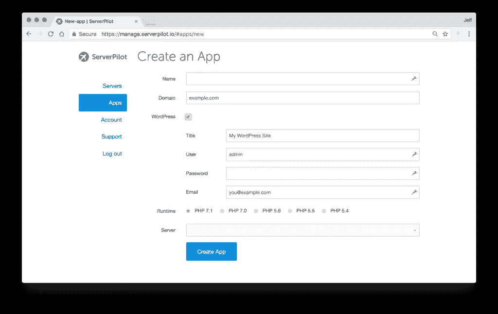

# 用 ServerPilot 部署和管理多个 WordPress 站点

> 原文：<https://www.sitepoint.com/deploy-and-manage-multiple-wordpress-sites-with-serverpilot/>

*本文是与 [SiteGround](https://www.siteground.com/sitepoint-recommended?afcode=97a975da3502771c04e59cbae092b1dd&campaign=server-pilot) 合作创作的系列文章的一部分。感谢您对使 SitePoint 成为可能的合作伙伴的支持。*

如果你已经尝试过将 WordPress 网站快速部署到你的主机提供商，你就会知道一键式安装工具有多有用，比如我们的主机合作伙伴 [SiteGround](https://www.siteground.com/sitepoint-recommended?afcode=97a975da3502771c04e59cbae092b1dd&campaign=server-pilot) 提供的工具。它有一些内部开发的很酷的功能，比如自动更新程序，可以自动备份和升级你的 WordPress 应用。如果你需要一键安装，请查看[网站的选项](https://www.siteground.com/web-hosting.htm?afcode=97a975da3502771c04e59cbae092b1dd&campaign=web-hosting)！

你为你的公司或你的客户，甚至为你自己的项目创建和管理多个带有多个 WordPress 站点的虚拟私人服务器(VPS)吗？ServerPilot 可能就是你管理这些服务器，并快速部署 WordPress 的工具。

ServerPilot 允许您将应用程序部署到您的虚拟专用服务器，而不必处理 web 服务器的命令行设置来获取您需要的文件、设置数据库和部署 WordPress。你可以部署这个环境，然后上传你自己的文件来创建一个 PHP、JavaScript 或者普通的 HTML 应用程序，但是特别是在 WordPress 站点的情况下，这个过程非常顺利。

## 谁应该使用 ServerPilot？

任何在不同主机上管理多个 WordPress 安装的人——特别是如果你是一个开发者，同时也提供托管服务，无论是为你自己的站点和项目，为客户，甚至是为你工作中的项目！ServerPilot 部署的快速性消除了大量建立自己的网络服务器和部署 WordPress 所涉及的昂贵的时间问题。有了一些使用提供 VPS 选项的托管服务的经验，并且有了 ServerPilot，你就可以启动一个新的服务器，并且立刻在上面安装一个工作 WordPress。

## 设置服务器

设置由 ServerPilot 管理的服务器是一个简单的过程。看看下面的内容吧！

### 1.建立一个 VPS

从你选择的提供虚拟专用服务器的主机提供商那里获得一个帐户，然后购买一个。有些是月费，有些是按小时计费。显然，你会寻找最适合你的特定项目。

获取 root 密码，但不要对服务器进行任何其他更改，也不要设置任何包或应用程序。就像 ServerPilot 说的那样，让服务器保持“干净”。

### 2.创建您的 ServerPilot 帐户

你将被带到欢迎屏幕。

### 3.将您的第一台服务器添加到 ServerPilot

单击创建您的第一台服务器后，您将看到类似于以下屏幕的屏幕:

填写您的服务器的 IP、root 密码，以及您希望在那里设置的“serverpilot”用户的密码。就是这样！如果一切顺利，您的服务器现在就可以开始在上面创建应用程序了。

## 部署您的应用

部署应用程序也非常快。您将转到应用程序，然后创建一个应用程序。您应该会看到应用程序创建屏幕:

在这里，您将输入您希望在内部调用该应用程序的名称、将用于访问它的域、您希望用于该应用程序的 PHP 版本，并最终选择安装它的服务器。WordPress 复选框将打开更多的选项——你也可以设置网站的标题，管理员的用户名、密码和电子邮件。

然后你只需点击创建应用程序！假设你已经找到了你的注册商，并且像平常一样把你的域名指向了你的服务器的 IP，你就完成了。你应该能够简单地访问你的网址并登录到 wp-admin 开始在你的网站上工作。

## 管理您的应用

您的应用程序有多种管理选项和信息。在应用程序的设置中，您可以删除应用程序、设置托管 SSL(使用付费 ServerPilot 计划)、添加或移除指向您的应用程序的域，以及添加或修改数据库。您还可以看到一些日志和统计数据。

## 结论

如果你正在寻找一种方法来管理多个虚拟私有服务器，并快速地部署 WordPress 实例，ServerPilot 是一个非常好的资源。

如果你只是在寻找一种快速将 WordPress 部署到你的主机上的方法，而不是真的需要一个更大的管理解决方案，许多共享主机提供商有一个 WordPress 的一键式安装工具，可能非常适合你的需要。我们的合作伙伴 [SiteGround](https://www.siteground.com/sitepoint-recommended?afcode=97a975da3502771c04e59cbae092b1dd&campaign=server-pilot) 就有这样一个工具，让你点击一下就可以部署 WordPress。如果这就是你需要的，不要再找了！如果您需要更复杂的管理解决方案，请尝试 ServerPilot，并在评论中告诉我们您的想法。

## 分享这篇文章