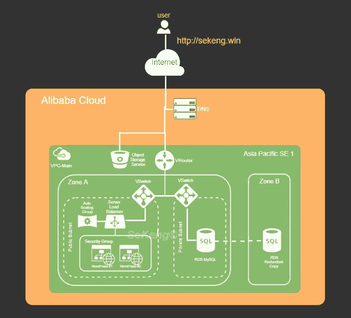
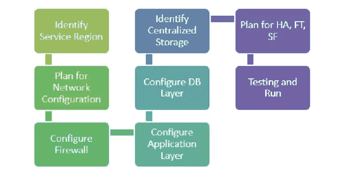
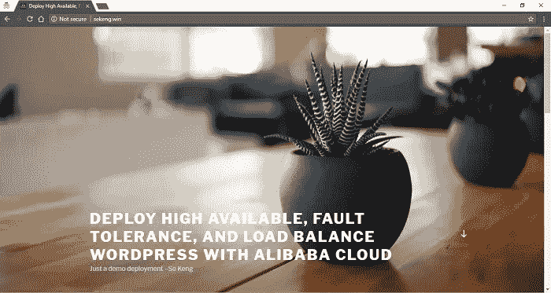

# 在阿里云上部署容错、负载平衡的 Web 应用

> 原文：<https://www.sitepoint.com/deploy-fault-tolerant-load-balanced-web-apps-on-alibaba-cloud/>

*本文原载于[阿里云](https://www.alibabacloud.com/blog/deploy-web-apps-with-high-availability-fault-tolerance-and-load-balancing-on-alibaba-cloud_277149)。感谢您对使 SitePoint 成为可能的合作伙伴的支持。*

高可用性(HA)、容错性(FT)和水平伸缩友好性(HSF)对于 web 应用程序今天的运行和成功同样重要。现有的或新的 web 应用程序应该使用这种底层架构进行设计和配置。幸运的是，您可以在今天的云时代(与本地裸机时代相比)轻松、快速地部署前述架构！

然而，这种灵活性伴随着一个警告——如何选择合适的云提供商？我们被选择宠坏了，这真的很有挑战性(而且令人兴奋！)在评价和选择合适的时候。

这篇文章旨在讨论并提供一个从头开始在[阿里云](http://click.aliyun.com/m/48746/)上部署 web 应用的演练，包括 HA、FT 和 HSF。在这篇文章中，我将简要介绍阿里云提供的几个服务和工具。是的，简单地说！如果您希望了解更多关于特定服务或工具的信息，请访问[文档中心](https://www.alibabacloud.com/help)。此外，这篇文章将强调部署此类服务时的关注点和考虑事项。

在本文中，WordPress 被用作部署在[阿里云](http://click.aliyun.com/m/48746/)上的演示网络应用。同样的部署原则应该适用于许多其他 web 应用程序。这篇文章根本不是为了讨论 WordPress 的配置。它不应该(也不能)作为 WordPress 配置的参考。关于 WordPress administrative 的最佳实践，有许许多多的好资源。

## 1.高层架构

像许多其他 web 应用程序一样，演示 web 应用程序由一个应用层(WordPress)和一个数据库层(MySQL)组成。

目标:最终，我们想要一个永远在线的网络应用(WordPress)！

为了实现这样一个“简单”的目标，演示 web 应用程序的部署必须满足以下最低要求:

1.  一个主站点。
2.  出于冗余和负载平衡的目的，每个站点上至少有两个物理上独立的 WordPress 实例。
3.  当现有实例停止或遇到故障时，自动生成另一个 WordPress 实例。
4.  数据库实例(MySQL)也必须以冗余模式运行。必要时，它应该自动故障转移到活动备用实例。
5.  集中式数据空间。共享资源必须可以被所有运行的 WordPress 实例访问和使用。例如，用户通过 WordPress 上传的文档应该在所有运行的 WordPress 实例中同步。

幸运的是，阿里云为我们提供了一系列服务和工具来满足这些需求。在本文中，我们将利用[云 DNS (DNS)](https://int.alibabacloud.com/m/48751/) 、[自动扩展组(ASG)](https://int.alibabacloud.com/m/48752/) 、[服务器负载平衡器(SLB)](https://int.alibabacloud.com/m/48750/) 、[弹性计算服务(ECS)](https://int.alibabacloud.com/m/48747/) 、[关系数据库系统(RDS)](https://int.alibabacloud.com/m/48749/) 、[对象存储服务(OSS)](https://int.alibabacloud.com/m/48748/) 和对象存储文件系统(OSSFS)工具来实现我们的目标。[部署的 WordPress](http://sekeng.win/) 的高层架构图如下:



## 2.部署程序

在深入研究每个单独的配置之前，我们将简要介绍图 1.0 中所示的组件。如前所述，你必须参考其他来源，如[阿里云在线文档](https://www.alibabacloud.com/product?spm=a3c0i.7954052.219104.1.5cf2a9c0X72WGN)以获得详细解释。下表根据我们的部署环境总结了这些组件的描述和用法:

**表 1:演示部署中的云组件**

| 站点/区域 | 数据中心的地理区域 | 1.部署地点 |
| 地区 | 区域内物理隔离的数据中心 | 2.用于数据库的冗余目的 |
| 云 DNS | 域名解析和管理服务 | 3.购买新域名 4。将流量路由到 WordPress 实例 |
| VPC(虚拟专用云) | 为私人使用而构建的虚拟隔离网络 | 5.对资源进行分组和分隔。设置安全控制 7。分配网络 IP 范围 |
| VRouter | 虚拟路由表 | 8.为配置的资源配置网络路由 |
| VSwitch | 将虚拟网络划分为子网 | 9.通过子网将指定区域内的资源分成组 |
| 服务器负载平衡器 | 根据配置的配置文件将流量分发到实例 | 10.在提供的 WordPress 实例中负载平衡(循环)请求 |
| 自动缩放组 | 根据扩展配置自动调整计算资源 | 11.作为看门狗来维护已定义的健康运行的 WordPress 实例 |
| 弹性计算服务(WordPress 实例) | 阿里云提供的计算和处理单元 | 12.安装并运行 WordPress。这是演示部署的应用层 |
| 关系数据库服务(MySQL) | 按需管理的数据库服务 | 13.WordPress 应用程序的数据库 |
| 对象存储服务 | 高可用性和容错对象存储 | 14.用户通过 WordPress 应用程序上传的文件/对象的集中存储 |

下面的工作流程描述了在[阿里云](http://click.aliyun.com/m/48746/)上部署 web 应用所涉及的一般步骤。



### 2.1.识别服务区域

决定应用程序应该部署在哪个区域非常重要。一般考虑应包括以下内容:

1.  成本:所有考虑因素之母。是的，费用可能因地区而异。
2.  **该地区的服务可用性**？有些地区提供其他地区没有的额外服务，这种情况并不少见——您必须进行测试才能发现！
3.  主要目标**用户的地理位置**。如果应用程序在物理上离客户更近，从而导致更短的延迟，那么用户体验肯定会更好。
4.  **规则&规定**。在所选地区托管应用程序是否合法？
5.  **可用区的数量 z** 。有时，我们需要通过在不同的区域部署冗余应用程序来提高应用程序的可用性。因为我的工作地点在东南亚，所以我会关注新加坡和吉隆坡的数据中心。在撰写本文时，“亚太 SE 3(吉隆坡)”只有一个单一区域，而“亚太 SE 1(新加坡)”有两个区域。

经过考虑，我们决定将“亚太 SE 1(新加坡)”作为我们演示部署的主要区域

### 2.2.网络配置计划

#### 一. VPC

我们必须考虑部署中可能运行的节点数量。每个运行的节点都受制于一个私有 IP，我们不希望以后节点的私有 IP 都用光了！

阿里云允许 VPC 使用三种类型的 CIDR 块:10.0.0.0/8、172.16.0.0/12、192.168.0.0/16。根据[阿里云文档](https://www.alibabacloud.com/help/doc-detail/54095.htm?spm=a3c0i.o27710en.a3.1.55cf99f575VxP0)，CIDR 区块的前&后三个 IP 将被系统使用预留，因此每个 CIDR 区块的私有 IP 的最大数量为:

*   10.0.0.0/8 = 16777212 (16777216 – 4)
*   172.16.0.0/12 1048572 (1048576 – 4)
*   192.168.0.0/16 = 65532 (65536 – 4)

你可能也想知道，为什么我们不使用允许的最大的 CIDR 地址块，以避免将来私有 IP 的耗尽？以下内容可能有助于你重新考虑这个想法:

1.  **更大的 CIDR 块**可能会增加处理 IP 相关配置的**复杂度**，例如子网创建、路由配置、安全组配置等。
2.  如果以上对您来说不是一个有效的展示停止，那么考虑这个:" **VPC 对等(互连)**"与其他 VPC 不允许重叠 CIDR 块。换句话说，一旦你使用 10.0.0.0/8 作为 CIDR 区块，你就不可能与其他 VPC 同行了！

经过考虑，我们将使用“192.168.0.0/16”进行我们的演示部署，因为 VPC 中只有几个正在运行的节点。

#### 二。子网络

在阿里云中，VSwitch 可用于将 VPC CIDR 区块进一步划分为一个子网，其中包含一个更小的 CIDR 区块。划分子网的一般注意事项包括:

1.  **根据功能对实例进行逻辑分组**。例如，将应用程序分组在一个组中，将 [RDS](https://int.alibabacloud.com/m/48749/) 分组在另一个组中，以便于维护。例如，通过删除连接到组的 VSwitch 来禁用一组实例。
2.  **简化安全组配置文件**配置。基于子网 CIDR 块级别的安全规则比基于单个实例的 IP 更清晰。
3.  启用特定子网上的**自动扩展和[服务器负载平衡器](https://int.alibabacloud.com/m/48750/)** 监控和操作。
4.  **资源冗余**。当现有子网的区域出现故障时，可以无缝故障转移到位于不同区域的不同子网。

经过考虑，我们将 WordPress 分组在一个子网(192.168.1.0/24)中，将 [RDS](https://int.alibabacloud.com/m/48749/) 实例分组在另一个子网(192.168.2.0/24)中。

### 2.3.配置防火墙(安全组)

实例级的网络访问可以通过阿里云的安全组来限制。安全组规则配置可以非常精细，直到每个协议、每个端口、每个客户端 IP 级别。因此，为了避免对实例的未授权访问，我们需要考虑以下几点:

1.  始终遵守**最小特权惯例**。仅限制对所需客户端的访问。
2.  **内部网或/和互联网连接**。您可以使用安全组通过只允许入站 intranet 访问来创建“专用子网”(不使用 internet)。此外，NAT 网关可用于允许专用网络中的实例访问出站互联网服务。

由于我们在 Linux 实例上运行 WordPress，我们至少允许 Security Group 中端口 80 (HTTP)和 22 (SSH)的入站规则。除此之外，所有出站流量都将被允许，因为对此没有具体要求。

### 2.4.配置应用层

这可能是我们在部署 web 应用程序时必须做出的最棘手和最不确定的决定。如前所述，本文不会讨论应用程序的容量需求，因此，选择合适的实例类型超出了本文的范围。总之，以下考虑事项通常有助于决定实例类型:

1.  如果您不了解实例类型性能或实际容量需求，请始终从**按需付费**模式开始。这种定价模式允许您自由试验不同的实例类型，而没有锁定期。
2.  您必须了解将要部署的**应用程序的约束**的性质。应用程序是受 CPU 限制还是受 IO 限制？您必须回答这个问题，以便确定具有最佳成本效益的适当实例类型。
3.  尽可能使用**下一级实例**进行部署。如果一个应用程序的容量需求可以通过实例系列类型 Y 的“X”实例来满足，那么对于相同数量的工作负载，如果我们使用来自相同系列类型的两个一级实例(例如 X/2)来部署该应用程序可能会更好。这将提高应用程序的可用性。例如，如果任何一个 X/2 实例停机，我们仍然可以处理 50%的工作负载，而如果 X 实例停机，我们则可以处理 100%的停机时间。当然，这种方法取决于应用程序的设计和使用。
4.  决定**其他使用参数**，例如网络类型、网络带宽、操作系统映像等。相应地。

由于这是一个没有任何实际生产用途的演示部署，我们将选择最低(最便宜的) [ECS](https://int.alibabacloud.com/m/48747/) 实例配置。比如:通用型 n1: 1 核，1GB，Ubuntu 16.04 OS，超云盘 40GB，1Mbps 网络带宽。

### 2.5.配置数据库层

通常，我们必须在使用自我管理的数据库实例(在 ECS 实例上自我安装数据库)和使用完全管理的 RDS 数据库服务(如 ApsaraDB )之间做出选择，前者就像我们通常为内部解决方案所做的那样。同样，比较或基准测试数据库服务的两种变体超出了本文的范围。这些准则通常有助于选择数据库变量:

1.  您有管理和操作数据库实例的可用资源吗？管理和操作任务可能包括备份数据文件、操作系统/数据库修补、主机上的访问控制等。如果答案是否定的，那么完全托管的 RDS DB 可能更好。
2.  您需要专用的数据库实例吗？如果您的数据库很小，工作负载很小，并且能够与应用程序共存(例如，在开发环境中)，由于成本效率的原因，自我管理的变体可能更好。
3.  您需要访问数据库实例的底层主机吗？例如，如果您需要执行特定的 OS/DB 配置以进行性能调优，那么应该使用自我管理的变体。
4.  完全托管的数据库服务是否提供了您需要的数据库类型？如果不是，那么答案很简单，选择自我管理的 DB 变体。
5.  如果您担心可能的云供应商锁定，那么您可能希望避免完全托管的变体，因为一些 [RDS](https://int.alibabacloud.com/m/48749/) 实施可能是特定于云供应商的。

由于既没有人力来维护演示数据库，也没有任何指定的数据库配置，我们将使用 ApsaraDB RDS–MySQL 部署演示数据库。此外，这个变体允许我们轻松地创建一个冗余(活动备用)数据库(只需点击一下鼠标！).

### 2.6.识别集中式存储

最终，可能会有多个并发的 WordPress 应用程序运行在物理上分离的 [ECS](https://int.alibabacloud.com/m/48747/) 实例上。每个实例可以生成和存储由用户操作产生的某些文件/图像/媒体。显然，任何实例生成的对象都必须在所有其他正在运行的应用程序实例之间同步。实现上述同步的方法之一是通过集中存储。生成的对象应同步到集中存储，然后在集中对象和其他运行实例之间同步。此外，集中式存储必须始终可用，任何实例的任何故障都不应影响集中式存储的可用性和持久性。

阿里云提供了几个完全托管的服务，可以作为集中存储:

1.  面向对象的对象存储服务:由于有保证的高可用性(99.9%)、可伸缩性和完全可管理的特性，它是集中式对象存储的理想选择。具体到这个演示部署，每个运行的 WordPress 实例应该与一个专用的公共对象存储服务的桶同步。通过使用这样的同步机制，所有运行的 WordPress 实例将拥有一组相同的创建对象。
2.  应用程序状态的 ApsaraDB Redis:通过完全管理的 ApsaraDB Redis，可以在运行的实例之间共享状态(例如共享值、参数)。

对象存储服务中的专用桶将被创建并用于存储作为用户操作的结果而创建的对象。所有正在运行的 WordPress 实例都应该与创建对象列表的相关桶同步。

### 2.7.为 HA、FT 和 HSF 制定计划

为了在阿里云中实现 HA、FT 和 HSF，web 应用应该从根本上设计为无状态和水平可伸缩的。任何依赖应用程序的状态或数据都应该从 web 应用程序中分离出来，并迁移到前面讨论过的集中存储中。

下面列出的服务可用于部署 HA、FT 和 HSF web 应用程序:

1.  **[云 DNS](https://int.alibabacloud.com/m/48751/)** :可以为托管在不同地区的实例配置“A”记录类型。这在故障转移场景中非常有用，只需一次点击就可以启用备用实例的“A”记录，从而将网络流量转移到备用实例。
2.  **Auto Scaling** :当正在运行的实例停止运行或变得不健康时，可以使用它在所需的区域中自动生成实例。
3.  **[服务器负载平衡器](https://int.alibabacloud.com/m/48750/)** :该服务将对已配置的实例进行健康检查，并将它们的状态报告给自动伸缩服务，以便采取进一步的行动。除此之外，该服务还会在运行的实例之间进行负载平衡。
4.  **ApsaraDB RDS** : RDS MySQL 提供多区域可用性特性，只需点击一下。这将真正减轻为数据库提供 HA 和 FT 所需的工作量。

演示部署将利用 DNS 将流量路由到 WordPress 实例，自动扩展以确保每个区域至少有两个运行的实例，以及[服务器负载平衡器](https://int.alibabacloud.com/m/48750/)提供健康检查以及负载平衡工作负载。最后但同样重要的是，RDS MySQL 上的多区域可用性特性可以为数据库提供 HA 和 FT。

### 2.8.测试和运行

为了测试 HA 和 FT 行为，我们可以手动停止正在运行的 [ECS](https://int.alibabacloud.com/m/48747/) ，并观察自动扩展服务触发的操作。如果自动缩放配置正确，将会自动产生一个新的实例。除此之外，我们还可以手动关闭 RDS DB 实例，以观察多区域冗余故障转移的发生。最棒的是，这些操作由各自的服务自动处理，无需任何手动干预。下面显示的是我们部署的[WordPress](http://sekeng.win/):



## 3.可能的改进

以下建议可能有助于进一步提高已部署 web 应用程序的弹性、性能和可用性:

1.  根据实例的工作负载自动扩展/缩小。例如，当 CPU/内存在一段时间内超过某个阈值时，生成一个新实例。
2.  利用 CDN 来缓存和分发内容，以最大限度地减少地理延迟并减少应用程序实例的流量。此外，CDN 还充当应用实例上 DDoS 攻击的防御层。
3.  通过创建读取复制副本来减轻数据库的“读取”工作负载。
4.  规划灾难恢复区域并创建故障转移策略。
5.  设置云监控，启用警报，并至少为关键指标和事件(如实例故障、磁盘空间已满、自动扩展触发等)打开详细日志。

## 4.附录(示例配置)

以下示例配置步骤基于“部署过程”一节中讨论的结果。您需要一个阿里云帐户来运行以下配置。如果你还没有得到一个，你可以通过这个[链接](https://account-intl.aliyun.com/register/intl_register.htm?biz_params=%7B%22intl%22%3A%22%7B%5C%22referralCode%5C%22%3A%5C%22b4zy2c%5C%22%7D%22%7D)注册(在撰写本文时有 300 美元的免费信用)。

### 1.VPC 和网络配置(确定服务区域和网络配置计划)

1.  登录阿里云控制台
2.  创造“VPC”。进入“产品”，点击“网络”下的“虚拟私有云”。选择地区为“亚太 SE 1”。一旦登陆 VPC 概览页面，点击“VPC”旁边的标签，然后点击“创建 VPC”按钮。
    *   名称:VPC 美因
    *   CIDR 范围:192.168.0.0/16
3.  创建一个“子网”。一个子网用于 WordPress 实例，一个子网用于 RDS。
    *   第一个子网(继续步骤 2 中的“下一步”以“创建虚拟交换机”):
        *   VPC:最近创建的 VPC(如美因河畔 VPC)
        *   名称:公共子网 1
        *   区域:A 区
        *   CIDR
    *   第二个子网(单击“创建更多”以创建第二个交换机):
        *   VPC:最近创建的 VPC(如美因河畔 VPC)
        *   名称:公共子网 2
        *   区域:A 区
        *   CIDR

### 2.安全组配置(配置防火墙)

1.  创建“安全组”。进入“产品”，点击“弹性计算服务”。进入 ECS 概述页面后，单击侧边选项卡上的“安全组”,然后单击“创建安全组”按钮。
    *   姓名:任何姓名。例如 SG-SSH-HTTP
    *   网络类型:VPC
    *   VPC:美因河畔 VPC
    *   点击“立即设置规则”
2.  添加规则。单击“添加安全组规则”
    *   第一条规则(任何入站客户端的 SSH)
        *   规则方向:入站
        *   授权策略:允许
        *   协议类型:SSH
        *   授权对象:0.0.0.0/0
    *   第二条规则(HTTP 用于任何入站客户端)
        *   规则方向:入站
        *   授权策略:允许
        *   协议类型:HTTP
        *   授权对象:0.0.0.0/0
    *   第三条规则(任何出站目标的所有协议)
        *   规则方向:出站
        *   授权策略:允许
        *   协议类型:全部
        *   授权对象:0.0.0.0/0

### 3.ECS 配置(配置应用层—第 1 部分)

1.  创建“密钥对”。进入“产品”，点击“弹性计算服务”。进入 ECS 概述页面后，单击侧面选项卡上的“密钥对”，然后单击“创建密钥对”。
    *   名称:ECS 实验室
    *   类型:自动创建密钥对
    *   应该会自动下载名为“ECS-Lab.pem”的密钥对文件。该文件将在连接到 ECS 实例时用作您的身份认证密钥。
2.  为你的 WordPress 安装创建一个 ECS 实例。进入“产品”，点击“弹性计算服务”。在 ECS 概述页面上，单击侧面选项卡上的“实例”,然后单击“创建实例”按钮。
    *   定价模式:现收现付
    *   地区和区域:亚太 SE 1(新加坡)，亚太 SE 1 A 区
    *   实例类型:通用类型 n1–1 核 1GB
    *   网络类型:相应地选择创建的“VPC”(VPC 主网)、虚拟交换机(公共子网 1)和安全组(SG-SSH-HTTP)
    *   操作系统:Ubuntu 16.04
    *   安全设置:附加密钥对，选择步骤 6 中生成的密钥对(ECS-Lab)。
    *   实例名:ECS-Lab-WP
    *   点击“立即购买”并进行相应操作
3.  使用在步骤 3.1 中生成的密钥对 SSH 到购买的 ECS 实例中。参考此[链接](https://www.alibabacloud.com/help/doc-detail/25434.htm)了解如何通过 SSH 进入 ECS 实例。进入“产品”，点击“弹性计算服务”。进入 ECS 概述页面后，单击侧边选项卡上的“实例”。互联网 IP 地址在“IP 地址”栏中。

SSH 进入 ECS 实例，并运行以下命令来安装 WordPress 所需的软件和包。请确保所有命令都成功执行。

```
apt-get update
apt-get install apache2 libapache2-mod-php php php-mcrypt php-mysql mysql-client-core-5.7 -y
cd /var/www/html
mv index.html index.html.bk
wget https://wordpress.org/latest.tar.gz
tar -xzf latest.tar.gz
cp -r wordpress/* /var/www/html/
rm -rf wordpress latest.tar.gz
chown -R www-data:www-data /var/www/html 
chmod -R 755 /var/www/html/wp-content
service apache2 restart 
```

### 4.ApsaraDB RDS 配置(配置数据库层)

1.  创建 ApsaraDB RDS–MySQL。进入“产品”并点击“用于 RDS 的 ApsaraDB”。进入 RDS 页面后，单击“创建实例”。
    *   计费方式:现收现付
    *   区域和分区:新加坡，多分区(A 区+B 区)
    *   数据库引擎:MySQL
    *   实例类型:1 个核心 1GB (rds.mysql.t1.small)
    *   网络类型:“VPC”，并相应地选择 VPC(VPC-主网)和 VSwitch(公共-子网 2)
    *   点击“立即购买”并进行相应操作
2.  配置 RDS 实例。转到“产品”并点击“ApsaraDB for RDS”(可能需要一段时间，所购买的“RDS”才会出现在页面上)。购买的 RDS 启动并运行后，单击 RDS 上的“管理”。
3.  创建白名单。单击侧边选项卡上的“安全”。在“白名单设置”选项卡下，单击“+添加白名单组”。
    *   组名:rds _ ecs _ 白名单
    *   白名单:192.168.1.0/24
    *   单击“确定”
4.  创建“wordpress”数据库。单击侧边选项卡上的“数据库”，然后单击“创建数据库”。
    *   数据库名称:wordpress
    *   支持的字符:utf8
    *   单击确定
5.  创建一个用户帐户。单击侧边选项卡上的“帐户”，然后单击“创建帐户”。
    *   数据库帐户:wordpress_user
    *   授权数据库:选择创建的数据库
    *   密码&重新输入密码:WordPress123 *(在此插入您自己更安全的密码)*
6.  单击“确定”创建帐户。

### 5.WordPress 配置(配置应用层-第 2 部分)

1.  使用 web 浏览器浏览到 ECS internet IP(在步骤 3.2 中创建)。
2.  填写 MySQL 连接的详细信息，如步骤 4.2 中定义的“数据库名称”、“用户名”、“密码”。“数据库主机”是在 4.1 中创建的 RDS 实例的“Intranet 地址”。你可以通过进入阿里云的控制台“产品”并点击“用于 RDS 的 ApsaraDB”来获得内部网地址。进入 RDS 页面后，单击创建的 RDS 实例，并复制“Intranet Address”值。
3.  点击“安装时运行”,继续 WordPress 的配置直到完成。万岁！到现在为止，你的第一个 WordPress 实例应该已经在[阿里云](http://click.aliyun.com/m/48746/)安装并运行了！

### 6.依赖同步的数据存储(识别集中存储)

1.  WordPress 用来存储用户上传文件的文件夹应该与集中存储同步。
2.  创建一个 [OSS](https://int.alibabacloud.com/m/48748/) 桶。进入“产品”，点击“存储& CDN”下的“对象存储服务”。进入对象存储页面后，单击 RDS 上的“创建存储桶”。
    *   桶名: **lab-wp-XXX** (使用自己的桶名)
    *   区域:亚太地区 SE 1(新加坡)
    *   存储类别:标准
    *   ACL:私有
    *   单击确定
3.  授予对步骤 14 中创建的存储桶的访问权限。进入“产品”，点击“监控和管理”下的“资源访问管理”。一旦你登陆到 RAM 页面，点击“用户”，然后点击“创建用户”。
    *   使用者名称:作业系统使用者
    *   单击确定
4.  授予创建的用户 [OSS](https://int.alibabacloud.com/m/48748/) 访问权限。进入“产品”，点击“监控和管理”下的“资源访问管理”。一旦你登陆到 RAM 页面，为新创建的用户点击“授权”按钮。
    *   选择并添加“AliyunOSSFullAccess”
    *   单击确定
5.  生成“用户访问密钥”。进入“产品”，点击“监控和管理”下的“资源访问管理”。进入 RAM 页面后，为新创建的用户单击“管理”。
6.  转到“用户访问密钥”部分，然后单击“创建访问密钥”。
7.  单击“保存访问密钥信息”保存生成的访问密钥和访问密钥机密。
8.  安装“ossfs”工具。该工具用于同步 WordPress 的相关文件夹和在步骤 6.2 创建的 OSS 桶。
9.  SSH 到启动的 WordPress ECS 实例
10.  根据此[链接](https://github.com/aliyun/ossfs#ossfs)处的指南安装‘OSS fs’

```
cd
wget https://github.com/aliyun/ossfs/releases/download/v1.80.3/ossfs_1.80.3_ubuntu16.04_amd64.deb
sudo apt-get update
sudo apt-get install gdebi-core -y
sudo gdebi ossfs_1.80.3_ubuntu16.04_amd64.deb 
```

12.  创建 WordPress 上传目录:

```
mkdir -p /var/www/html/wp-content/uploads
chown -R www-data:www-data /var/www/html/wp-content/uploads 
```

14.  相应地使用在步骤 6.2 和 6.5 中创建的存储桶名称和密钥设置凭据。

```
chmod 640 /etc/passwd-ossfs 
```

16.  将“la b-WP-XXX”OSS bucket 挂载到 WordPress 相关文件夹，并在实例启动期间启用自动挂载。
17.  在`/etc/fstab`中添加以下命令，在系统启动时挂载`lab-wp-XXX`。小心使用正确的区域。例如 http://oss-ap-southeast-1.aliyuncs.com 的

`echo "ossfs#lab-wp-XXX /var/www/html/wp-content/uploads fuse _netdev,url=http://oss-ap-southeast-1.aliyuncs.com,allow_other, 0 0" >> /etc/fstab`

19.  执行安装操作:`mount -a`
20.  为了避免装载的 OSS bucket 被 Linux 扫描(这会产生不必要的成本)，请将以下详细信息添加到“/etc/updatedb.conf”中:
    *   将“/var/www/html/WP-content/uploads”添加到修剪路径
    *   将“fuse.ossfs”添加到 PRUNEFS 中

### 7.高可用性、容错和负载平衡配置

1.  创建[负载平衡器](https://int.alibabacloud.com/m/48750/)。在“ECS 概述”页面上，单击侧边选项卡上的“负载平衡器”。在“负载平衡器”页面上，单击“创建服务器负载平衡器”。
    *   地区:新加坡
    *   区域:多区域
    *   主要区域:A 区
    *   备用区:B 区
    *   实例类型:互联网
    *   数量:1
2.  配置负载平衡器。在“ECS 概述”页面上，单击侧边选项卡上的“负载平衡器”。加载负载平衡器页面后，在步骤 7.1 中，单击购买的负载平衡器上的“管理”。
3.  单击“监听器”，然后单击“添加监听器”按钮。
    *   前端协议:HTTP，端口 80
    *   后端协议:HTTP，端口 80
    *   计划:加权舍入
    *   单击“显示高级”并启用持续会话
    *   超时持续时间:300
4.  单击“下一步”配置运行状况检查。
    *   域名:留空
    *   健康检查端口:80
    *   运行状况检查路径:/index.php
    *   正常状态代码:启用 http_2xx 和 http_3xx
    *   单击“确认”以预配负载平衡器
5.  更新 WordPress 中的负载平衡器互联网 IP 地址。这很重要，因为正在运行的 WordPress 实例已经用正在运行的 ECS IP 自动配置了。我们需要将 IP 地址改为指向负载平衡器的 IP 地址，因为 WordPress 可能由负载平衡器后面的任何 ECS 实例运行。如果您有域名，您可能希望改为更新到域名。
    *   使用浏览器浏览到 WordPress。转到“设置”URL，例如“http://<ecs internet="" ip="">/WP-admin/options-general . PHP”，然后相应地将“WordPress 地址(URL)”&“站点地址(URL)”更改为负载平衡器的互联网 IP。</ecs>
6.  停止 ECS 实例。进入“产品”，点击“弹性计算服务”。进入 ECS 概述页面后，单击侧边选项卡上的“实例”,然后单击“更多”,最后单击“停止”。
7.  创建自定义图像。ECS 停止后，单击“更多”,然后单击“创建自定义映像”。
    *   图像名称:IMG 可湿性粉剂
    *   图像描述:WordPress 的图像
8.  步骤 22 中的“自定义映像”创建完成后，重新启动 ECS(您可以在“快照”部分检查创建状态)。进入“产品”，点击“弹性计算服务”。进入 ECS 概述页面后，单击侧边选项卡上的“实例”,然后单击“更多”,然后单击“开始”。
9.  ECS 启动并运行后，创建一个[自动扩展组](https://int.alibabacloud.com/m/48752/)。进入“产品”，点击“弹性计算”下的“自动缩放”。一旦登陆“自动缩放”页面，点击“创建缩放组”。
    *   缩放组名称:ASG-WS
    *   最大数量:2
    *   最小数量:2
    *   默认冷却时间:300
    *   网络类型:VPC，并选择 VPC (VPC 主网)和虚拟交换机(公共子网 1)
    *   服务器负载平衡器:选择在步骤 7.1 中创建的负载平衡。您可能需要单击“加载更多数据”来显示负载平衡器。
    *   相应地配置 ECS 源和“用户定义的映像”。
    *   点击“提交”按钮。
10.  创建“扩展配置”。点击“创建缩放配置”。
    *   源 ECS:选择在步骤 7.8 中重新启动的 ECS。
    *   配置名称:ASG_ECS_WP
    *   安全组:选择在步骤 2.1 中创建的安全组
    *   用户定义的图像:选择在步骤 7.7 中创建的图像。
    *   点击“下一步”，然后点击“确定”并“启用”自动缩放组。
    *   检索负载平衡器公共 IP。进入“产品”，点击“弹性计算服务”。进入 [ECS](https://int.alibabacloud.com/m/48747/) 概述页面后，单击侧边选项卡上的“负载平衡器”。公共 IP 在“IP 地址”栏下。
11.  负载平衡器执行的运行状况检查可能需要一段时间才能完成。一旦负载平衡状态显示为“正常”,你就可以使用负载平衡器的公共 IP 访问 WordPress 应用程序。

**恭喜你！现在你已经成功地在一个地区部署了一个高可用性、容错和负载平衡的 WordPress 服务器！**

如果你想购买一个域名，请到“域名和网站”下的“域名”进行购买。

如果你想将你的域名与已部署的 WordPress 相关联，请转到“域名&网站”下的“阿里巴巴[云 DNS](https://int.alibabacloud.com/m/48751/) ，并为“服务器负载平衡”公共 IP 添加至少“A”条记录。

## 分享这篇文章