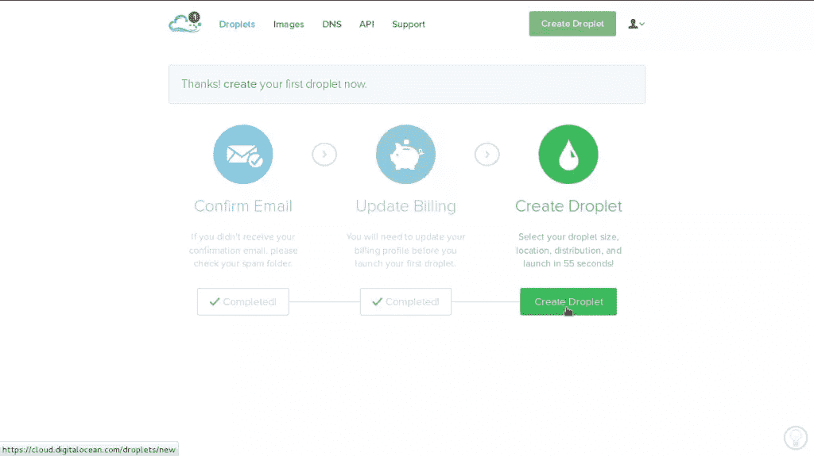
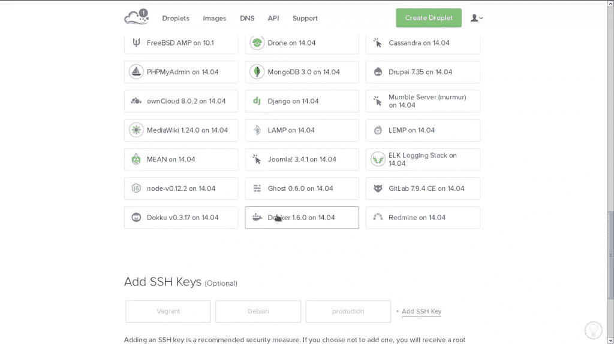
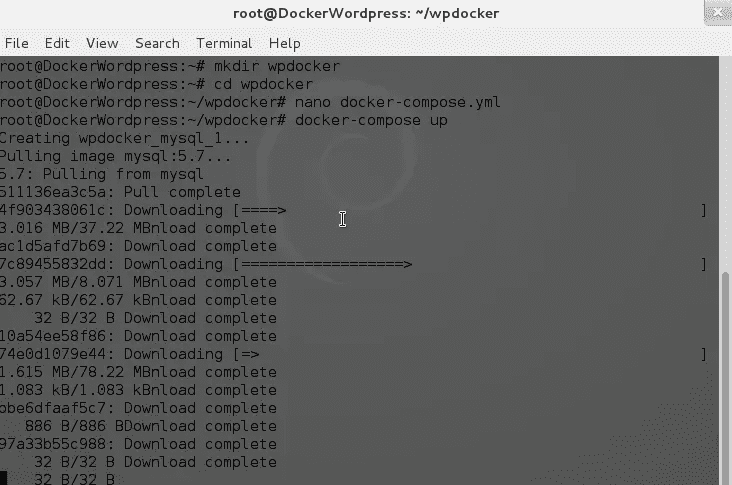
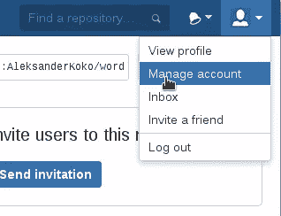
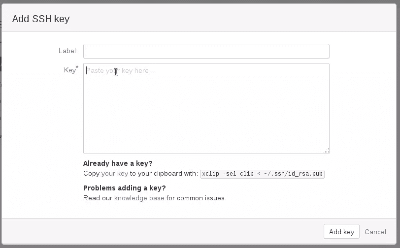

# 用 Docker 部署 WordPress

> 原文：<https://www.sitepoint.com/deploying-wordpress-with-docker/>

在我以前的文章中，我们已经介绍了什么是 Docker，并准备了我们的本地环境。在第二篇文章中，我们让 [Docker 与 WordPress](https://www.sitepoint.com/how-to-use-the-official-docker-wordpress-image/) 一起工作。在第三篇文章中，我们看到了如何[更好地使用 Docker Compose](https://www.sitepoint.com/how-to-manually-build-docker-containers-for-wordpress/) 来更容易、更易于管理地构建容器。现在，我将向你展示如何从本地机器部署一个项目(WordPress)到 DigitalOcean droplet。

## 设置您的数字海洋液滴

首先，在 [DigitalOcean](https://www.digitalocean.com/) 上创建一个账户。数字海洋是一个受欢迎的和负担得起的 [VPS](http://en.wikipedia.org/wiki/Virtual_private_server) 提供商。它是最便宜的 VPS 提供商之一，但这并不意味着便宜=质量差。你可以用 20GB 的 SSD 存储运行一个 512MB 的实例，每月只需 5 美元。

更新账单信息后(如果您是 DigitalOcean 的新手)，您现在需要创建一个 droplet。一个 droplet 就是一个 VPS 实例(毕竟，云技术都是很酷的名字！).



接下来，为实例选择一个名称。当你刚开始时，每月 5 美元的 512MB 内存已经很不错了。以后，您可以将该实例升级到 1GB，或者一直升级到 64GB 实例。区域是您的实例将居住的地方。选择您和/或您的用户所在地区附近的某个地方。毕竟，你希望你的网站有最好的速度。我选择了阿姆斯特丹，因为我住在欧洲。对于图像，您可以从普通操作系统开始，也可以从应用程序开始。Docker 安装时附带了一个应用程序(预建的盒子)。选择该图像。



现在您必须选择一个 [SSH 密钥](http://en.wikipedia.org/wiki/Secure_Shell)。SSH 是一种安全的方式，我们可以通过终端连接到我们的 droplet 并开始工作。为了更好地理解 SSH 如何工作，以及如何配置它以用于数字海洋，请阅读[博客上的这篇文章](https://www.digitalocean.com/community/tutorials/how-to-connect-to-your-droplet-with-ssh)。因为我已经配置了一个 SSH 密钥，所以我不需要添加新的。之后，只需点击创建 droplet，它应该只需要几秒钟就可以创建一个预装 Docker 的全功能 Ubuntu 14.04 系统。

## 安装 Docker 合成

在 DigitalOcean 上安装 WordPress 最简单的方法是使用 Docker Compose。毕竟，谁愿意一直和神秘的命令打交道呢？要设置 Docker Compose，我们需要一个到 droplet 的连接。SSH 连接将允许我们在 droplet 上执行命令。

```
ssh root@[ip_of_the_machine] 
```

要安装 Compose，请执行以下两个命令:

```
curl -L https://github.com/docker/compose/releases/download/1.2.0/docker-compose-`uname -s`-`uname -m` > /usr/local/bin/docker-compose 
```

```
chmod +x /usr/local/bin/docker-compose 
```

现在我们将检查 Compose 是否安装正确:

```
docker-compose --version 
```

如果您获得了版本号，那么您已经正确地完成了所有工作。

接下来，为项目创建一个文件夹。在其中，创建一个新的`docker-compose.yml`文件。

```
⧸⧸mkdir wpdocker
cd wpdocker
touch docker-compose.yml
nano docker-compose.yml 
```

在您的`docker-compose.yml`文件中，添加以下内容:

```
web:
    image: wordpress
    links:
     - mysql
    environment:
     - WORDPRESS_DB_PASSWORD=password
    working_dir: /var/www/html
    volumes:
     - wordpress/wp-content/:/var/www/html/wp-content
    ports:
     - "80:80"
mysql:
    image: mysql:5.7
    environment:
     - MYSQL_ROOT_PASSWORD=password
     - MYSQL_DATABASE=wordpress 
```

与我们的[上一个例子](https://www.sitepoint.com/how-to-manually-build-docker-containers-for-wordpress/)的唯一区别是没有指定 IP 地址。应该配置端口，即使容器上的端口 80 是 droplet 上的端口 80，没有这个端口它就不能工作。

执行:

```
docker-compose up 
```



因为是这个 droplet 第一次会用 Docker，所以会先拉所有图片。现在在浏览器上检查 droplet IP，你会看到一个安装 WordPress 页面。万岁，你做到了！

这个例子有两个问题。首先，如果我们关闭终端，该进程(在 droplet 上)将会关闭。第二个问题是我们可能想要编辑我们的主题文件。这不是真正的部署，而只是在 VPS 上的安装。

对于第一个问题，只需要加上`-d`。

```
docker-compose up -d 
```

## 将本地发展与数字海洋同步

这是有趣的部分开始。我们可以使用 git 和一个存储库来修改我们的本地 WordPress 安装，并将修改推送到存储库。将变更推送到存储库之后，我们可以将这些变更拉回到 droplet 中。您可能希望选择一个私有存储库。你可以选择 [BitBucket](https://bitbucket.org/) 作为替代，因为 GitHub 只在你不付费的情况下提供公共库。在我的例子中，我将使用 BitBucket。

接下来我们需要一个 SSH 密钥。如果你还没有 SSH 密钥，请阅读 GitHub 上的这篇文章。

有了 SSH 密钥后，在 BitBucket 上创建一个帐户。如果你想免费使用 GitHub，它也是一样的。创建一个新的存储库并配置您的 SSH 密钥。您的 SSH 密钥位于`~/.ssh/`文件夹下。打开 SSH 文件夹下的`id_rsa.pub`文件，复制该文件的内容。





接下来，转到您的本地项目(如果您愿意的话，是我们在上一篇文章中创建的项目)。如果它没有运行，执行`docker-compose up -d`并开始做出改变。安装一些插件和一个主题。此外，添加新的职位，网页或其他任何你想要的。

现在在`wp-content`文件夹中导航并执行以下命令:

```
git init
git remote add origin git@bitbucket.org:[repository].git
git add .
git commit -m "first init"
git push -u origin master 
```

`wp-content`文件夹的内容现在在您的 BitBucket 存储库中。接下来，我们需要把它们拉到我们的水滴上。SSH 到您的 droplet，如果您还没有登录。

```
ssh root@[droplet_ip] 
```

连接后，在项目文件夹中导航，然后:

```
docker-compose stop
cd wordpress
rm -rf wp-content 
```

您会看到我已经删除了 droplet 上的`wp-content`文件夹，因为我们将使用存储库中的内容。

现在我们需要为 droplet 生成一个 SSH 密钥，我们可以通过运行:

```
ssh-keygen -t rsa -C "your_email_here" 
```

我们需要再次复制`id_rsa.pub`的内容，并在 BitBucket 上注册那个 SSH 密钥:

```
cat ~/.ssh/id_rsa.pub 
```

复制终端上回显的内容，并将其作为一个新的密钥添加到 BitBucket，确保您给它一个有意义的名称。

```
git clone git clone git@bitbucket.org:[repository].git wp-content 
```

您已经克隆了存储库，并将新文件夹命名为“`wp-content`”。

之后，导航回项目的根目录，再次启动容器。

```
cd ..
docker-compose up -d 
```

现在，您可以使用浏览器查看您的网站。你应该能够登录到管理面板，你会看到新的插件和主题安装。您也可以导出本地 WordPress 数据，并在您的 droplet 安装中使用它。我会让你把这一步当作作业来处理(如果你喜欢那种作业的话)。

## 结论

我们现在即将结束 Docker 上的这个系列。Docker 是一项令人兴奋的新技术，看起来它将改变我们创建和部署应用程序的方式。

在本文中，我们看到了如何将我们的本地 WordPress Docker 安装部署到 DigitalOcean。我们在 BitBucket 上创建了一个存储库，并使用该存储库与我们的 DigitalOcean droplet 进行同步。如果您还没有阅读我们之前在 Docker 上发表的文章，您可以在下面找到它们:

*   [面向 WordPress 开发者的 Docker 简介](https://www.sitepoint.com/docker-for-wordpress-developers/)
*   [如何为 WordPress 手动构建 Docker 容器](https://www.sitepoint.com/how-to-manually-build-docker-containers-for-wordpress/)
*   [如何使用 Docker 官方 WordPress 图片](https://www.sitepoint.com/how-to-use-the-official-docker-wordpress-image/)

我们真的很想听听你的意见。还有，和上次一样的问题，你会考虑在生产中使用 Docker 吗？

## 分享这篇文章