# 在几分钟内设计一张经典的圣诞贺卡

> 原文：<https://www.sitepoint.com/design-a-classy-last-minute-christmas-card-in-minutes/>

再过几个小时圣诞节就要到了，如果你还没有寄出你的节日贺卡，你就陷入了困境。从商店里找到合适的卡片可能是一个真正的挑战，尤其是在时间紧迫的时候。你希望它是个性化的，你希望它符合你的个性和风格，你希望它看起来很好。你可以更快更好地设计自己的卡片。使用 Photoshop，再加上一点创意，你可以在几分钟内制作出一张精彩的、个性化的圣诞卡，让你的朋友和家人爱不释手。

在你开始设计你的卡片之前，你需要首先考虑你要制作什么类型的卡片。您可以创建一个简单的单页，正面和背面的卡，或者您可以创建一个双折卡。如果你创建一个双折卡片，本质上你仍然是在创建一个正面和背面卡片，但是它会沿着中心分开，一边是卡片的外面，另一边是卡片的里面。圣诞卡的典型尺寸是 4 英寸×8 英寸，又长又薄，5 英寸×7 英寸，或者 5 英寸×7 英寸折叠，这意味着你开始用的纸应该是 10 英寸×14 英寸。我们将介绍如何制作一张 5 英寸×7 英寸的折叠圣诞卡。

[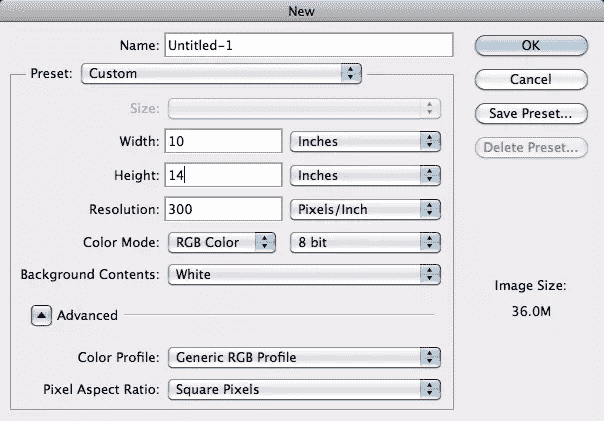](https://www.sitepoint.com/wp-content/uploads/2012/12/Screen-shot-2012-12-14-at-11.08.04-AM.png)

创建一个新的 Photoshop 文档，大小为 14 英寸高，10 英寸宽。我们将沿着它的高度中心折叠，给我们一个顶部折叠的风景圣诞卡。将分辨率设置为 300ppi，因为我们将打印卡片，所以图像需要清晰，以便打印。如果我们将卡片设计为 72ppi，那么我们的图像在打印时会看起来像素化或模糊。您可以在 RGB 颜色模式下开始设计，但请记住在编辑完卡片后将其更改为 CMYK。

您可能希望设计一些参考线，只是为了帮助您记住卡片的边界以及可以放置图像和文本的位置。出于打印目的，最好在任何打印表面的边缘留出 1/8 英寸的空间。这将确保您为所有的打印区域留出足够的空间，而不会有任何内容被剪切掉。下面，你可以看到我如何设置我的指南。你可以按 Command + "R "来显示或隐藏你的标尺，你可以右击标尺线本身，这将弹出一个菜单，你可以在这里选择你的测量单位。我把我的像素改成了英寸。我在边缘周围 1/8 英寸处设置了导轨，并在中心设置了一个导轨来标记卡片的折叠线。

[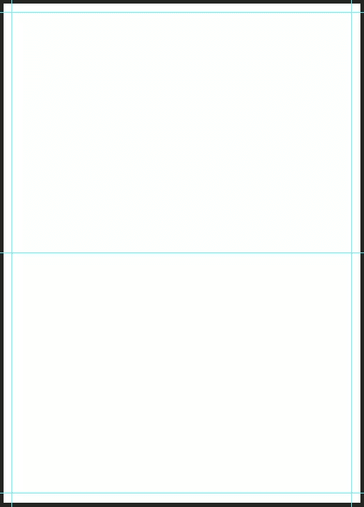](https://www.sitepoint.com/wp-content/uploads/2012/12/Screen-shot-2012-12-14-at-1.20.01-PM.png)

看上面的例子，下半部分是卡片的正面，上半部分是背面。现在，我们可以开始引入我们的图像，并建立我们的圣诞卡设计。对于图片，你可以自己拍一张全家福，或者从网上找一张好看的库存照片。我找到了下面的图片，你可以从[这里](http://www.sxc.hu/browse.phtml?f=download&id=1408534)下载。将此图像放入您的圣诞卡工作文件中。

将图像放入文件时，可以放大或缩小图像。使其紧密贴合卡片的边缘。如果它重叠或者不完美，那也没关系，因为我们要给图像添加一个图层蒙版。

[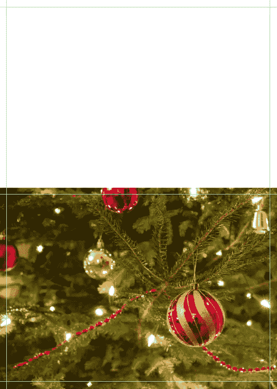](https://www.sitepoint.com/wp-content/uploads/2012/12/Screen-shot-2012-12-14-at-2.10.40-PM.png)

单击图层面板中的图层蒙版图标，通过图层蒙版在图像周围添加一个边框。这比直边照片好看多了。在蒙版上，选择笔刷工具，在默认笔刷设置下，选择大小设置为 100 像素的圆钝中等硬度笔刷。将光标放在图像的左上角，按住 shift 键，单击右上角、右下角、左下角和左上角，在图像周围创建一个条纹遮罩边框。由于丝带与圣诞节的主题相配，这种效果会很好。

[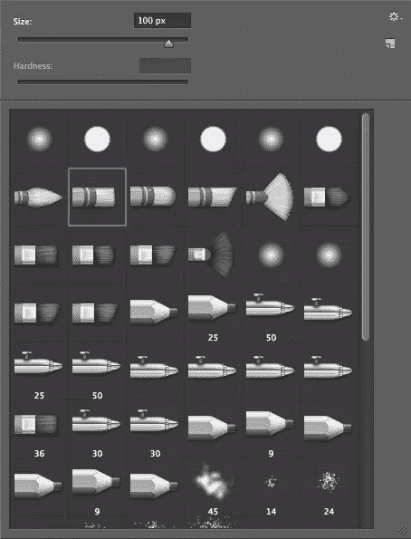](https://www.sitepoint.com/wp-content/uploads/2012/12/Screen-Shot-2012-12-19-at-8.51.47-PM.png)

[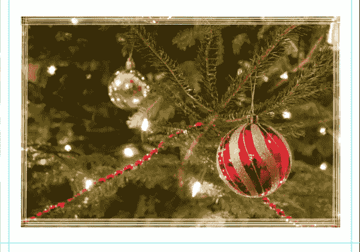](https://www.sitepoint.com/wp-content/uploads/2012/12/Screen-Shot-2012-12-19-at-8.54.49-PM.png)

接下来，我们将创建一个背景背后的卡。选择一种浓郁的红色，你可以从装饰物中取样。我选择的红色是 20000 号。选择背景层，点击 Alt/Option + Delete，用我们选择的深红色填充。接下来，我们将为我们的背景创建一个图案。创建一个大约 300 像素宽和高的新文档。选择自定义形状工具，并选择“花卉装饰 2”形状。按住 shift 键，这样当您拖动它时，它会保持其比例。确保填满整个画布。

[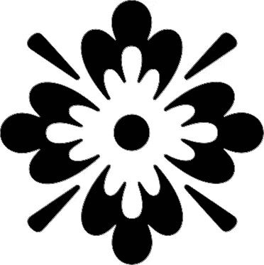](https://www.sitepoint.com/wp-content/uploads/2012/12/Screen-Shot-2012-12-19-at-9.19.11-PM.png)

右击形状层，选择“栅格化层”然后，转到“编辑”>“定义模式”给这个模式起一个你能识别的名字。关闭此文档并返回到您的卡片文档。在红色背景层上新建一层，按住 Shift + Delete，选择“图案”作为填充选项。选择您刚刚创建的装饰图案。图案将填充整个图层。将不透明度设置为 30%。

[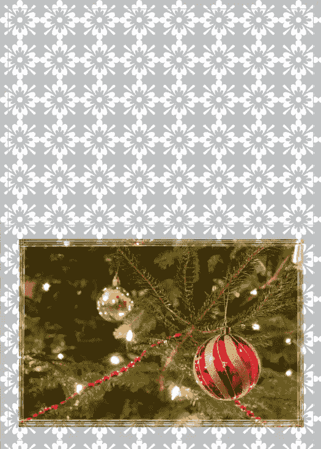](https://www.sitepoint.com/wp-content/uploads/2012/12/Screen-Shot-2012-12-19-at-9.46.01-PM.png)

恢复下面的红色层，改变图案层的混合模式为“减”接下来，我们将在卡片的正面输入我们的信息。一个漂亮的字体是你卡片的好选择。我选择了 Scriptina Pro，设置为 104pt。将颜色设置为白色，然后双击文字图层以显示图层样式。选取“投影”，并将距离设置为 0px，扩散设置为 36px，大小设置为 50px。这将在文字后面创建一个微妙的阴影区域，使背景与文字形成额外的对比，从而更容易阅读。

[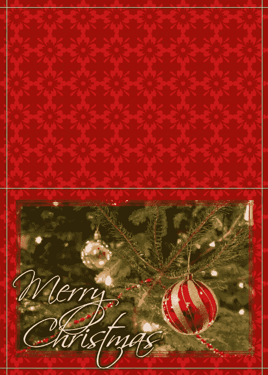](https://www.sitepoint.com/wp-content/uploads/2012/12/Screen-Shot-2012-12-19-at-9.53.55-PM.png)

接下来，我们将创建卡的内部。保持相同的方向，创建一个相同大小的新文档，10 英寸乘 14 英寸，300ppi。像以前一样布置参考线，这样你就知道页边距和折叠区域的位置了。卡片的内部相当简单。我们将使用一个简单的形状，一个简短的信息，和大量的空间来写你自己的个人信息给你的卡片接收者。

选择自定义形状工具，并选择冬青形状。将冬青形状拖到卡片的上半部分。用像封面上那样的红色填充形状。将形状水平居中。

[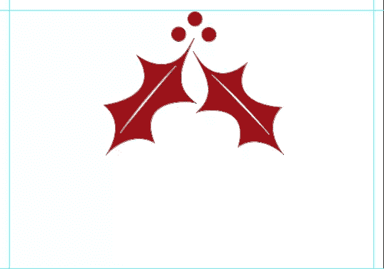](https://www.sitepoint.com/wp-content/uploads/2012/12/Screen-Shot-2012-12-19-at-10.41.23-PM.png)

接下来，我们将键入一条短消息，如“节日快乐”我仍然使用 Scriptina Pro 字体。把它放在冬青树的中间，做成深绿色(#032e00)。确保它停留在卡片的上半部分。

[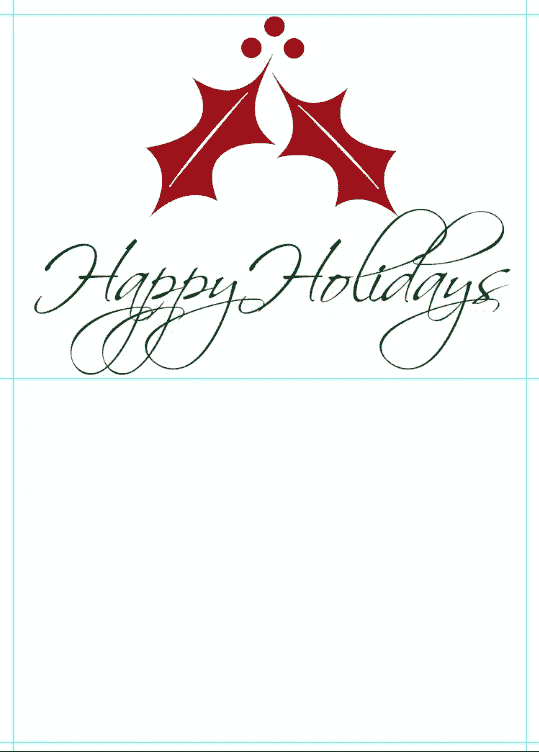](https://www.sitepoint.com/wp-content/uploads/2012/12/Screen-Shot-2012-12-19-at-10.46.39-PM.png)

接下来，我们将在卡片的下半部分添加一个元素。我们会让它变得微妙，这样就有足够的空间来手写个人信息。选择自定义形状工具，并选择“雪花 1。”将颜色设置为与冬青相同的红色。拖出一个略小于两英寸的雪花形状。然后点击 Command/Ctrl + "J "复制层。按 Command/Ctrl + "T "来变换雪花，按住 shift，将雪花缩小到大雪花的大约 1/3。选择原始雪花层，设置不透明度为 30%。

[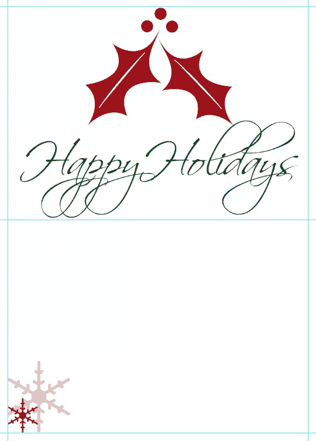](https://www.sitepoint.com/wp-content/uploads/2012/12/Screen-Shot-2012-12-19-at-10.54.17-PM.png)

### 结论

使用您自己的照片(或库存图片)和一些自定义形状，您可以在节日期间制作一张精美的圣诞卡。制作你自己的圣诞卡会给节日庆典增添个人色彩。您可以为一大群人创建一套卡片，也可以为每个朋友和家庭成员创建个性化的卡片。节日快乐！

## 分享这篇文章