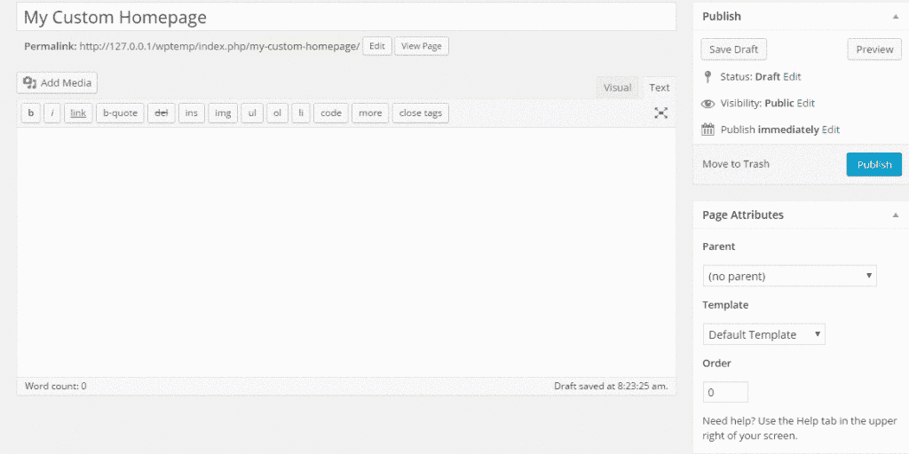
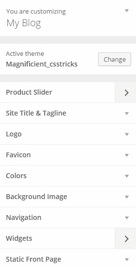
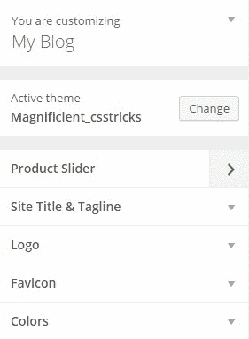
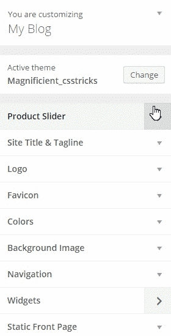
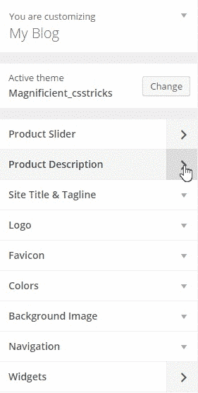
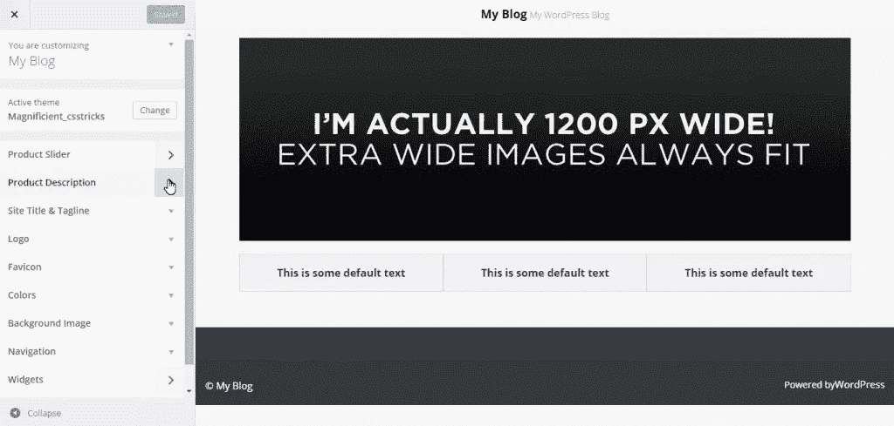
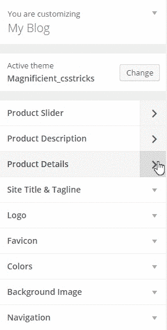
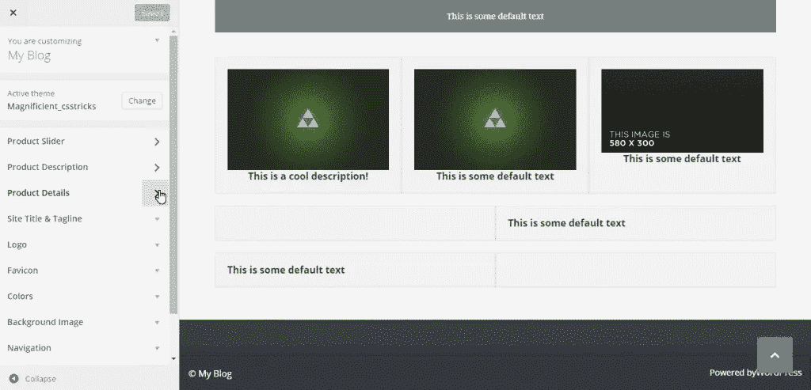
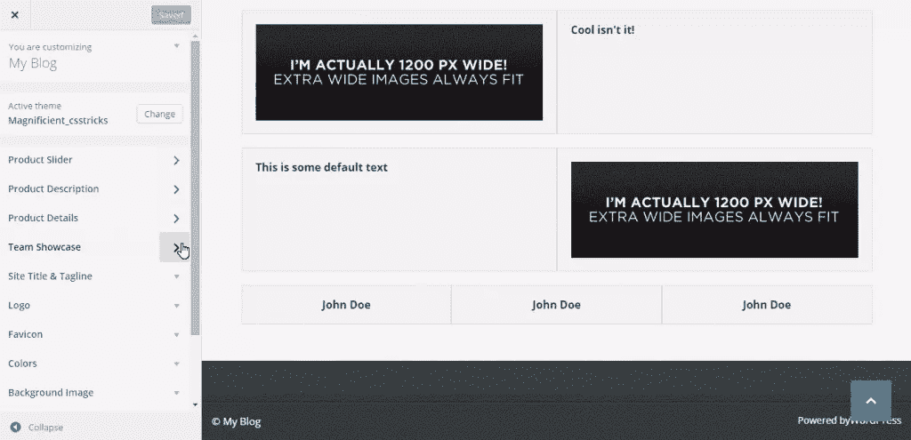
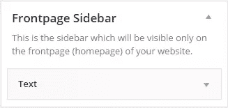

# 为你的 WordPress 网站设计自定义主页

> 原文：<https://www.sitepoint.com/designing-a-custom-home-page-for-your-wordpress-website/>

WordPress 被用于网络上的大部分网站。它允许我们创建各种不同类型的网站，但任何网站最重要的组成部分之一总是主页。完美的登陆页面将帮助你降低跳出率，增加流量和客户。在这篇文章中，我们将介绍如何创建一个 WordPress 网站的自定义主页(或登陆页)。

有很多方法可以达到这个目的，这只是*的一种方法*。

### 概述我们将在本文中涵盖的内容

首先，我们将完成这些基本步骤:

1.  在 WordPress 的索引页面上显示滑块。
2.  显示三个面板，用于显示产品说明。
3.  并排显示两行包含产品详细信息的图片和文字。
4.  面板，显示您的团队成员。

然后，我们将了解以下高级主题:

1.  从另一个页面获取内容(例如，从**关于我们的**页面)。
2.  只为首页创建侧边栏。
3.  最重要的方面将是我们可以从“WordPress Customizer”选项改变滑块的图像。我们不需要任何插件来添加滑块或创建图像幻灯片。

### 我们需要的东西

1.  用于为主题提供选项的工具包。
2.  [Flexslider](http://flexslider.woothemes.com/) 用于提供滑块选项。

Maria Antonietta Perna 在之前的文章中介绍了 [Kirki，如果你正在寻找关于这个主题的好的介绍。](https://www.sitepoint.com/fast-wordpress-customizer-options-development-with-kirki/)

##### 注意

为了模块化，我创建了一个名为**库**的文件夹，并将所有的**函数**文件放在里面，这样就可以很容易地只编辑必要的组件。在 GitHub 随意叉我的主题。在这个主题中，我从**functions.php**文件中调用了**库**文件夹中的所有文件。我已经为这个主题使用了[基础 CSS 框架](http://foundation.zurb.com/)。

你会在**库**文件夹中找到一个名为**theme-options.php**的文件，我们将在本教程中对其进行最多的编辑。在您最喜欢的文本编辑器中打开该文件，准备好动手吧！

### Kirki

Kirki 不是一个框架。这是一个工具包，允许 WordPress 开发者使用定制器，并通过抽象代码来利用其高级功能和灵活性，使每个人都更容易创建一个美丽而有意义的用户体验。

我们可以使用 Kirki 向定制器添加配置、字段、部分和面板。这并不能取代 WordPress 定制器 API。Kirki 的 API 只是默认 WordPress 方法的一个包装器，简化了语法，允许你用更少的代码写更多的东西，并利用了它的一些最先进的特性。

从 [GitHub](https://github.com/aristath/kirki) 下载 kirki 文件，并把它放在你的主题文件夹中名为“Kirki”的文件夹中。

首先，您必须创建一个新的配置。配置具有唯一的 ID，所有使用相同`config_id`的字段将继承该配置的属性。

添加配置后，您可以添加面板、部分和字段。请注意，为了能够添加字段，您的定制器中至少应该有一个部分。字段不能是“孤立的”，它们必须被分组到一个部分中。

#### 配置

Kirki 允许你为你的插件或主题创建配置，并按 ID 分组。然后链接到该 ID 的所有字段都将继承配置属性。

```
Kirki::add_config( 'my_theme', array(
    'capability'    => 'edit_theme_options',
    'option_type'   => 'option',
    'option_name'   => 'my_theme',
) );
```

*   任何有效的 WordPress 功能。详见 [WordPress Codex](https://codex.wordpress.org/Roles_and_Capabilities) 。
*   `option_type`:可以是 option，也可以是 theme_mod。
*   如果你使用选项而不是主题模式，那么你可以用它来指定一个选项名。你所有的字段将会被保存为 WordPress 数据库中那个选项下的一个数组。

#### 嵌板

面板是部分的包装器，是将多个部分组合在一起的一种方式。

```
Kirki::add_panel( 'panel_id', array(
    'priority'    => 10,
    'title'       => __( 'My Title', 'textdomain' ),
    'description' => __( 'My Description', 'textdomain' ),
) );
```

#### 部分

节是字段的包装器，是将多个字段组合在一起的一种方式。所有字段都必须属于一个节，任何字段都不能是孤立的。

```
Kirki::add_section( 'section_id', array(
    'title'          => __( 'My Title', 'textdomain' ),
    'description'    => __( 'My Description', 'textdomain' ),
    'panel'          => '', // Not typically needed.
    'priority'       => 160,
    'capability'     => 'edit_theme_options',
    'theme_supports' => '', // Rarely needed.
) );
```

#### 菲尔茨

字段是提供的选项，如文本框和复选框，以便用户可以在其中输入自定义文本。每个字段只能与特定的部分相关联。

```
function my_custom_text_settings( $fields ) {

    // Add the controls
    $fields[] = array(
        'label'       => __( 'My custom control', 'translation_domain' ),
        'section'     => 'my_section',
        'settings'    => 'my_setting',
        'type'        => 'text',
        'priority'    => 10,
        'option_type' => 'theme_mod',
        'capability'  => 'edit_theme_options',
    );

    $fields[] = array(
        'label'       => __( 'My custom control 2', 'translation_domain' ),
        'section'     => 'my_section',
        'settings'    => 'my_setting_2',
        'type'        => 'text',
        'priority'    => 20,
        'option_type' => 'theme_mod',
        'capability'  => 'edit_theme_options',
    );

    return $fields;

}
add_filter( 'kirki/fields', 'my_custom_text_settings' );
```

介绍够了。现在让我们自定义我们的主题！

### 将 Kirki 与我们的主题相结合

我们需要做的第一件事是将 Kirki 与我们的主题相结合。为此，打开您的**theme-options.php**文件，您将在**库**文件夹中找到该文件，并向其中添加以下代码:

```
// Integrating Kirki with our theme
include_once( get_template_directory() . '/kirki/kirki.php' );
```

上面的代码将 Kirki 文件与我们的主题链接起来。**请注意，如前所述，我们从 GitHub 源下载的文件应该放在主题文件夹**内名为‘kirki’的文件夹中。

### 创建配置

如前所述，我们需要创建一个可以与我们的选项一起使用的**配置**。将以下代码添加到您的 theme-options.php 文件**中。**

```
// Adding the configuration
Kirki::add_config( 'mc', array(
    'capability'    => 'edit_theme_options',
    'option_type'   => 'option',
    'option_name'   => 'mc',
) );
```

我们已经成功地为我们的主题创建了一个配置。现在，我们将在选项中使用 **mc** 作为我们的**选项名称**。

### 设计

现在让我们来看看我们的登录页面的设计。我们的主页将包括以下内容:

1.  **产品滑块**(用于展示产品页面的幻灯片)。
2.  **描述框**(用于显示贵公司的一些信息)。
3.  **产品详情**(展示您产品的一些细节)。
4.  **团队展示**(用于展示您团队成员的详细信息)。

我们将在主页上逐一介绍如何做到这些。

##### 注意

所有选项都可以通过 **WordPress 定制器**选项定制。你需要访问你的 WordPress 管理面板中的**外观>定制**选项来定制这些选项。

### 为首页创建自定义模板

我们不想改变我们的**index.php**文件，因为我们可以为我们的首页创建一个**定制模板**。在这个自定义模板中，我们将添加我们的代码，以便它显示我们定制的首页。因此，我们将创建一个自定义模板，该模板将在首页显示内容。

在你的主题文件夹中创建一个名为**homepage.php**的新文件，并添加如下内容:

```
/**
Template Name: Custom Homepage
**/
```

在这个文件中，我们添加了显示滑块的代码。

我们必须将它设置为我们的静态首页。但是，最初没有一个页面会使用这个模板。我们将不得不创建一个新的页面，将使用这个模板。请遵循以下步骤:

1.  创建新页面(**页面>添加新页面* *)。
2.  为页面添加标题(如**我的自定义主页* *)。
3.  从**页面属性**下的**模板* *下拉列表中选择* *自定义主页* *。
4.  点击**发布* *按钮。



现在，将 WordPress Customizer 中的**静态首页**选项设置为**静态页面**，并从其下方的下拉菜单中选择**我的自定义主页**(或者如果你已经为该页面使用了任何其他名称，请选择该名称)。



不要忘记点击定制器的**保存&发布**按钮。

您不会注意到定制器内部有任何可见的变化，因为我们没有向我们的**homepage.php**文件添加任何代码。打开 homepage.php 的**，让我们开始添加代码吧！**

 **让我们添加以下代码:

```
// Add the header
get_header();

// Add the footer
get_footer();
```

上面的代码包括我们当前主题目录中的**header.php**和**footer.php**文件。如果您现在刷新定制器，您可能只会看到导航和页脚菜单。

### 产品滑块

一个**产品滑块**显示你最有创意或最畅销的产品。这些是访问者在你的网站上首先看到的产品。创建**产品滑块**包括以下步骤:

1.  创建一组滑块(通常为 5 个)。
2.  向滑块添加背景图像。
3.  向滑块添加标题。

#### 创建一组滑块

如前所述，我们使用 [FlexSlider](http://flexslider.woothemes.com/) 在我们的主题中显示滑块。所以，首先，我们需要从 [GitHub](https://github.com/woothemes/FlexSlider) 下载 Flexslider。我们将只需要使用 [jquery.flexslider.js](https://github.com/woothemes/FlexSlider/blob/master/jquery.flexslider.js) 、 [flexslider.css](https://github.com/woothemes/FlexSlider/blob/master/flexslider.css) 、 [bg_play_pause.png](https://github.com/woothemes/FlexSlider/blob/mastimg/bg_play_pause.png) 和 [fonts](https://github.com/woothemes/FlexSlider/tree/master/fonts) 文件夹。将这些资源复制到你的主题文件夹中。

##### 注意

如果您正在使用我提供的主题，您可以复制**供应商**文件夹中的 **jquery.flexslider.js** ，呈现在 **js** 文件夹中， **css** 文件夹中的 **flexslider.css** 文件，**图像**文件夹中的 **bg_play_pause.png** 文件以及**字体**文件夹中的内容

现在，我们需要用我们的主题将这些文件排队。我们将向位于**库**文件夹中的**enqueue-scripts.php**文件添加以下入队代码:

```
// adding flexslider scripts file in the footer
wp_register_script( 'flexslider-js', get_template_directory_uri() . '/js/vendor/jquery.flexslider.js', array( 'jquery' ), '', true );

wp_enqueue_script( 'flexslider-js' );
```

接下来，我们使用下面的代码将 CSS 文件放入我们的**enqueue-style.php**中，在**库**文件夹中:

```
// flexslider stylesheet
wp_register_style( 'magnificient-flexslider-stylesheet', get_stylesheet_directory_uri() . '/css/flexslider.css', array(), '' );

wp_enqueue_style( 'magnificient-flexslider-stylesheet' );
```

恭喜你！您已经成功地将 Flexslider 文件与您的主题一起加入队列。您可以通过检查页面的源来检查入队是否成功。你可以通过**右键点击你页面上的**并点击**查看页面源代码**来检查你页面的源代码。搜索 **flexslider** 会发现 JS 和 CSS 文件已经成功入队。

##### 注意

如果您没有使用我提供的主题，您可能需要编辑以下部分:`/js/vendor/jquery.flexslider.js`和`/css/flexslider.css`，并用您的 JS 和 CSS 文件的路径替换它。

首先，让我们在我们的 **WordPress 定制器**中创建一个**面板**，它将为我们的滑块显示图像、链接和标题。

再次打开**theme-options.php**，并添加以下代码:

```
// Adding the Product Slider panel
Kirki::add_panel( 'product_slider', array(
    'priority'    => 10,
    'title'       => __( 'Product Slider', 'magnificient' ),
    'description' => __( 'A slider to show the products', 'magnificient' ),
) );
```

上面的代码向我们的**定制器**添加了一个**产品滑块**面板，但是它是不可见的，因为没有任何部分有这个面板，也没有任何字段包含任何与这个面板相关的部分。迷惑？让我们继续，它会变得更加清晰。

接下来，我们需要为主页添加一个名为**产品滑块的部分。这可以通过将以下代码添加到 theme-options.php 的**文件中来实现:****

```
// Adding the Product Slider for Homepage section
Kirki::add_section( 'product_slider_for_homepage', array(
    'title'          => __( 'Product Slider for Homepage', 'magnificient' ),
    'description'    => __( 'This slider will be shown on the front page of your website', 'magnificient' ),
    'panel'          => 'product_slider', // Not typically needed.
    'priority'       => 160,
    'capability'     => 'edit_theme_options',
    'theme_supports' => '', // Rarely needed.
) );
```

上面的代码在**产品滑块**面板内添加了主页部分的**产品滑块。**

接下来，我们添加一个显示图像的字段。我们可以使用以下代码创建一个**图像字段**:

```
// Adding the Product Slider image 1 field
Kirki::add_field( 'mc', array(
    'type'        => 'image',
    'settings'     => 'product_slider_image_1',
    'label'       => __( 'Product Slider image 1', 'magnificient' ),
    'description' => __( 'This image will be the first image for the Product Slider.', 'magnificient' ),
    'section'     => 'product_slider_for_homepage',
    'default'     => '',
    'priority'    => 10,
) );
```

现在，如果我们刷新我们的**定制器**，我们会看到**产品滑块**面板已经出现。



通过图像字段，我们可以添加将在滑块中显示的图像。我们将再创建四个类似的字段，这样我们至少可以为滑块创建五个图像。以下代码将再添加四个图像字段:

```
// Adding the Product Slider image 2 field
Kirki::add_field( 'mc', array(
    'type'        => 'image',
    'settings'     => 'product_slider_image_2',
    'label'       => __( 'Product Slider image 2', 'magnificient' ),
    'description' => __( 'This image will be the second image for the Product Slider.', 'magnificient' ),
    'section'     => 'product_slider_for_homepage',
    'default'     => '',
    'priority'    => 10,
) );

// Adding the Product Slider image 3 field
Kirki::add_field( 'mc', array(
    'type'        => 'image',
    'settings'     => 'product_slider_image_3',
    'label'       => __( 'Product Slider image 3', 'magnificient' ),
    'description' => __( 'This image will be the third image for the Product Slider.', 'magnificient' ),
    'section'     => 'product_slider_for_homepage',
    'default'     => '',
    'priority'    => 10,
) );

// Adding the Product Slider image 4 field
Kirki::add_field( 'mc', array(
    'type'        => 'image',
    'settings'     => 'product_slider_image_4',
    'label'       => __( 'Product Slider image 4', 'magnificient' ),
    'description' => __( 'This image will be the fourth image for the Product Slider.', 'magnificient' ),
    'section'     => 'product_slider_for_homepage',
    'default'     => '',
    'priority'    => 10,
) );

// Adding the Product Slider image 5 field
Kirki::add_field( 'mc', array(
    'type'        => 'image',
    'settings'     => 'product_slider_image_5',
    'label'       => __( 'Product Slider image 5', 'magnificient' ),
    'description' => __( 'This image will be the fifth image for the Product Slider.', 'magnificient' ),
    'section'     => 'product_slider_for_homepage',
    'default'     => '',
    'priority'    => 10,
) );
```



我们可以通过这些字段上传图像，然后在登录页面上显示。

#### 向滑块添加背景图像

现在，我们将为**产品滑块**添加代码。在`<?php`标签内的`<?php get_header(); ?>`旁边添加以下代码:

```
// Getting  the images
$product_slider_image_1 = Kirki::get_option( mc, product_slider_image_1 );
$product_slider_image_2 = Kirki::get_option( mc, product_slider_image_2 );
$product_slider_image_3 = Kirki::get_option( mc, product_slider_image_3 );
$product_slider_image_4 = Kirki::get_option( mc, product_slider_image_4 );
$product_slider_image_5 = Kirki::get_option( mc, product_slider_image_5 );
```

这些行获取我们保存在定制器中的每张幻灯片的图像。在下一步中，我们将检查这些图像是否存在。如果它们中的任何一个存在，我们将调用我们的滑块。

```
// Check if any image exists
if ( $product_slider_image_1 || $product_slider_image_2 || $product_slider_image_3 || $product_slider_image_4 || $product_slider_image_5 ) {
```

这一行检查任何幻灯片中的任何图像是否存在。如果图像存在，则调用 **flexslider** 。现在，我们将使用下面的代码回显每张幻灯片的图像:

```
<div class="product-slider">
    <ul class="slides">
        <?php if ( $product_slider_image_1 ) { echo '&lt;li>&lt;img src="'. $product_slider_image_1 .'" class="product-slider-image-1"></li>'; } ?>
        <?php if ( $product_slider_image_2 ) { echo '&lt;li>&lt;img src="'. $product_slider_image_2 .'" class="product-slider-image-2"></li>'; } ?>
        <?php if ( $product_slider_image_3 ) { echo '&lt;li>&lt;img src="'. $product_slider_image_3 .'" class="product-slider-image-3"></li>'; } ?>
        <?php if ( $product_slider_image_4 ) { echo '&lt;li>&lt;img src="'. $product_slider_image_4 .'" class="product-slider-image-4"></li>'; } ?>
        <?php if ( $product_slider_image_5 ) { echo '&lt;li>&lt;img src="'. $product_slider_image_5 .'" class="product-slider-image-5"></li>'; } ?>
    </ul>
</div>
```

接下来，我们只需为 Flexslider 添加 JavaScript 即可。

```
<script type="text/javascript">
    (function($) {
        $(window).load(function() {
            $('.product-slider').flexslider({
                animation: "slide",
                controlNav: false,
                directionNav: false,
                slideshowSpeed: 3000, 
            });
        });
    })(jQuery);
</script>
```

#### 向滑块添加标题

我们还可以给幻灯片添加标题。我们只需在定制器中添加一个新字段，该字段将接受每张幻灯片的标题(文本)并显示出来。

让我们先添加字段。

```
// Adding the Product Slider caption 1 field
Kirki::add_field( 'mc', array(
    'type'        => 'text',
    'settings'     => 'product_slider_caption_1',
    'label'       => __( 'Product Slider caption 1', 'magnificient' ),
    'description' => __( 'This caption will be the description for the first slide.', 'magnificient' ),
    'section'     => 'product_slider_for_homepage',
    'default'     => __( 'This is some default text', 'magnificient' ),
    'priority'    => 10,
) );
```

我们可以对其他四张幻灯片做类似的事情。

现在，在前端，在我们的**自定义主页**模板中，我们需要编辑一些代码来显示这些标题。

首先，我们需要将标题存储在变量中:

```
//Getting the captions
$product_slider_caption_1 = Kirki::get_option( mc, product_slider_caption_1 );
$product_slider_caption_2 = Kirki::get_option( mc, product_slider_caption_2 );
$product_slider_caption_3 = Kirki::get_option( mc, product_slider_caption_3 );
$product_slider_caption_4 = Kirki::get_option( mc, product_slider_caption_4 );
$product_slider_caption_5 = Kirki::get_option( mc, product_slider_caption_5 );
```

然后，替换以下代码:

```
<div class="product-slider">
    <ul class="slides">
        <?php if ( $product_slider_image_1 ) { echo '&lt;li>&lt;img src="'. $product_slider_image_1 .'" class="product-slider-image-1"></li>'; } ?>
        <?php if ( $product_slider_image_2 ) { echo '&lt;li>&lt;img src="'. $product_slider_image_2 .'" class="product-slider-image-2"></li>'; } ?>
        <?php if ( $product_slider_image_3 ) { echo '&lt;li>&lt;img src="'. $product_slider_image_3 .'" class="product-slider-image-3"></li>'; } ?>
        <?php if ( $product_slider_image_4 ) { echo '&lt;li>&lt;img src="'. $product_slider_image_4 .'" class="product-slider-image-4"></li>'; } ?>
        <?php if ( $product_slider_image_5 ) { echo '&lt;li>&lt;img src="'. $product_slider_image_5 .'" class="product-slider-image-5"></li>'; } ?>
    </ul>
</div>
```

使用以下代码:

```
<div class="product-slider">
    <ul class="slides">
        <?php if ( $product_slider_image_1 )
            {
        ?>
            <li>
                " class="product-slider-image-1" />
        <?php if ( $product_slider_caption_1 ) { echo '&lt;p class="flex-caption">'. $product_slider_caption_1 .'</p>'; } ?>
            </li>
        <?php
            }
        ?>
        <?php if ( $product_slider_image_2 )
            {
        ?>
            <li>
                " class="product-slider-image-2" />
        <?php if ( $product_slider_caption_2 ) { echo '&lt;p class="flex-caption">'. $product_slider_caption_2 .'</p>'; } ?>
            </li>
        <?php
            }
        ?>
        <?php if ( $product_slider_image_3 )
            {
        ?>
            <li>
                " class="product-slider-image-3" />
        <?php if ( $product_slider_caption_3 ) { echo '&lt;p class="flex-caption">'. $product_slider_caption_3 .'</p>'; } ?>
            </li>
        <?php
            }
        ?>
        <?php if ( $product_slider_image_4 )
            {
        ?>
            <li>
                " class="product-slider-image-4" />
        <?php if ( $product_slider_caption_4 ) { echo '&lt;p class="flex-caption">'. $product_slider_caption_4 .'</p>'; } ?>
            </li>
        <?php
            }
        ?>
        <?php if ( $product_slider_image_5 )
            {
        ?>
            <li>
                " class="product-slider-image-5" />
        <?php if ( $product_slider_caption_5 ) { echo '&lt;p class="flex-caption">'. $product_slider_caption_5 .'</p>'; } ?>
            </li>
        <?php
            }
        ?>
    </ul>
</div>
```

### 描述框

描述框可以提供关于我们产品的有用描述。这些盒子放在滑块的正下方，这样可以吸引游客的注意力。如果您想展示产品的详细信息，这些框会很有帮助。通常，可以有三到四个盒子(或面板)，但如果您愿意，可以有更多。

在本教程中，我们将创建三个盒子，并使用 Foundation CSS 框架的**数据均衡器**属性为每个面板提供统一的高度。

我们开始工作吧！

#### 创建面板

首先，我们将创建一个单独的面板来显示描述框。我们也可以在同一个面板下提供所有的选项(在我们创建的第一个面板中)，但是将东西分开以备后用是一个好习惯。

我们需要在我们的**theme-options.php**文件中添加以下代码:

```
// Adding the Product Description panel
Kirki::add_panel( 'product_description', array(
    'priority'    => 10,
    'title'       => __( 'Product Description', 'magnificient' ),
    'description' => __( 'Panels to show description of the products', 'magnificient' ),
) );
```

#### 创建截面

我们现在将为**产品描述**创建两个部分。我们将在一个部分上传图片，并在另一个部分添加描述。

首先，使用以下代码为**图像**创建一个部分:

```
// Adding the Product Images for Homepage section
Kirki::add_section( 'product_images_for_homepage', array(
    'title'          => __( 'Product Images for Homepage', 'magnificient' ),
    'description'    => __( 'These images will be shown on the product description panels on the  front page of your website', 'magnificient' ),
    'panel'          => 'product_images', // Not typically needed.
    'priority'       => 160,
    'capability'     => 'edit_theme_options',
    'theme_supports' => '', // Rarely needed.
) );
```

然后我们为**描述**创建一个部分:

```
// Adding the Product Description for Homepage section
Kirki::add_section( 'product_description_for_homepage', array(
    'title'          => __( 'Product Description for Homepage', 'magnificient' ),
    'description'    => __( 'These panels will be shown on the front page of your website', 'magnificient' ),
    'panel'          => 'product_description', // Not typically needed.
    'priority'       => 160,
    'capability'     => 'edit_theme_options',
    'theme_supports' => '', // Rarely needed.
) );
```

#### 创建字段

接下来，我们需要为图像输入创建三个字段(因为将有三个框，因此有三个图像),然后我们将为产品描述创建三个字段。代码如下所示:

```
// Adding the Product Description Image 1 field
Kirki::add_field( 'mc', array(
    'type'        => 'image',
    'settings'     => 'product_description_image_1',
    'label'       => __( 'Product Description image 1', 'magnificient' ),
    'description' => __( 'This image will be the first image for the Product Description.', 'magnificient' ),
    'section'     => 'product_images_for_homepage',
    'default'     => '',
    'priority'    => 10,
) );

// Adding the Product Description Image 2 field
Kirki::add_field( 'mc', array(
    'type'        => 'image',
    'settings'     => 'product_description_image_2',
    'label'       => __( 'Product Description image 2', 'magnificient' ),
    'description' => __( 'This image will be the second image for the Product Description.', 'magnificient' ),
    'section'     => 'product_images_for_homepage',
    'default'     => '',
    'priority'    => 10,
) );

// Adding the Product Description Image 3 field
Kirki::add_field( 'mc', array(
    'type'        => 'image',
    'settings'     => 'product_description_image_3',
    'label'       => __( 'Product Description image 3', 'magnificient' ),
    'description' => __( 'This image will be the third image for the Product Description.', 'magnificient' ),
    'section'     => 'product_images_for_homepage',
    'default'     => '',
    'priority'    => 10,
) );

// Adding the Product Description Textarea 1 field
Kirki::add_field( 'mc', array(
    'type'        => 'textarea',
    'settings'     => 'product_description_textarea_1',
    'label'       => __( 'Product Description textarea 1', 'magnificient' ),
    'description' => __( 'This description will be the description for the first product.', 'magnificient' ),
    'section'     => 'product_description_for_homepage',
    'default'     => __( 'This is some default text', 'magnificient' ),
    'priority'    => 10,
) );

// Adding the Product Description Textarea 2 field
Kirki::add_field( 'mc', array(
    'type'        => 'textarea',
    'settings'     => 'product_description_textarea_2',
    'label'       => __( 'Product Description textarea 2', 'magnificient' ),
    'description' => __( 'This description will be the description for the second product.', 'magnificient' ),
    'section'     => 'product_description_for_homepage',
    'default'     => __( 'This is some default text', 'magnificient' ),
    'priority'    => 10,
) );

// Adding the Product Description Textarea 3 field
Kirki::add_field( 'mc', array(
    'type'        => 'textarea',
    'settings'     => 'product_description_textarea_3',
    'label'       => __( 'Product Description textarea 3', 'magnificient' ),
    'description' => __( 'This description will be the description for the third product.', 'magnificient' ),
    'section'     => 'product_description_for_homepage',
    'default'     => __( 'This is some default text', 'magnificient' ),
    'priority'    => 10,
) );
```



#### 显示输出

现在，我们需要使用下面的代码在自定义模板上显示输出。

```
$product_description_image_1 = Kirki::get_option( mc, product_description_image_1 );
$product_description_textarea_1 = Kirki::get_option( mc, product_description_textarea_1 );
if ( $product_description_image_1 ) {
    echo '';
}
if ( $product_description_textarea_1 ) {
    echo '<h6 class="product-description-textarea text-center">'. product_description_textarea_1 .'</h6>';
}
```

这将显示第一个框的输出。同样，我们将对另外两个盒子做同样的事情。

```
$product_description_image_2 = Kirki::get_option( mc, product_description_image_2 );
$product_description_textarea_2 = Kirki::get_option( mc, product_description_textarea_2 );
if ( $product_description_image_2 ) {
    echo '';
}
if ( $product_description_textarea_2 ) {
    echo '<h6 class="product-description-textarea text-center">'. $product_description_textarea_2 .'</h6>';
}

$product_description_image_3 = Kirki::get_option( mc, product_description_image_3 );
$product_description_textarea_3 = Kirki::get_option( mc, product_description_textarea_3 );
if ( $product_description_image_3 ) {
    echo '';
}
if ( $product_description_textarea_3 ) {
    echo '<h6 class="product-description-textarea text-center">'. $product_description_textarea_3 .'</h6>';
}
```

现在转到您的定制器，添加图像和描述，您将看到显示您的输入的页面！



### 产品详情

这部分包含两行，一行是图片，另一行是描述。这一页的这一部分或这一节可以作为产品最重要方面的视觉展示给参观者。

#### 创建面板

让我们先创建一个面板。我们就称之为**产品详情**。

```
// Adding the Product Details panel
Kirki::add_panel( 'product_details', array(
    'priority'    => 10,
    'title'       => __( 'Product Details', 'magnificient' ),
    'description' => __( 'Panels to show details of the products', 'magnificient' ),
) );
```

#### 创建截面

我们将使用下面的代码为字段创建一个部分:

```
// Adding the Product Details for Homepage section
Kirki::add_section( 'product_details_for_homepage', array(
    'title'          => __( 'Product Details for Homepage', 'magnificient' ),
    'description'    => __( 'This will show the details on the front page of your website', 'magnificient' ),
    'panel'          => 'product_details', // Not typically needed.
    'priority'       => 160,
    'capability'     => 'edit_theme_options',
    'theme_supports' => '', // Rarely needed.
) );
```

#### 创建字段

与前面介绍的概念类似，我们将使用下面的代码创建两个图像字段和两个文本区域字段。

```
// Adding the Product Details image 1 field
Kirki::add_field( 'mc', array(
    'type'        => 'image',
    'settings'     => 'product_details_image_1',
    'label'       => __( 'Product Details image 1', 'magnificient' ),
    'description' => __( 'This image will be the first image for the Product Details.', 'magnificient' ),
    'section'     => 'product_details_for_homepage',
    'default'     => '',
    'priority'    => 10,
) );

// Adding the Product Details image 2 field
Kirki::add_field( 'mc', array(
    'type'        => 'image',
    'settings'     => 'product_details_image_2',
    'label'       => __( 'Product Details image 2', 'magnificient' ),
    'description' => __( 'This image will be the second image for the Product Details.', 'magnificient' ),
    'section'     => 'product_details_for_homepage',
    'default'     => '',
    'priority'    => 10,
) );

// Adding the Product Details textarea 1 field
Kirki::add_field( 'mc', array(
    'type'        => 'textarea',
    'settings'     => 'product_details_textarea_1',
    'label'       => __( 'Product Details textarea 1', 'magnificient' ),
    'description' => __( 'This description will be the details for the first product.', 'magnificient' ),
    'section'     => 'product_details_for_homepage',
    'default'     => __( 'This is some default text', 'magnificient' ),
    'priority'    => 10,
) );

// Adding the Product Details textarea 2 field
Kirki::add_field( 'mc', array(
    'type'        => 'textarea',
    'settings'     => 'product_details_textarea_2',
    'label'       => __( 'Product Details textarea 2', 'magnificient' ),
    'description' => __( 'This description will be the details for the second product.', 'magnificient' ),
    'section'     => 'product_details_for_homepage',
    'default'     => __( 'This is some default text', 'magnificient' ),
    'priority'    => 10,
) );
```



#### 显示输出

我们需要在**自定义主页**模板上显示输出。打开 homepage.php 的**文件，添加以下代码:**

```
<?php
    $product_details_image_1 = Kirki::get_option( mc, product_details_image_1 );
    $product_details_textarea_1 = Kirki::get_option( mc, product_details_textarea_1 );
    if ( $product_details_image_1 || $product_details_textarea_1 ) {
?>
        <div class="row" data-equalizer id="product-details-one">
            <div class="large-6 columns panel" data-equalizer-watch id="product-image">
                <?php
                    if ( $product_details_image_1 ) {
                        echo '';
                    }
                ?>
            </div>
            <div class="large-6 columns panel" data-equalizer-watch id="product-description">
                <?php
                    if ( $product_details_textarea_1 ) {
                        echo '<h6>'. $product_details_textarea_1 .'</h6>';
                    }
                ?>
            </div>
        </div>
<?php
    }
?>
```

对另一排也这样做。然后，转到您的定制器并刷新它。



### 团队展示

页面的这一部分用于提供有关您的团队的一些信息。这一部分应该是有用的，因为它让我们的访问者了解他们将与谁一起工作。

通常，这个部分可能由许多团队成员组成。在这个例子中，我们将只为三个成员提供选项，但是您可以根据需要扩展它。

#### 创建面板

我们将创建一个新面板，并将其命名为 **Team Showcase** 。

```
// Adding the Team Showcase panel
Kirki::add_panel( 'team_showcase', array(
    'priority'    => 10,
    'title'       => __( 'Team Showcase', 'magnificient' ),
    'description' => __( 'A section to show your team', 'magnificient' ),
) );
```

#### 创建截面

接下来，我们将创建一个包含团队展示选项的部分。

```
// Adding the Team Showcase for Homepage section
Kirki::add_section( 'team_showcase_for_homepage', array(
    'title'          => __( 'Team Showcase for Homepage', 'magnificient' ),
    'description'    => __( 'This will show the team members on the front page of your website', 'magnificient' ),
    'panel'          => 'team_showcase', // Not typically needed.
    'priority'       => 160,
    'capability'     => 'edit_theme_options',
    'theme_supports' => '', // Rarely needed.
) );
```

#### 创建字段

总共有六个字段，包括三个头像的图像字段和三个成员姓名的文本字段。

```
// Adding the Team Showcase image 1 field
Kirki::add_field( 'mc', array(
    'type'        => 'image',
    'settings'     => 'team_showcase_image_1',
    'label'       => __( 'Team Showcase image 1', 'magnificient' ),
    'description' => __( 'This image will be the first image for the Team Showcase.', 'magnificient' ),
    'section'     => 'team_showcase_for_homepage',
    'default'     => '',
    'priority'    => 10,
) );

// Adding the Team Showcase image 2 field
Kirki::add_field( 'mc', array(
    'type'        => 'image',
    'settings'     => 'team_showcase_image_2',
    'label'       => __( 'Team Showcase image 2', 'magnificient' ),
    'description' => __( 'This image will be the second image for the Team Showcase.', 'magnificient' ),
    'section'     => 'team_showcase_for_homepage',
    'default'     => '',
    'priority'    => 10,
) );

// Adding the Team Showcase image 3 field
Kirki::add_field( 'mc', array(
    'type'        => 'image',
    'settings'     => 'team_showcase_image_3',
    'label'       => __( 'Team Showcase image 3', 'magnificient' ),
    'description' => __( 'This image will be the third image for the Team Showcase.', 'magnificient' ),
    'section'     => 'team_showcase_for_homepage',
    'default'     => '',
    'priority'    => 10,
) );

// Adding the Team Showcase text 1 field
Kirki::add_field( 'mc', array(
    'type'        => 'text',
    'settings'     => 'team_showcase_text_1',
    'label'       => __( 'Team Member 1', 'magnificient' ),
    'description' => __( 'Name of the first member.', 'magnificient' ),
    'section'     => 'team_showcase_for_homepage',
    'default'     => __( 'John Doe', 'magnificient' ),
    'priority'    => 10,
) );

// Adding the Team Showcase text 2 field
Kirki::add_field( 'mc', array(
    'type'        => 'text',
    'settings'     => 'team_showcase_text_2',
    'label'       => __( 'Team Member 2', 'magnificient' ),
    'description' => __( 'Name of the second member.', 'magnificient' ),
    'section'     => 'team_showcase_for_homepage',
    'default'     => __( 'John Doe', 'magnificient' ),
    'priority'    => 10,
) );

// Adding the Team Showcase text 3 field
Kirki::add_field( 'mc', array(
    'type'        => 'text',
    'settings'     => 'team_showcase_text_3',
    'label'       => __( 'Team Member 3', 'magnificient' ),
    'description' => __( 'Name of the third member.', 'magnificient' ),
    'section'     => 'team_showcase_for_homepage',
    'default'     => __( 'John Doe', 'magnificient' ),
    'priority'    => 10,
) );
```

#### 显示输出

我们现在将在我们的**自定义主页**模板上显示团队三名成员的图像和姓名。打开 homepage.php**并插入以下内容:**

让我们首先将图像和文本的值存储在变量中。

```
// For team member 1
$team_showcase_image_1 = Kirki::get_option( mc, team_showcase_image_1 );
$team_showcase_text_1 = Kirki::get_option( mc, team_showcase_text_1 );

// For team member 2
$team_showcase_image_2 = Kirki::get_option( mc, team_showcase_image_2 );
$team_showcase_text_2 = Kirki::get_option( mc, team_showcase_text_2 );

// For team member 3
$team_showcase_image_3 = Kirki::get_option( mc, team_showcase_image_3 );
$team_showcase_text_3 = Kirki::get_option( mc, team_showcase_text_3 );
```

然后，我们可以使用下面的代码显示每个成员:

```
//Team Member 1
if ( $team_showcase_image_1 ) { echo '&lt;img src="'. $team_showcase_image_1 .'" />'; }
if ( $team_showcase_text_1 ) { echo '&lt;h6 class="team-showcase-member text-center">'. $team_showcase_text_1 .'</h6>'; }

//Team Member 2
if ( $team_showcase_image_1 ) { echo '&lt;img src="'. $team_showcase_image_1 .'" />'; }
if ( $team_showcase_text_1 ) { echo '&lt;h6 class="team-showcase-member text-center">'. $team_showcase_text_1 .'</h6>'; }

//Team Member 3
if ( $team_showcase_image_1 ) { echo '&lt;img src="'. $team_showcase_image_1 .'" />'; }
if ( $team_showcase_text_1 ) { echo '&lt;h6 class="team-showcase-member text-center">'. $team_showcase_text_1 .'</h6>'; }
```



### 高级主题

#### 从另一个页面获取内容

我们还可以将另一个页面的内容提取到我们的主页中。如果你想展示一些关于你公司的信息，并且你已经有了一个关于我们的页面，这是非常有用的。你不需要重新写同样的内容。您可以使用 Kirki 获取这些内容。

我们可以创建一个单独的面板来提供此选项，让我们这样做吧！

以下是面板的代码:

```
// Adding the Frontpage Separate Page Content panel
Kirki::add_panel( 'front_page_separate_page_content', array(
    'priority'    => 10,
    'title'       => __( 'Frontpage Separate Page Content', 'magnificient' ),
    'description' => __( 'A section to fetch content from another page', 'magnificient' ),
) );
```

这是该部分的代码:

```
// Adding the Frontpage Separate Page Content for Homepage section
Kirki::add_section( 'front_page_separate_page_content_for_homepage', array(
    'title'          => __( 'Frontpage Separate Page Content for Homepage', 'magnificient' ),
    'description'    => __( 'This will show the separate page content on the front page of your website', 'magnificient' ),
    'panel'          => 'front_page_separate_page_content', // Not typically needed.
    'priority'       => 160,
    'capability'     => 'edit_theme_options',
    'theme_supports' => '', // Rarely needed.
) );
```

接下来，我们将显示一个下拉菜单，管理员可以从中选择要在首页显示的页面。我们可以使用 Kirki 的[下拉页面](https://github.com/aristath/kirki/wiki/dropdown-pages)选项。

我们可以使用以下代码添加该字段:

```
// Adding the Separate Page Content dropdown field
Kirki::add_field( 'mc', array(
    'type'        => 'dropdown-pages',
    'settings'     => 'front_page_separate_page_content_dropdown',
    'label'       => __( 'Frontpage Separate Page Content', 'kirki' ),
    'description' => __( 'Select the page whose content will be shown on the front page inside the frontpage separate page section', 'kirki' ),
    'section'     => 'front_page_separate_page_content_for_homepage',
    'default'     => '',
    'priority'    => 10,
) );
```

这启用了 WordPress 定制器中的选项。我们现在可以编辑我们的**homepage.php**文件来显示内容。打开该文件，并将以下代码复制到希望显示该内容的位置:

```
$front_page_separate_page_content_dropdown = Kirki::get_option( mc, front_page_separate_page_content_dropdown );
if ( $front_page_separate_page_content_dropdown ) {
    $front_page_separate_page_content_dropdown_content = get_post_field('post_content', $front_page_separate_page_content_dropdown);
    echo $front_page_separate_page_content_dropdown_content;
}
```

#### 仅为 Frontpage 创建边栏

如果你遵循 WordPress Codex，为你的主题创建一个侧边栏是很简单的。我不想在这里做太多的细节，我只想通过使用下面的代码在**库/widget-areas.php** 文件中给这个主题添加侧栏。

打开**widget-areas.php**并添加以下内容:

```
// Frontpage Sidebar
register_sidebar(array('name'=> 'Frontpage Sidebar',
    'id' => 'frontpage-sidebar',
    'description' => __(  'This is the sidebar which will be visible only on the frontpage (homepage) of your website.', 'magnificient' ),
    'before_widget' => '<article id="%1$s" class="panel widget %2$s">',
    'after_widget' => '</article>',
    'before_title' => '<h4>',
    'after_title' => '</h4>'
));
```

##### 注意

位于**库**文件夹中的**widget-areas.php**文件包含了这个主题的所有小部件区域，所以我在那里添加了侧边栏代码。

然后，我们只需编辑我们的**homepage.php**文件，在页面上显示这个小部件区域。打开 homepage.php 的**，添加以下代码:**

```
<?php dynamic_sidebar("frontpage-sidebar"); ?>
```



现在，当你在侧边栏中添加一个小部件时，它将只显示在 frontpage 上。


### 包装它

在本教程中，我解释了如何使用 Kirki 工具包为你的 WordPress 网站制作一个登陆页面。你可以用一些 CSS 来装饰它，并按照你喜欢的方式定制它。如果你对实现这个工具包有什么好的想法，请在下面的评论区告诉我。如果你遇到任何问题或有任何疑问，请告诉我，我很乐意帮忙。** 

## **分享这篇文章**