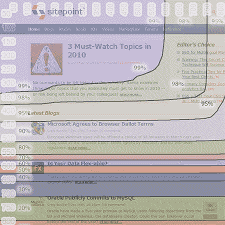

# 折叠上方设计和谷歌浏览器大小工具

> 原文：<https://www.sitepoint.com/designing-above-the-fold-and-the-google-browser-size-tool/>

 *【折上折】*是一个起源于印刷报业的概念。只有折叠报纸的上半部分是可见的，所以编辑将重要内容移到页面顶部，以吸引人们购买报纸。

这个术语已经被网页设计行业所采用，它指的是网页加载时的可见部分。许多“专家”仍然认为文件夹下的内容会被遗漏。我工作的一家大型国际 IT 公司雇佣了许多团队，他们竞相将自己的内容放在显著的位置。经理、设计师、程序员、文案作者和广告销售团队都会坚持认为他们的内容比其他人更重要。这通常会导致每页顶部一片混乱。

我从来没有被“高于折叠”的论点所说服。首先，没有明确的折叠线——显示器有不同的尺寸，浏览器可能不是全屏的，操作系统控件和工具栏会占用空间。其次，大多数用户理解滚动条，CX 合伙人最近的一份报告提供了令人信服的证据。他们的结论是:

1.  **少即是多**
    不要把所有的东西都塞到折叠处——使用空白和图像鼓励探索。
2.  **明显的横线会阻碍滚动**
    全角粗线会下意识地指示一页的结束，所以确保内容可见以鼓励滚动。
3.  **避免页面内滚动条**
    浏览器滚动条表示页面内容的数量，所以避免使用 iframes 和可滚动 div，这打破了惯例。(我要补充的是，改变滚动条的颜色也会导致用户错过内容)。

然而，你可以利用简单的设计调整来确保人们注意到特定的区域。例如，谷歌最近将“下载”按钮向上移动 100 像素，谷歌地球的下载量增加了 10%。

该公司随后创建了 [**浏览器大小**](http://browsersize.googlelabs.com/) ，这是谷歌实验室的一个新工具，可以显示有多少人通常可以查看你的网页区域。该图表是根据 Google.com 大学整理的浏览器高度和宽度信息计算出来的。例如，99%的用户可以立即看到顶部的 600 x 300 像素。而只有 10%的用户可以看到超过 1250 x 800 像素的内容。

因此，设计者可以创建一个页面，确保重要内容突出显示，并最大限度地减少大多数用户的滚动。这无疑是一个有用的工具，尽管我希望它不会导致过多的 600 x 300 像素的小网站！

链接:

*   [**Google Labs 浏览器大小工具**](http://browsersize.googlelabs.com/)
*   [谷歌博客公告——浏览器大小:一种观察他人如何看待你的网站的工具](http://googleblog.blogspot.com/2009/12/browser-size-tool-to-see-how-others.html)

## 分享这篇文章