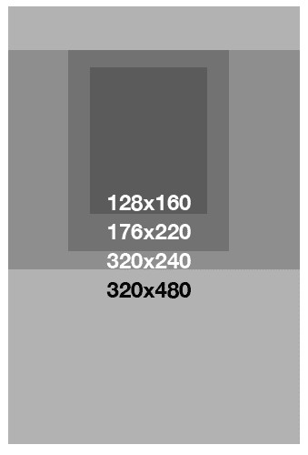
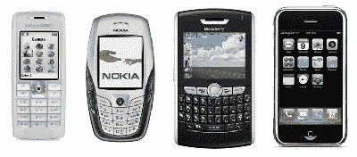
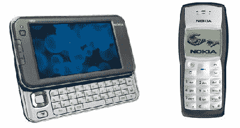

# 手机网络文章设计

> 原文：<https://www.sitepoint.com/designing-for-mobile-web/>

通过移动设备浏览网页的用户数量持续上升，但大多数移动网站仍然不尽如人意。

事实是，为移动设备用户创造一个好的网络体验比你想象的要容易得多。在这篇文章中，我将介绍七个基本步骤，如果遵循这些步骤，将有助于您避免导致许多其他移动网站失败的陷阱。通过这篇文章的结尾，你将会确切地知道为了建立一个成功的移动网站，你的努力应该集中在哪里。

##### 1.不要混淆你的标记

有几种不同类型的标记可用于构建移动网站。你需要选择一个适合你客户需求的，并坚持下去。

***WML***

在移动网络设备的早期，在移动网络上冲浪的唯一方式是浏览 WAP(无线应用协议)站点。WAP 网站使用 WML(无线标记语言)作为其主要标记语言。WML 是一种基于卡片和甲板隐喻的 XML 标记语言。

对我们来说幸运的是，WML 已经被其他几种技术取代了——事实上，如果你只是刚刚进入移动网页游戏，你可能会完全忽略 WML。WML 主要由遗留系统或网站使用，这些网站明确以拥有六年或更老的低端手机的客户为目标。

然而，仍在使用 WML 浏览器的一个潜在客户群是发展中国家的用户。例如，[诺基亚 1100 和 1101](http://en.wikipedia.org/wiki/Nokia_3310) 是非常基本、非常便宜的手机，估计全球销量为 2 亿部，这使得这款手机成为迄今为止全球最畅销的机型。如果你的网站定位于这个市场，WML 可能是你最好的解决方案。

***XHTML***

对于大多数网站，我们可以忽略 WML，使用一种您可能更熟悉的标记语言——XHTML。

如今，大多数内置手机浏览器都能很好地处理 XHTML。手机可以识别两种风格的 HTML:

1.  XHTML——由桌面 web 浏览器呈现的相同的基本 XHTML
2.  XHTML-MP—这里的 MP 代表移动配置文件

这两种语言的区别在于，XHTML-MP 包含的元素略少，限制更严格。这些差异的存在是为了让移动设备更容易解析和呈现 web 文档，但是编写 XHTML-MP 标记不应该给编写常规 XHTML 的过程带来任何重大变化。

有趣的是，当我和我的团队开发移动网站时，我们通常使用常规的 XHTML，这种方法很好地服务了我们。

##### 2.了解你的手机

随着等离子电视和高清电视慢慢进入市场，广播公司遇到了在哪里放置他们的标志和新闻标签的问题。以前，他们知道所有的电视都是相同的 3×2 尺寸，所以他们知道屏幕的相对宽度。现在，他们开始感受到处理各种电视分辨率和尺寸的痛苦——这是 web 开发人员每天都要处理的问题。

当然，移动世界更糟糕！我们不仅要适应不同的屏幕尺寸和分辨率，还要适应不同的形状，如图 1 所示。从短而长的矩形，到高而瘦的矩形，再到完美的正方形，移动世界包含了丰富的变化，几乎让你想拔光头发！

如果你考虑最常见的手机，它们可以根据屏幕大小进行分类——上下相差几个像素:

*   128 x 160 像素
*   176 x 220 像素
*   240 x 320 像素
*   320 x 480 像素

了解这些屏幕尺寸有助于你优化你的一些内容，但是最好保持你的网站的形状和风格尽可能的简单和线性。手机上没有鼠标——只有上下移动的功能——所以你不能要求用户在页面上跳来跳去。

***iPhone/互联网平板对老式绿屏手机***

手机市场有几个例外。它们是真正的高端设备，如 iPhone 或诺基亚互联网平板电脑，以及非常基本的老式“绿屏”单色点阵设备，如[诺基亚 3310](http://en.wikipedia.org/wiki/Nokia_3310) ，两者都显示在图 3 中。

低端手机有几个局限性，包括屏幕分辨率和呈现 XHTML 文档的能力非常有限。正如我在前面提到的，如果你的大多数客户都属于这一类，那么 WML 可能仍然适合你。

另一方面，高端设备通常能够运行类似于台式机的网络浏览器。向这些设备提供高质量的用户体验可能很棘手——虽然设备可能完全能够呈现完整的传统网页设计，但它可能通过蜂窝网络传输数据，这比标准的宽带互联网速度慢得多。因此，即使设备可以处理正常的网站，客户的情况和他们请求您的服务的原因可能意味着向他们发送您的网站的正常版本不是最好的解决方案。

我们将在下一节看到这对移动网站的设计意味着什么。

##### 3.瞄准合适的客户

任何网站的目标都应该是了解你的客户，以便向他们提供最合适的内容。

这个目标对于移动网站来说更加重要——你不仅需要了解你的客户，还需要知道他们可能在你的移动网站上做什么，以及当他们做的时候他们会在哪里。传统网站的客户最有可能坐在一张桌子前，面对一个分辨率不错的大显示器。浏览你的移动网站的访问者不太可能处于同样的情况——他们可能在排队等候，乘坐火车或公共汽车，奔向登机口，或者在深夜迷失在一个陌生的城镇并试图到达某个地方。

谷歌是一家投入大量精力简化其网络应用程序以适应移动用户的公司。Google 的 web 开发人员已经确定并专注于三个主要群体，他们试图将他们的应用程序定位于这些客户的需求。这是三个坚实的类别，值得为您自己的移动网站检查。现在让我们来看看它们。

**Go to page:** [1](/designing-for-mobile-web) | [2](/designing-for-mobile-web-2/) | [3](/designing-for-mobile-web-3/)

## 分享这篇文章