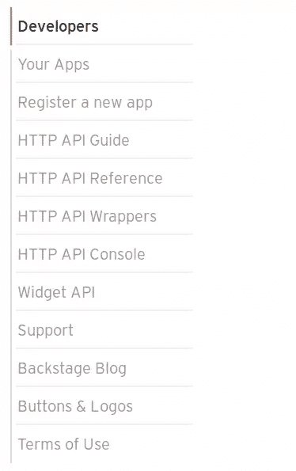
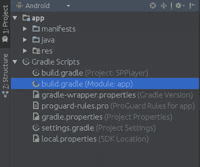
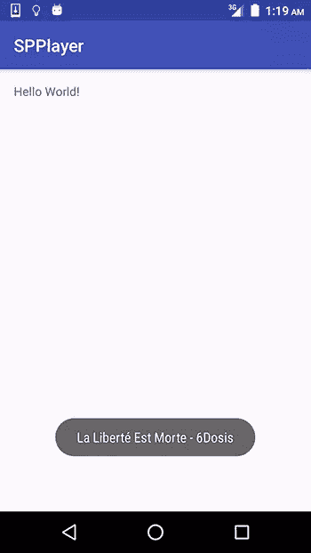
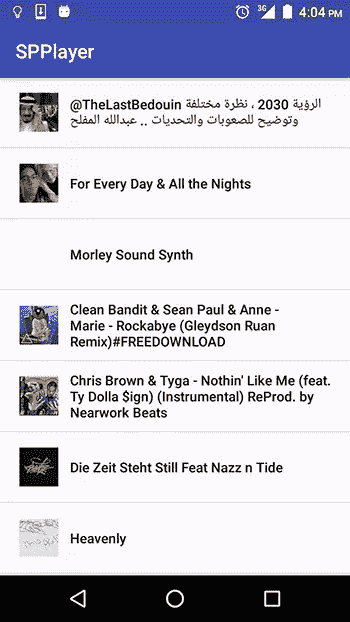
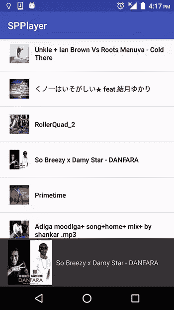
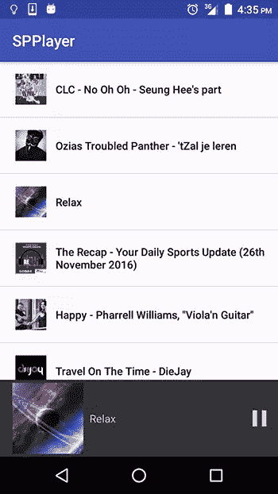

# 如何开发一个音乐流媒体 Android 应用程序

> 原文：<https://www.sitepoint.com/develop-music-streaming-android-app/>

*本帖于 2016 年 11 月更新，以反映翻新库的变化*。

[Android 多媒体框架](https://source.android.com/devices/media.html)为播放各种常见媒体类型提供了广泛的支持，允许您将音频、视频和图像集成到应用程序中。您可以播放存储在应用程序资源(原始资源)中的媒体文件、文件系统中的独立文件或通过网络连接到达的数据流中的音频或视频。在本文中，我们将了解如何使用媒体框架来播放流式音频。我们将看看媒体框架中的两个主要类——`MediaPlayer`(播放声音和视频的主要 API)和`AudioManager`(管理设备上的音频源和音频输出),并使用它们创建一个简单的音频播放器，允许用户浏览和播放 SoundCloud 中的内容。

## 入门指南

如前所述，我们将创建一个访问 SoundCloud API 的应用程序，所以首先你需要在 SoundCloud 开发者门户网站[developers.soundcloud.com](https://developers.soundcloud.com/)注册一个帐户。创建帐户后，点击页面右侧的注册新应用链接。



在接下来的屏幕上，命名您的应用程序。我们将把我们的应用命名为 *SPPlayer* 。


在下一页，你将看到你的应用程序的详细信息。保持页面打开，因为您需要将显示的客户端 ID 复制到 Android 应用程序中。

设置完成后，我们现在将创建 Android 应用程序。创建一个新的 Android 项目(我用的是 Android Studio。如果您使用 Eclipse，教程中的一些步骤会有所不同，例如添加库。你可以在网上找到关于如何使用 Eclipse 的帮助。).

创建一个新项目，并将应用程序命名为 *SPPlayer* 。设置您自己的公司域，然后单击下一步。在下一个屏幕上，我将最小 SDK 保留为 API 15 的默认值。在下一屏选择*空活动*模板，在最后一屏点击*完成*。

接下来打开你应用的 *build.gradle* 文件，添加 *gson* 、*改型*、 *converter-gson* 和 *picasso* 库。



将下列依赖项添加到文件中。

```
compile 'com.google.code.gson:gson:2.8.0'
compile 'com.squareup.retrofit2:retrofit:2.1.0'
compile 'com.squareup.retrofit2:converter-gson:2.1.0'
compile 'com.squareup.picasso:picasso:2.5.2'
```

随着教程的进行，我将解释我们为什么使用库。

当您更改 *build.gradle* 文件时，会有一条消息让您知道 IDE 需要一个*同步*才能正常工作。点击该消息右侧的*立即同步*。Gradle 将获取添加的依赖项。你需要一个互联网连接让格雷尔去取它们。

首先，创建一个类来保存一些配置数据，如 SoundCloud 端点的客户端 ID 和基本 URL。创建一个名为 *Config* 的类，并修改它，如下所示

```
package com.echessa.spplayer;

/**
 * Created by echessa on 11/26/16.
 */
public class Config {

    public static final String CLIENT_ID = "YOUR_CLIENT_ID";
    public static final String API_URL = "https://api.soundcloud.com";
}
```

将 SoundCloud 应用程序客户端 ID 替换为您自己的 ID。

`API_URL`常量保存 API 端点的基本 URL，如本 [SoundCloud HTTP API 参考](https://developers.soundcloud.com/docs/api/reference)中所述。如果您想知道可以用 API 做什么，参考指南是一个很好的阅读资源。

接下来创建一个`Track`对象，它将保存从 SoundCloud 获取的每个音频文件的数据。创建一个名为`Track`的类，并添加以下字段和 getter 方法。

```
package com.echessa.spplayer;

import com.google.gson.annotations.SerializedName;

/**
 * Created by echessa on 11/26/16.
 */
public class Track {

    @SerializedName("title")
    private String mTitle;

    @SerializedName("id")
    private int mID;

    @SerializedName("stream_url")
    private String mStreamURL;

    @SerializedName("artwork_url")
    private String mArtworkURL;

    public String getTitle() {
        return mTitle;
    }

    public int getID() {
        return mID;
    }

    public String getStreamURL() {
        return mStreamURL;
    }

    public String getArtworkURL() {
        return mArtworkURL;
    }

}
```

在上面的代码中，我们创建了四个字段来保存我们感兴趣的跟踪数据。要知道对 API 的调用将接收什么数据，您可以在浏览器中尝试以下 URL。它以 JSON 格式获取单个音轨的数据。

```
http://api.soundcloud.com/tracks/13158665.json?client_id=YOUR_CLIENT_ID
```

在`Track`类中，注意每个字段上的`@SerializedName`注释和`gson`导入。 [Gson](https://code.google.com/p/google-gson/) 库是 Google 的一个开源库，它将 Java 对象序列化和反序列化为 JSON。上面，它将获取 JSON 并将其映射到对象的字段，否则您将不得不编写更多的代码来从 JSON 获取数据并使用它创建一个`Track`对象。这就是为什么我们在类中不使用任何 setters，Gson 会在创建一个 Track 对象时自动设置这些字段。

**注意**:我不会提到每次添加代码后需要的导入。如果需要导入，IDE 会提示您添加它，您也可以[设置 IDE，使其自动解析导入](http://stackoverflow.com/questions/22272524/how-to-auto-import-the-necessary-classes-in-android-studio-with-shortcut)。如果存在导入冲突，我将只提到导入，以便让您知道应该使用哪个类。

打开 *AndroidManifest.xml* 文件，添加以下权限。

```
<uses-permission android:name="android.permission.INTERNET"/>
```

接下来向名为 *SCService* 的项目添加一个`Interface`。如图所示进行修改。

```
package com.echessa.spplayer;

import java.util.List;

import retrofit2.Call;
import retrofit2.http.GET;
import retrofit2.http.Query;

/**
 * Created by echessa on 11/26/16.
 */

public interface SCService {

    @GET("/tracks?client_id=" + Config.CLIENT_ID)
    Call<List<Track>> getRecentTracks(@Query("created_at") String date);
}
```

这里我们使用界面中的[改型库](http://square.github.io/retrofit/)。retrieval 是 Square 的一个开源库，它通过将远程 API 转换成声明性的、类型安全的接口来简化 HTTP 通信。接口上声明的方法代表一个远程 API 端点。注释描述了方法如何映射到 HTTP 请求。

该库使得从 web API 下载 JSON 或 XML 数据变得非常简单。一旦数据被下载，它就被解析成一个*普通的旧 Java 对象* (POJO)，必须为响应中的每个资源定义这个对象。

上面的代码将从 SoundCloud 获得一个音轨列表。我们添加了一个`@Query`注释，为将要调用的 URL 添加更多的参数。这里我们指定一个`created_at` at 参数，SoundCloud API 将使用它来过滤返回的结果；API 将只返回从指定日期开始创建的曲目。

为了测试这是否有效，在调用`setContentView(R.layout.activity_main);`之后，将以下代码放入`MainActivity.java`中的`onCreate(Bundle)`方法中。

```
Retrofit retrofit = new Retrofit.Builder()
        .baseUrl(Config.API_URL)
        .addConverterFactory(GsonConverterFactory.create())
        .build();

SCService scService = retrofit.create(SCService.class);
scService.getRecentTracks("last_week").enqueue(new Callback<List<Track>>() {
    @Override
    public void onResponse(Call<List<Track>> call, Response<List<Track>> response) {
        if (response.isSuccessful()) {
            List<Track> tracks = response.body();
            showMessage(tracks.get(0).getTitle());
        } else {
            showMessage("Error code " + response.code());
        }
    }

    @Override
    public void onFailure(Call<List<Track>> call, Throwable t) {
        showMessage("Network Error: " +  t.getMessage());
    }
});
```

上面首先通过调用几个函数实例化了一个`Retrofit`对象。实例化对象时，`baseUrl()`和`build()`必须被调用，`baseUrl()`必须在`build()`之前被调用。其他方法是可选的。

`baseUrl()`设置 API 的基本 URL，`build()`用配置的值创建一个`Retrofit`实例。在上面，我们包括了`addConverterFactory()`，它为对象的序列化和反序列化添加了一个转换器工厂。我们的项目将处理 JSON 数据，所以我们使用`GsonConverterFactory`，它能够在 JSON 中编码和解码对象。还有其他转换器模块可用，您可以根据应用需求使用多个模块。当使用多个转换器时，它们的指定顺序很重要。Retrofit 将尝试解析它用第一个指定的转换器获得的数据，并且只有在前一个转换器解析数据失败时，它才会移动到下一个转换器。以下是可用转换器的列表。

*   *Gson* : `com.squareup.retrofit2:converter-gson:2.1.0`
*   *简单的 XML* : `com.squareup.retrofit2:converter-simplexml:2.1.0`
*   *杰克森* : `com.squareup.retrofit2:converter-jackson:2.1.0`
*   *原蟾蜍* : `com.squareup.retrofit2:converter-protobuf:2.1.0`
*   *魔石* : `com.squareup.retrofit2:converter-moshi:2.1.0`
*   *电线* : `com.squareup.retrofit2:converter-wire:2.1.0`
*   *标量* : `com.squareup.retrofit2:converter-scalars:2.1.0`

您也可以通过扩展[转换器来创建自己的转换器。工厂](https://github.com/square/retrofit/blob/master/retrofit/src/main/java/retrofit2/Converter.java)抽象类。

`Retrofit`是将 API 接口转换成发出网络请求的对象的类。为了使用我们的`SCService`,我们创建了一个`Retrofit`对象，然后用它来创建接口的一个实例。

在上面的代码中，`Retrofit`类生成了一个`SCService`接口的实现。对生成的`SCService`的每个调用都会向远程 web 服务器发出一个 HTTP 请求。

我们调用`SCService` `getRecentTracks()`函数，向其传递字符串`last_week`，该字符串将用作查询参数`created_at`的值。对于这个参数，SoundCloud 期望一个格式为`yyyy-mm-dd hh:mm:ss`的日期，但是它也指定了一些可以用来指定日期的特殊值。可用选项有:`last_year`、`last_two_weeks`、`last_week`、`last_day`和`last_hour`。

要执行对服务器的请求，可以使用`call.execute()`进行同步调用，也可以使用`call.enqueue(new Callback<>() {})`进行异步调用。我们使用后者，给它传递一个`Callback`函数，当响应返回时将调用这个函数。在回调中，如果请求成功，我们得到返回的曲目并显示列表中第一首曲目的标题；否则，我们向用户显示一条错误消息。

就在这里，你可以看到使用改造的优势。当一个响应从服务器返回时，它的`response.body()`可以被分配给`List<Track> tracks`，后者将自动解析来自服务器的 JSON 数据，并将其转换成`Track`对象。如果没有改进，您将不得不编写执行解析的代码。

上面的实现不是进行 HTTP 请求的最佳方式。我们将对服务器进行几次调用，使用上面的方法，我们将在每次发出请求时创建一个`Retrofit`和`SCService`,这些都是开销很大的操作，所以整体性能会受到影响。因此，我们将使用 *Singleton* 模式，这样`Retrofit`和`SCService`只需创建一次，需要时就可以使用。我们很快就会这样做。现在，将下面的函数添加到被调用来向用户显示 Toast 消息的类中。

```
private void showMessage(String message) {
    Toast.makeText(MainActivity.this, message, Toast.LENGTH_LONG).show();
}
```

运行应用程序。您应该会看到一条提示消息，显示获取的第一首曲目的标题。我有:



现在，我们将通过坚持 *Singleton* 模式来提高应用程序的性能。

将以下类添加到项目中。

```
package com.echessa.spplayer;

import retrofit2.Retrofit;
import retrofit2.converter.gson.GsonConverterFactory;

/**
 * Created by echessa on 11/26/16.
 */

public class SoundCloud {

    private static final Retrofit RETROFIT = new Retrofit.Builder()
            .baseUrl(Config.API_URL)
            .addConverterFactory(GsonConverterFactory.create())
            .build();
    private static final SCService SERVICE = RETROFIT.create(SCService.class);

    public static SCService getService() {
        return SERVICE;
    }
}
```

这创建了`Retrofit`和`SCService`对象，就像我们之前做的那样，然后它包含了一个将返回服务的函数。由于`RETROFIT`和`SERVICE`是 *final* 和 *static* ，它们将只被创建一次，并且在每次创建一个`SoundCloud`对象时被重用。

现在你可以在我们放在 *MainActivity* 类的`onCreate(Bundle)`中的代码中使用它。

```
SCService scService = SoundCloud.getService();
scService.getRecentTracks("last_week").enqueue(new Callback<List<Track>>() {
    @Override
    public void onResponse(Call<List<Track>> call, Response<List<Track>> response) {
        if (response.isSuccessful()) {
            List<Track> tracks = response.body();
            showMessage(tracks.get(0).getTitle());
        } else {
            showMessage("Error code " + response.code());
        }
    }

    @Override
    public void onFailure(Call<List<Track>> call, Throwable t) {
        showMessage("Network Error: " +  t.getMessage());
    }
});
```

如果你运行应用程序，你应该可以看到第一个返回的曲目的标题，就像以前一样。

既然我们可以从服务器获取数据，我们需要创建一个显示数据的列表。

右击布局文件夹，选择*新建- >布局资源文件*，添加布局文件。将其命名为 *tracklistrow* ，并将以下内容添加到 *track_list_row.xml* 文件中。

```
<?xml version="1.0" encoding="utf-8"?>
<RelativeLayout xmlns:android="http://schemas.android.com/apk/res/android"
android:orientation="vertical"
android:paddingLeft="@dimen/activity_vertical_margin"
android:paddingRight="@dimen/activity_vertical_margin"
android:layout_width="match_parent"
android:layout_height="@dimen/row_height">

<ImageView
    android:id="@+id/track_image"
    android:layout_centerVertical="true"
    android:padding="@dimen/image_padding"
    android:layout_width="@dimen/image_size"
    android:layout_height="@dimen/image_size"/>
<TextView
    android:layout_centerVertical="true"
    android:id="@+id/track_title"
    android:layout_marginLeft="@dimen/activity_vertical_inner_margin"
    android:layout_width="wrap_content"
    android:layout_height="wrap_content"
    android:textAppearance="@style/TextAppearance.AppCompat.Body2"/>

</RelativeLayout>
```

以上创建了我们将用于曲目列表中每一行的布局。我们将显示该曲目的专辑封面和曲目标题。

修改 *activity_main.xml* 如图所示。

```
<?xml version="1.0" encoding="utf-8"?>
<RelativeLayout xmlns:android="http://schemas.android.com/apk/res/android"
    xmlns:tools="http://schemas.android.com/tools"
    android:layout_width="match_parent"
    android:layout_height="match_parent"
    tools:context=".MainActivity">

    <ListView
        android:id="@+id/track_list_view"
        android:layout_width="match_parent"
        android:layout_height="match_parent"/>

</RelativeLayout>
```

这为活动添加了一个`ListView`。

将以下内容添加到 *dimens.xml* 文件中。不要替换文件中的其他值，我们仍然使用它们。

```
<dimen name="row_height">72dp</dimen>
<dimen name="image_padding">4dp</dimen>
<dimen name="image_size">48dp</dimen>
<dimen name="activity_vertical_inner_margin">56dp</dimen>
```

接下来，创建以下将用于列表视图的定制适配器。

```
package com.echessa.spplayer;

import android.content.Context;
import android.view.LayoutInflater;
import android.view.View;
import android.view.ViewGroup;
import android.widget.BaseAdapter;
import android.widget.ImageView;
import android.widget.TextView;
import com.squareup.picasso.Picasso;
import java.util.List;

/**
 * Created by echessa on 11/26/16.
 */
public class SCTrackAdapter extends BaseAdapter {

    private Context mContext;
    private List<Track> mTracks;

    public SCTrackAdapter(Context context, List<Track> tracks) {
        mContext = context;
        mTracks = tracks;
    }

    @Override
    public int getCount() {
        return mTracks.size();
    }

    @Override
    public Track getItem(int position) {
        return mTracks.get(position);
    }

    @Override
    public long getItemId(int position) {
        return position;
    }

    @Override
    public View getView(int position, View convertView, ViewGroup parent) {

        Track track = getItem(position);

        ViewHolder holder;
        if (convertView == null) {
            convertView = LayoutInflater.from(mContext).inflate(R.layout.track_list_row, parent, false);
            holder = new ViewHolder();
            holder.trackImageView = (ImageView) convertView.findViewById(R.id.track_image);
            holder.titleTextView = (TextView) convertView.findViewById(R.id.track_title);
            convertView.setTag(holder);
        } else {
            holder = (ViewHolder) convertView.getTag();
        }

        holder.titleTextView.setText(track.getTitle());

        // Trigger the download of the URL asynchronously into the image view.
        Picasso.with(mContext).load(track.getArtworkURL()).into(holder.trackImageView);

        return convertView;
    }

    static class ViewHolder {
        ImageView trackImageView;
        TextView titleTextView;
    }

}
```

上面的适配器使用了 [ViewHolder 设计模式](http://developer.android.com/training/improving-layouts/smooth-scrolling.html#ViewHolder)，这提高了列表视图的性能。

当滚动 ListView 时，您的代码可能会频繁调用`findViewById()`，这会降低性能。即使适配器返回一个膨胀的视图进行回收，您仍然需要查找元素并更新它们。重复使用`findViewById()`的一个方法是使用*视图保持器*设计模式。

一个 *ViewHolder* 对象将每个组件视图存储在布局的标签字段中，因此您可以立即访问它们，而无需重复查找。

在上面的代码中，我们创建了一个类来保存视图集:`static class ViewHolder`。然后在`getView(int, View, ViewGroup)`中，我们填充*视图保持器*并将其存储在布局中。此后，每个视图现在都可以访问，而无需查找，从而节省了宝贵的处理器周期。

我们将曲目列表行的文本设置为曲目的标题，并使用 [Picasso 库](http://square.github.io/picasso/)获取曲目的图像。同样来自 Square 的 Picasso library 是一个用于 Android 的图像下载和缓存库。除了下载和缓存图像，你还可以用它对图像进行一些变换，比如设置大小和裁剪。你也可以用它来设置一个占位符图像，当图像加载时显示，以及一个“错误”图像，当加载失败时显示。在上面的代码中，我们使用它从给定的 url 加载图像，并将其放入曲目列表行的 imageview 中。

在*MainActivity.java*中添加以下类变量。

```
private List<Track> mListItems;
private SCTrackAdapter mAdapter;
```

对`onCreate(Bundle)`进行如下修改，并添加如下所示的`loadTracks(List<Track>)`方法。

```
@Override
protected void onCreate(Bundle savedInstanceState) {
    super.onCreate(savedInstanceState);
    setContentView(R.layout.activity_main);

    mListItems = new ArrayList<Track>();
    ListView listView = (ListView)findViewById(R.id.track_list_view);
    mAdapter = new SCTrackAdapter(this, mListItems);
    listView.setAdapter(mAdapter);

    SCService scService = SoundCloud.getService();
    scService.getRecentTracks("last_week").enqueue(new Callback<List<Track>>() {
        @Override
        public void onResponse(Call<List<Track>> call, Response<List<Track>> response) {
            if (response.isSuccessful()) {
                List<Track> tracks = response.body();
                loadTracks(tracks);
            } else {
                showMessage("Error code " + response.code());
            }
        }

        @Override
        public void onFailure(Call<List<Track>> call, Throwable t) {
            showMessage("Network Error: " +  t.getMessage());
        }
    });
}

private void loadTracks(List<Track> tracks) {
    mListItems.clear();
    mListItems.addAll(tracks);
    mAdapter.notifyDataSetChanged();
}
```

在上面的代码中，我们创建了一个列表视图和一个`SCTrackAdapter`实例，并将其设置为列表视图的适配器。然后，我们从 API 中获取最近的磁道，并调用`loadTracks(List<Track>)`,其中我们将磁道添加到适配器使用的数组列表中，并将更改通知给适配器。

运行该应用程序，列表将加载 SoundCloud 的最新曲目，专辑插图将显示在列表的左侧。对于没有专辑插图的轨道，您可以使用 Picasso 指定要显示的图像。参考[文档](http://square.github.io/picasso/javadoc/index.html)了解该库还提供什么。



当您选择列表中的一个项目时，什么都不会发生。我们希望播放选定的曲目。

首先，我们将在屏幕底部添加一个工具栏，它将显示所选的曲目以及播放和暂停的控件。修改 *activity_main.xml* 如图所示。

```
<LinearLayout xmlns:android="http://schemas.android.com/apk/res/android"
    xmlns:tools="http://schemas.android.com/tools"
    android:layout_width="match_parent"
    android:layout_height="match_parent"
    android:orientation="vertical"
    tools:context=".MainActivity">

    <ListView
        android:id="@+id/track_list_view"
        android:layout_weight="100"
        android:layout_width="match_parent"
        android:layout_height="0dp"/>

    <android.support.v7.widget.Toolbar
        android:background="#333333"
        android:theme="@style/Base.ThemeOverlay.AppCompat.Dark.ActionBar"
        android:layout_width="match_parent"
        android:layout_height="100dp">

        <ImageView
            android:id="@+id/selected_track_image"
            android:layout_width="92dp"
            android:layout_height="92dp"/>

        <TextView
            android:id="@+id/selected_track_title"
            android:paddingLeft="8dp"
            android:layout_width="wrap_content"
            android:layout_height="wrap_content"/>

        <ImageView
            android:id="@+id/player_control"
            android:layout_gravity="right"
            android:layout_width="@dimen/image_size"
            android:layout_height="@dimen/image_size"/>

    </android.support.v7.widget.Toolbar>

</LinearLayout>
```

在这里，我们将工具栏添加到位于屏幕底部的布局中。工具栏有一个`ImageView`将显示曲目专辑插图，一个`TextView`将显示曲目标题，另一个`ImageView`将显示*播放*和*暂停*图标。

在*MainActivity.java*中添加以下类变量。

```
private TextView mSelectedTrackTitle;
private ImageView mSelectedTrackImage;
```

将以下内容添加到`listView.setAdapter(mAdapter);`语句下方的`onCreate(Bundle)`中。

```
mSelectedTrackTitle = (TextView)findViewById(R.id.selected_track_title);
mSelectedTrackImage = (ImageView)findViewById(R.id.selected_track_image);

listView.setOnItemClickListener(new AdapterView.OnItemClickListener() {
    @Override
    public void onItemClick(AdapterView<?> parent, View view, int position, long id) {
        Track track = mListItems.get(position);

        mSelectedTrackTitle.setText(track.getTitle());
        Picasso.with(MainActivity.this).load(track.getArtworkURL()).into(mSelectedTrackImage);

    }
});
```

这将使用所选轨道的数据设定工具栏的图像视图和文本视图。

运行应用程序，从列表中选择一首曲目后，工具栏会更新该曲目的信息。



现在是播放选定曲目的最后一步。

将以下内容添加到该类中。

```
private MediaPlayer mMediaPlayer;
private ImageView mPlayerControl;
```

然后在分配变量`mSelectedTrackImage`的语句后添加以下内容。

```
mPlayerControl = (ImageView)findViewById(R.id.player_control);
```

将以下内容添加到`setContentView(R.layout.activity_main);`语句后的`onCreate(Bundle)`中。

```
mMediaPlayer = new MediaPlayer();
mMediaPlayer.setAudioStreamType(AudioManager.STREAM_MUSIC);
mMediaPlayer.setOnPreparedListener(new MediaPlayer.OnPreparedListener() {
    @Override
    public void onPrepared(MediaPlayer mp) {
        togglePlayPause();
    }
});
```

在上面，我们实例化了`mMediaPlayer`并为它设置了音频流类型。`MediaPlayer`类可用于控制音频/视频文件和流的回放。然后，我们注册一个回调，当媒体源准备好回放时将调用这个回调。回调函数调用下面的函数。

将下面的函数添加到类中。

```
private void togglePlayPause() {
    if (mMediaPlayer.isPlaying()) {
        mMediaPlayer.pause();
        mPlayerControl.setImageResource(R.drawable.ic_play);
    } else {
        mMediaPlayer.start();
        mPlayerControl.setImageResource(R.drawable.ic_pause);
    }
}
```

上面做了一个检查，看看媒体播放器是否在播放。如果是，它会暂停播放，并将播放器控制图标更改为播放图标。如果媒体播放器没有播放，它会开始播放，并将图标更改为暂停图标。

要使用图标，下载[资产](https://uploads.sitepoint.com/wp-content/uploads/2015/06/1435295957Assets.zip)文件夹，并将可绘制文件夹粘贴到项目的*资源*文件夹中。这些图标来自[谷歌的材料设计图标库](https://github.com/google/material-design-icons)。

接下来，在使用 Picasso 设置工具栏图像的语句之后，向列表视图的`onItemClick(AdapterView<?>, View, int, long)`方法添加以下内容。

```
if (mMediaPlayer.isPlaying()) {
    mMediaPlayer.stop();
    mMediaPlayer.reset();
}

try {
    mMediaPlayer.setDataSource(track.getStreamURL() + "?client_id=" + Config.CLIENT_ID);
    mMediaPlayer.prepareAsync();
} catch (IOException e) {
    e.printStackTrace();
}
```

当一个项目被选中时，检查玩家是否在玩。如果一首曲目正在播放，它会停止播放，媒体播放器会复位，然后所选曲目才能播放。接下来，我们设置媒体播放器的数据源，这是流式音频文件的完整 URL。然后我们让播放器异步回放。您可以在这里调用`prepare()`或`prepareAsync()`，但是对于流，您应该调用`prepareAsync()`，它会立即返回，而不是阻塞，直到缓冲了足够的数据。对于文件，调用`prepare()`是可以的，它会阻塞，直到`MediaPlayer`准备好回放。

然后在初始化`mPlayerControl`的语句后添加以下内容。

```
mPlayerControl.setOnClickListener(new View.OnClickListener() {
    @Override
    public void onClick(View v) {
        togglePlayPause();
    }
});
```

上面为播放器控制图像视图设置了一个点击监听器，用于切换播放器的播放/暂停状态。

运行该应用程序，您应该能够播放选定的音频文件，通过进行新的选择切换到另一个轨道，并通过点击工具栏中的暂停来暂停播放。



音频文件播放完毕后，工具栏图标会一直显示暂停图标。当一首曲目播放完毕时，我们希望工具栏的图标变为播放。为了做到这一点，我们将在媒体播放器上设置一个完成时监听器来检测何时完成并改变工具栏的图标。

在对`mMediaPlayer.setOnPreparedListener()`的调用下面添加以下内容。

```
mMediaPlayer.setOnCompletionListener(new MediaPlayer.OnCompletionListener() {
    @Override
    public void onCompletion(MediaPlayer mp) {
        mPlayerControl.setImageResource(R.drawable.ic_play);
    }
});
```

运行应用程序，现在，一旦曲目播放完毕，工具栏图标应该会发生变化。

最后，将以下内容添加到文件中。这将在活动被销毁时释放媒体播放器。我们不希望在任何资源不被使用的时候还留着它们。

```
@Override
protected void onDestroy() {
    super.onDestroy();

    if (mMediaPlayer != null) {
        if (mMediaPlayer.isPlaying()) {
            mMediaPlayer.stop();
        }
        mMediaPlayer.release();
        mMediaPlayer = null;
    }
}
```

这就把我们带到了教程的结尾。我们已经创建了一个简单的音频播放器，并看到了如何使用 MediaPlayer 类来播放流式音频。你可以[在这里](https://github.com/sitepoint-editors/SPPlayer)从 GitHub 下载完成的项目。记得在 Config.java 类中粘贴你的 SoundCloud 客户端 ID。

## 分享这篇文章