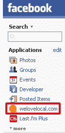
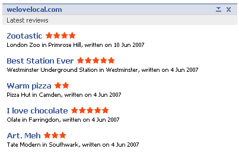
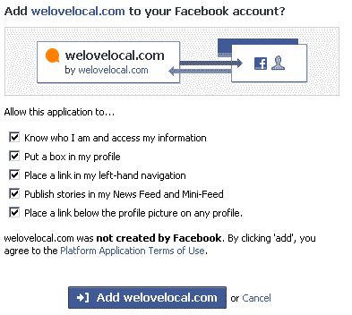

# 使用 Facebook 平台和 PHP 开发

> 原文：<https://www.sitepoint.com/developing-facebook-platform/>

今年五月底，脸书团队[宣布了对该软件包的开发者工具](http://developers.facebook.com/news.php?blog=1&story=21)的重大改变，该工具被称为 Facebook 平台。虽然该平台本身在此版本发布前几个月就已经推出，但在旧金山的脸书开发者大会 f8 上还是宣布了许多新功能。这次发布吸引了大量媒体报道——从[华尔街日报](http://online.wsj.com/public/article/SB117971397890009177-wjdKPmjAqS_9ZZbwiRp_CoSqvwQ_20070620.html)到 [TechCrunch。但是重要的问题是:你为什么要关心？](http://www.techcrunch.com/2007/05/24/facebook-launches-facebook-platform-they-are-the-anti-myspace/)


根据 Alexa 的数据，[脸书是网络上排名前 20 的网站之一](http://www.alexa.com/data/details/traffic_details?url=http://www.facebook.com)，它有一些令人印象深刻的统计数据:

*   该网站的增长率约为每周 3%，相当于每天有 10 万新用户。
*   50%的注册用户每天都会访问该网站。
*   该网站吸引的流量超过了易贝:每月 400 亿次页面浏览，相当于每个用户每天平均浏览 50 个页面。

只要看看这些统计数据，你就应该开始思考如何利用这种流量水平来为自己的网站带来好处。如果你能利用脸书的用户群，你就能非常容易快速地增加观众对你的品牌、产品、服务或网站的了解。

让我们考虑一个真实世界的例子。我目前在做[welovelocal.com](http://www.welovelocal.com)，这是一个英国的目录，它允许用户查找和评论企业。虽然这不一定是一个新的想法，但该网站增加了一个社交元素，用户可以通过查看朋友的评论来了解其他有类似兴趣的用户正在评论的企业。通过利用脸书，像这样的网站可以显著增加其在给定用户的朋友网络中的曝光率。

例如，如果我们喜爱的本地用户 Stacy 写了一篇关于一家餐馆的评论，这篇评论将被发布到 Stacy 的脸书新闻订阅源上。史黛西在脸书的所有朋友都可以看到她写了一篇新的评论，并且可以点击我们爱本地来阅读。

你能看到潜力吗？

你可以以多种方式使用 Facebook 平台，包括创建只存在于脸书本土的应用程序。然而，我觉得最大的潜力在于将脸书集成到一个现有的站点中，这也是我将在本文中讨论的内容。

新闻源可能是该平台最重要的元素，因为它为你发出的任何通知添加了真正的病毒元素——能够为你的任何用户联系到整个朋友网络无疑是一个伟大的功能。但是还有许多其他途径可以将内容传达给用户。例如，您可以:

*   从用户的脸书个人资料页面的左侧菜单栏添加一个到您自己网站的链接，如下所示。



*   向用户的个人资料添加一个内容框，其中包含您喜欢的任何内容。有了 welovelocal，我们用它来显示用户最近的五条评论，包括评级和链接到我们网站上的实际评论，如下所示。



*   向用户发送执行特定操作的请求。例如，您可以检索用户的朋友列表，并向他们发送请求，将您的应用程序添加到他们的脸书个人资料中。
*   在脸书境内上传照片、创建相册、获取照片和管理照片。这样做的一个用途可能是访问用户添加到他们的脸书账户的照片，并把它们拉进你的网站，或者把上传到你网站的照片推回脸书。

##### 我如何使用它？

在本文中，我们将通过 PHP 5 来了解使用脸书平台的基本知识。如果您有兴趣使用另一种语言将您的网站与脸书集成，脸书开发者的维基上有大量信息:

*   [ASP.NET](http://wiki.developers.facebook.com/index.php/ASP.NET)
*   [ASP(VBScript)](http://wiki.developers.facebook.com/index.php/ASP_%28VBScript%29/)
*   [ColdFusion](http://wiki.developers.facebook.com/index.php/ColdFusion) 的应用
*   [C++](http://wiki.developers.facebook.com/index.php/C%2B%2B)
*   [C#](http://wiki.developers.facebook.com/index.php/C)
*   [Java](http://wiki.developers.facebook.com/index.php/Java)
*   [Perl](http://wiki.developers.facebook.com/index.php/Perl)
*   [PHP](http://wiki.developers.facebook.com/index.php/PHP)
*   [Python](http://wiki.developers.facebook.com/index.php/Python)
*   [Ruby on Rails](http://wiki.developers.facebook.com/index.php/Using_Ruby_on_Rails_with_Facebook_Platform)
*   [VB.NET](http://wiki.developers.facebook.com/index.php/ASP.NET)

我很幸运(或者很不幸)在五月份正式平台发布之前开发了 welovelocal 应用程序。这意味着我必须编写自己的代码来调用这些函数。有一个官方的 PHP 5 库和一个非官方的 PHP 4 版本(见上面的 PHP 链接),你可以比我更快更容易地使用它们。然而，为了获得对平台如何工作的正确理解，有必要看一看发生的原始交互。

##### 第一步

您必须注册一个 API 密钥，然后才能访问 Facebook 平台。为此，你需要注册一个脸书账户，然后将“开发者”应用添加到你的脸书账户。你可以通过在 www.facebook.com/developers 遵循非常简单的指示来做到这一点。添加后，你会发现开发者应用程序很像一个普通的脸书群组，但在页面顶部附近有一个名为“我的应用程序”的附加链接，单击该链接会显示你已注册的所有脸书应用程序的列表。

注册后，您需要生成一个密钥。单击申请另一个关键链接，您将逐步完成创建脸书应用程序的过程。您可以向许多字段提供可选信息，所有这些都在[脸书开发者网站](http://developers.facebook.com/)上的[快速入门指南](http://developers.facebook.com/step_by_step.php)中有所解释。

您的应用程序现在实际上已经可以使用了，尽管它不会做任何事情！根据您希望应用程序执行的操作，您的用户可能需要执行一些步骤来将您的应用程序安装到他们的脸书帐户中。该过程通常包括他们单击安装链接，然后确认请求，如下所示。



一旦应用程序被添加，它将出现在用户的新闻订阅源和迷你订阅源中，这两者都可以被他们所有的朋友看到——这是你的第一次免费宣传！

##### 证明

您的应用程序已经可以使用了，但是您当然希望为您的用户提供一些内容。对网站所有者来说，两个最重要的特性是:

*   将项目发布到新闻订阅源的能力
*   添加配置文件框的能力

在使用这些功能之前，您需要使用脸书平台对当前用户进行身份验证。

对 Facebook 平台 API 的每个调用都需要一个会话密钥来标识登录并使用系统的用户。要获得这个密钥，您必须调用脸书 API，该 API 重定向用户登录到脸书网站并授权该请求。

这里的一个障碍是，这种授权提供的会话密钥只能持续一段时间——大约 24 小时。没有过期的密钥会有用得多。幸运的是，我们可以通过以下两个步骤获得这样一个密钥，稍后我将对此进行更详细的解释:

1.  首先，要求用户授权您的应用程序，以便它可以访问用户在脸书上的帐户。这将返回 auth token 1，它将生成一个 24 小时后过期的会话密钥。

3.  然后，让用户生成 auth token 2，然后将它粘贴到您网站上的一个表单中。有了这个令牌，您将能够生成一个永不过期的会话密钥。

一旦获得了最终令牌，就可以通过调用`facebook.auth.getSession`函数来请求永久会话密钥。

但首先，请允许我详细说明这两个步骤。

***第一步-获取授权令牌 1***

从您的 web 站点，使用一个附加了 API 密钥的 URL 将您的用户定向到脸书，就像这样:`www.facebook.com/login.php?api_key=APIKEY`(其中 API 密钥应该替换为您自己的 API 密钥)。如果用户当前没有登录，他们将被要求这样做。

然后，用户将被要求接受您设置的任何服务条款，并被重定向到您在创建应用程序时指定的回调 URL。这可以通过脸书侧边栏的开发者链接编辑你的应用程序来改变。

重定向就绪后，脸书将使用实际的认证令牌将`?auth_token=TOKEN`追加到 URL。您可以将这个令牌与`facebook.auth.getSession`函数一起使用；它是 PHP 中的一个`GET`变量。

然而，因为我们想要获得一个无限的会话，所以那个`auth`令牌实际上是不相关的——我们需要获得另一个令牌，我们可以用它来获得一个永久的会话密钥。如果我们对无限期会话不感兴趣，我们就在这里停下来。我们可以在下面的`facebook.auth.getSession`函数中使用`auth`令牌。

***第二步-获取授权令牌 2***

一旦您的用户在登录脸书后返回您的网站，您需要将他们发送到`www.facebook.com/code_gen.php?api_key=APIKEY`。回到脸书网站，用户将被要求生成一个令牌，将显示给他们。然后他们必须将它复制并粘贴到你网站上的一个表格中——它不是通过`GET` / `POST`传递的。您可以创建一个表单来接受来自您的用户的令牌。

一旦用户向您的站点提交了第二个令牌，您就需要调用`facebook.auth.getSession`函数，将令牌作为参数传递。这将最终返回一个会话密钥，您可以继续使用该密钥对用户进行身份验证；例如，这个密钥可以存储在数据库中，与用户的帐户放在一起，以便将来检索。

需要注意的是，如果用户从他们的脸书帐户中删除了您的应用程序，他们需要重复此验证过程才能使用您的脸书应用程序。因此，您应该为用户提供选项来重置他们的脸书集成并再次进行设置。如果您将用户的会话密钥存储在数据库中，这个任务只需要删除该会话密钥，并让用户通过上面的两步认证过程。

##### 呼叫`facebook.auth.getSession`

现在您有了一个身份验证令牌，您需要为当前用户获得一个会话密钥。这个键被传递给每一个其他的脸书 API 调用，以标识应用程序对其执行操作的用户。

因为我们没有使用脸书提供的库，所以我们需要手工构建将发送到脸书的 HTTP 查询，并编写一些代码来处理响应。对于每个电话，你必须提供三个必需的值，正如脸书网站上描述的:

*   `method`–第一个参数是方法名。该方法必须是 API 文档公开的方法之一，否则 API 将返回错误代码 3(带有消息未知方法)。
*   `api_key`–与进行 API 调用的站点相对应的特定于供应商的 API 键。这与我们在登录请求中使用的密钥相同，是在您注册应用程序时提供给您的。
*   `sig`–方法调用的签名。

签名的生成如下伪代码所示:

```
args = array of args to the request, formatted in arg=val pairs  

sorted_array = alphabetically_sort_array_by_keys(args);  

request_str = concatenate_in_order(sorted_array);  

signature = md5(concatenate(request_str, secret))
```

我写了一个简短的`do_facebook_request()`函数，可以从下载[，而不是每次需要执行 HTTP 查询时都必须手动这么做。这需要为特定的 API 函数发送可选参数，以及该函数的名称。它构造并发送请求，然后返回结果:](https://www.sitepoint.com/examples/facebook/facebook.zip)

```
do_facebook_request.php  

<?php  

/**  

* Sends an API request to Facebook  

*  

* @param array $parameters Array of parameters to send  

* @param string $method The API function to call  

* @return array Returns array of data returned  

*/  

function do_facebook_request($parameters, $method)  

{      

  if (empty($parameters) || empty($method))  

  {  

    return false;  

  }  

  // Build Facebook args  

  // http://developers.f8.facebook.com/documentation.php?v=1.0&doc=auth  

  $data['api_key'] = 'API KEY';  

  $data['method'] = $method;  

  $data['v'] = '1.0';  

  // Loop through and set as array  

  foreach ($parameters as $key => $value)  

  {  

    $data[$key] = $value;  

  }    

  // Sort            

  ksort($data);  

  $args = '';          

  foreach ($data as $key => $value)  

  {  

    $args .= $key.'='.$value;  

  }  

  $data['sig'] = md5($args.'secret');  

  // Get a Facebook session  

  $response = do_post_request('http://api.facebook.com/restserver.php', $data);  

  // Handle XML  

  $xml = simplexml_load_string($response);  

  return $xml;  

}  

/**  

* Sends a POST request with necessary parameters  

* Code based on (broken link)  

* We use HTTP here. See http://uk2.php.net/manual/en/wrappers.http.php  

*  

* @param string $url The URL to perform the POST on. Include http://  

* @param array $data The data to POST in array format  

* @param array $optional_headers Any HTTP headers. See http://www.php.net/manual/sv/function.header.php or http://www.faqs.org/rfcs/rfc2616  

* @param string $method The method for the request. Defaults to POST  

* @return string The response  

*/  

function do_post_request($url, $data, $optional_headers = NULL, $method = 'POST')  

{  

  // Just defining some parameters for the request here  

  // See http://uk2.php.net/manual/en/wrappers.http.php#AEN268663 for additional context options  

  $params = array('http' => array('method' => $method, 'content' => http_build_query($data)));  

  if ($optional_headers !== NULL) // Add in any additional headers  

  {  

    $params['http']['header'] = $optional_headers;  

  }  

  // Makes it easier to add additional parameters such  

  // as any optional HTTP headers as set above  

  $context = stream_context_create($params);  

  $fp = @fopen($url, 'rb', false, $context);  

  if (!$fp)  

  {  

    return false;  

  }  

  $response = @stream_get_contents($fp);  

  if ($response === false)   

  {  

    fclose($fp);  

    return false;  

  }  

  fclose($fp);  

  return $response;  

}  

?>
```

该代码是我为 welovelocal 应用程序编写的类的一部分，基于 Wez Furlong 的博客中提供的代码。您需要用自己的密钥替换第 20 行的 API_KEY，以及第 40 行的秘密来生成签名。这个秘密是由脸书生成的一个字符串，显示在脸书开发者应用程序的“我的应用程序”部分的 API 键下面。
这里有一个我们调用`do_facebook_request`函数的例子:

```
$xml = do_facebook_request(array('auth_token' => $token), 'facebook.auth.getSession');
```

处理完请求后，`$xml`变量将包含如下内容:

```
<?xml version="1.0" encoding="UTF-8"?>  

<auth_getSession_response  xmlns:xsi="https://www.w3.org/2001/XMLSchema-instance" xsi:schemaLocation="http://api.facebook.com/1.0/ http://api.facebook.com/1.0/facebook.xsd">  

  <session_key>5f34e11bfb97c762e439e6a5-8055</session_key>  

  <uid>8055</uid>  

  <expires></expires>  

</auth_getSession_response>
```

这是您可以存储并用于所有后续请求的`session_key`。有关详细信息，请参见 [auth.getSession](http://developers.facebook.com/documentation.php?v=1.0&method=auth.getSession) 文档。

##### 用户配置文件框

将贡献的内容显示为用户档案的一部分是用户展示他们在您的网站上所做工作的一个很好的方式。有了 welovelocal，我们让人们在个人资料上列出他们的最新评论，这样他们的朋友就可以阅读他们写的东西。这个概念可以扩展到照片、新闻文章、游戏高分——几乎任何东西，真的。

脸书使用它自己的 HTML 语言子集，允许你在用户档案中放入丰富的内容，而不会带来安全问题或破坏网站的布局。这种标记语言被称为 FBML——脸书标记语言——并且在脸书开发者网站上有很好的记录。

将内容推送到配置文件非常简单——您在代码中生成 FBML，然后将其发送到 API，这使得内容是活的。该函数名为 [facebook.profile.setFBML](http://developers.facebook.com/documentation.php?v=1.0&method=profile.setFBML) ，要求您提供我们之前获得的会话密钥和您想要显示的实际 FBML。

创建 FBML 非常简单，在官方文档中有很好的解释，所以我在这里不赘述。您可以使用 [FBML 测试控制台](http://developers.facebook.com/tools.php?fbml)来预览输出结果。

一旦你写好了 FBML，你可以使用`do_facebook_request()`函数把它发送给脸书的 API:

```
$xml = do_facebook_request(array('session_id' => 'idhere', 'call_id' => microtime(), 'markup' => $markup), 'facebook.profile.setFBML');
```

你会注意到一个`call_id`作为我们传递给`do_facebook_request`函数的最后一个参数。这是请求的唯一 ID。脸书建议您使用以毫秒为单位的当前时间，可通过 [`microtime()`](http://www.php.net/microtime) 功能获得。

就这样—个人资料内容会立即出现！

##### 新闻提要

脸书的新闻提要是你的朋友们发生的一切的总结——这是他们与网站互动的历史。通过朋友的新闻源，您可以:

*   通过状态更新了解他们在做什么(比如 [Twitter](http://twitter.com/)
*   了解他们与谁成为了朋友
*   查看他们何时更新了个人资料

…以及在脸书发生在他们身上的几乎所有其他事情。我相信你会同意，能够向用户的所有朋友发布项目是宣传你自己网站上发生的活动的一种很好的方式。

您可以将新闻发布到单个用户的订阅源，或者发布到特定用户的所有朋友的订阅源。接下来，我们将看看后一个任务——使用 [`feed.publishActionOfUser`](http://developers.facebook.com/documentation.php?v=1.0&method=feed.publishActionOfUser) 函数——因为这对于通知人们你自己网站上发生的事情是最有用的。

虽然`feed.publishActionOfUser`函数允许您发送最多四张图片(这对于使用图形内容的网站来说是理想的)，但是为了简单起见，我将把这个例子放在发送文本的简单任务上。

发送新闻时，您必须指定标题(最多。40 个字符)，但是您也可以选择提供正文文本。标题将以粗体显示，正文以常规段落样式显示。正文通常用于阐述标题中包含的细节。

脸书允许在标题和正文中使用某些标签。这些标记允许您显示上下文相关的信息，例如用户名和到配置文件的链接。因此，如果我要向我的朋友发送以下发布信息的请求:

```
<fb:userlink uid="profileowner"/> wrote a new review.
```

它会显示为:

<q>大卫·米顿(网名)写了一篇新评论。</q>

我的名字将被链接到我的脸书个人资料，并且网络名将被替换为查看新闻订阅源的人认识我的网络(例如，大学名、俱乐部名等)。

为了防止垃圾邮件，脸书对你发送新闻的次数进行了限制。这在开发者文档中有详细的解释。

正如我们前面看到的，您还可以使用`do_facebook_request`函数发送新闻提要，如下所示:

```
$params['call_id'] = microtime();  

$params['session_id'] = 'idhere';  

$params['title'] = '<fb:userlink uid="profileowner"/> wrote a new review';  

$params['body'] = '<a href="http://www.welovelocal.com/business/'.$business['url_company'].'/#r'.$review_id.'">Read the full review...</a>';  

do_facebook_request($params, 'facebook.feed.publishActionOfUser');
```

##### 展开你的翅膀

在这篇文章中，我们只涉及了一些关键的 Facebook 平台功能，但是还有很多其他的功能，你可以利用它们向脸书推送更多的内容。

*用户数据*–[文档](http://developers.facebook.com/documentation.php?v=1.0&method=users.getInfo)

一旦您对用户进行了身份验证，您就可以获取他们几乎所有的个人资料数据(尽管根据他们的隐私设置，可用的数据可能会受到限制)。当然，人们应该负责任地使用这些数据——想到的一种方法是使用它来预先填充您自己站点上的许多字段，以使用户不必两次输入相同的数据。

*事件*–[文档](http://developers.facebook.com/documentation.php?v=1.0&method=events.get)

由于任何给定的用户都倾向于在脸书上联系许多朋友，该网站经常被用来组织社交活动。脸书 API 允许您利用这一点，并根据特定标准返回用户可以看到的所有事件的列表。过滤此数据的标准包括开始和结束日期，以及用户是否表示将参加活动。

您可以使用这个特性向您的用户展示一个日历，这样他们就可以围绕他们与朋友之间的其他约定来计划其他活动。

*组*–[文档](http://developers.facebook.com/documentation.php?v=1.0&method=groups.get)

与使用事件数据的方式类似，您可以使用脸书 API 来找出用户所属的组，并检索这些组的成员列表。与通知 API 结合使用会很有用，例如，向一个组中的所有用户发送加入您的网站的请求。当然，这种方法可能会被视为[发送垃圾信息](http://www.facebook.com/developers/message.php?id=26)，所以你肯定需要确保你广播的内容是相关的。

*照片上传*–[文档](http://developers.facebook.com/documentation.php?v=1.0&doc=photoupload)

脸书每周有超过 6000 万张照片上传，目前有 160TB 的照片存储空间，这使得它成为一种非常受欢迎的分享照片的方式。使用 API，您可以:

*   创建新相册来存储照片
*   检索现有相册的列表，选择要上传照片的相册
*   上传照片到网站
*   从特定相册或当前用户可以访问的整个站点的所有照片中检索照片

这意味着您可以向用户展示他们在脸书的照片列表，并让他们能够在您自己的网站上显示这些照片。他们也可以反过来做:把你网站上的照片复制到脸书，这样他们所有的朋友都能看到。

##### 摘要

这篇文章介绍了一些将您的网站与脸书集成的方法。无论你是选择只利用 Web 增长最快的社区的一个小方面，还是张开双臂拥抱它，脸书 API 都是一个强大的工具，既可以增强现有用户的体验，又可以通过增加网站流量来吸引新用户。

*资源*

*   [脸书开发商](http://developers.facebook.com/)
*   [脸书应用的剖析](http://developers.facebook.com/anatomy.php)
*   [常见问题解答](http://developers.facebook.com/faq.php)
*   [FBML 测试控制台](http://wiki.developers.facebook.com/#el#/Wiki/#el#/</li>
    <li>/#l#/http://developers.facebook.com/tools.php”>API Test Console</li>
    <p></a></li>
    <li><a class=)

## 分享这篇文章