# 数字字体:浓缩的历史

> 原文：<https://www.sitepoint.com/digital-fonts-condensed-history/>

这篇文章之前发表在 [99designs 博客](https://99designs.com/blog/creative-inspiration/history-of-digital-fonts/?utm_source=partner&utm_medium=paid-referral&utm_campaign=sitepoint&utm_content=interview-post)上。想要最好的设计来改造你的企业吗？[考虑发起一场 99 设计的设计大赛！](https://99designs.com/launch/?utm_source=partner&utm_medium=paid-referral&utm_campaign=sitepoint&utm_content=interview-post)

今天的设计师比以往任何时候都更需要使用数字工具为网页等数字环境进行设计。数字到印刷的连接，曾经是最重要的，现在只是众多任务中的一项。这种变化影响了设计的所有方面，但也许不会超过印刷术，因为数字字体的可读性在很大程度上取决于显示环境。

是吗？随着数字硬件变得越来越好，我们正在考虑视网膜屏幕等。问题是，数字字体和其他字体之间是否还存在有意义的区别。未来会发生什么？

带着这个问题，我们决定将目光投向过去，调查数字字体的历史。随着计算机的发明和广泛应用，印刷术到底发生了怎样的变化？这段历史能告诉我们关于我们这个时代的什么？

数字字体的历史比我们想象的要复杂得多，至少可以追溯到 20 世纪 50 年代。在这里，我们用一个版本来总结它，借用排印行话，是明显的“浓缩”。

### 排版技术突飞猛进

战后几年，尤其是 20 世纪 60 年代，个人打字机和大批量复制印刷机上的许多创新革新了排版。这些为数字革命铺平了道路。

#### IBM 电动打字机

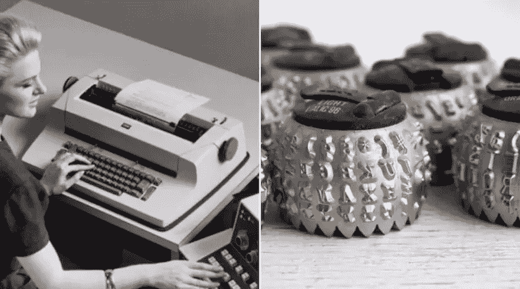

图片来自 etsy.com IBM.com

传统的打字机使用一篮子打字杆，当相应的键被按下时，打字杆就会敲击书页。他们经常卡壳。

然后，在 1961 年，IBM 推出了电动打字机，取而代之的是一个高尔夫球形状的打印头，如右上方所示，它可以根据用户的输入将合适的字符转换到合适的位置。它很少卡住，更重要的是，打印头可以很容易地切换到改变字体(包括，比如说，粗体或斜体)。

第一次，一个打字员可以在一份文件中使用多种字体。对这种灵活性的需求——以及更多——为我们现在使用的桌面出版界面铺平了道路。

#### 雏菊轮印花

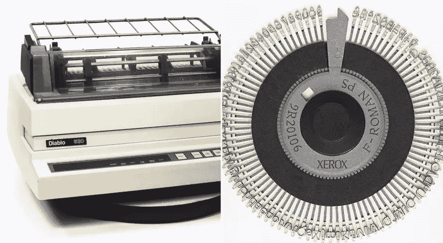

图片来自 wikipedia.org recycledgoods.com

乍一看，daisywheel 打印机(以主要部件的花状形状命名)似乎是电动打印机的一个微小创新。他们用一个带有径向辐条的圆盘取代了球形打字头(见右上方)，这样更轻更有效，从而将打字速度提高了两到三倍。

但事实上，改善更为显著。首先，daisyhead 机制首次允许在个人打字机中使用比例字体，即不同的字符根据其形状占据不同的水平空间。

另一方面，这种方法的效率如此之高，以至于整个计算世界都采用了它。在图形用户界面出现之前，一些计算机会使用 daisywheel 打印机创建打印输出。在 20 世纪 70 年代末引入激光和点阵打印后，daisywheel 仍然是主要的打印机机制，因为它相对便宜。甚至在它的时代过去之后，像苹果 Laserwriter 这样的里程碑式的数字设备模仿了它的命令集。

#### 照相排版

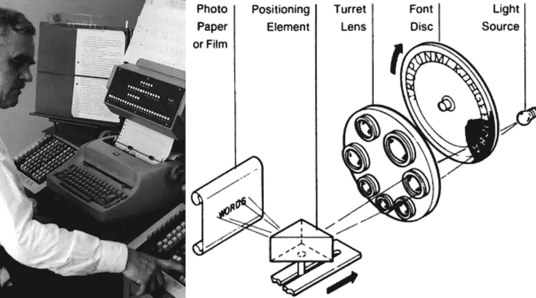

图片来自 tipgrafos.net multimediaman.wordpress.com

在大规模生产印刷机领域，主要的创新是照相排版，由马萨诸塞州剑桥的光子公司于 1949 年首次推出。这种方法用光的缥缈物质代替铅型模具或“slugs”。

这就是它的工作原理。操作员通过一个带有字符切口的“字体盘”投射光线。然后，操作员选择一个放大镜来确定投影字符的大小。最后，投影落在感光相纸或胶片上，像变魔术一样，打出的字出现了。这种薄膜可以反过来用于创建一个胶印模具，它可以油墨和复制一次又一次。

#### 数码机器

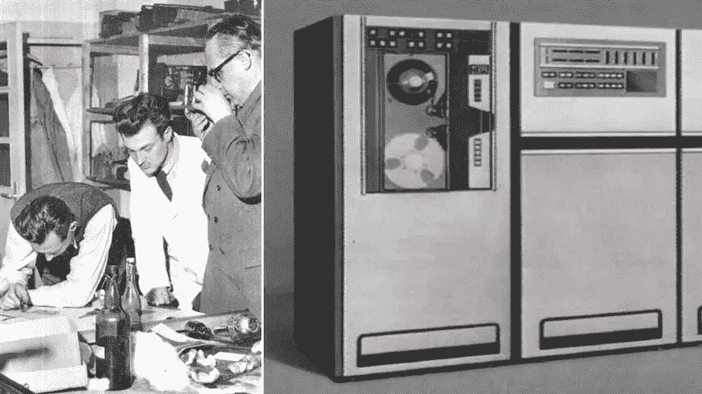

图片来自 willoid.com nonstopsystems.com

最终，照相排版就像古腾堡时代的老式印刷机一样“模拟”。唯一不同的是，木头或铅模具被相对高科技的轻型和化学处理过的纸张所取代。

然而，数码机器是一种不同的动物。20 世纪 60 年代中期，德国印刷商鲁道夫·赫尔(Rudolf Hell)发明了 Digiset，它仍然可以将光线投射到相纸上，但它是通过阴极射线管(CRT)来实现的，这与电视使用的技术相同。

最大的不同是，在这种情况下，光线不是通过物理角色的切口投射的。相反，光线被分布到微小的点上——相当于像素——这些点被投射成所选字母的形状，这种形状是使用网格形成的，这种网格后来被称为位图格式。换句话说，它是数字化的。

更重要的是，CRT 有一个编辑终端，可以很容易地返回并纠正错误。由于信息是数字化的，一旦出现，文件甚至可以保存在软盘上。因此，Digiset 机器是个人电脑桌面出版程序的先驱。它只是大得多。

### 字体数字化

印刷技术的进步需要印刷术实践中的补充变化。为了努力适应新机器的要求，像阿德里安·弗鲁提格这样的印刷工创造了现代数字字体的前身。

#### 宇宙

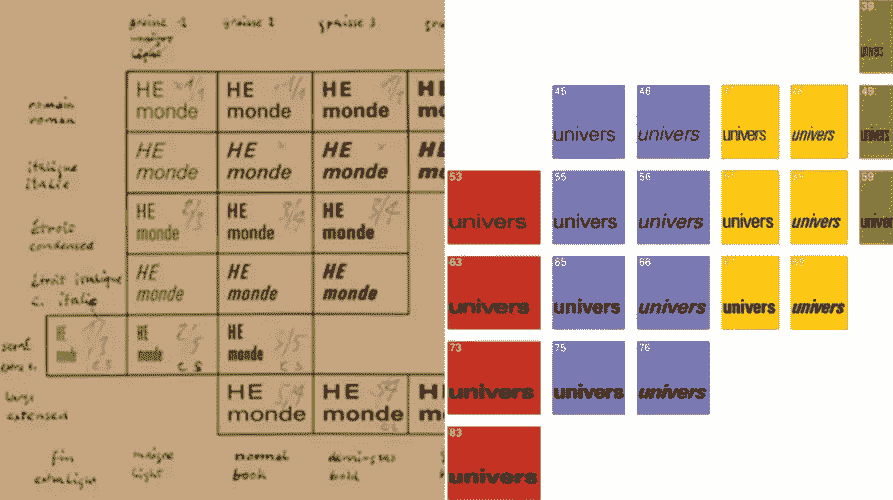

图片来自 multimediaman.wordpress.com

尽管照相排版有很多优点，但它也有缺点。投射的光线永远不会像硬成型的字母模具那样清晰，因此制造商呼吁世界上最好的印刷工人创造出更仔细区分字母的字体。

最著名的例子之一是瑞士印刷工阿德里安·弗鲁提格的《宇宙》。创建于 20 世纪 50 年代中期的 Univers 的目标是取代 Futura，成为照相排字机的无衬线字体。对 Frutiger 来说，这个结果是需要的产物，而不是艺术的产物:

“这些字体(我重新绘制)没有任何历史价值……想想我为了在 Lumitype 上看到好的结果而不得不产生的那种畸变！v 和 W 需要巨大的分叉来保持开放。为了防止圆角，我几乎不得不引入衬线——草稿不是无衬线的，而是一堆畸形的香肠！”

然而，大约三十年后，Univers 最终变得更加:一个数字类型的新兴世界的模型。证明其突出地位的事实是，直到 2003 年，Univers Condensed 一直是苹果 MAC 电脑的键盘字体。Frutiger 可能不高兴。

#### Digi Grotesk

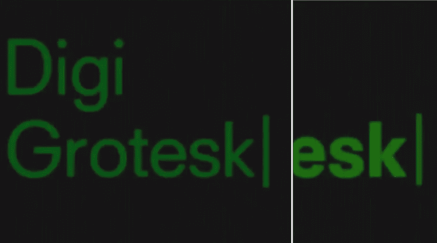

图片来自 buzzfeed.com

第一个真正的数字字体来自鲁道夫·赫尔的工作室。他的基于 CRT 的 Digiset 机器要求使用网格上的光点设计数字字体，即位图格式，这样看起来仍然很好。结果是 Digi Grotesk (grotesk 的意思是无衬线),以正常和粗体形式显示在上面。

考虑到它的先锋地位，Digi Grotesk 看起来很棒。比 80 年代出现的块状位图字体好多了。这种差异的原因是后来的位图必须处理早期 PC 显示器的极低分辨率。地狱的巨大数码机器是比较高的分辨率。

#### 光学字符识别

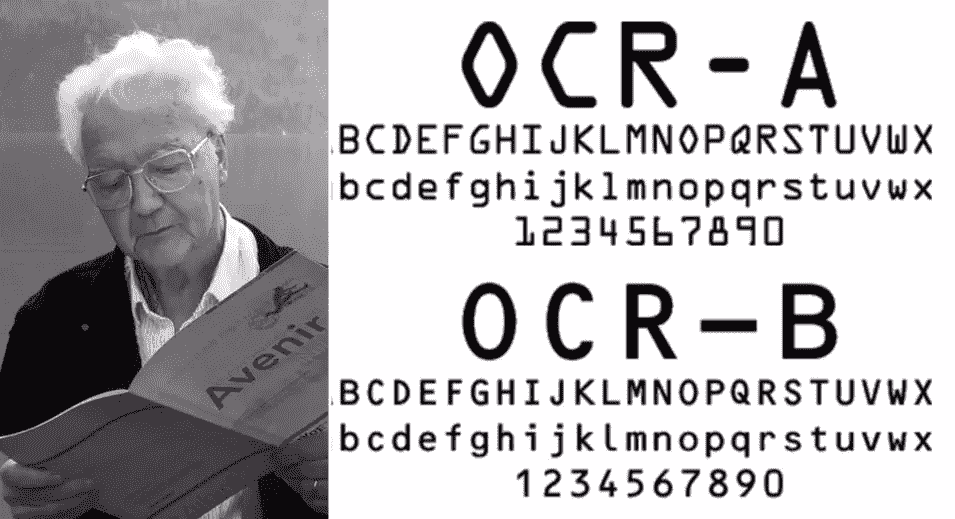

图片来自 multimediaman.wordpress.com fontshop.com

数字印刷术的另一个关键时刻是在 20 世纪 60 年代末和 70 年代初改进 OCR(光学字符识别)的运动。

OCR 是机器(如计算机)识别印刷字符并将其转换为可存储的数字信息的机制。这种信息处理能力对于像银行业和政府机构这样的行业非常重要。

在原始计算机时代，OCR 需要一种字体，其中每个字母都完全不同于其他字母，这样计算机就不会出现任何错误，同时仍然可以被人眼识别为传统的字母。最初的成果是 OCR-A，这是 1968 年 23 个美国铅字铸造厂的联合项目。你可能认识这种字体，因为它有时还会出现在国际标准书号(ISBNs)和护照上。

然而，欧洲人对美国的解决方案并不感到兴奋，所以在 20 世纪 70 年代，他们雇佣 Frutiger(见左上图)来设计更新。最终的字体 OCR-B 仍然符合机器识别的要求，同时更接近人类的审美标准。

### 个人电脑来了

到了 20 世纪 80 年代中期，个人电脑清楚地表明自己将成为下一件大事。这意味着更多的人每天与数字界面互动，以及随之而来的所有排版问题。解决方案不仅需要计算机硬件和软件的革命，也需要打印机的革命。

#### 附笔

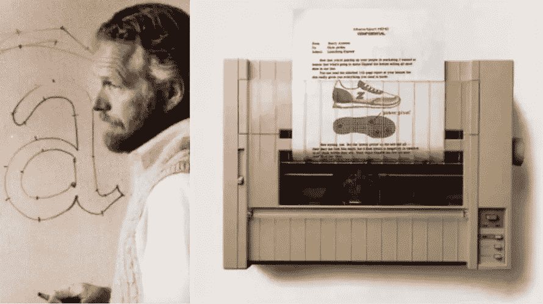

图片来自 macworld.com carlosicaza.com

1983 年，苹果发布了第一台带有图形用户界面的电脑 Lisa，赢得了全世界图形设计爱好者的支持。唯一的问题是，你对自己设计的东西无能为力，因为不存在将如此复杂的信息传输到印刷页面的技术。文本输出是可读的，但远远达不到专业质量的水平。还有图像？别提了。

与此同时，一对名叫约翰·沃诺克(上图左)和查尔斯·格施克的夫妇放弃了他们在施乐公司的工作，成立了一家新公司，他们以加利福尼亚州洛斯阿尔托斯他们房子后面的一条小溪命名:Adobe。

沃诺克的重大发明是 PostScript，这是一种页面描述语言，它完全满足了苹果的需求:它将数字显示的字体信息转换为打印平滑的矢量曲线输出的字体信息。结果，在 300dpi，被宣传为“排版质量。”

尤其是在推出了 LaserWriter(见右上图)这款苹果第一款像样的打印机之后，苹果开始涉足平面设计业务。

#### PageMaker

图片来自 arkivum.com mac-history.net

第三个必要的组成部分是更好的屏幕设计软件。进入 Aldus，一家后来被 Adobe 收购的公司，和它的程序 PageMaker，有史以来第一个桌面出版程序。

#### 真实类型与开放类型

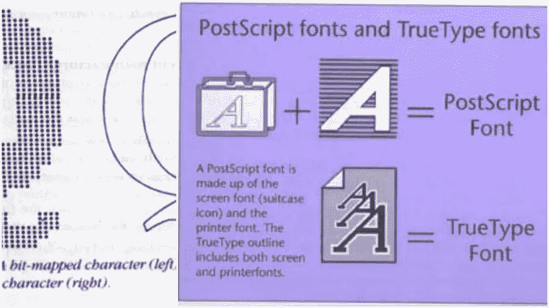

经由 mmlab2.rlc.dcccd.edu 的图像

Adobe 提出将 PostScript 集成到苹果和微软的操作系统中，但价格不菲。作为回应，这些计算机公司拒绝了，并联合起来创建他们自己的字体和页面描述软件。

结果是 True Type(。ttf，或“真实类型风格”格式)，一种可扩展的、基于矢量的字体技术。它将以前的两个字体文件，一个用于计算机显示，一个用于打印输出，合并成一个。

不幸的是，很少有代工厂愿意发布他们数字字体的 TrueType 版本，因为 Adobe 的软件是更值得信赖的实体。因此，许多投放市场的 TrueType 字体都是自制的、业余的，损害了软件的可信度。

1996 年，Adobe 和微软宣布将联合开发一种融合 PostScript 和 TrueType 的新字体格式，震惊了业界。这种格式被称为 OpenType(。otf 或“开放式风味”格式)。2007 年，几乎 90%售出的字体都是 OpenType 字体。

### 今天的字体形成了

有了必要的打印机硬件和图形用户界面软件，印刷工人就有了设计吸引人和可读的计算机字体的重任。

#### 罗伯特·帕拉迪诺神父

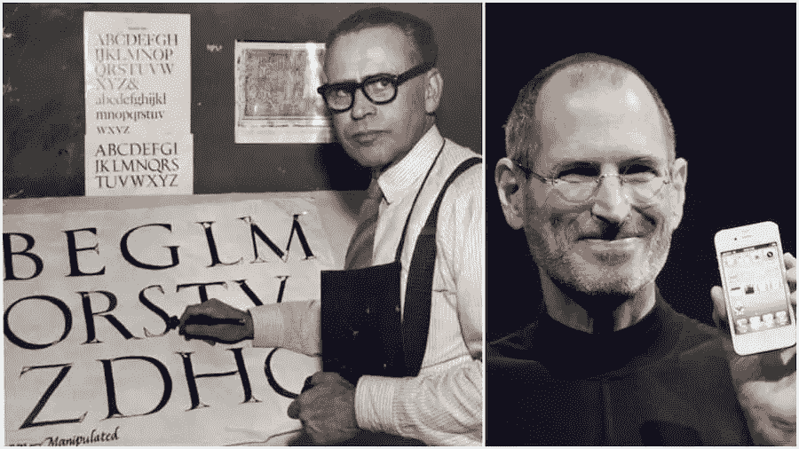

图片来自 wikipedia.org appelmo.com

听起来不可思议，史蒂夫·乔布斯可能将苹果的成功归功于一位特拉普派僧侣书法家，罗伯特·帕拉迪诺神父，他在俄勒冈州里德学院学习的一年中遇见了他。

据乔布斯说，帕拉迪诺在校园书法工作室的工作教会了他一些关于美学和设计重要性的宝贵经验——这些元素被认为是苹果超越个人电脑的优势。2005 年，乔布斯告诉斯坦福大学的一群学生，他从帕拉迪诺神父那里获得了什么:

“我学习了衬线字体和无衬线字体，学习了不同字母组合之间的间距变化，学习了什么让伟大的排版变得伟大。这是一种科学无法捕捉的美丽、历史和艺术上的微妙，我觉得它很迷人。”

六年后，当乔布斯开始开发苹果丽莎时，他列出了一些核心要求:它必须有大量的字体，而且字体必须成比例。我们与早期计算联系在一起的等宽的旧机器将成为过去。

#### 苏珊·卡尔

图片来自 wikipedia.org blogs.plos.org

为了实现他的美学梦想，乔布斯雇佣了艺术史学家和设计师苏珊·卡雷。除了为苹果图形用户界面设计最初的图标套件，Kare 还设计了一系列以著名城市命名的按比例间隔的位图字体。

这些字体应该反映出与他们同名的城市的特征。因此，芝加哥是大而大胆的，而日内瓦近似于瑞士的印刷风格。

当然，随着 Adobe 更平滑、基于矢量的数字字体的出现，Kare 的工作将变得毫无意义。因此，我们更熟悉的不是“芝加哥”、“日内瓦”和“洛杉矶”，而是最初 PostScript 程序附带的字体:Courier、Helvetica、Times 和 Symbol。

#### 无数的

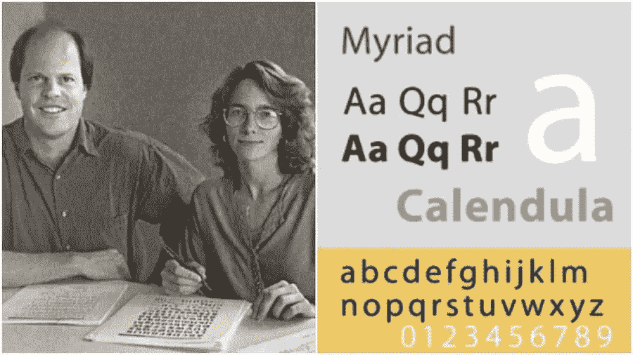

图片来自 use-my-warez.net typedesignersatwork.tumblr.com

Robert Slimach 和 Carol Twombly(左上)在 1992 年为 Adobe Systems 设计了 Myriad，这是一种无衬线字体，以其“y”的不同寻常的下行字母而闻名。这绝对是 Frutiger 传统中的一种字体，可以在数字环境中阅读，尽管 Frutiger 本人显然对此有复杂的感觉，据报道，他说这种字体“做得还不错”，但“有点太过了”

在 90 年代，Myriad 似乎是一个默默无闻的怪人。今天，它是地球上最著名的数字字体之一。为什么？因为苹果在 2002 年将其作为公司字体，取代了苹果 Garamond。

#### 韦尔达纳

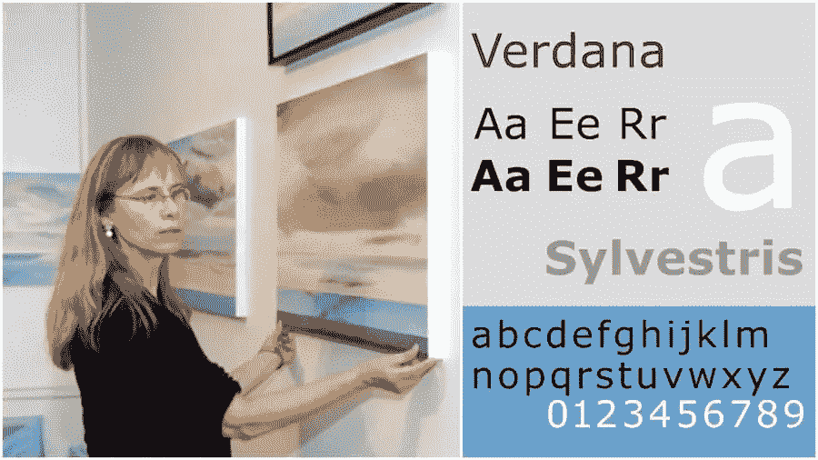

图片来自 wikipedia.org thepugetnews.com

自 1985 年以来，弗吉尼亚·豪利特一直是微软的首席设计师之一，她也意识到需要一种 Frutiger 风格的字体，因此在 1996 年，她委托马修·卡特设计 Verdana 字体。这个名字是单词“verdant”和“Ana”的混合，是豪利特女儿的名字。

Verdana 以其高 x 高度(小写字母的长度)、宽比例和宽松的字母间距而闻名，所有这些结合在一起，使其易于在 1996 年普遍使用的相对较低分辨率的显示器上阅读。

然而，在今天的视网膜屏幕世界中，这种设计的价值已经受到质疑。事实上，人们甚至可以得出这样的结论:始于 20 世纪 50 年代照相排版并持续到 21 世纪初的数字字体实验时代已经结束。现在，几乎任何字体都可以作为“数字字体”一个实验的新时代可以开始了。

你认为数字字体的里程碑是什么？分享在评论里！

## 分享这篇文章