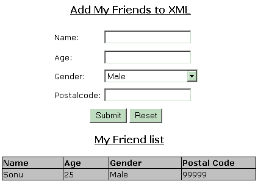
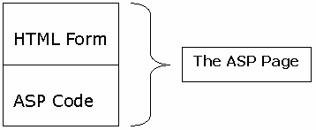

# 使用 ASP 和 XML/XSL 存储和显示数据

> 原文：<https://www.sitepoint.com/display-data-asp-xmlxsl/>

如果使用应用程序，存储和显示数据是一项基本任务。无论您使用的是桌面应用程序还是 Web 应用程序，保存和显示过程几乎总是必需的。

在本文中，我将展示如何轻松地使用 ASP 表单向 XML 文件添加数据，如何检索这些数据，以及如何在格式良好的表格中显示这些数据。

我们将创建一个示例 ASP 页面，用户可以在其中输入自己的姓名、年龄、性别和邮政编码。这些数据将存储在 XML 文件中，并使用 XSL 显示。示例 ASP 页面和生成的表如下所示:



有些程序员喜欢混合他们的 asp 和 html 代码，但我不推荐这样做。我总是发现尽可能将 ASP 页面分成两部分是很有帮助的，我建议你也这样做。

下面是我的 ASP 页面的结构:



第一部分包含一个简单的表单，第二部分包含为我们保存的 ASP 代码。为了更好的理解，让我们从看表格开始。

##### 表单

你可以用你喜欢的任何控件创建一个简单的窗体。除了您包括的控件，我们还需要一个提交按钮和一个重置按钮。

在本例中，我创建了一个名为 frmPerson 的简单表单，它包含三个文本字段和一个下拉字段。我们将使用 post 方法来处理输入到该表单中的数据。

```
<form action="VerifyPerson.asp" method="post" name="frmPerson"  

id="frmPerson"> 

<INPUT name=Name> 

<INPUT name=Age> 

<SELECT style="WIDTH: 154px" name=Gender> 

  <OPTION value=Male selected>Male</OPTION> 

  <OPTION value=Female>Female</OPTION> 

</SELECT> 

<INPUT name=Postalcode> 

<INPUT type=submit value=Submit name=submit><INPUT type=reset value=Reset  

name=reset> 

</form>
```

给每个保存数据的标签取一个变量名是非常重要的。例如，名称文本字段`<INPUT name=Name>`包含变量`Name`。为了从表单中检索数据，我们将在下一个 ASP 段落中使用这个变量和其他变量。为了熟悉 ASP 和 XML，我建议您下载示例并仔细阅读。

好了，这是 ASP 页面的第一部分。第二部分会更简单！

##### ASP 代码

现在，我将用 7 个简单的步骤向您展示如何从表单中检索数据，并将数据保存到 XML 文件中。

**1。**第一步当然是检查用户是否按下了提交按钮！为此，我们将使用 JScript 函数`count`。

```
var submit = Request.Form("submit").Count; 

if( submit > 0 ){ 

  // The user has pressed the submit button 

  // So the code to save the data will take place here. 

} 

else { 

  // We could also place our form in this part of code, which  

must be written in Jscript, though this isn't recommended. 

}
```

**2。**现在我们需要从表单中检索数据，并将其存储在适当的变量中。为了检索数据，我们将使用`Request.Form("variable_name");` 函数。

因此，让我们创建 4 个变量，并检索所需的数据:

```
var name = Request.Form("Name"); 

var age = Request.Form("Age"); 

var gender = Request.Form("Gender"); 

var pcode = Request.Form("PostalCode");
```

**3。**第三步是检查用户是否在表单中输入了任何数据。为此，我们只需检查步骤 2 中的变量是否为空。

```
var error = ""; 

if ( name == "" ) 

  error = "Name "; 

if ( age == "" ) 

  error += "Age "; 

if ( pcode == "") 

  error += "PostalCode ";
```

**4。**在步骤 3 中，我们将结果保存在`var error`中。现在我们需要检查“`error`”是否包含任何数据。如果是这样，那么我们知道我们发现了一个错误，我们将这样显示它。如果 error 为空，那么我们将继续保存过程。

```
if(error!=""){ 

  //We have found an error, so display this to the user! 

  Response.Write("Please enter the following data:<br>"); 

  Response.Write(<b>); 

  Response.Write(error); 

  Response.Write("</b>"); 

} 

else{ 

  //Everything is fine, so let's start to save the data. 

}
```

**5。**现在我们已经执行了必要的检查，我们可以保存数据了。

为此，我们将 Person.xml 文件加载到一个 xml 文档中。然后，我们将使用函数`xmlDoc.getElementsByTagName`加载当前节点列表以获取当前根节点。

完成后，我们需要创建所需的节点。这可以通过功能`xmlDoc.createElement("AnyNodeName")`来实现。最后，我们需要将输入表单的数据保存到适当的 XML 变量中。以下是您需要的代码:

```
. 

. 

. 

else{ 

  // Load the required xml file 

  var xmlDoc=Server.CreateObject("MICROSOFT.FreeThreadedXMLDOM"); 

  xmlDoc.async="false"; 

  xmlDoc.load(Server.MapPath("Person.xml")); 

  // Get the current root  

  var nodeList = xmlDoc.getElementsByTagName("PersonList"); 

  if(nodeList.length > 0){ 

    var parentNode = nodeList(0) ; 

    // Create the required nodes 

    var personNode = xmlDoc.createElement("Person"); 

    var nameNode = xmlDoc.createElement("Name"); 

    var ageNode = xmlDoc.createElement("Age"); 

    var genderNode = xmlDoc.createElement("Gender"); 

    var pcodeNode = xmlDoc.createElement("PostalCode"); 

    // Assign the variables, which we have retrieved in  

    step 2 to the xml variables 

    nameNode.text = name; 

    ageNode.text = age; 

    genderNode.text= gender; 

    pcodeNode.text = pcode; 

    . 

    . 

    .
```

**6。**向左两步！首先，我们将把创建的节点附加到父节点。这可以通过功能`parentNode.appendChild("personNode");`来完成

```
 .  

    .  

    .  

    parentNode.appendChild(personNode);  

    personNode.appendChild(nameNode);  

    personNode.appendChild(ageNode);  

    personNode.appendChild(genderNode);  

    personNode.appendChild(pcodeNode);  

    .  

    .  

    .
```

**7。**最后，我们将使用函数`xmlDoc.save(Server.MapPath("Person.xml"));`将节点保存到 XML 文件中

```
 // 7) Now save the nodes to the file  

    xmlDoc.save(Server.MapPath("Person.xml")); 
```

##### 使用 XSL 显示数据

到目前为止，我们已经看到了如何保存站点用户通过表单提交的数据。但是我们如何展示它呢？我们将使用 ASP 和 XSL 来显示数据。

我们需要做的第一件事是加载 XML 文件，这可以通过 XML 解析器轻松实现。微软的 XML 解析器可用于 Internet Explorer 5.0。

在将 XML 文件加载到 document 对象中之后，可以在 DOM 对象的帮助下检索 XML 数据。首先，我们必须加载 XSL 文件:

```
 // This part is used to display the data   

      var objXMLDoc = Server.CreateObject("MICROSOFT.FreeThreadedXMLDOM");  

      objXMLDoc.async = false;  

      objXMLDoc.load(Server.MapPath("person.xml"));  

      var xsl=Server.CreateObject("MICROSOFT.FreeThreadedXMLDOM");  

      xsl.async = false;  

      xsl.load(Server.MapPath("person.xsl"));
```

现在我们已经加载了两个文件，每个文件都有自己的 DOM 对象。接下来，我们需要创建一个查询来为我们选择节点。当然，我们可以选择特定的节点，但是现在，我们只选择根节点，在这种情况下，所有其他节点都将被自动选择。

```
 var xmlQuery="//Person";  

        var docHeadlines=objXMLDoc.documentElement.selectNodes(xmlQuery);
```

接下来，我们只需要遍历节点来显示每个存储的条目。

```
 var numNodes;  

numNodes=docHeadlines.length;  

        var nn;  

        for(var i=0;i<numNodes;i++){  

          nn = docHeadlines.nextNode();  

          Response.Write(nn.transformNode(xsl));  

        }
```

现在您知道了如何将 XSL 文件加载到 DOM 对象中。但是 XSL 文件看起来像什么呢？XSL 还能为你做什么？

XSL 是一种将 XML 转换成 HTML 的语言。当然，您也可以使用简单的 HTML 和 ASP 来显示数据，但是为了使 Web 表单具有专业的外观和更好的结构，您需要使用 XSL。

然而，XSL 可以为您提供比我们在这里探索的更多的东西。例如，它可以提供排序和过滤等功能。在一个简单的 ASP 站点中，您还可以使用 XSL 来处理变量和条件，以及循环。当然，我不能在本文中涵盖所有这些，但是您应该知道 XSL 必须提供什么。

现在，这是我们构建的 XSL 文件:

```
 <xsl:stylesheet xmlns:xsl="https://www.w3.org/1999/XSL  

/Transform" version="1.0">  

      <xsl:template match="Person">   

      <tr>  

      <td><font face="verdana" size="2">  

<xsl:value-of select="Name"/></font></td>  

      <td><font face="verdana" size="2">  

<xsl:value-of select="Age"/></font></td>  

      <td><font face="verdana" size="2">  

<xsl:value-of select="Gender"/></font></td>  

      <td><font face="verdana" size="2">  

<xsl:value-of select="PostalCode"/></font></td>  

      </tr>  

    </xsl:template>  

  </xsl:stylesheet>
```

在第一行，我们使用 `<xsl:stylesheet>`元素告诉文档这是一个 XSL 样式表。然后，我们使用`<xsl:template match="Person">` 告诉 XSL 它必须从 XML 文件的哪个元素开始

我们选择了`Person`元素，因为这是最重要的。下面的所有数据将被自动选择。

最后，为了显示 XML 元素的值，我们简单地实现了`<xsl:value-of-select="element name"/>`标签，它检索元素的值。

##### 结论

就是这样！现在你已经创建了一个功能齐全的系统，可以保存、读取和显示表单中的数据。你已经了解了 ASP，XML 和 XSL 的优势。再多练一点，建议你修改一下 ASP 页面，创建自己的通讯录。

[下载本教程使用的示例文件](https://www.sitepoint.com/examples/aspandxml/Example.zip)，编程愉快！

## 分享这篇文章