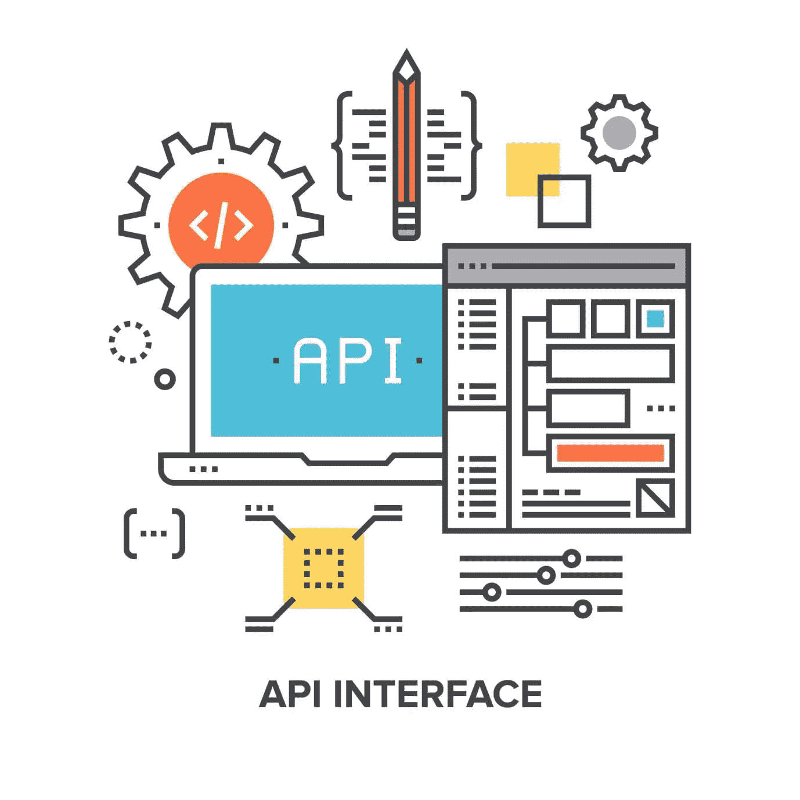
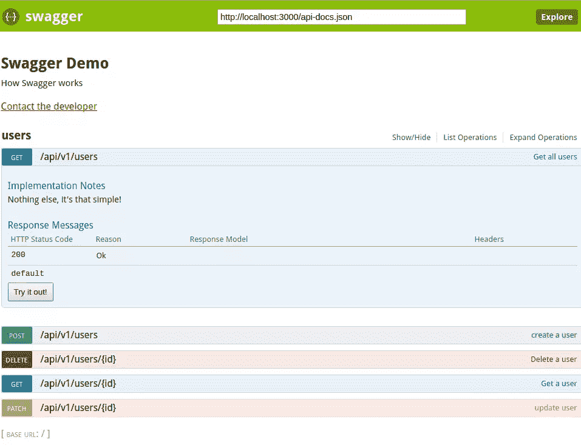
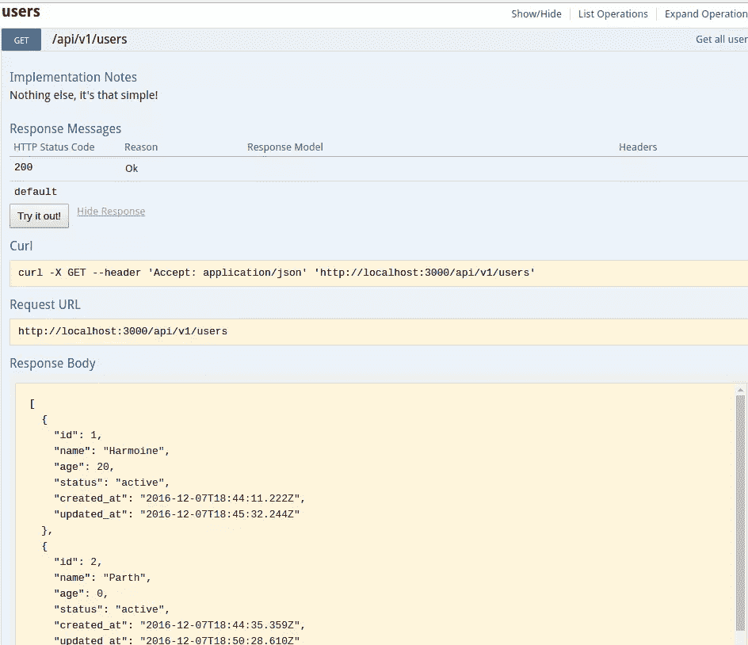

# 做正确的事情，用 Swagger 记录你的 Rails API

> 原文：<https://www.sitepoint.com/do-the-right-thing-and-document-your-rails-api-with-swagger/>



你可能花了大部分编程时间试图让你的代码更好、更快或更高效，不是吗？但是，你花了多少时间来记录你的代码呢？不是很多，如果你像我们大多数人一样，但是文档不是那么重要，对吗？

也许，如果你正在做一个小项目，而你的团队只有一个成员，那就是你。但即使那样，你也不会永远维持你的那个小项目。如果有一天，有人走进来，试图了解它是如何工作的，以便实现另一个功能或修复一个错误，这可能需要更长的时间才能开始。此外，我们都知道当我们遇到一个庞大的、无文档记录的代码库并试图修复一个 bug 时那种失落的感觉。“代码作为文档”并不总是(或者永远不会？)工作。

对于 API 来说，这要重要得多，因为您正在开发的系统将被其他人通过您公开的端点使用。考虑一个场景，当您必须为一个业务问题设计一个后端解决方案时，它将被一个前端或移动团队使用。每当一个 API 被改变或实现时，共享 Postman 集合是不方便的。这样会拖慢开发节奏，造成不必要的摩擦。幸运的是，我们有很多工具可以实现文档，而不必编写大量代码和示例响应。

今天，我将通过 Swagger 向您介绍使用文档创建 API 的过程。Swagger 有两个部分:swagger-docs，它为您的 API 生成文档；swagger-ui，它使用由 swagger-docs 生成的 JSON 来构建一个用于消费这些 API 并与之交互的 UI。

## 我们的 JSON API

我们将使用 Rails 通过使用`--api`选项启动项目，这样我们可以从 API 所需的最小结构开始:

```
rails new swagger-demo --api 
```

用`name`、`age`和`status`字段创建一个用户模型:

```
rails generate model User name age:integer status:integer 
```

`status`字段将被定义为一个枚举:

```
# models/user.rb
model User < ApplicationRecord
  enum status: [:active, :inactive]
end 
```

使用`scaffold_controller`生成器创建一个具有基本 CRUD 操作的用户控制器:

```
rails generate scaffold_controller api/v1/users 
```

好了，我们的 CRUD 动作的基本结构已经准备好了。让我们添加一些文档:

## 使用 swagger-docs 设置文档

为了生成文档，我们将使用 swagger–docs gem。这个 gem 将帮助我们创建可以提供给 swagger-ui 的 JSON 文件。

### 装置

在 gem 文件中:

```
gem 'swagger-docs' 
```

然后，

```
bundle install 
```

### 配置

接下来，在**配置/初始化器**目录中添加一个名为 **swagger_docs.rb** 的初始化器。下面是一个基本配置，供您开始使用:

```
# config/initializers/swagger-docs.rb
Swagger::Docs::Config.register_apis({
  "1.0" => {
    # location where our api doc files will be generated, as of now we will store files under public directory
    :api_file_path => "public/",
    # base path url of our application
    # while using production mode, point it to production url
    :base_path => "http://localhost:3000",
    # setting this option true tells swagger to clean all files generated in api_file_path directory before any files are generated
    :clean_directory => true,
    # As we are using Rails-API, our ApplicationController inherits ActionController::API instead of ActionController::Base
    # Hence, we need to add ActionController::API instead of default ActionController::Base
    :base_api_controller => ActionController::API,
    # parent_controller needs to be specified if API controllers are inheriting some other controller than ApplicationController
    # :parent_controller => ApplicationController,
    :attributes => {
      :info => {
        "title" => "Swagger Demo",
        "description" => "How Swagger works",
        "contact" => "parthmodi54@yahoo.com",
        "license" => "Apache 2.0",
        "licenseUrl" => "http://www.apache.org/licenses/LICENSE-2.0.html"
      }
    }
  }
}) 
```

有关可用选项的更多信息，请参见文档的 [swagger-docs 配置选项](https://github.com/richhollis/swagger-docs#configuration-options)部分。

### 记录用户控制器 API

swagger-docs 提供了自己的 DSL 来记录 API。下面一行向 swagger-docs 注册了`UsersController`:

```
swagger_controller :users, "User Management" 
```

接下来，我们需要为控制器中的每个动作添加文档。我们可以指定必需的和可选的参数、参数类型(如字符串、整数、枚举)以及我们需要这些参数的方式(以表单数据、正文或多部分表单数据等形式)。)

请看下面显示的`UsersController`的`create`动作的示例代码:

```
class Api::V1::UsersController < ApplicationController
  .....
  # POST /users
  swagger_api :create do
    summary "To create user"
    notes "Implementation notes, such as required params, example queries for apis are written here."
    param :form, "user[name]", :string, :required, "Name of user"
    param :form, "user[age]", :integer, :optional, "Age of user"
    param_list :form, "user[status]", :string, :required, "Status of user, can be active or inactive"
    response :success
    response :unprocessable_entity
    response :500, "Internal Error"
  end
  def create
    @user = User.new(user_params)
    if @user.save
      render json: @user, status: :created
    else
      render json: @user.errors, status: :unprocessable_entity
    end
  end
  .....
end 
```

`swagger_api`用于指定 API 名称和描述。`param`指定参数名称、类型和描述。我们使用嵌套在用户散列中的参数，因此我们使用`user[name]`。

`response`列出 API 生成的响应代码和类型。提到 API 可能产生的所有可能的响应代码是一个很好的做法。

其他 CRUD 操作以类似的方式记录。对于基本的 CRUD 来说，这可能已经足够了，但是要更深入地了解一些有趣的事情，比如干涸的文档，请前往 [swagger-docs docs](https://github.com/richhollis/swagger-docs#drying-up-common-documentation) 。

### 生成和查看文档

以下 Rake 任务将为已配置的控制器/动作生成文档:

```
rake swagger:docs 
```

这将在初始化器的 API_FILE_PATH 选项中指定的路径下生成文档文件。如果一切顺利，您将会看到在 **public/** 目录中生成的几个文件，特别是在 **public/api/v1/** 中。如果没有生成文件，请运行以下命令查看更详细的控制台输出，并调试发生的情况:

```
SD_LOG_LEVEL=1 rake swagger:docs 
```

**注意:**如果你得到错误`undefined method "swagger_controller" for API::V1::UsersController::Class`，那么你需要显式设置`base_api_controller`选项，如下所示:

```
# config/initializers/swagger-docs.rb
Swagger::Docs::Config.base_api_controller = ActionController::API 
```

这个在这里[详细解释。](https://github.com/richhollis/swagger-docs#inheriting-from-a-custom-api-controller)

太好了！现在我们已经准备好了文档。转到浏览器并键入 localhost:3000/api-docs.json 来检查生成的 json 文件。现在我们可以设置 swagger-ui 来使用这些文档。

## 设置 Swagger-UI

swagger-ui 是一个构建在 HTML、CSS 和 JS 中的独立结构，它提供了一个漂亮的用户界面，可以用来与我们的 API 交互和玩耍。好的方面是 UI 是用我们提供的 JSON 文件动态生成的。

### 装置

按照以下步骤安装 swagger-uia:

*   去 [swagger-ui repo](https://github.com/swagger-api/swagger-ui) 和[克隆它](https://github.com/swagger-api/swagger-ui.git)或者[下载一个版本](https://github.com/swagger-api/swagger-ui/archive/master.zip)。

*   将 **dist** 目录的内容与【index.html】的**一起放入您在`api_file_path`选项中指定的路径中。根据我们的配置，它是 **public/** 目录。在这里你可以找到 **api-docs.json** 。如果您已经将`api_file_path`更改到其他位置，那么您将需要相应地放置文件。只要记住将**index.html**和 **api-docs.json** 放在同一个目录中。**

*   在**index.html**中，将 url 改为指向 **api-docs.json** 文件:

```
// get the url from search bar
var url = window.location.search.match(/url=([^&]+)/);
if (url && url.length > 1) {
  url = decodeURIComponent(url[1]);
} else {
  // point to api-docs.json to read API documentation
  url = "/api-docs.json";
} 
```

一切就绪！键入 http://localhost:3000/index . html 并查看运行中的代码。



点击*试用*按钮将运行 API 操作并显示结果:



这是到示例项目库 [swagger-demo](https://github.com/8parth/swagger-demo) 的链接，其中记录了您遇到困难时的所有操作。

## 结论

我们实现了 swagger-docs 来记录我们的 API，使用 swagger-ui 从我们的文档中动态构建 ui。完成初始设置后，您只需在每次更改或实现 API 时运行`rake swagger:docs`, swagger-ui 就会为您生成这个 UI。

用这种方式记录你的 API 是正确的。它允许消费者快速理解你的 API 提供了什么，允许他们测试动作，并以最小的冲突开始编写他们的前端代码。

## 分享这篇文章