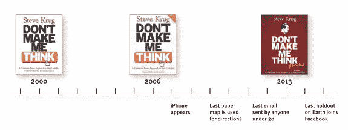

# 设计师必读:不要让我想重温

> 原文：<https://www.sitepoint.com/dont-make-think-revisited/>

Steve Krug

早在五月份，我[写了一篇关于史蒂夫·克鲁格的经典 UX 著作的评论](https://www.sitepoint.com/review-dont-make-me-think/ "Don't Make Me Think Review"),*不要让我思考*。

看完这篇评论后，史蒂夫好心地给我发来了更新版本，写于 2013 年底，正如标题中所提到的，它也涵盖了移动网络和应用程序 UX。如今，随着越来越多的人通过各种设备访问网络，移动设备对每个网页设计师来说都非常重要。这本书的第一版是在 2000 年写的，所以正如史蒂夫指出的，“世界已经改变了”，“技术已经掌握了一些类固醇”。

我们现在不仅可以在小得多的屏幕上访问网络，而且网络也在继续突飞猛进地发展，可用性本身已经成为主流，计算机的速度也显著提高。我可以继续说下去，例如，我们现在有了云，它允许我们能够存储文件，以便从任何位置访问。

时间表显示了《不要让我思考》的上映日期以及之后发生的事情。

虽然*不要让我认为*自首次发布以来在设计界一直非常受欢迎，但移动设备意味着是时候推出更新版本了。正如我在我的第一篇评论中提到的，这本书给出的建议是永恒的，但额外的信息将确保它在未来许多年仍然是最受欢迎的。

## 《别让我再想旧事重提》有什么新内容？

在很大程度上，在这本书的更新版本中，有一个主要的变化你会发现很有用，那就是增加了一章关于移动的内容:C **第 10 章——移动:它不再只是阿拉巴马州的一个城市**—*欢迎来到 21 世纪——你可能会有轻微的眩晕感*。

> 多年来，手机逐渐变得越来越智能，收集在书桌抽屉里，并在它们之间进行密谋。但是直到大跃进，他们才终于有了觉悟。

当然，他指的是 2007 年 6 月 iPhone 的推出，这与他在书中多次指出史蒂夫·乔布斯和乔纳森·伊夫对 UX 的影响有关。多亏了他们，它已经成为主流，现在，即使是商业人士也理解它的相关性，即使他们并没有真正理解这门学科本身。

随着更好的智能手机，移动网络和更快的处理能力出现了问题，首先是试图将网页压缩到一个小屏幕上的问题。苹果想出了能够捏和滚动以及一个伟大的浏览器界面的想法，但本质上是微型计算机快速响应请求的能力使它变得有用。

## 移动可用性

根据史蒂夫的说法，当谈到移动 UX 时，实际上与桌面没有太大区别。基本原则仍然存在，但有一些“重大差异”使得 UX 更具挑战性。他说，在某些方面，网页和应用程序设计仍处于“蛮荒的西部”阶段，我们还不太可能找到与之合作的最佳方式。谈到移动，首先要考虑的是:

> 这都是关于权衡

还有…

> 创建良好的移动可用性的大部分挑战归结为做出良好的权衡

因此，很可能用户将不得不点击更多次来获得他们想要的内容，因此，举例来说，移动网站将变得更深入。众所周知，与完整网站相比，移动网站的另一个问题是内容如何呈现。你会提供一个精简的版本，做一个独立的移动网站(在金钱和疯狂方面花费很大)还是致力于移动优先的精神？

当然，目前的趋势是创建一个使用响应式网页设计(RWD)的网站，但史蒂夫指出:

> 关于可扩展设计，我可以告诉你两件事(也叫动态布局、流体设计、适应性设计和响应性设计)，它们是:
> 
> *   这往往需要大量的工作
> *   做好这件事很难

尽管如此，作者相信这个问题会及时得到解决，尤其是因为它与商业网站的收入密切相关。然后他给出了一些建议，关于设计师可以做什么来克服可伸缩设计和 UX 的问题，包括可点击区域的问题，我们都已经看到许多网站犯了错误(并且还在继续)。

## 移动应用

当然，如果没有谈到移动应用，任何关于移动和 UX 的现代讨论都是不完整的。史蒂夫表示，像任何其他需要良好 UX 的项目一样，应用程序的关键很简单:

> 一个能力和经验一般(甚至低于平均水平)的人可以想出如何使用这个东西[即，它是*可学的* ]来完成某事*有效*，而不会带来比它的价值更大的麻烦*有效*。

如果要让应用程序有效并被用户所喜爱，它们需要具备所有这些要素。你不需要有一个逻辑学位就能找到一个应用程序，它应该是一个使用起来“令人愉快”的东西，应该是可学的，也应该是令人难忘的。

这一部分包含了一些很好的例子，并指出应用程序需要让用户投入尽可能少的时间来学习如何使用它们。这是因为，正如史蒂夫指出的，如果你对一个应用程序没有深刻的印象，不足以经常使用它，那么你就会放弃它，因为这是大多数应用程序的命运，UX 对他们的设计至关重要。

## 手机可用性测试

这 20 页章节的最后一部分讲述了手机可用性测试的逻辑。除了一些关于实现这一点的最佳方法的伟大建议(线索，不是通过观察用户的脸)，还有关于可能导致真正问题的问题的可操作的提示。

例如，本节将向您展示如何制作史蒂夫的概念验证“Brundlefly 相机”。我就把这个留在那里，不再告诉你更多的事情，我发现它很有趣，尽管我还没有尝试过做一个。

## 最后的想法

我是第一本书的忠实读者，我更是这本书的忠实读者。更新的版本解决了现在与读者相关的问题，很好地审视了移动和应用程序，这是迄今为止**而不是**增加的一次性章节，只是为了更新书籍和获得更多销售(尽管它毫无疑问会这样)。

风格也保留了下来，这无疑是这本书卖得这么好的原因之一——它很容易理解，而且 ***很有趣！***

就我个人而言，我把这本书放在办公室里，当谈到我写的关于 UX 的东西时，我会一遍又一遍地参考它，它可以直接提醒我主要的原则，并有助于启动进一步的研究。事实上，这是我办公室里最常用的纸质书，很少离开我的办公桌。

因此，如果你在寻找一本能帮助你在 UX 起步的好书，这绝对是值得推荐的。

## 分享这篇文章