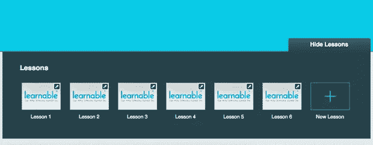

# 如何用 jQuery、HTML 和 CSS 构建一个课程抽屉

> 原文：<https://www.sitepoint.com/drawing-from-our-learning-how-to-build-a-lesson-drawer-in-jquery-html-and-css/>

本着展示如何在 [SitePoint](https://www.sitepoint.com) 的姐妹公司 [Learnable](http://www.learnable.com) 做事情的精神——一个任何人都可以创建关于任何事情的在线课程，然后出售该课程的访问权的新网站——我将带你浏览 Learnable 的学生视图的一个小组件:课程抽屉。我已经稍微简化了布局和样式，这样您就可以很容易地理解发生了什么，但是 JavaScript 是完全相同的。

在这篇文章中，我将介绍构建抽屉所需的 HTML(包括一些新的 HTML5 元素)、CSS 和 JavaScript(在 jQuery 的帮助下)。抽屉是一个大容器，里面有一个课程的课程列表，可以通过一个按钮打开。课程由可点击的缩略图表示。要查看我们将要构建的示例，请点击[这里](https://www.sitepoint.com/examples/learnablecodeexample/)。



## HTML:结构

```
<section class="clearfix" id="lessonBuilder">
  <span id="lessonsTabTarget"><a href="#">Show Lessons</a></span>
  <nav id="lessonsTab" style="display: none;">
    <h1>Lessons</h1>
    <ul class="clearfix">
      <li class="tab"><a href="#"></a></li>
      <li class="tab"><a href="#"></a></li>
      <li class="tab"><a href="#"></a></li>
      <li class="tab"><a href="#"></a></li>
    </ul>
  </nav>
</section>
```

如果你不熟悉 HTML5，你会看到我使用了一些对你来说是新的标签。`section`用于描述站点的各个部分，`nav`标签用于包含导航元素。HTML5 标签有助于减少“div-itis”；比如你可能有`<div id="section"></div>`和`<div id="nav"></div>`的地方。

除了新的标签，它基本上是标准的 HTML。无序列表将包含链接的缩略图。

## JavaScript:魔法

```
var LEARNABLE = {};
/**
  * Initialises the Lesson Drawer
  */
LEARNABLE.lessonDrawer = (function () {
    var init = function () {
        $("#lessonsTab").hide();
        $('#lessonsTabTarget').toggle(function() {
            $(this).addClass("shown").children('a').html("Hide Lesson Navigator");
            $("nav#lessonsTab").show("slow");
            return false;
        }, function() {
            $("nav#lessonsTab").hide("slow");
            $(this).removeClass("shown").children('a').html("Show Lesson Navigator");
            return false;
        });
    };

    // Public API
    return {
        init: init
    };
})();

$(document).ready(function() {
    LEARNABLE.lessonDrawer.init();
});
```

JavaScript 是它变得有趣的地方。我将一步一步地进行，一边解释，一边按照我写的方式构建它。

```
var LEARNABLE = {};
```

这将创建一个包含页面函数的对象。我们将其命名为`LEARNABLE`，因为它“命名”了您的函数。这种编写 JavaScript 的形式被称为[模块模式](http://yuiblog.com/blog/2007/06/12/module-pattern/)。这是一种构建 JavaScript 的好方法，原因有很多:

*   它减少了全局变量的数量，因为它们是邪恶的。
*   您可以轻松地让许多函数协同工作，而不会影响正在运行的其他脚本。
*   它的维护和工作相对简单。
*   参与该项目的其他开发人员将能够很容易地看到发生了什么。

```
var LEARNABLE = {};
/**
  * Initialises the Lesson Drawer
  */
LEARNABLE.lessonDrawer = (function () {
    var init = function () {

    ...

    };

    // Public API
    return {
        init: init
    };
})();
```

现在我们创建我们的函数。我把它命名为`lessonDrawer`，因为它是`LEARNABLE`代码库的一部分，所以它变成了`LEARNABLE.lessonDrawer`。

`LEARNABLE.lessonDrawer`是函数，所以写成 `= (function (){`，然后是代码，用`})();`结束。

以下是该函数的外部位:

```
LEARNABLE.lessonDrawer = (function () {

    ...

})();
```

数一下括号，你会发现末尾多了一组`()`。这意味着它是自动执行的；当您的浏览器下载了这个脚本后，它将运行它，允许脚本中的任何其他 JavaScript 函数访问它。嗯，算是吧。

```
 var init = function () {

    ...

    };

    // Public API
    return {
        init: init
    };
```

这个小技巧意味着在`lessonDrawer`函数中有更多的函数，在这个例子中称为`init`。棘手的部分是，在`lessonDrawer`函数的末尾，它将返回给你的脚本一个访问`init`函数的方法。你可能会问，这有什么大不了的？假设我们稍微改变了一下:

```
var LEARNABLE = {};
/**
  * Initialises the Lesson Drawer
  */
LEARNABLE.lessonDrawer = (function () {
    var init = function () {

    ...

    };
    var otherThing = function () {

    ...

    };

    // Public API
    return {
        init: init
    };
})();
```

因为我们已经明确说过我们只希望`init`函数可用，所以`lessonDrawer`之外的任何函数都不能使用名为`otherThing`的函数。它在父函数中是安全的。你不能意外地运行它，更重要的是，当你把它交给其他开发者时，他们只能按照你指定的方式使用它。

现在来看一下`init`函数的内部:

```
$("#lessonsTab").hide();
```

首先，我们隐藏了`#lessonsTab`，这是我们的`nav`容器。我们在这个函数中这样做，以便不使用 JavaScript 的用户仍然可以看到课程抽屉:

```
$('#lessonsTabTarget').toggle(function() {

    ....

}, function() {

    ....

});
```

[jQuery Toggle](http://api.jquery.com/toggle/) 方法显示或隐藏它被告知的元素。在`$('#lessonsTabTarget').toggle(function() {`和`});`之间的前半部分意味着当它被点击时，它将显示课程抽屉。

它的对应部分在`function() {`和关闭`});`之间，如果课程抽屉打开，它将隐藏该抽屉:

```
 $(this).addClass("shown").children('a').html("Hide Lesson Navigator");
    $("nav#lessonsTab").show("slow");
    return false;
```

这是*显示*课程抽屉的代码。我现在一行一行地解释给你听:

```
$(this).addClass("shown").children('a').html("Hide Lesson Navigator");
```

`$(this)`表示其父节点正在讨论的内容(在本例中，它是`$('#lessonsTabTarget')`)。我一直假设你知道`$('#lessonsTabTarget')`是什么意思，但是对于那些在家玩的人来说，它向 jQuery(用`$`表示)查询任何 ID 为`lessonsTabTarget`的元素。

我们将一个名为“`shown"`的类添加到`$(this)`中，然后在它的子类中寻找一个锚。回头看看我们正在使用的 HTML 结构，这是`<span id="lessonsTabTarget"><a href="#">Show Lessons</a></span>`，在子锚点上，我们将文本(或其 HTML)更改为下一个文本(“隐藏课程导航器”)，作为对用户的指示，如果他们单击按钮，他们将隐藏它)。

```
$("nav#lessonsTab").show("slow");
```

现在我们告诉它找到`nav#lessonsTab`，让它慢慢出现。 [jQuery Show](http://api.jquery.com/show/) 方法接受几个参数，第一个参数是您希望显示一个元素需要多长时间。代替`"slow"`，你可以使用`"fast"`或毫秒数，其中 1000 表示一秒(因为这是作为整数键入的，所以不需要引号，不像`"fast"`和`"slow"`)。

```
return false;
```

我们`return false`阻止浏览器跟随链接。(实际上，它不会去任何地方，但是`<a href="#"`会让页面跳转到顶部而不会返回 false)。

总结一下:

*   每当页面包含一个`#lessonsTabTarget`元素时，设置一个无阻碍的 JavaScript 函数。
*   添加一个类(告诉 CSS 它是“`shown`”)。
*   更改按钮文本。
*   打开课程标签抽屉。
*   阻止页面跟随该链接。

后半段正好相反！它会隐藏课程抽屉，移除“`shown`”类名，并将文本改回。它还会阻止浏览器跟踪该链接。另一方面，`return false`总是需要成为函数中的最后一项。

最后，我们需要运行代码。我们最后的任务是告诉文档，当它下载了所有的资源(JavaScript 和 CSS，以及图像)，或者当它准备好了，运行`init()`函数。要访问`init()`功能，你必须使用它的全名:`LEARNABLE.lessonDrawer.init();`。

```
$(document).ready(function() {
    LEARNABLE.lessonDrawer.init();
});
```

## CSS:波兰人

添加 CSS 是使它成为真正伟大的组件所需要的最后一点。

```
/* HTML5 tags */
header, section, footer, aside, nav, article, figure {
	display: block;
}

#lessonBuilder {
  min-height: 200px;
  width: 940px;
  margin: 0 auto;
  position: relative;
}

nav#lessonsTab {
  background-color: #26414A;
  width: 940px !important;
  margin: 0 auto;
  opacity: 1 !important;
  padding: 30px 0;
  z-index: 1;
  display: none;
}

nav#lessonsTab h1 {
  color: white;
  font-size: 18px;
  margin: 0 0 0 45px;
}

nav#lessonsTab ul {
  list-style: none;
  padding: 20px 0 0 45px;
  margin: 0;
}

nav#lessonsTab ul li {
  float: left;
  margin: 0 15px 40px 0;
  padding: 4px;
  height: 70px;
}

nav#lessonsTab ul li:hover {
  background-color: #C9EFFB;
}

nav#lessonsTab ul li a {
  width: 100px;
  display: block;
  text-decoration: none;
}

nav#lessonsTab ul li a img {
  border: none;
}

#lessonsTabTarget {
  border-top: 2px solid #3F6D7B;
  width: 940px;
  display: block;
  z-index: 2;
  margin-top: -2px;
  text-decoration: none;
}

#lessonsTabTarget a {
  background: #283D44 url('lessonnav.png') top left repeat-x;
  display: block;
  padding: 7px 20px;
  position: absolute;
  right: 0;
  top: 0;
  color: white;
  width: 170px;
  text-align: center;

  -moz-border-radius: 0 0 5px 5px;
  -webkit-border-radius: 0 0 5px 5px;
  border-radius: 0 0 5px 5px;

  font-weight: bold;
  font-size: 15px;
  text-decoration: none;
  text-shadow: 0 1px 1px #333;
}

#lessonsTabTarget.shown a,
#lessonsTabTarget a:hover {
  background: #283D44 url('lessonnav.png') 0 -35px repeat-x;
}

/* http://perishablepress.com/press/2008/02/05/lessons-learned-concerning-the-clearfix-css-hack */
.clearfix:after {
	clear: both;
	content: ' ';
	display: block;
	font-size: 0;
	line-height: 0;
	visibility: hidden;
	width: 0;
	height: 0;
}

.clearfix {
	display: inline-block;
}

* html .clearfix {
	height: 1%;
}

.clearfix {
	display: block;
}
```

## 最后

这个漂亮的模块化组件是一个真实世界的例子，它有效地结合使用了 JavaScript(在本例中是 jQuery)、HTML(和一些 HTML5 的东西)和 CSS。正如我提到的，它在 [Learnable](http://www.learnable.com) 中使用，在这里你可以[在线学习或创建任何主题的课程](https://www.sitepoint.com/want-to-teach-your-own-course-were-here-to-help/)。

**note:**Want more?

如果你想阅读更多马克的作品，请订阅我们每周的网页设计简讯，。

我希望你喜欢(并理解)它。如果你有任何问题，请随时通过下面的评论提问。

## 分享这篇文章