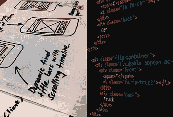
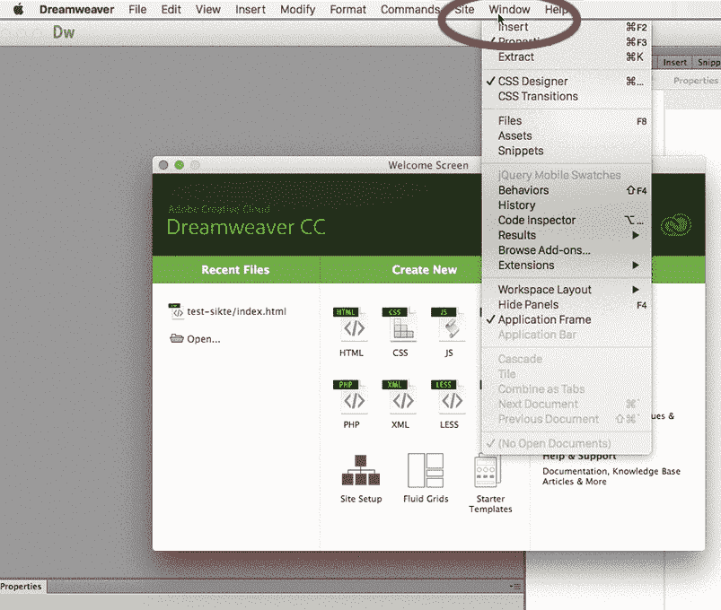
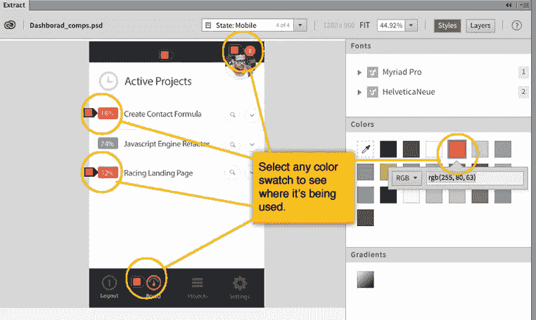
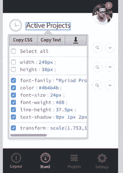
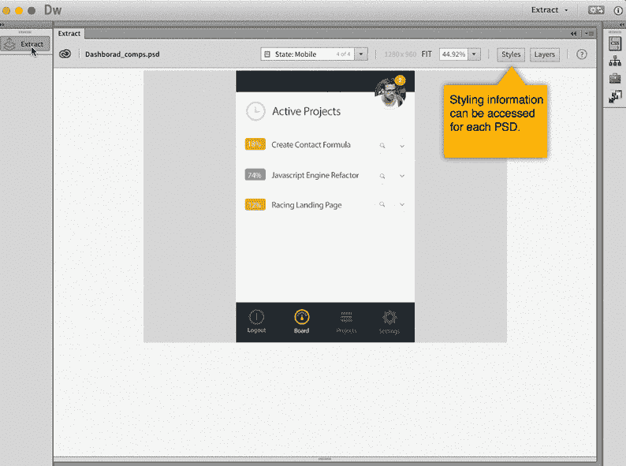
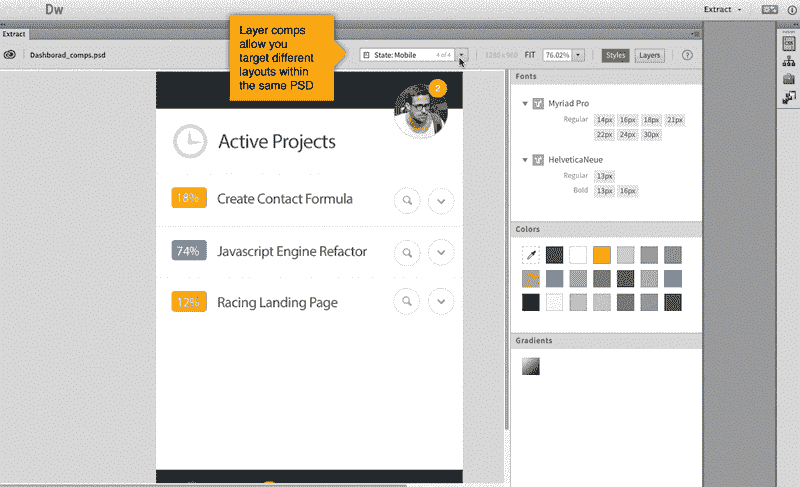
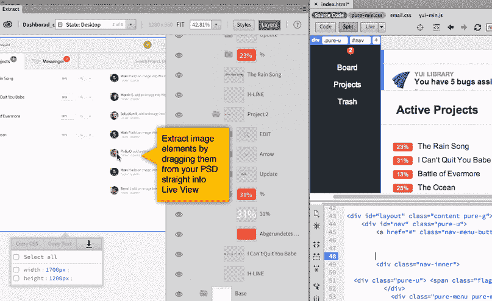
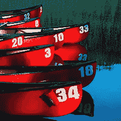

# Dreamweaver CC:打开 PSDs 的 Web 开发工具？

> 原文：<https://www.sitepoint.com/dreamweaver-2014-opens-psds/>

*本文由 [Adobe](http://www.adobe.com/products/dreamweaver.html?sdid=KQYQX) 赞助。感谢支持 SitePoint 的赞助商！*

**你的 web 开发过程中最大的瓶颈在哪里？事情会停滞不前的那部分？**

毫无疑问，它因项目而异，但我怀疑对我们大多数人来说，这是从设计到代码的翻译步骤——通常这意味着 PSD 到 HTML。事实上，一个蓬勃发展的全球性“HTML & CSS 裁剪者”行业已经成长起来，只为在 PSD 工作的设计师提供服务。

已经有很多尝试将这两个非常不同的过程合并起来，从本质上创建一个图形设计工具，可以输出*生产就绪*代码。虽然他们的意图是高尚的，但我们都理解自动生成与手工代码一样干净的代码的困难。

Adobe 正在采取一种新的方法来弥合设计代码的差距。Dreamweaver CC 2014.1 是第一款可以让您直接访问 PSD comps 的 web 开发工具。没错，你可以从 Photoshop 文档中直接提取任何图像、颜色或 CSS 值到你的编码窗口。

这不是关于大块标记的按钮式生成。本质上，你仍然是编写的每一行代码的完全主人和‘看门人’——这种情况对我们很多人都有吸引力。然而，突然之间，在应用程序之间不断“ALT+TAB”(或 Mac 上的“CMD+TAB”)的需求大大减少了。

这是一个雄心勃勃的想法，对不对？让我们看看它在实践中是如何工作的。

## 提取工作空间

第一次打开 Dreamweaver 时，您可能不会立即注意到新的提取 UI 控件，所以首先让我们找到它们。首先，如果你打开应用程序右上角的“工作区”下拉菜单，你会看到“提取”现在是“代码”和“设计”视图下面的一个选项。

然而，也可以通过`Windows > Extract`菜单随时轻松启动[提取面板](http://adobe.ly/1vDsSPE "Link to the Extract panel video")(见图表)。

启动提取面板。

如果你愿意，试着把你自己的 PSD 加载到提取面板中。除了准备用于 Dreamweaver 的文件之外，这还会将文件同步到您的在线 Creative Cloud 资产帐户，从而在任何阶段都可以轻松地与朋友、同事和客户共享文件。

对于这个演示，我将使用 Nicolas Kayser 的优雅的 Taspire 仪表板 PSD 作为我的基础。

## 在 Dreamweaver 中与 PSD 交互

一旦它被加载，你的 PSD 将显示在提取面板中，但大多数有用的工具是默认隐藏的。右上角有两个按钮——样式和图层。

### 风格

“样式”面板为您提供了一个“自上而下”的清单视图，显示文档中正在使用的内容—颜色、字体和渐变。

使用滴管和各种舍入误差，不难得到两三种相同颜色的细微变化。单击任何颜色样本都会突出显示使用该颜色的所有地方。这是清理你的调色板和合理化你的字体列表的完美地方。

颜色、字体和渐变选项在“样式”面板中进行整理

### 层

文本元素的 CSS 属性和值。

单击图层面板按钮会显示 Photoshop 图层面板的简化渲染。如你所料，你可以在这里显示和隐藏任何层。

您可以通过在提取视图中直接选择任何页面元素(如图像、菜单、文本等)来开始工作，尽管在某些情况下，您可能会发现使用“图层”面板选择页面元素更容易。

单击任何页面元素都会弹出一个优雅的小弹出面板，包含三个选项:

1.  复制 CSS :通常这可能只是简单项目的 CSS 宽度和高度，但也可能是文本元素的宽度和高度。列出了所有可行的 CSS 属性，但是您只需要复制您选中的属性。您可以通过单击将这些属性直接注入到 CSS 文件中的任何规则中。
2.  复制文本(Copy Text):这对于将页面标题和菜单标题放入 HTML 代码非常方便。
3.  **图像导出控件**(通过向下箭头按钮):我们将进一步关注这一点。

摘录面板之旅

### Photoshop 图层构图是你的朋友

在我的上一篇文章中，我们谈到了在 Photoshop 中使用“图层构图”来管理你的响应式布局。如果您错过了，从本质上讲，每个新的图层构图都是您的图层在那个时刻的快照。然后，您可以随时通过单击返回到该状态。

通常，您会在 Photoshop 中为每个响应布局状态创建一个图层构图，而在 Dreamweaver 中，这是真正值得的地方。

在 Dreamweaver 中切换图层构图

您可以使用提取工作区顶部的下拉菜单在图层构图之间切换。对于一个“移动优先”的设计，你应该从你的移动布局开始，并开始将 CSS 提升到你的默认样式表。

在项目的后期，你可以切换到一个更大的布局，并将这些资源提取到你的媒体查询 CSS 中。

### 提取图像可能就是这样一个拖拉的过程

是的，我知道，一个可怕的双关语。然而，这是很酷的功能。

在布局编码的早期阶段，你通常只是试图确定一些标志性的设计元素——英雄形象、头像和插图。Dreamweaver 现在可以让您将图像从 PSD comp 直接拖动到实时视图窗口，从而真正加快了速度。

将图片从你的电脑直接拖放到你的 HTML 中。

这是一个简单的过程。Dreamweaver 将自动导出图像，要求您输入文件名和文件夹，并在 HTML 中插入 IMG 标签。

我发现这是一种超快速的方法，可以快速地分割出大块区域。

### 摘要

大多数网页布局从 Photoshop 开始，最终在代码编辑器中完成。

docoverachiever

但是有一个中间阶段，你跨越了两个大的应用程序——你的图形应用程序和你的代码编辑器。有点像踩在两只独木舟之间。每一个都可能是很好的容器，但脚踏两只船自然会很尴尬。

Dreamweaver 的新方法是缩短 comp 和 web 开发工具之间的距离。结果是你的应用程序切换大幅减少，并且通常更稳定，更集中的工作流程。

这需要对你的工作方式做一点小小的调整，但是这个过程确实有很多让人喜欢的地方。

#### 有关系的

*   [使用 Photoshop CC 2014 生成响应式图像资源](https://www.sitepoint.com/responsive-image-assets-photoshop-css-2014/)
*   [什么是 Adobe Extract——为什么要关注它？](https://www.sitepoint.com/adobe-extract/)

## 分享这篇文章