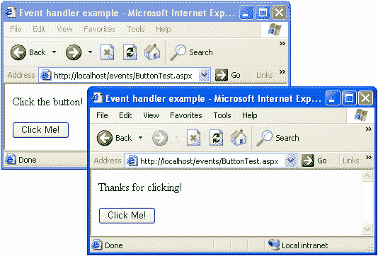
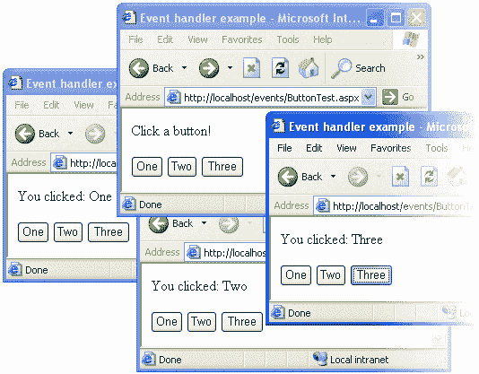
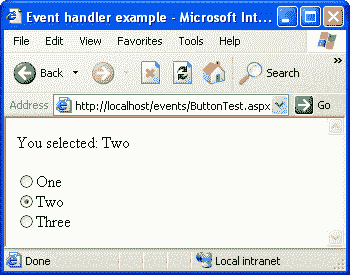

# 用 C#进行事件驱动的 ASP.NET 开发

> 原文：<https://www.sitepoint.com/driven-asp-net-development-c/>

许多当今最流行的 Web 开发平台(PHP、ASP、Perl 和 Cold Fusion 等)都支持面向对象编程(OOP)概念，这有助于保持 Web 应用程序代码的良好组织性、模块化和可伸缩性。

但是现代编程语言还有一个在 Web 开发平台中不太常见的特性:*事件驱动编程* (EDP)。作为少数几个同时支持 OOP 和 EDP 的 Web 开发平台之一，ASP.NET 为复杂项目提供了无与伦比的开发效率。

在本文中，我将展示 ASP.NET 的 EDP 特性，并向您展示如何使用 EDP 完成一些常见的 Web 编程任务。虽然这些技能对任何 ASP.NET 开发人员来说都是必不可少的，但那些使用过非电子数据处理平台的网络程序员应该特别注意。电子数据处理需要对一些基本问题采取非常不同的方法。如果你没有充分意识到电子数据处理的力量，使用其他语言时形成的习惯很容易转化为低效和不必要的复杂的 ASP.NET 代码。

本文是 ASP.NET 系列文章的第四篇。如果你是 ASP.NET Web 开发的新手，并且没有读过我以前的文章，在继续之前，请查看一下[ASP.NET 入门](https://www.sitepoint.com/blog/)、[ASP.NET 表单处理基础](https://www.sitepoint.com/blog/)和[面向 ASP.NET 开发者的面向对象 c#](https://www.sitepoint.com/blog/)。

##### 事件驱动与过程化编程

早在图形用户界面(GUI)出现之前，大多数计算机程序都是按程序编写的。一个程序可以是一个简单的指令列表(其中一些是以用户输入为条件的，程序会一直停下来提示用户)。最近，一个流行文化的偶像将过程化编程总结如下:*“这样做！去吧。废话，废话，废话！”*

GUI 的发展需要更灵活的编程模型。每次用户交互都可以简化为简单的选择题或文本提示的日子已经一去不复返了。基于 GUI 的程序必须能够对各种各样的*事件*做出反应，从鼠标点击到后台系统活动(比如打印机缺纸)，而不中断程序负责完成的任何任务的流程。

想象一下——如果在每一帧之间，浏览器必须停下来检查鼠标是否移动或被点击，那么 GIF 动画在 Web 浏览器中看起来会有多流畅？是否按下了任何键？如果光盘驱动器被打开或关闭？更重要的是，Web 浏览器的代码有多容易管理？进入事件驱动编程。

现在，如果不了解 EDP，你就不能为像 Windows 这样的图形操作系统编写程序，但是直到 ASP.NET(以及其他一些先驱，如 Macromedia Flash)之前，EDP 的好处对 Web 开发人员来说是不存在的。

"为什么所有其他语言都采用古老的、过程化的编程模型？"你可能会想。ASP 和 PHP 开发人员(包括我自己！)，已经习惯了用这种形式的巨大 if 语句编写脚本:

```
if (the user did this) 

{ 

  do this 

} 

else if (the user did this) 

{ 

  do this 

} 

... 

else 

{ 

  do this 

}
```

我可以将这种编程结构背后的推理追溯到两个来源:

**HTTP 的无状态特性**

超文本传输协议(HTTP)，网页浏览器和网页服务器之间所有通信使用的协议*无状态*。大多数服务器端编程语言(包括 ASP.NET)都支持 cookies 和会话以及其他旨在克服这一限制的功能，但当它真正实现时，对网页的每个请求仍然是一个简单的问答循环，本质上与所有其他请求是分离和独立的。

**CGI 和 Perl，服务器端编程的亚当和夏娃**

当第一次构思服务器端编程时，公共网关接口(CGI)是唯一的方法。CGI 是一种标准，通过这种标准，Web 服务器将运行一个指定的程序，等待它终止，并响应它的请求将程序的输出发送回 Web 浏览器。

HTTP 和 CGI 都是极其简单的标准，但今天的 Web 应用程序却以极其复杂的方式使用它们。这些标准的简单性(运行程序/脚本以产生对浏览器请求的响应)暗示了一种简单的编程模型；但是今天的应用需要更强大的东西。

事件驱动编程让开发人员识别一组 Web 应用程序应该监视的*事件*，并定义如何对每个事件做出反应，而不是遵循一个固定的指令列表。具有 JavaScript 背景的开发人员会认为这一切听起来太熟悉了。事实上，如果你稍微倾斜一下你的头，ASP.NET 代码看起来会非常像 JavaScript 代码。

##### 处理简单的事件

和 JavaScript 一样，ASP.NET 的事件驱动编程主要包括编写事件处理程序——响应事件而运行的方法。虽然 JavaScript 有很多你可以处理的事件，但 ASP.NET 有几百个事件，这还不算你自己添加的能力！

让我们看一个非常简单的例子，它包含 JavaScript 开发人员熟悉的事件:按钮点击。

以下是`ButtonTest.aspx`的代码:

```
<%@ Page Inherits="ButtonTest" src="ButtonTest.cs" %>  

<html>  

  <head>  

    <title> Event handler example </title>  

  </head>  

  <body>  

    <form runat="server">  

      <p>  

        <asp:Label runat="server" id="message">  

          Click the button!</asp:Label>  

      </p>  

      <p>  

        <asp:Button runat="server" id="button1"  

          Text="Click Me!" OnClick="ButtonClick" />  

      </p>  

    </form>  

  </body>  

</html>
```

如您所见，这是一个简单的 ASP.NET 页面，带有一个`<asp:Label>` ( `message`)和一个`<asp:Button>` ( `button1`)。`<asp:Button>`将其`OnClick`属性设置为`ButtonClick`，这是代码隐藏文件中定义的`ButtonTest`基类中定义的方法的名称。

如果你不理解文件背后的代码的概念，重新阅读我上一篇文章的结尾，[面向对象的 C#给 ASP.NET 开发者](https://www.sitepoint.com/blog/)。以下是`ButtonTest.cs`的代码:

```
using System;  

using System.Web;  

using System.Web.UI;  

using System.Web.UI.HtmlControls;  

using System.Web.UI.WebControls;  

public class ButtonTest : Page  

{  

  protected Label message;  

  protected void ButtonClick(Object sender, EventArgs e)  

  {  

    message.Text = "Thanks for clicking!";  

  }  

}
```

这个类包含的只是对`ButtonClick`和`Label`字段的定义，消息(这是必需的，因为`ButtonClick`引用了它)。像所有人一样。NET 事件处理程序中，`ButtonClick`方法接受两个参数，不返回任何内容(`void`)。第一个参数将始终包含生成事件的对象(在本例中为`button1`)，而第二个参数用于传递关于事件的任何附加信息(本文中我们将看到的事件都不会使用这个参数)。

将这两个文件放在您的 ASP。启用. NET 的 Web 服务器并加载`ButtonTest.aspx`。如图 1 所示，单击按钮将触发事件处理程序并显示新消息。

**Figure 1: The ButtonClick event handler responds to the click**

作为一名经验丰富的 PHP 开发人员，我希望必须检查页面的`Page_Load`方法中的按钮是否被点击，并对那里的点击做出响应。然而，有了对 EDP 的支持，ASP.NET 让你更自然地将你的事件处理代码组合在一起。

##### 在代码中分配处理程序

虽然前面的例子相当简单，但它确实有一个症结。按钮的事件处理程序是在`.aspx`文件中分配的，这违反了我们以前用代码隐藏文件实现的设计代码和服务器端逻辑的分离。

为了改善这种情况，我们可以在代码中分配事件处理程序。最好的方法是在`Page_Init`方法中，当页面初始化时(即服务器在处理浏览器的第一个请求之前加载它)，ASP.NET 会自动调用这个方法。下面是更新后的`ButtonTest.cs`，变化以粗体显示:

```
using System;   

using System.Web;   

using System.Web.UI;   

using System.Web.UI.HtmlControls;   

using System.Web.UI.WebControls;   

public class ButtonTest : Page   

{   

 **protected Button button1;**   

 protected Label message;   

 **protected void Page_Init(Object sender, EventArgs e)**   

 **{**   

 **button1.Click += new EventHandler(ButtonClick);**   

 **}**   

  protected void ButtonClick(Object sender, EventArgs e)   

  {   

    message.Text = "Thanks for clicking!";   

  }   

}
```

进行上面的更改，从`ButtonTest.aspx`中的`button1`标签中删除`OnClick`属性，您应该会发现该示例的行为与之前完全一样。让我们检查一下我们在这里做了什么:

```
 button1.Click += new EventHandler(ButtonClick);
```

您可能已经猜到，这一行添加了`ButtonClick`方法作为`button1`的`Click`事件的处理程序。但是语法有些神秘，尤其是与它所替换的简单的`OnClick`属性相比！

全部。NET 事件的行为类似于它们各自类的属性。所以所有`System.Web.UI.WebControls.Button`对象支持的`Click`事件在这种情况下作为`button1.Click`是可访问的。

现在，任何。NET 事件可以有多个与之相关联的处理程序(例如，当事件发生时，将按顺序触发多个方法)。因此，*没有用赋值(`=`)操作符给*分配一个事件处理程序，我们只是*给任何可能存在的处理程序(`+=`)添加一个事件处理程序。。NET 不允许对事件使用`=`操作符，任何尝试都会导致编译错误。您还可以使用`-=`操作符来删除事件处理程序，但仅此而已。*

至于事件处理程序本身，您可能期望看到类似这样的内容(我知道我看到了！):

```
 button1.Click += ButtonClick; /* This is wrong */
```

我们必须用`ButtonClick`方法显式创建一个`EventHandler`对象(而不是直接将该方法指定为事件处理程序)的原因与 C#语言的一个令人困惑的小细节有关— *委托*。

我会让你参考 C#语言规范或者一本好书，比如《编程 c#》(O ' Reilly，2001)，以获得关于委托的完整讨论；然而，这里是基本的。C#委托是一种特殊类型的类，其对象包含一组方法，这些方法具有相同数量和类型的参数，并返回相同类型的值。

`System.EventHandler`类是委托的一个简单例子。`EventHandler`指定它必须包含带两个参数(一个`Object`和一个`EventArgs`)并返回`void`的方法。

所以作为一个类型为`System.EventHandler`的事件，`Button`类的`Click`事件需要我们给它分配一个类型为`EventHandler`的委托。为此，我们用代码`new EventHandler(ButtonClick)`创建一个包含我们的`ButtonClick`方法的新的`EventHandler`对象，并将其添加到事件中。

如果你真的没有理解，不要太担心。对我来说，委托是 C#中最难掌握的特性，因为在当今流行的其他语言中，你很难找到这种特性。过了一段时间，语法就成了第二天性，只有高级应用程序才需要了解委托，而不仅仅是如何用它们创建事件处理程序。

##### 共享事件处理程序

在许多情况下，您可能希望为多个事件源定义一个事件处理程序。由于所有事件处理程序都接收到对事件源的引用，因此它们可以确定多个源中的哪一个引发了该事件，并相应地采取行动。

考虑以下更新版本的`ButtonTest.aspx`:

```
<%@ Page Inherits="ButtonTest" src="ButtonTest.cs" %>    

<html>    

  <head>    

    <title> Event handler example </title>    

  </head>    

  <body>    

    <form runat="server">    

      <p>    

        <asp:Label runat="server" id="message">    

          Click a button!</asp:Label>    

      </p>    

      <p>    

        <asp:Button runat="server" id="button1"    

          Text="One" />    

        <asp:Button runat="server" id="button2"    

          Text="Two" />    

        <asp:Button runat="server" id="button3"    

          Text="Three" />    

      </p>    

    </form>    

  </body>    

</html>
```

我们现在有三个按钮可供选择，我们希望在单击每个按钮时显示不同的消息。下面是文件后面的更新代码，`ButtonTest.cs`:

```
using System;    

using System.Web;    

using System.Web.UI;    

using System.Web.UI.HtmlControls;    

using System.Web.UI.WebControls;    

public class ButtonTest : Page    

{    

  protected Button button1;    

 **protected Button button2;**    

 **protected Button button3;**    

  protected Label message;    

  protected void Page_Init(Object sender, EventArgs e)    

  {    

 **EventHandler clickHandler =**    

 **new EventHandler(ButtonClick);**    

 **button1.Click += clickHandler;**    

 **button2.Click += clickHandler;**    

 **button3.Click += clickHandler;**    

  }    

  protected void ButtonClick(Object sender, EventArgs e)    

  {    

 **if (sender is Button)**    

 **{**    

 **Button clickedButton = (Button)sender;**    

 **message.Text = "You clicked: " + clickedButton.Text;**    

 **}**    

 }    

}
```

我们已经添加了对两个新按钮的引用，并将我们的`EventHandler`赋给了一个变量(`clickHandler`，然后我们将这个变量添加到所有三个按钮的`Click`事件中。最后，我修改了`ButtonClick`方法来显示用户点击的按钮的名称。让我带您浏览一下代码，因为它使用了一些我以前没有讨论过的技巧。

```
 if (sender is Button)    

    {
```

调用`ButtonClick`方法时，总是使用发送者参数中的事件源。该参数的类型是`Object`，它是。NET 框架(即所有类都是`System.Object`的子类)。为了显示被点击的按钮的名称，我们需要将这个参数视为一个`Button`——而不仅仅是一个`Object`。在这样做之前，我们必须检查以确保 sender 参数确实是一个`Button`对象，尽管它存储在一个类型为`Object`的变量中。

<q>**注:**这种将任何对象存储在同一个类或其任何基类(又名超类)的变量中的能力，实际上是现代面向对象语言的一个特性，称为*多态性*。在上一篇文章中，如果我们愿意，同样的特性允许我们像对待类`Tree`的对象一样对待类`CoconutTree`的对象。</q>

为了检查存储在 sender 中的对象是否属于类`Button`(或其任何子类)，我们在 C#中使用 is 操作符。语法相对来说是不言自明的；如果发送者包含一个可以被视为`Button`的对象，那么`sender is Button`将是`true`。

```
 Button clickedButton = (Button)sender;
```

因为我们已经检查过`sender`包含一个`Button`，我们可以创建一个`Button`类型的变量，并将`sender`的值存储到其中。由于，据 C#所知，`sender`只是一个`Object`，而你不能在`Button`变量中存储一个`Object`，我们需要告诉 C#取`sender`中的值，并将其转换成一个`Button`。这是通过将要转换的类型括在括号中并放在变量名之前来实现的，就像我们在这里所做的那样。

这种值从一种类型到更复杂类型的显式转换称为*转换*。一个有经验的 C#程序员会说我们在上面一行“将`sender`转换为`Button`”。

最后，既然我们已经在`clickedButton`变量中单击了按钮，我们可以使用它的标签来显示适当的消息:

```
 message.Text = "You clicked: " + clickedButton.Text;
```

结果见图 2，或者在您自己的服务器上尝试这个脚本！

**Figure 2: Same event handler, multiple outcomes**

##### 回发与非回发事件

正如我上面提到的，有成百上千的事件散布在。NET Framework，您可以使用事件处理程序对其做出反应。有些事件是用户活动的结果(例如，我们到目前为止实验过的`Click`事件)，而其他事件是由 ASP.NET 本身生成的(例如，一个数据库项被插入到一个`DataGrid`控件中)。用户生成的事件有两种类型:

*   **回发事件**通过表单提交(如按钮、超链接等)立即报告给 Web 服务器。).
*   **非回发事件**，浏览器会注意到这些事件，但直到下一次提交表单时才会报告(例如，复选框、单选按钮、列表选择、文本条目等)。).

为了演示这一点，让我们在例子中从使用`Buttons`切换到`RadioButtons`。这里是`.aspx`:

```
<%@ Page Inherits="ButtonTest" src="ButtonTest.cs" %>     

<html>     

  <head>     

    <title> Event handler example </title>     

  </head>     

  <body>     

    <form runat="server">     

      <p>     

        <asp:Label runat="server" id="message">     

          Choose an option!</asp:Label>     

      </p>     

      <p>     

        <asp:RadioButton runat="server" id="button1"     

          Text="One" GroupName="radioGroup" /><br />     

        <asp:RadioButton runat="server" id="button2"     

          Text="Two" GroupName="radioGroup" /><br />     

        <asp:RadioButton runat="server" id="button3"     

          Text="Three" GroupName="radioGroup" /><br />     

      </p>     

      <p>     

        <asp:Button runat="server" id="submitButton"     

          Text="Submit" />     

      </p>     

    </form>     

  </body>     

</html>
```

在这个例子中，我们有三个`<asp:RadioButton>`标签，它们共享同一个`GroupName`。这将创建一组三个单选按钮，一次只能选择其中一个。

以下是文件背后的代码:

```
using System;     

using System.Web;     

using System.Web.UI;     

using System.Web.UI.HtmlControls;     

using System.Web.UI.WebControls;     

public class ButtonTest : Page     

{     

 **protected RadioButton button1;**     

 **protected RadioButton button2;**     

 **protected RadioButton button3;**     

 protected Label message;     

  protected void Page_Init(Object sender, EventArgs e)     

  {     

 **EventHandler selectionHandler =**     

 **new EventHandler(RadioChange);**     

 **button1.CheckedChanged += selectionHandler;**     

 **button2.CheckedChanged += selectionHandler;**     

 **button3.CheckedChanged += selectionHandler;**     

  }     

 **protected void RadioChange(Object sender, EventArgs e)**     

 **{**     

 **RadioButton checkedButton = null;**     

 **if (button1.Checked)**     

 **checkedButton = button1;**     

 **else if (button2.Checked)**     

 **checkedButton = button2;**     

 **else if (button3.Checked)**     

 **checkedButton = button3;**     

 **if (checkedButton != null)**     

 **message.Text = "You selected: " + checkedButton.Text;**     

 **}**     

}
```

如您所见，`RadioButton`对象有一个类型为`EventHandler`的`CheckedChanged`事件，每当有问题的单选按钮改变其选择状态时，该事件就会被触发。通过为所有三个单选按钮的`CheckedChanged`事件分配相同的事件处理程序(`selectionHandler`)，我们可以在用户从列表中选择新的单选按钮时得到通知。

但是由于`CheckedChanged`事件不是回发事件，它直到下一次表单提交时才触发，这就是为什么我们仍然需要一个`<asp:Button>`来提交表单。

幸运的是，大多数具有非回发事件的 ASP.NET 控件(包括`RadioButton`)也有一个`AutoPostBack`属性，可以将其所有事件更改为回发事件。因此，只需将三个单选按钮的`AutoPostBack`属性设置为 true，我们就可以取消提交按钮:

```
<%@ Page Inherits="ButtonTest" src="ButtonTest.cs" %>     

<html>     

  <head>     

    <title> Event handler example </title>     

  </head>     

  <body>     

    <form runat="server">     

      <p>     

        <asp:Label runat="server" id="message">     

          Choose an option!</asp:Label>     

      </p>     

      <p>     

        <asp:RadioButton runat="server" id="button1"     

          Text="One" GroupName="radioGroup"     

          **AutoPostBack="true"** /><br />     

        <asp:RadioButton runat="server" id="button2"     

          Text="Two" GroupName="radioGroup"     

          **AutoPostBack="true"** /><br />     

        <asp:RadioButton runat="server" id="button3"     

          Text="Three" GroupName="radioGroup"     

          **AutoPostBack="true"** /><br />     

      </p>     

    </form>     

  </body>     

</html>
```

如图 3 所示，现在只要用户选择一个单选按钮，消息就会更新。

**Figure 3: `CheckedChanged` becomes a Postback Event with `AutoPostBack="true"`**

##### 摘要

在本文中，我在 ASP.NET 演示了事件驱动编程(EDP)的基础。我解释了 EDP 相对于更传统的服务器端编程技术的优势，并确保在代码隐藏文件中分配事件处理程序，以保持设计和服务器端逻辑之间的分离。我展示了如何对多个事件源使用单个事件处理程序，并通过区分回发和非回发事件结束了本文。

虽然我已经在这里介绍了基本情况，但事件比我们看到的简单例子可能暗示的更深入地融入了 ASP.NET 的结构。在以后的一篇文章中，我将展示如何使用 ASP.NET 在 Web 上显示数据库信息，我们将再次讨论事件主题，以便为表中的各种数据项提供格式。在另一篇文章中，我将解释在构建自定义 ASP.NET Web 控件时需要注意的所有不同事件。

然而，在我的下一篇文章中，我将介绍在 ASP.NET 进行表单验证的技术。再一次，当大多数其他服务器端语言让你自己照顾自己时，ASP.NET 配备了一套丰富的工具来为你做大部分工作。如果您曾经手工编写过 JavaScript 表单验证代码，那么您一定不想错过这篇文章！

## 分享这篇文章