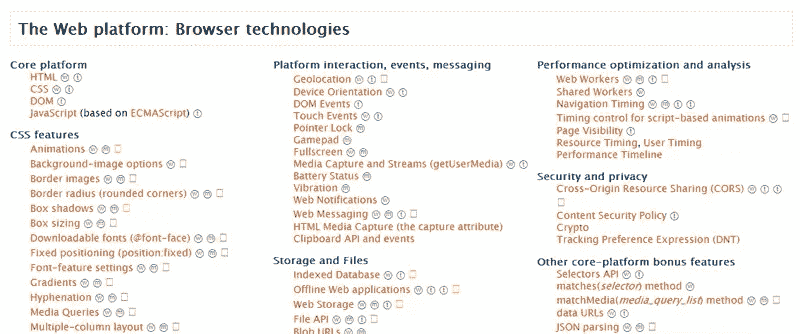
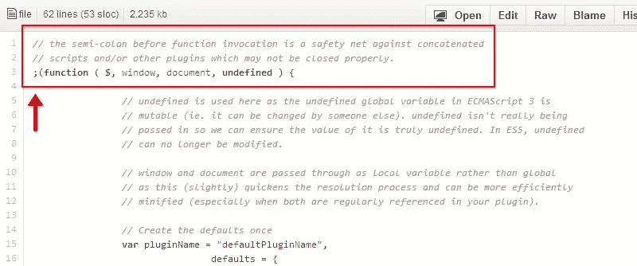

# 淹没在 Web 开发行业的工具中

> 原文：<https://www.sitepoint.com/drowning-in-tools-web-development-industry/>

在这个行业中，我们偶尔需要一个提醒，即我们作为前端开发人员的行业——我尽可能以最积极的方式说——可能是一件令人沮丧的事情。

几年前，当我[嘲笑](http://html9responsiveboilerstrapjs.com/)当时激增的框架和库的数量，并取笑它们被呈现的方式时，整个概念似乎引起了业内每个人的共鸣。那个网站像病毒一样传播开来，我不记得有任何人说过我对这种情况掉以轻心。

> “哦，你的头还没爆炸吗？这个应该行。”
> –[H9 RBS . js](http://html9responsiveboilerstrapjs.com/)

令人惊讶的是，我们今天的处境可能更糟。

从 7 月下旬开始，我策划了一份名为 [Web 工具周刊](http://webtoolsweekly.com/)的专注于工具的每周时事通讯。每一周，当我浏览我的 feeds(是的，RSS 仍然存在)和进行各种形式的其他研究时，我会不断地标记新的应用程序、脚本、插件、库、CSS 框架、生产力工具、测试工具等等。

事实上，我或许可以每天发布简讯，我仍然有足够的内容。在写这篇文章的时候，我有一个大约 500 个不同的应用程序、资源、脚本、库、插件等的分类列表。我还没在任何一期杂志上发表过。让我们不要忘记前 30 期的 500 多种工具。

而这仅仅是一个人的研究结果！

## 这是好事吗？

许多人，如果不是我们所有人，可能会同意被工具淹没是一件好事也是一件坏事。我们可以这样总结好的和坏的:

*   这是一件好事，因为有无穷无尽的工具供我们使用，帮助我们解决前端开发人员面临的几乎所有问题。
*   这是一件坏事，因为它往往太多了，太多的选择会让人麻痹，让我们 T2 有时会讨厌我们所做的事情。

当然，不是每个人都会完全同意我对这两点的评估，但我认为每个人都会同意，所有这一切都有利弊。

## 问题为什么会存在？

你们中的大多数人可能理解为什么我们会处于现在的处境。网络平台是一个开放的平台，任何人都可以以他们认为合适的任何理由使用它。

[*网络平台*](http://platform.html5.org/)

我们使用构成网络平台的技术来建造东西。很多时候，我们在开放的环境中构建东西，让其他人不仅可以反馈如何改进我们所构建的东西，还可以利用我们的项目，让[把它变成自己的](https://help.github.com/articles/fork-a-repo)。那可以是[一个强大的东西](https://github.com/h5bp/html5-boilerplate/network/members)。

这是我们这个行业的伟大之处之一，[不像某些商业战略](https://en.wikipedia.org/wiki/Patent_troll)，这种开放性和协作不会扼杀创新；它做的正好相反。

## 让你的头露出水面

我会第一个承认这篇文章的标题是为了引起注意。但我认为这是对我们现状的真实描述，所以我并不以使用它为耻。

我所讨论的问题——我希望我已经说清楚了，这些都是好问题！不会很快好转。我预计情况将基本保持不变。如果增加新的开放技术，我们可以预期情况会变得更糟。

那么我们该如何应对呢？我们如何继续使用新工具，保持高效率，并跟上新技术的步伐？

我很乐意在评论中听到你的建议，但这里是我的建议:

### 不要感到不知所措

在这个行业，人们常说“如果你休息一年，你会觉得自己过时了。”这是从我之前链接的 Tuts+文章中直接引用的。最糟糕的是，你不必休息一年来感受这种感觉。对我来说，这里的关键词是*感觉*。是的，你会*感到*过时，但事情不会像看起来那么糟糕。

在我看来，就算是行业内 80%的开发者都“掉队”也没关系。重要的是我们正在把事情做好。为了完成工作，以你觉得舒服的速度和你需要的速度学习新东西。

当然，如果你跟不上某些工具，你可能无法向一些热门的硅谷初创公司推销你的技能。但是你可能不得不降低你的标准。世界各地都有很多事情要做，而且并不是每个开发人员职位都要求你什么都懂。

### 让工具具有教育性

更有可能的是，你每周都会遇到几十个新的脚本、库和插件。几乎所有这些工具都有开放的源代码供我们使用和检查。

所以向他们学习吧！

您现在可能无法使用某个特定的脚本，并且可能永远也不会使用它。但还是可以偷看一下源码。

看看它，问问自己:代码是如何组织的？它是否使用了任何你可能想记下来并仔细阅读的[不熟悉的模式](http://addyosmani.com/resources/essentialjsdesignpatterns/book/)？如果有你不认识的模式或方法，向[询问](https://www.sitepoint.com/forums/)或[查找](https://developer.mozilla.org/en-US/docs/DOM/DOM_Reference)会有帮助吗？源代码[中有什么看起来很奇怪的东西](http://stackoverflow.com/questions/7145514/whats-the-purpose-of-starting-semi-colon-at-beginning-of-javascript)可以通过更好地理解而受益吗？

*来自 [jQuery 样板文件来源](https://github.com/jquery-boilerplate/jquery-boilerplate/blob/master/src/jquery.boilerplate.js)*

关键是，曾经编写的每一段代码对某处的某个人都有某种教育价值，即使没有人在现实世界中使用过它。

### 专注于解决问题

不要担心最新的新工具和技术，除非你确实能看到学习它们的好处。

起初，我确信许多开发人员不愿意花时间学习 CSS 预处理器。没有太多的编程或命令行经验，它被许多人视为一项艰巨的任务，似乎没有太多的时间投资回报。

但是现在越来越多的开发人员认识到大型项目从使用像 [Sass](http://sass-lang.com/) 或 [LESS](http://lesscss.org/) 这样的工具的特性中获益良多。因此，许多开发人员已经正确地得出结论，学习预处理器的时间投资是值得的。

这也是我们在学习任何新工具时应该遵循的原则。不要用某样东西，因为所有酷小孩都在用；使用它是因为它帮助你更有效率，或者因为它解决了一个特定的问题。

## 你如何处理这种情况？

这是我对该行业现状以及我们如何充分利用它的看法。正如你所看到的，尽管如果我们只关注消极方面会令人沮丧，但这个行业有很多好处，我认为好处远远超过坏处。

但这只是我的看法。你呢？

*   您是否对行业中大量可用的新工具和技术感到不知所措？
*   你认为这一切还有其他积极或消极的方面吗？更重要的是…
*   你个人是怎么处理的？

## 分享这篇文章