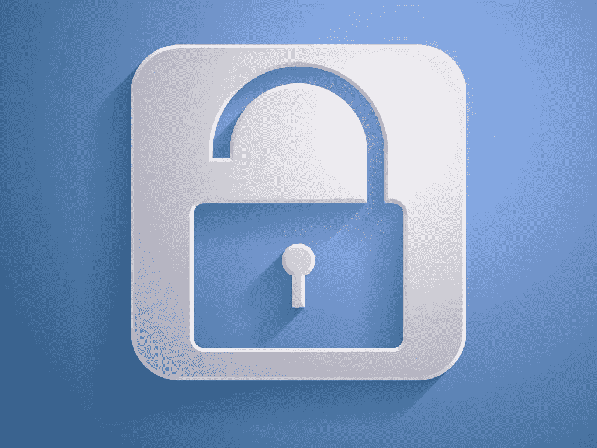

# 使用 Symfony 3 中的 Guard 更容易进行身份验证

> 原文：<https://www.sitepoint.com/easier-authentication-with-guard-in-symfony-3/>

Symfony2 安全系统是该框架的一个复杂部分，对许多人来说很难理解和使用。它非常强大和灵活，但不是最简单的。关于自定义身份验证的例子，[查看我以前的文章](https://www.sitepoint.com/user-authentication-symfony2-userapp-io/)，它将 Symfony 与 UserApp 服务集成在一起。



随着版本 2.8(以及期待已久的版本 3)的发布，Symfony 框架中加入了一个新的组件: [Guard](https://github.com/symfony/security-guard) 。该组件的目的是与安全系统集成，并为创建自定义身份验证提供一种非常简单的方法。它公开了一个接口，该接口的方法将带您从认证链的起点到终点:逻辑的和所有组合在一起的。

在本文中，我们将创建一个简单的表单认证，要求用户登录并拥有每个页面的`ROLE_ADMIN`角色。仍然可以使用构建表单身份验证的原始方式，但是我们将使用 Guard 来说明它的简单性。然后，您可以将相同的概念应用于任何类型的身份验证(令牌、社交媒体等)。

如果你想在你自己的 IDE 中继续，你可以克隆这个库的[,它包含了我们的 Symfony 应用程序和认证保护。那么，我们开始吧。](https://github.com/upchuk/symfony3/)

## 安全配置

任何安全配置都需要一个用户类(表示用户数据)和 UserProvider(获取用户数据)。为了简单起见，我们将使用`InMemory`用户提供者，它反过来使用默认的 Symfony `User`类。所以我们的`security.yml`文件可以这样开始:

```
security:
    providers:
        in_memory:
            memory:
                users:
                    admin:
                        password: admin
                        roles: 'ROLE_ADMIN' 
```

关于 Symfony 安全系统的更多信息以及这个文件可能包含的内容，我强烈建议你阅读 Symfony 网站上的[书籍条目](http://symfony.com/doc/current/book/security.html)。

我们的`InMemory`提供者现在有一个拥有`ROLE_ADMIN`的硬编码测试用户。

在`firewalls`键下，我们可以定义我们的防火墙:

```
 secured_area
            anonymous: ~
            logout:
                path:   /logout
                target: /
            guard:
                authenticators:
                    - form_authenticator 
```

这基本上是说匿名用户可以访问防火墙，用户注销的路径是`/logout`。新的部分是`guard`键，它指示哪个认证器用于这个防火墙的保护配置:`form_authenticator`。这需要成为服务名，我们马上会看到它是如何定义的以及在哪里定义的。

最后，在安全配置中，我们可以指定一些访问规则:

```
 access_control:
            - { path: ^/login, roles: IS_AUTHENTICATED_ANONYMOUSLY }
            - { path: ^/, roles: ROLE_ADMIN } 
```

在本例中，我们指定未登录的用户只能访问`/login`路径。对于所有其他的，需要`ROLE_ADMIN`角色。

## 登录控制器

在进入实际的认证器之前，让我们看看我们为实际的登录表单和控制器准备了什么。在我们的`DefaultController`里面我们有这个动作:

```
 /**
   * @Route("/login", name="login")
   */
  public function loginAction(Request $request)
  {
    $user = $this->getUser();
    if ($user instanceof UserInterface) {
      return $this->redirectToRoute('homepage');
    }

    /** @var AuthenticationException $exception */
    $exception = $this->get('security.authentication_utils')
      ->getLastAuthenticationError();

    return $this->render('default/login.html.twig', [
      'error' => $exception ? $exception->getMessage() : NULL,
    ]);
  } 
```

定义`/login`路由，这个动作负责向未登录的用户显示一个基本的登录表单。该表单的 Twig 模板如下所示:

```
{{ error }}

<form action="{{ path('login') }}" method="POST">
    <label for="username">Username</label>
    <input type="text" name="username" class="form-control" id="username" placeholder="Username">
    <label for="password">Password</label>
    <input type="password" name="password" class="form-control"
           id="password" placeholder="Password">
    <button type="submit">Login</button>
</form> 
```

目前为止没什么特别的。只是一个简单的表单标记，直接在 HTML 中快速搭建，回发到同一个`/login`路径。

## 保护验证器服务

我们在安全配置中引用了我们的安全验证器的服务。让我们确保在`services.yml`文件中定义了这个服务:

```
 services:
    form_authenticator:
          class: AppBundle\Security\FormAuthenticator
          arguments: ["@router"] 
```

该服务引用我们的`FormAuthenticator`类:

```
namespace AppBundle\Security;

use Symfony\Component\HttpFoundation\RedirectResponse;
use Symfony\Component\HttpFoundation\Request;
use Symfony\Component\HttpFoundation\Response;
use Symfony\Component\Routing\RouterInterface;
use Symfony\Component\Security\Core\Exception\CustomUserMessageAuthenticationException;
use Symfony\Component\Security\Core\Exception\UsernameNotFoundException;
use Symfony\Component\Security\Core\Security;
use Symfony\Component\Security\Core\User\InMemoryUserProvider;
use Symfony\Component\Security\Core\User\UserInterface;
use Symfony\Component\Security\Guard\AbstractGuardAuthenticator;
use Symfony\Component\Security\Core\Authentication\Token\TokenInterface;
use Symfony\Component\Security\Core\Exception\AuthenticationException;
use Symfony\Component\Security\Core\User\UserProviderInterface;

class FormAuthenticator extends AbstractGuardAuthenticator
{

  /**
   * @var \Symfony\Component\Routing\RouterInterface
   */
  private $router;

  /**
   * Default message for authentication failure.
   *
   * @var string
   */
  private $failMessage = 'Invalid credentials';

  /**
   * Creates a new instance of FormAuthenticator
   */
  public function __construct(RouterInterface $router) {
    $this->router = $router;
  }

  /**
   * {@inheritdoc}
   */
  public function getCredentials(Request $request)
  {
    if ($request->getPathInfo() != '/login' || !$request->isMethod('POST')) {
      return;
    }

    return array(
      'username' => $request->request->get('username'),
      'password' => $request->request->get('password'),
    );
  }

  /**
   * {@inheritdoc}
   */
  public function getUser($credentials, UserProviderInterface $userProvider)
  {
    if (!$userProvider instanceof InMemoryUserProvider) {
      return;
    }

    try {
      return $userProvider->loadUserByUsername($credentials['username']);
    }
    catch (UsernameNotFoundException $e) {
      throw new CustomUserMessageAuthenticationException($this->failMessage);
    }
  }

  /**
   * {@inheritdoc}
   */
  public function checkCredentials($credentials, UserInterface $user)
  {
    if ($user->getPassword() === $credentials['password']) {
      return true;
    }
    throw new CustomUserMessageAuthenticationException($this->failMessage);
  }

  /**
   * {@inheritdoc}
   */
  public function onAuthenticationSuccess(Request $request, TokenInterface $token, $providerKey)
  {
    $url = $this->router->generate('homepage');
    return new RedirectResponse($url);
  }

  /**
   * {@inheritdoc}
   */
  public function onAuthenticationFailure(Request $request, AuthenticationException $exception)
  {
    $request->getSession()->set(Security::AUTHENTICATION_ERROR, $exception);
    $url = $this->router->generate('login');
    return new RedirectResponse($url);
  }

  /**
   * {@inheritdoc}
   */
  public function start(Request $request, AuthenticationException $authException = null)
  {
    $url = $this->router->generate('login');
    return new RedirectResponse($url);
  }

  /**
   * {@inheritdoc}
   */
  public function supportsRememberMe()
  {
    return false;
  }
} 
```

虽然这看起来很多，但实际上不是。让我们一步一步来，了解这里发生了什么。

首先，我们将它放在包的`Security`文件夹中。这只是个人的选择，我们没有义务这样做。然后，我们从`AbstractGuardAuthenticator`扩展，因为它已经负责从`GuardAuthenticatorInterface`接口实现一个所需的方法。如果我们需要一个特定的令牌类来表示我们的认证，我们也可以只实现接口和它的`createAuthenticatedToken()`方法。目前，我们不需要这么做。

接口方法的实现是问题的关键，它们共同形成了从用户试图访问站点到他们被授予或拒绝访问的身份验证管道。

我们从每个请求都在*上被调用的`getCredentials()`方法开始。这个方法的目的是要么从请求中返回凭证数据，要么返回 NULL(要么拒绝访问，允许另一个验证者提供凭证，要么调用`start()`方法)。因为只有对我们的`/login`路径的 POST 请求才是凭证的容器，所以只有在这种情况下，我们才返回一个包含提交的用户名和密码的数组。*

如果`getCredentials()`没有返回 NULL，那么下一个被调用的方法就是`getUser()`。后者负责根据我们从前一个方法收到的凭证加载用户。使用默认的用户提供者(在我们的例子中是`InMemory`提供者)，我们根据用户名加载并返回用户。虽然我们在这里也可以返回 NULL 来触发认证失败，但是我们可以选择抛出一个`CustomUserMessageAuthenticationException`来指定我们自己的定制失败消息。

然而，如果检索并返回一个用户，`checkCredentials()`方法就会起作用。正如所料，这个方法的目的是验证传递的凭证是否与找到的用户的凭证相匹配。同样的规则也适用，如果我们返回 NULL 或者抛出一个异常，我们就不能通过认证。

此时，如果凭据匹配，用户就会登录。在这种情况下，调用了`onAuthenticationSuccess()`方法，我们可以再次做我们想做的事情。在我们的例子中，重定向到主页似乎是一个很好的例子。相反，如果认证失败，则调用`onAuthenticationFailure()`方法。我们所做的是重定向回`/login`页面，但不是在设置会话中的最后一个认证异常之前，这样我们可以在表单上方显示错误消息。在管道的任何身份验证失败点调用此方法。

`start()`方法是进入防护系统(和应用程序)的入口点。每当用户试图访问需要认证的页面，但是`getCredentials()`没有返回*凭证*时，就会调用这个方法。在我们的例子中，这意味着如果有人试图访问主页，请求中没有凭证，所以`getCredentials()`返回 NULL。我们接下来要做的是重定向到`/login`页面，这样用户就可以登录并访问主页。

让我们想象另一个例子:基于令牌的认证。在这种情况下，每个请求**需要**包含一个认证用户的令牌。这意味着`getCredentials()`将总是必须返回凭证。如果没有，那么`start()`方法将返回一个响应，表明访问被拒绝(或者任何您能想到的)。

最后一个方法负责标记`RememberMe`功能。在我们的例子中，我们不使用它，所以我们返回 false。想了解更多关于[在 Symfony](http://symfony.com/doc/current/cookbook/security/remember_me.html) 记住我的信息，请查看食谱条目。

## 结论

我们现在有了一个使用 Guard 组件的全功能登录系统。上面提到了令牌认证的例子，我们可以实现一个令牌认证，并让它与我们在本文中编写的令牌认证协同工作。多个授权码可以像这样存在:

```
 guard:
                authenticators:
                    - form_authenticator
                    - token_authenticator
                entry_point: form_authenticator 
```

如果我们配置多个授权码，我们还需要指定哪个应该是入口点(当用户试图在不提供凭证的情况下访问资源时，将调用其`start()`方法)。

请注意，Guard 不会替换 Symfony 中的任何内容，而是对其进行了补充。因此，现有的安全设置肯定会继续发挥作用。例如，我们以前使用的[的`form_login`或`simple_form`将继续工作。](https://www.sitepoint.com/user-authentication-symfony2-userapp-io/)

你试过警戒了吗？你对此有何感想？让我们知道！

## 分享这篇文章