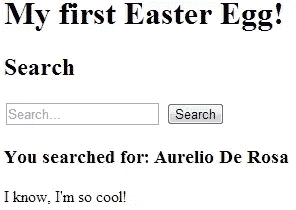

# 复活节彩蛋:它们是什么以及如何创造它们

> 原文：<https://www.sitepoint.com/easter-eggs-what-they-are-and-how-to-create-them/>

复活节彩蛋是一种隐藏的信息或功能，与正常功能完全无关，开发者将它放在软件、网站或游戏中。与病毒、蠕虫和特洛伊木马不同，复活节彩蛋是完全无害的。它们经常被用作程序员的一种签名或一个笑话。有时它们是由程序员的个人倡议而不是公司的要求编写的，在这种情况下，公司可能会对开发人员采取法律行动。另一方面，有很多情况下，一家公司，尤其是那些专门从事游戏开发的公司，明确要求几个复活节彩蛋。

## 复活节彩蛋简史

这个词来自盎格鲁-撒克逊传统，父母在复活节时在花园里藏一些鸡蛋，然后让他们的孩子找到它们。这种类型的工作经常在游戏中使用，例如，通过组合键或以给定的顺序执行某些动作，您可以访问新的级别或新的权力。

几年来，包括我在内的人们都认为雅达利 1979 年发布的游戏*冒险*是第一款包含复活节彩蛋的视频游戏。它没有你想象的那么神奇；它只是显示沃伦·罗比内特(程序员的名字)。虽然这个神话仍然存在，但似乎[以前的复活节彩蛋](http://www.atariage.com/forums/topic/59087-the-very-first-easter-egg-was-not-adventure/)已经存在。

在过去的几十年里，软件和游戏中包含的复活节彩蛋的数量增加了，即使是最著名的也不例外。网络提供了大量的例子；像 Mozilla、Oracle 和 Google 这样的公司只是少数几个将复活节彩蛋放在软件中的公司。

*   Mozilla 在所有版本的 Firefox 中都放了一个复活节彩蛋。要查看它的运行情况，请在地址栏中键入“about:mozilla ”,然后按 enter 键。Firefox 显示了“Mozilla 之书”中关于 Firefox 诞生的一段引文。
*   谷歌在 Picasa 中创造了一个复活节彩蛋。如果打开桌面软件，然后按 Ctrl + Shift + Y，就会出现一个玩具熊的图像。每按一次组合键，就会显示另一只熊。
*   著名的网络电话软件 Skype 有一个简单但有趣的例子。如果你打开聊天，然后输入“(醉)”一个隐藏的表情出现。
*   一款俄罗斯方块游戏被藏在了 uTorrent 软件中。要查看它，请单击“帮助”菜单，然后转到“关于”。按 T 键，游戏就会出现。
*   OpenOffice 套件有很多隐藏的游戏和其他东西。如此之多，以至于他们在自己的网站上有一个特定的部分。如果你想在 Calc 中玩井字游戏，写“= GAME(A2:C4；TicTacToe ")"到 A1 单元格中，然后按 enter。

## 创造你的第一个复活节彩蛋

我将指导你用 PHP 创建一个简单的复活节彩蛋。我们将创建一个搜索表单，如果用户搜索我的名字(显然你可以用你自己的名字来改变)，页面将显示一条很好的消息。这将是复活节彩蛋。

使用以下 HTML 代码创建一个 PHP 文件:

```
<!DOCTYPE html>
<html>
 <head>
  <meta charset="UTF-8">
  <title>My First Easter Egg!</title>
 </head>
 <body>
  <h1>My First Easter Egg!</h1>
  <h2>Search</h2>
  <form method="get" action="<?php echo htmlspecialchars($_SERVER["PHP_SELF"]); ?>">
   <input type="text" name="searched-text" id="searched-text" placeholder="Search..." accesskey="s">
   <input type="submit" value="Search">
  </form>
 </body>
</html>
```

表单没有太多元素；它只需要一个输入框，用户可以输入她想要搜索的内容和提交按钮。

试着用表格。正如您将看到的，它什么也不做，只是将用户重定向到同一个页面，将搜索字段中输入的内容作为参数发送。业务逻辑还没有实现，所以不用担心没有什么特别的事情发生。

下一步是编写业务逻辑。我们需要使用`$_GET`超全局数组来分析请求，以查看它的值。如果`searched-text`参数不为空，我们将显示用户搜索的内容，但是如果她搜索了我的名字，我将添加有趣的消息“我知道，我太酷了！”。

结果代码应该如下所示。

```
<?php
if (! empty($_GET['searched-text'])) {
    echo "<h3>You searched for: " . htmlentities($_GET["searched-text"]) . "</h3>";
    // The comparison is case-insensitive
    if (strcasecmp($_GET["searched-text"], "Aurelio De Rosa") == 0) {
        echo "<p>I know, I'm so cool!</p>";
}
```

现在，当用户搜索我的名字时，她会看到以下屏幕:



## 一个稍微复杂一点的例子

正如您所看到的，前面的例子非常简单。现在我将解释一个稍微复杂一点的例子。假设您有一个表单，但是在用户第一次搜索您的名字时显示消息并不太专业。也许她只是在搜索你写的某个软件。你可以做的是，只有当用户坚持重复搜索你的名字时，才显示有趣的信息。最终我们需要一个计数器，为了这个例子，如果用户连续三次搜索我的名字，我将显示这个消息。

首先需要调用`session_start()`，这是一个创建新会话或恢复当前会话的函数。然后测试`$_SESSION`超全局数组中是否设置了复活节彩蛋计数器；如果没有，我们将把它的值设置为零。每当用户搜索我的名字时，计数器就加 1。在所有其他情况下，计数器被重置。最后一种情况包括消息是否也被显示。

生成的源代码如下:

```
<?php
session_start();
if (!isset($_SESSION["easter-egg"])) {
    $_SESSION["easter-egg"] = 0;
}
?>
<html>
 <head>
  <meta charset="UTF-8">
  <title>My First Easter Egg!</title>
 </head>
 <body>
  <h1>My First Easter Egg!</h1>
  <h2>Search</h2>
  <form method="get" action="<?php echo htmlspecialchars($_SERVER["PHP_SELF"]); ?>">
   <input type="text" name="searched-text" id="searched-text" placeholder="Search..." accesskey="s">
   <input type="submit" value="Search">
  </form>
<?php
if (!empty($_GET["searched-text"])) {
    echo "<h3>You searched for: " . htmlentities($_GET["searched-text"]) . "</h3>";
    // The comparison is case-insensitive
    if (strcasecmp($_GET["searched-text"], "Aurelio De Rosa") == 0) {
        $_SESSION["easter-egg"]++;
        if ($_SESSION["easter-egg"] == 3) {
            echo "<p>I know, I'm so cool!</p>";
            $_SESSION["easter-egg"] = 0;
        }
    }
    else {
        $_SESSION["easter-egg"] = 0;
    }
}
else {
    $_SESSION["easter-egg"] = 0;
}
?>
 </body>
</html>
```

## 结论

在本文中，我已经向您展示了如何创建一个简单的复活节彩蛋。复活节彩蛋是在你的软件上签名并证明你的亲子关系的一种有趣的方式，但是要小心，不要在你的公司软件上添加彩蛋，因为这可能会产生不良后果。现在，每次你运行一个新程序时，你可能会想在互联网上搜索一下，看看它是否包含一个复活节彩蛋。

图片 via[Fotolia](http://us.fotolia.com/?utm_source=sitepoint&utm_medium=website_link&utm=campaign=sitepoint "Royalty Free Stock Photos at Fotolia.com")

## 分享这篇文章