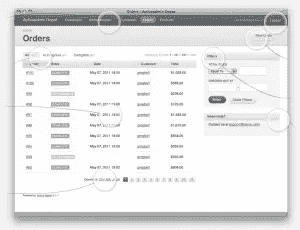
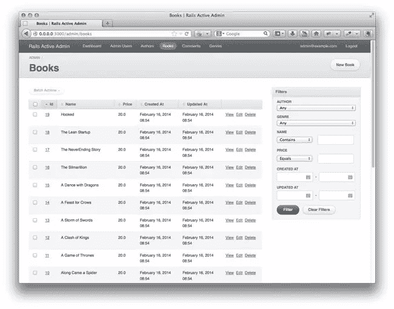

# Rails 中带有主动管理的简单管理界面

> 原文：<https://www.sitepoint.com/easy-admin-interfaces-active-admin-rails/>



应用程序管理是大多数 web 应用程序中的常见需求，从头构建一个应用程序可能是一项艰巨的任务。然而，在创建管理界面时，有一些选项可以帮助您避免从零开始。我们将看到一个流行的可用选项—[主动管理](http://activeadmin.info)。

Active Admin 是一个用于构建管理风格界面的框架。只需很少的努力，您就可以创建一个管理界面，使您能够管理您的数据，它是高度可定制的。我们将研究如何在 Rails 4 应用程序中设置和定制它。

您应该注意到，在撰写本教程时，还没有支持 Rails 4 的官方版本(正在开发的版本 1.0.0 将支持 Rails 4)。现在，你必须使用主分支。此外，主动管理 Github repo 的维护者警告说，官方网站[上的文档已经过时，最新的文档，你应该检查一下](http://activeadmin.info/documentation.html) [Github repo 页面](https://github.com/gregbell/active_admin)本身。

## 安装和设置

对于本教程，我设置了三个模型。

```
rails g model Genre name:string
rails g model Author first_name:string last_name:string
rails g model Book name:string price:decimal author:references genre:references
rake db:migrate
```

这些模型具有以下关联。

`app/models/genre.rb`

```
class Genre < ActiveRecord::Base
  has_many :books
end
```

`app/models/author.rb`

```
class Author < ActiveRecord::Base
  has_many :books
end
```

`app/models/book.rb`

```
class Book < ActiveRecord::Base
  belongs_to :author
  belongs_to :genre
end
```

要设置 Active Admin，请在 gem 文件中添加 gem。目前对于 Rails 4 的支持，我们正在跟踪 master。

```
gem 'activeadmin', github: 'gregbell/active_admin'
```

然后安装它。

```
bundle install
```

运行生成器以安装 Active Admin。这将创建一个`AdminUser`模型、一个用于配置 Active Admin 的初始化文件和一个保存管理文件的`app/admin`目录。它使用[设计](https://github.com/plataformatec/devise)进行认证。

```
rails g active_admin:install
```

如果您已经建立了一个`AdminUser`模型，那么您可以运行下面的代码，它将使用现有的`AdminUser`模型。

```
rails g active_admin:install AdminUser
```

对于需要手动进行的一些设置，您将在终端上获得进一步的设置说明。

接下来，运行迁移。

```
rake db:migrate
```

启动服务器并导航到[http://localhost:3000/admin](http://localhost:3000/admin)。您应该能够使用以下内容登录:

```
Username: admin@example.com
Password: password
```

登录后，将显示管理仪表板。顶部是一个菜单，显示已向 Active Admin 注册的型号。至此，只注册了`AdminUser`型号。您可以查看注册管理员用户的列表，编辑他们的信息，并创建新用户。

## 创建管理员用户

在向 Active Admin 注册其他模型之前，让我们更改创建 Admin 用户的默认行为。默认情况下，要创建管理员用户，管理员需要输入电子邮件、密码和确认密码。如果应用程序只要求提供电子邮件地址，然后给用户发送一个链接，让他们可以设置密码，那就更好了。

将用于在`app/admin/admin_user.rb`中创建管理员用户的表单更改为仅包含电子邮件字段。

```
form do |f|
  f.inputs "Admin Details" do
    f.input :email
  end
  f.actions
end
```

现在，通过在`app/models/admin_user.rb`文件中添加以下内容，可以创建一个没有密码的管理员。

```
after_create { |admin| admin.send_reset_password_instructions }
def password_required?
  new_record? ? false : super
end
```

`password_required?`方法检查记录是否是第一次被创建，如果是，则返回 false，从而允许创建一个没有密码的管理员。`after_create`方法向注册的电子邮件地址发送一封电子邮件，其中包含设置密码的链接。这已经由 device 进行了设置，因为默认情况下，device 安装有`rememberable`子模块。(当管理员试图通过忘记密码链接找回密码时，会发送这封电子邮件。您可以[修改](http://www.moku.io/blog/tech/tutorial-devise-rails/)默认的模板信息，以适应更改密码和设置密码的需要。

如果您没有在环境文件中定义默认 url 选项，那么发送电子邮件将会失败。由于我们正在开发中，请在`config/environments/development.rb`文件中包含以下内容。

```
config.action_mailer.default_url_options = { :host => 'localhost:3000' }
```

当然，您需要为要发送的电子邮件设置一个邮件程序。这超出了本教程的范围，但是您可以查看 [Action Mailer](http://guides.rubyonrails.org/action_mailer_basics.html) 文档，了解如何在 Rails 应用程序中发送电子邮件。即使没有设置 Action Mailer 来发送邮件，我们也可以在终端上查看邮件内容。您可以在电子邮件中找到更改密码链接 url，然后将其复制并粘贴到浏览器中，以测试它是否有效。

## 自定义视图

注册我们的三种型号:

```
rails generate active_admin:resource Genre
rails generate active_admin:resource Author
rails generate active_admin:resource Book
```

我通过在`db/seeds.rb`文件中放置以下内容来填充数据库，并运行`rake db:seed`

```
ya = Genre.create! :name => "Young Adult"
humor = Genre.create! :name => "Humor"
gnovel = Genre.create! :name => "Graphic Novel"
crime = Genre.create! :name => "Crime"
fantasy = Genre.create! :name => "Fantasy"
business = Genre.create! :name => "Business and Finance"

collins = Author.create! :first_name => "Suzanne", :last_name => "Collins"
kaling = Author.create! :first_name => "Mindy", :last_name => "Kaling"
handler = Author.create! :first_name => "Chelsea", :last_name => "Handler"
ohba = Author.create! :first_name => "Tsugumi", :last_name => "Ohba"
oda = Author.create! :first_name => "Eiichiro", :last_name => "Oda"
grisham = Author.create! :first_name => "John", :last_name => "Grisham"
patterson = Author.create! :first_name => "James", :last_name => "Patterson"
martin = Author.create! :first_name => "George", :last_name => "Martin"
tolkien = Author.create! :first_name => "John", :last_name => "Tolkien"
ende = Author.create! :first_name => "Michael", :last_name => "Ende"
ries = Author.create! :first_name => "Eric", :last_name => "Ries"
eyal = Author.create! :first_name => "Nir", :last_name => "Eyal"

Book.create! :name => "The Hunger Games", :price => 20.00, :author => collins, :genre => ya
Book.create! :name => "Catching Fire", :price => 20.00, :author => collins, :genre => ya
Book.create! :name => "Mockingjay", :price => 20.00, :author => collins, :genre => ya
Book.create! :name => "Is Everyone Hanging out Without Me?", :price => 20.00, :author => kaling, :genre => humor
Book.create! :name => "Are You There, Vodka? It's Me Chelsea", :price => 20.00, :author => handler, :genre => humor
Book.create! :name => "Death Note", :price => 20.00, :author => ohba, :genre => gnovel
Book.create! :name => "One Piece", :price => 20.00, :author => oda, :genre => gnovel
Book.create! :name => "The Pelican Brief", :price => 20.00, :author => grisham, :genre => crime
Book.create! :name => "A Time to Kill", :price => 20.00, :author => grisham, :genre => crime
Book.create! :name => "Along Came a Spider", :price => 20.00, :author => patterson, :genre => crime
Book.create! :name => "A Game of Thrones", :price => 20.00, :author => martin, :genre => fantasy
Book.create! :name => "A Clash of Kings", :price => 20.00, :author => martin, :genre => fantasy
Book.create! :name => "A Storm of Swords", :price => 20.00, :author => martin, :genre => fantasy
Book.create! :name => "A Feast for Crows", :price => 20.00, :author => martin, :genre => fantasy
Book.create! :name => "A Dance with Dragons", :price => 20.00, :author => martin, :genre => fantasy
Book.create! :name => "The Silmarillion", :price => 20.00, :author => tolkien, :genre => fantasy
Book.create! :name => "The NeverEnding Story", :price => 20.00, :author => ende, :genre => fantasy
Book.create! :name => "The Lean Startup", :price => 20.00, :author => ries, :genre => business
Book.create! :name => "Hooked", :price => 20.00, :author => eyal, :genre => business
```

运行该应用程序，您现在可以在仪表板菜单上看到`Authors`、`Books`和`Genres`项目。点击每个菜单项，您会看到该集合中的项目列表，每个项目都有`View`、`Edit`和`Delete`链接。

让我们改变默认的`Books`页面，如下所示。



首先，更改显示的列。Active Admin 显示对象拥有的所有字段的列，但在这种情况下，我们将删除`Created At`和`Updated At`列，并添加作者姓名和流派名称列。这是在`app/admin/book.rb`的`index`方法中完成的，其中指定了包含的列。

```
index do
  column :name
  column :author
  column :genre
  column :price
end
```

Active Admin 将检测`Book`与`Author`和`Genre`之间的`belongs_to`关系，但是您会注意到，对于作者列，条目的名称显示为`Author #1`(取决于记录的 id)。查看右边 Filters 工具条上的 Author 下拉菜单，注意显示的是 Author 对象名，而不是人类可读的内容。

这是由于[如何](https://github.com/gregbell/active_admin/blob/master/lib/active_admin/application.rb)主动管理决定使用什么名称作为对象的显示名称。

```
# Active Admin makes educated guesses when displaying objects, this is
# the list of methods it tries calling in order
setting :display_name_methods, [ :display_name,
                                  :full_name,
                                  :name,
                                  :username,
                                  :login,
                                  :title,
                                  :email,
                                  :to_s ]
```

要解决这个问题，在`app/models/author.rb`文件中为作者模型定义一个`to_s`方法。

```
class Author < ActiveRecord::Base
  has_many :books

  def to_s
  "#{first_name} #{last_name}"
  end
end
```

刷新页面时，Author 列现在将显示作者的名字和姓氏。

您还可以在数据显示之前对其进行一些操作。让我们更改“价格”列以显示其货币。为此，我们将使用`number_to_currency`助手。对于美元，不需要向该方法传递任何选项。

```
ActiveAdmin.register Book do
  index do
    column :name
    column :author
    column :genre
    column :price do |product|
      number_to_currency product.price
    end
    default_actions
  end
end
```

`default_actions`方法增加了“查看”、“编辑”和“销毁”链接。

通过在 index 方法中的字段名前指定新名称，可以更改列名。

```
column 'New Name', :name
```

页面右侧是一个过滤器，在搜索记录时非常有用。您可能不需要它提供的一些默认属性。对于图书选项，让我们指定要用于过滤的属性。在`app/admin/book.rb`中添加

```
filter :name
filter :author
filter :genre
filter :price
```

Active Admin 根据属性类型选择最相关的过滤器类型。对于作者和流派属性，它们显示在选择下拉菜单中。我们可能希望过滤属于多个流派或作者的记录，因此选择菜单对此没有用。让我们将它改为将集合项显示为复选框。

```
filter :author, :as => :check_boxes
filter :genre, :as => :check_boxes
```

可以修改侧边栏来显示更多信息。例如，向`Author` Show 页面添加一个侧边栏，在表格中列出作者写的所有书籍。在`app/admin/author.rb`文件中，进行以下更改。

```
ActiveAdmin.register Author do
  sidebar 'Books by this Author', :only => :show do
    table_for Book.joins(:author).where(:author_id => author.id) do |t|
      t.column("Title") { |book| book.name }
    end
  end
end
```

## 导入数据

默认情况下，该界面允许我们逐个创建记录。如果我们有大量的数据需要保存，或者我们想要使用来自另一个应用程序的数据，那么这样做的效率会很低。可以在应用程序中启用 CSV 导入。

为此我们将使用`active_admin_importable`宝石。在您的 gem 文件中添加:

```
gem 'active_admin_importable'
```

然后执行`bundle install`。

要在作者页面上启用 CSV 导入，在`app/admin/author.rb`中添加以下内容。

```
active_admin_importable
```

页面的右上角会出现一个`Import Authors`按钮。单击它并浏览您的本地文件系统，找到您想要导入的 csv 文件。该文件应该有一个与您的模型属性相对应的标题行。您不必包含所有列，因为默认值将被插入到您遗漏的列中。

我创建了一个包含以下两条记录的 CSV 文件，并将其导入。

```
First name,Last name
Jane,Doe
John,Doe
```

## 下载数据

Active Admin 使您能够下载 CSV、XML 或 JSON 格式的数据。

当您下载 CSV 文件时，您将看到模型的属性作为文件的头。您可以指明 CSV 文件中包含的内容。对于作者模型，将我们的 CSV 文件格式化为只包含作者的名和姓。

在`app/admin/author.rb`中包括以下内容。

```
csv do
  column :first_name
  column :last_name
end
```

您也可以启用[电子表格](https://github.com/randym/activeadmin-axlsx)导出。将以下内容添加到 gem 文件中。

```
gem 'activeadmin-axlsx'
```

运行`bundle install`。运行该应用程序时，您会看到每个资源页面上都包含一个 XLSX 链接，作为下载数据的选项之一。

可以格式化电子表格中导出的数据。下面包括作者的名字和姓氏，并更改了标题颜色。在`app/admin/author.rb`中添加。

```
xlsx(:header_style => {:bg_color => 'C0BFBF', :fg_color => '000000' }) do
  delete_columns :id, :created_at, :updated_at
end
```

如果您不想提供 XML 作为下载选项，您可以通过在模型的 Active Admin 文件中添加以下内容来更改特定模型的选项。例如，在`app/admin/author.rb`中添加下面的语句，这只会改变作者页面上的链接。

```
index download_links: [:csv, :xlsx]
```

要为名称空间中的所有资源设置选项，请将以下内容添加到`config/initializers/active_admin.rb`文件中。

```
ActiveAdmin.setup do |config|
  config.namespace :admin do |admin|
  admin.download_links = [:csv, :xlsx]
  end
end
```

## 结论

我们已经了解了一些常见的定制，但是还有很多 Active Admin 的特性我们还没有介绍。要了解更多信息，请从[文档](http://activeadmin.info/documentation.html)和 [Github 页面](https://github.com/gregbell/active_admin)开始。

## 分享这篇文章