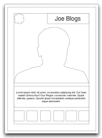
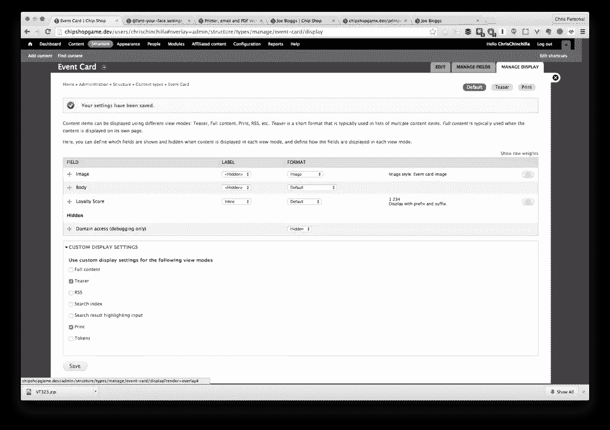
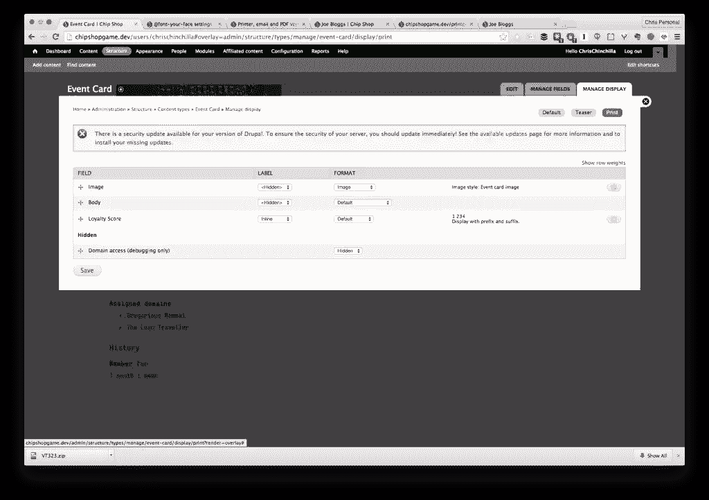
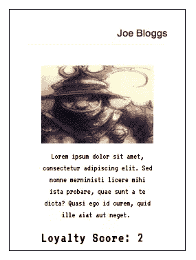
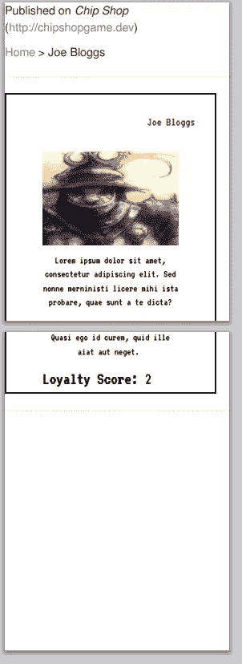
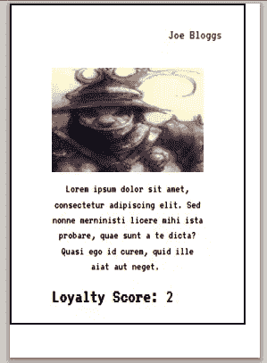
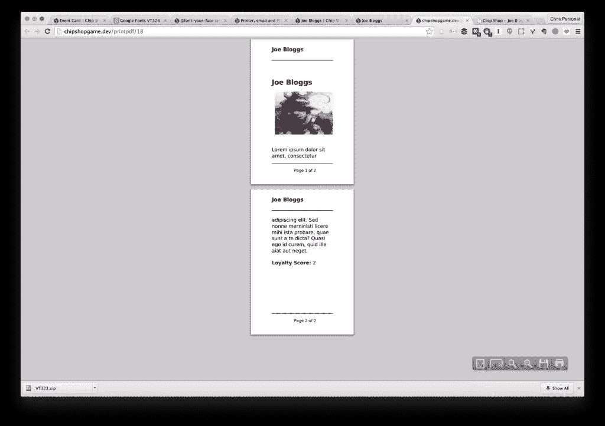
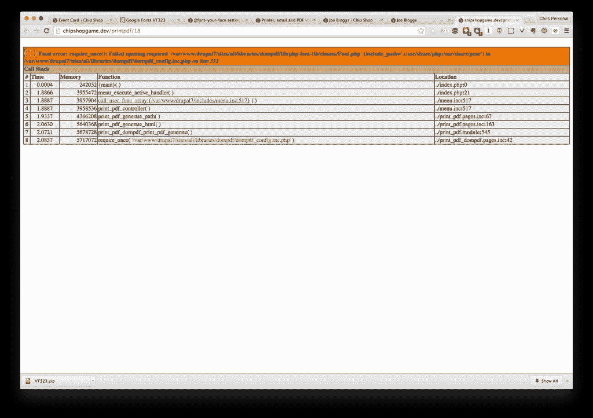

# Drupal 中有效的 PDF 生成

> 原文：<https://www.sitepoint.com/effective-pdf-generation-drupal/>

几个月前，我有一个 PDF 生成的客户需求，在这种情况下，生成可以在线查看或打印的证书。我花了一些时间研究可用的最佳 Drupal 选项，并收集了一些关于如何最好地实现这些目标的建议。在向几个人提到我的结果后，似乎 PDF 生成是一个常见的需求，现在我在一个个人项目中又有了同样的需求，所以这似乎是一个很好的案例研究，向您介绍我的发现。

## 为什么不直接打印？

如果你的需求很简单，告诉你的网站用户打印可能会更容易，没有什么能阻止他们这么做。如果我们想要对打印的内容进行一定程度的控制，或者我们想要分发文件进行打印，那么我们需要考虑其他选项。

## 网络与印刷

PDF 生成需要稍微改变一下思维模式。作为 web 开发人员，我们花了大量时间说服来自印刷背景的设计师停止制作难以在 web 上复制的像素级完美设计。如果您想引入 PDF 生成或任何形式的高设计打印输出，那么我们需要重新学习我们留下的一些旧技能。印刷的本质意味着它是精确的，往往需要像素(或毫米)级的完美设计。

## 我想要完成什么？

我目前正在开发一款[桌游](http://chipshopgame.com)，我想让玩家能够创建自己的卡片，这些卡片可以在网站上分享，也可以打印出来在游戏中使用。我们有一个特定的大小和布局，这些卡将永远需要符合，这里是我们将部分重建的初始设计:



## Drupal 中的 PDF 选项

在 Drupal 中有两个创建 pdf 的选项。[打印模块](https://www.drupal.org/project/print)和[查看 PDF](https://www.drupal.org/project/views_pdf) 。视图 PDF 最初似乎是更好的选择，因为它允许我们利用视图的力量和它提供的无数选项。然而，它依赖 PHP 模块，据我所知，依赖于`eval()`函数。PDF 生成有可能成为一项服务器密集型任务，这种方法对我来说效率很低，除了我不愿意在 Drupal 中启用任何类型的 PHP 评估模块。

这促使我选择了打印模块，它也得到更好的支持，并提供了许多其他可能有用的输出选项。

接下来我们需要决定我们的 PDF 生成库，我将建议你使用 wkhtmltopdf 并稍后解释为什么，因为我想先构建一些东西来比较。请访问 [wkhtmltopdf](http://wkhtmltopdf.org/downloads.html) 网站，并按照说明进行设置。请记住，它需要安装在本地和生产站点上。安装后，您需要在 Drupal libraries 文件夹中创建 wkhtmltopdf 可执行文件的别名，即:

```
ln -s /usr/bin/wkhtmltopdf /var/www/sites/all/libraries/wkhtmltopdf
```

如果你在 Ubuntu 下安装，我遇到了一些官方存档的问题，我建议从上面的链接手动安装。

## 配置打印模块

让我们从`admin/config/user-interface/print/common`的一般设置开始:

*   *徽标选项，页脚选项*:在我的例子中关闭。
*   保持当前的主题 CSS :启用这个来保持主题的一致性和减少工作量。

让我们设置链接显示的方式和位置，以达到我们的 PDF /印刷版本，`admin/config/user-interface/print/ui`。

我把我的设置成块显示，这样我可以对布局有更多的控制。


PDF 输出的整体配置选项位于`admin/config/user-interface/print/pdf`

我推荐这些设置:

*   *在*:新浏览器窗口中打开 PDF
*   *纸张尺寸和方向*:适合您的尺寸和方向。现在我用 A7 作为我的卡，它不完全一样，但对这个演示来说足够接近了。
*   缓存:我还不能确定这有多有效，但是通常的规则是适用的，在开发期间保持关闭，在生产中保持打开
*   *文件名*:我会用`[site:name] - [node:title]`，你可以在这里用代币。

查看 wkhtmltopdf 细节，`admin/config/user-interface/print/pdf/wkhtmltopdf`。
由于 wkhtmltopdf 是一个更高级的工具，它是基于命令行的配置，你可以在这里找到关于它的更多细节[。](http://wkhtmltopdf.org/usage/wkhtmltopdf.txt)

以下是我添加的一些额外内容:

```
--margin-bottom 0m --margin-left 0m --margin-top 0m --margin-right 0m --dpi 300
```

这确保了我们没有被 wkhtmltopdf 添加的边距，并且可以依赖我们的 CSS 输出。我们也以 300dpi 进行打印渲染。

**关于图像的快速注释**。这里有设置图像 dpi 渲染的选项，但是当然如果有人上传了一个 72dpi 的图像，它被放大到 300dpi，它看起来会很差。要做到这一点，需要结合配置和用户培训。

## 创建 HTML

打印模块的工作原理是将 HTML 标记重新创建为其他输出格式。我发现首先创建将产生这个输出的标记和 CSS 更容易。在我的情况下，这影响了我的内容类型的默认输出，但这可以通过使用视图模式或打印模块自己的打印输出来保持独立。以下是我的内容类型–我添加了一些我的内容类型需要的额外字段，但不是全部:



如果您愿意，打印模块还提供了它自己的定制视图模式，这样我们就可以复制相同的显示，或者与上面提到的技术结合使用。



## 创造风格。

打印模块自带样式表(`print.css`，位于模块文件夹中)，可用于创建仅适用于打印模块渲染版本的节点的样式。你需要给你的主题添加一个副本，并以通常的方式将它们添加到你的主题的`.info`文件中。

如果你选择了选项*保持当前的主题 CSS* ，如上所述，那么打印模块将使用你的主主题样式，然后检查`print.css`文件中的任何覆盖，你只希望在打印模块渲染输出。这对我来说最有意义，感觉是最整洁的选择。如果不使用这个选项，那么`print.css`文件是唯一会影响输出的样式表。本例的其余部分将假设它已启用。

这是我们之前看到的设计的简化 HTML 版本:



我正在使用一个自举子主题，它自带的标记可能与你的主题不同。我通过 [font-your-face](https://www.drupal.org/project/fontyourface) 加载了一些自定义字体，并为图像创建了一个自定义图像样式，这些字段名称也代表了我上面添加的字段。图像样式不允许你用厘米来定义尺寸，为了得到正确的像素尺寸，我使用了这个[工具](http://www.vesterkopi.dk/en/help/561-convert-cm-to-pixels)。

我们有一个特定的打印尺寸，我们正在努力完成。您可以在 CSS 中用各种单位指定大小，所以在我们的例子中，我使用厘米。

这是我的 CSS:

```
//This is my main content area, will be different in other themes and in mine covers the regions that appear for logged in and anonymous users
    .node-type-event-card .main-container section.col-sm-9,
    .node-type-event-card .main-container section.col-sm-12 {
      border: solid 1px #000000;
      width: 6.8cm;
      height: 9.3cm;
      padding: 0.681cm;
    }

    //The card title
    .node-type-event-card .main-container h1.page-header {
      text-align: right;
      margin: 0;
      font-size: 14px;
    }

    //Sets card padding
    .node-type-event-card .main-container .content {
      padding: 20px;
    }

    //Formats the field contents
    .node-type-event-card .main-container .content .field {
      color: black;
      margin-top: 10px;
      margin-bottom: 10px;
    }
    .node-type-event-card .main-container .content .field-name-body {
      font-size: 12px;
      text-align: center;
    }
    .node-type-event-card .main-container .content .field-name-field-image img {
      width: 100%;
    }
```

以下是 PDF 输出目前的样子:



不太对。

这是因为打印模块使用的是我们的主题，而不是另一个 tpl 文件`print.tpl.php`。将它从模块中复制到你的主题中，这样我们可以做一些修改。您可以添加`--format`指定输出格式，即`print--pdf.tpl.php`。

我们之所以要编辑这个，主要是因为打印模块默认在页面顶部打印了一堆链接和一些我们不想要也不能在 UI 中移除的`hr`标签，所以我们来整理一下。这是我最后的 HTML:

```
<!DOCTYPE html PUBLIC "-//W3C//DTD XHTML+RDFa 1.0//EN"
      "https://www.w3.org/MarkUp/DTD/xhtml-rdfa-1.dtd">
    <html xmlns="https://www.w3.org/1999/xhtml" xml:lang="<?php print $language->language; ?>" version="XHTML+RDFa 1.0" dir="<?php print $language->dir; ?>">
      <head>
        <?php print $head; ?>
        <base href='<?php print $url ?>' />
        <title><?php print $print_title; ?></title>
        <?php print $scripts; ?>
        <?php if (isset($sendtoprinter)) print $sendtoprinter; ?>
        <?php print $robots_meta; ?>
        <?php if (theme_get_setting('toggle_favicon')): ?>
          <link rel='shortcut icon' href='<?php print theme_get_setting('favicon') ?>' type='image/x-icon' />
        <?php endif; ?>
        <?php print $css; ?>
      </head>
      <body>
        <?php if (!empty($message)): ?>
          <div class="print-message"><?php print $message; ?></div><p />
        <?php endif; ?>
        <?php if ($print_logo): ?>
          <div class="print-logo"><?php print $print_logo; ?></div>
        <?php endif; ?>

        <?php if (!isset($node->type)): ?>
          <h2 class="print-title"><?php print $print_title; ?></h2>
        <?php endif; ?>
        <div class="print-content"><?php print $content; ?></div>
        <div class="print-footer"><?php print theme('print_footer'); ?></div>
        <?php if ($sourceurl_enabled): ?>
          <div class="print-source_url">
            <?php print theme('print_sourceurl', array('url' => $source_url, 'node' => $node, 'cid' => $cid)); ?>
          </div>
        <?php endif; ?>
        <?php print $footer_scripts; ?>
      </body>
    </html>
```

我的 CSS ( `print.css`)与之前的 CSS 非常相似，但是反映了页面结构:

```
// I have found that clearing the margins helps with the PDF generation    
    body {
          margin: 0;
          padding: 0;
        }

        html {
          margin: 0;
        }

        .print-content .node {
          border: solid 1px #000000;
          width: 6.8cm;
          height: 9.3cm;
          padding: 0.681cm;
          font-family: 'VT323';
          font-size: 20px;
        }

        .print-content h2 {
          text-align: right;
          margin: 0;
          font-size: 14px;
        }

        .print-content .content {
          padding: 20px;
        }

        .print-content .content .field {
          color: black;
          margin-top: 10px;
          margin-bottom: 10px;
        }

        .print-content .content .field-name-body {
          font-size: 12px;
          text-align: center;
        }

        .print-content .content .field-name-field-image img {
          width: 100%;
        }
```


现在，字体有什么问题？不幸的是，我们不能使用远程服务器上的自定义字体(在这种情况下，谷歌字体)。我不确定这是打印模块的问题(查看`print.tpl.php`，它以不同的方式加载样式)还是 wkhtmltopdf 的问题。如果你不能下载你的字体，我发现了一些其他潜在的途径，但是我会假设你可以，并展示一个简单的方法。

下载你的字体并在本地添加，我把它们放入`theme/fonts`，并在你的 print.css 文件的顶部添加下面的 CSS。

```
@font-face {
      font-family: 'VT323';
      src: url('../fonts/VT323-Regular.ttf');
      font-style: regular;
      font-weight: 400;
    }
```

瞧啊。



嗯，我们还有一页边空白，但那是因为我们没有使用正确的纸张尺寸。所以，除此之外，这是非常伟大的！

## Why wkhtmltopdf?

你们中的许多人可能对 [TCPDF](http://www.tcpdf.org/) 和 [dompdf](https://github.com/dompdf/dompdf) 很熟悉——它们很常见，而且相当轻便。我尝试了 TCPDF，结果如下:



没有现成的 wkhtmltopdf 准确，所以我尝试了 dompdf:



嗯。这是因为我正在使用自定义字体，文档提到，通过更改，我可以得到这个工作。然而，wkhtmltopdf 直接为我工作，没有调整或筛选文档。它的目标是产生一个完整的 HTML 副本，所以通常是 99%准确。我的上一个项目(要复杂得多)在使用一些更适合筛选的 CSS 技术时发现了一些问题，但即使是这些问题也是可以解决的。

虽然 wkhtmltopdf 提供了迄今为止最好的 pdf 输出，但安装需要安装一个可执行文件，这可能会使它不适合大多数人。但是，我会假设如果你正在使用 Drupal，并且需要达到这种布局复杂度，那么你可以访问你自己的服务器或者 VPS。

您尝试过用 Drupal 生成任何形式的 PDF(或其他格式)吗？我很想听听你找到的建议和调整。

## 分享这篇文章