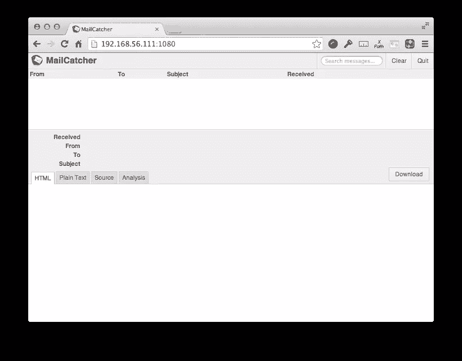
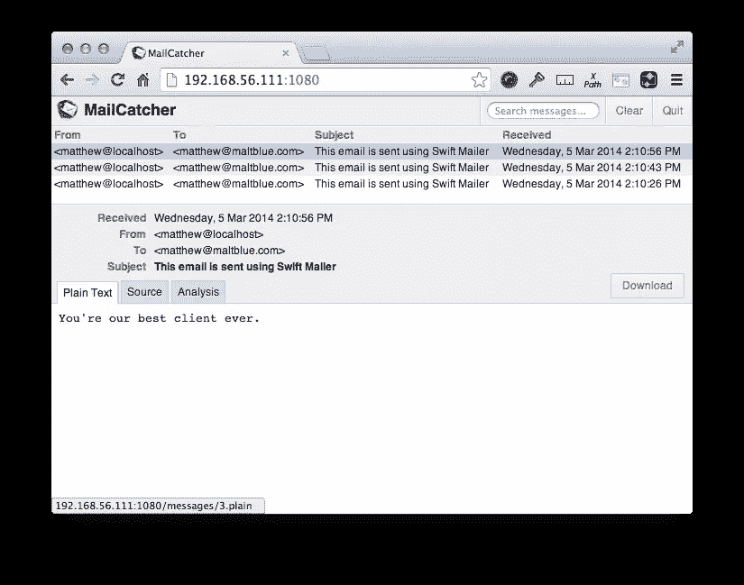
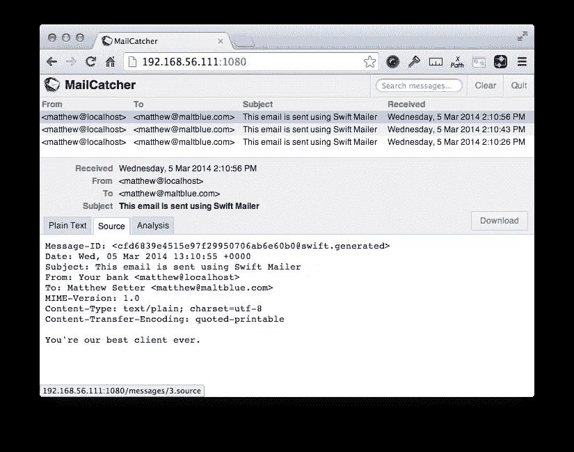

# 使用 MailCatcher 调试电子邮件

> 原文：<https://www.sitepoint.com/email-debugging-mailcatcher/>

你在申请中使用电子邮件，对吗？好吧，这是个反问句。你当然知道。尽管电子邮件已经有 30 多年的历史了，但它仍然是这个星球上最受欢迎的应用程序。以下是 2012 年来自 Pingdom 的一些统计数据:

*   **22 亿**——全球电子邮件用户数量
*   **1440 亿**——全球每天的电子邮件总流量
*   **43 亿**—2012 年全球电子邮件客户端数量

**惊人！**

## 但是为什么要写另一篇关于电子邮件的文章呢？

原因很简单，我们都可能在某个时候遇到过。因为我们需要测试，尽可能地接近产品，但不要意外地给我们的客户发电子邮件，以免他们因为客户收到了测试邮件而感到困惑、沮丧或尴尬。

我相信你明白我的意思。您认为您已经将应用程序设置为某种调试模式。考虑到这一点，您开始测试，从您的应用程序发送大量电子邮件。自始至终，你都觉得很舒服，因为你知道除了你没人会看到他们。

你的测试通过了，你祝贺自己，然后继续前进。过了一会儿，你接到一个客户打来的 Skype 电话，我们姑且称之为简单的电话。她的客户一直打电话来，询问他们为什么会收到来自她公司的奇怪电子邮件，她对此很恼火。她不开心，想要答案？

去过吗？不想再去了？我猜你不知道。下面是解决方案—[邮件捕捉器](http://mailcatcher.me)。如果你不熟悉，邮件捕手

> …运行一个超级简单的 SMTP 服务器，它捕获发送给它的任何消息，并在 web 界面上显示。运行 mailcatcher，将你最喜欢的应用程序设置为发送到 smtp://127.0.0.1:1025，而不是默认的 smtp 服务器，然后查看 [http://127.0.0.1:1080](http://127.0.0.1:1080) 以查看到目前为止到达的邮件。

听起来是个好办法吗？无论你是累了，有压力了，还是刚加入团队，或者只是需要运行测试——mail catcher 将确保不会有电子邮件被发送到你的网络之外，甚至是你的开发虚拟机之外。

在这篇文章中，我将向你展示当电子邮件被它捕获时，如何设置和运行它。

## 预先准备好的虚拟机

为了省去你设置 MailCatcher 的许多麻烦，我创建了一个自定义的 save you 来帮你完成这一切。确保您已经安装了 VirtualBox 和 vagger，然后使用以下命令克隆文章的存储库副本:

```
git clone git@github.com:sitepoint-examples/mailcatcher-article.git
```

然后，在克隆的项目目录中，运行以下命令:

```
vagrant up
```

这将启动虚拟机配置过程，在配置过程运行时显示大量输出。配置的虚拟机相当简约。它安装了*邮件捕捉器*、*发送邮件*和 *Nginx* 。

Nginx 有一个简单的 VHost 设置，它将项目目录映射到虚拟机上的`/var/www/`。如果您想确切了解供应期间发生了什么，请查看`provision.sh`。

## 手动安装邮件捕捉器

如果您想自己安装 MailCatcher，并且您有一个虚拟机(或者一个可用的 Linux 机器)，下面是运行的步骤:

```
sudo apt-get install -y vim curl python-software-properties lynx nginx
sudo apt-get install -y php5-fpm php5-memcache memcached php-apc
sudo apt-get install -y build-essential libsqlite3-dev ruby1.9.3 sudo gem install mailcatcher
sudo mailcatcher --http-ip 0.0.0.0
```

您可能需要也可能不需要运行第三个命令。我这样做了，因为我使用了一个非常简约的 Ubuntu Precise 64 流浪者图像，它需要这些包来构建 MailCatcher。请注意，如果您使用的是不同的 Linux 发行版或版本，各个包的名称可能会有所不同。

**注意:**如果您遵循标准的 MailCatcher 启动过程，它将只监听 IP `127.0.0.1`和端口`1025`。在这种设置下，我们无法从主机上看到它。因此，我在虚拟机上添加了一个公共 IP，`192.168.56.111`,并更改了 MailCatcher 的配置，使其监听所有 IP。

## 邮件捕捉器 Web 用户界面

现在您将能够在`http://192.168.56.111:1080`看到 MailCatcher web UI。它将看起来像下面的图像:



这是一个非常简单的界面，在顶部列出了邮件捕捉队列中的邮件，如果有的话。当列表中有电子邮件时，底部窗格很好地向您显示了关于它们的信息，我们稍后会看到。

## 示例代码

对于本文，我已经创建了一个简单的 PHP 脚本，`index.php`，可以在项目存储库中获得，并且可以在`http://192.168.56.111`访问。它使用 SwiftMailer 连接到 MailCatcher 并在加载时发送电子邮件。您可以在下面的代码中看到一个相当标准的 HTML 页面。

```
<?php require_once('mail-loader.php'); ?>
<html>
<head>
    <title>Simple MailCatcher PHP Example</title>
</head>
<body>
    <h1>Simple MailCatcher PHP Example</h1>
    <p>This application sends a number of emails which will be caught by MailCatcher. To check them, view them in <a href="http://192.168.56.111:1080/" target="_blank">the local MailCatcher installation</a></p>
</body>
</html>
```

包括`mail-loader.php`，下面有。

```
<?php
require('vendor/autoload.php');
$email = 'matthew@example.com';
$subject = 'testing';
$message = 'test message';

$transport = Swift_SmtpTransport::newInstance(
    "localhost", 1025
);

$message = Swift_Message::newInstance();
$message->setTo(array(
    "matthew@maltblue.com" => "Matthew Setter",
));
$message->setSubject(
    "This email is sent using Swift Mailer"
);
$message->setBody("You're our best client ever.");
$message->setFrom("matthew@localhost", "Your bank");

$mailer = Swift_Mailer::newInstance($transport);
$mailer->send($message, $failedRecipients);
print_r($failedRecipients);
```

如果你不熟悉 SwiftMailer [Aurelio 在 SitePoint](https://www.sitepoint.com/sending-email-with-swift-mailer/) 上的文章提供了一个很好的介绍。顺便说一下，我在这个例子中使用的是他的代码。**谢谢奥雷里奥。**

基本上，我们需要注意的只有一行，如下所示:

```
$transport = Swift_SmtpTransport::newInstance(
    "localhost", 1025
);
```

这将创建一个到我们刚刚设置的 MailCatcher 服务器的连接。就这样，没什么花哨的！我现在已经重新加载页面三次，已经发送了三封电子邮件。您可以在下图中看到它们被列在 MailCatcher 中。



我点击了第一个条目，它显示了收件人、发件人、收件人和主题的详细信息，以及电子邮件的正文。如果我们切换到 Source 选项卡，如下图所示，我们可以看到原始电子邮件的详细信息:



通过第三个标签，我们可以使用[分形](http://getfractal.com/)来分析我们电子邮件的内容。今天我将跳过它，因为它超出了本文的范围。

## 我们都准备好了

完成后，我们现在可以像以前一样创建电子邮件，设置收件人、主题、附件等等，就像我上面做的那样，并且知道它们永远不会到达真实的地址。

我们可以编写测试来验证代码是否正常工作。我们可以检查邮件发送工作流程，检查邮件内容、收件人、标题等等。它非常实用，不需要把任何东西送到我们的环境之外。

现在我们可以放心了，我们的客户(以及他们的客户)将永远不会收到任何不是给他们的邮件。真是如释重负。

## 包扎

现在，这是一个相当简单的例子，只使用了一个简单的 SwiftMailer 代码片段。我确信你的代码库比这个例子复杂得多。

但我相信在您的应用程序中，您会有可用的调试和测试配置，您可以相应地设置主机和端口，以区别于实时配置。通过这样做，不需要修改任何其他代码，并且您可以获得 MailCatcher 带来的安心的好处。

你已经在使用 MailCatcher 了吗？你整合它的经验是什么？有没有什么问题让你没有意识到？请在评论中分享你的想法。

## 分享这篇文章