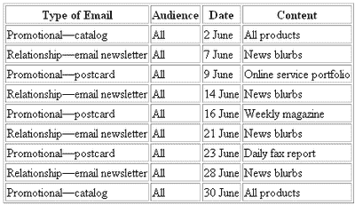
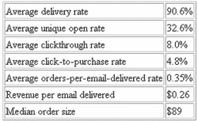
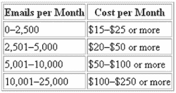
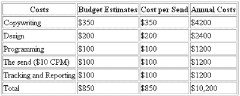
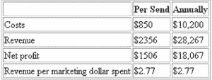

# 电子邮件营销策略:成功的捷径

> 原文：<https://www.sitepoint.com/email-marketing-strategy/>

许多电子邮件营销项目都是有机增长的。一个想法诞生了，发了一封邮件，奏效了，又发了一封邮件，如此循环。虽然这种方法没有错，但是通过实施战略计划，你通常可以在更短的时间内完成更多的事情。

这篇文章摘自我的 SitePoint 出版物 [*《电子邮件营销套件*](https://www.sitepoint.com/premium/library) 》，我们将看看制定有效电子邮件策略的计划涉及哪些内容，无论是你的第一次电子邮件营销活动，还是你想提升到下一个层次的现有活动。写这样一个计划需要相当多的时间和精力，一开始可能看起来有点令人生畏，但不要让这阻止你。一个计划不仅对你的活动的长期成功是必要的，对你在短期内保持正轨也是至关重要的。把它当作一种创造性的努力，一旦你掌握了窍门，你很快就会发现写一份战略计划其实是一件非常有趣的事情。

该工具包是一个规划，创建，实施和改善电子邮件营销活动的综合指南。它涵盖了电子邮件营销的所有方面，从不同类型的电子邮件，精心制作有效的选择消息的任务，以及制定伟大的主题行的挑战，从地址和消息内容，到优化送达率的主题，病毒式营销技术，以及第三方列表的使用。有关全部细节，请参见[目录](https://www.sitepoint.com/premium/library)。

但是现在，让我们开始制定你的电子邮件营销策略吧！

战略计划是一份不断发展的文件。随着你对电子邮件营销的了解和经验的增长，你会想改变你的计划，吸收你学到的新想法，去掉那些不符合你期望的想法。即使是最全面的计划也需要随着时间的推移而调整，所以不要犹豫，这样做是正常的，也是明智的。

在这一章中，我们将为一个虚构的出版公司——国会出版公司——开发一个电子邮件策略，它的主要竞争对手——同样虚构的国会文摘，已经有了一个有效的电子邮件营销活动。

为了给国会出版物创建一个电子邮件营销策略，我们将进行一系列的步骤，你可以在你自己的电子邮件营销活动中使用这些步骤。该过程包括以下任务:

1.  进行竞争分析。
2.  回答一些关于你的产品、受众、内容、邮寄时间表、目标和预算的关键问题。
3.  为战略设定量化目标。
4.  制定和分配预算。

不过，首先，让我们看看为什么我们应该首先制定一项战略。

##### 为什么要制定电子邮件策略？

为什么我们开车时要用路线图？这样我们就不会迷路了。好的方向将为我们节省时间、汽油和金钱，并为我们提供一个没有压力的旅程。

同样，电子邮件营销策略是你成功的地图。它会给你指明正确的方向，让你不会偏离方向，并确定你可以达到商业目标的最快路线。像好的方向一样，好的战略计划将节省您的时间，帮助您相应地制定预算，确保您的电子邮件工作与您公司的目标同步，并允许您提前计划，以便您不会错过机会。

和所有好事情一样，准备一个全面的战略计划需要时间。虽然这可能看起来是一个漫长的过程，但制定一个计划实际上会在未来节省你的时间——这是一个确保你用现有资源产生最佳结果的万无一失的方法。

既然我们致力于准备战略的想法，让我们开始吧！

##### 进行竞争分析

在你开始起草自己的电子邮件策略之前，戴上你的侦探帽，开始调查你的竞争对手在做什么。进行竞争分析有助于您了解自己面临的挑战，让您有机会从竞争对手那里收集营销活动的想法，并找出让您的沟通更有效的优势。

很自然，你会想关注你的竞争对手的营销努力，特别是电子邮件营销。现在让我们花一点时间来讨论这个问题。如果您的竞争对手不使用电子邮件，请随意跳到下一部分。

***进入竞争对手的名单***

全面竞争分析的第一步是订阅竞争对手的邮件列表和电子邮件简讯。我建议你使用一个不会泄露太多关于你或你的企业信息的电子邮件地址，因为众所周知，公司会将竞争对手的电子邮件地址列入黑名单。

 *在分析竞争对手的邮件时，你应该考虑以下几点。跟踪你的竞争对手发送的电子邮件的类型，他们发送邮件的时间，以及邮件发送给谁。和我一样，你可能也想保留每封邮件的副本以备将来参考。这些邮件是交易性的还是建立关系的？他们提到了哪些产品和服务？如何对待不同的细分市场？大约一个月后，你会对他们的基本计划有一个很好的感觉，你可以用这些知识来帮助塑造你自己的活动。

表 3.1 总结了我对国会出版物的主要竞争对手《国会文摘》的电子邮件营销活动的评论。该评论显示，在 6 月份，国会文摘发出了每周简讯和每周促销电子邮件，其中该公司的产品线轮换。每四封促销邮件中就有一封是包含出版商所有产品的目录。6 月，每周发两封邮件(一封是促销邮件；另一个是时事通讯)。《国会文摘》可能会决定在重大事件发生的几周内推出更多的时事通讯，或者在国会休会期间减少每周的电子邮件。

*表 3.1。《国会文摘》电子邮件营销竞争概述*

既然我们已经确定了国会电子邮件摘要的频率和时间，让我们仔细看看每封电子邮件的内容。我花了一些时间评估不同类型的内容(文章、采访、调查等)。)组织在其电子邮件中使用的内容，以及这些内容的来源。我问了自己一些问题。内容看起来是专业人员写的吗？它看起来像是被购买的吗？内容是专门为《国会文摘》写的，还是泛泛而谈？

你能在例 3.1 中看到任何模式吗？每封邮件都有相同的功能区。新闻导语被用作一种营销工具——除非注册，否则读者无法获得完整的故事。这些观点包括一小块一小块的专有内容，旨在吸引用户订阅。《每周提示》和《每周引用》包含简短的编辑内容，读者提交的内容是通过允许读者参与民意调查而开发的，民意调查的结果将予以公布。最后，但并非最不重要的是，国会产品文摘的广告也包括在内。

*例 3.1。评估国会简报电子邮件的内容*
**6 月 7 日**

*   上周的新闻简介(订阅者链接到全文)
*   关于本周期待什么的观点文章
*   关注国会的一周提示
*   本周报价(代表)
*   投票:提名人会被确认吗？
*   上周的投票结果:能源法案会成为法律吗？
*   周刊广告

**6 月 14 日**

*   上周的新闻简介(订阅者链接到全文)
*   关于本周期待什么的观点文章
*   关注国会的一周提示
*   本周报价(代表)
*   民意调查:社会保障会发生什么变化？
*   上周的投票结果:提名人会被确认吗？
*   周刊广告

**6 月 21 日**

*   上周的新闻简介(订阅者链接到全文)
*   关于本周期待什么的观点文章
*   关注国会的一周提示
*   本周报价(代表)
*   民意调查:今年的社会保障法案会胎死腹中吗？
*   上周的民意调查结果:社会保障会发生什么变化？
*   周刊广告

**6 月 28 日**

*   上周的新闻简介(订阅者链接到全文)
*   关于本周期待什么的观点文章
*   关注国会的一周提示
*   本周报价(代表)
*   投票:马克·费尔特，又名“深喉”，将作为英雄还是反派留在人们的记忆中？
*   上周的民意调查结果:今年的社会保障法案会被否决吗？
*   周刊广告

所有的内容都有国会或政治倾向，而且这份清单上没有国会文摘会发现内部开发特别困难的内容——毕竟，这是一家出版公司。企业可以轻松地将付费出版物中的内容重新用于时事通讯的观点文章和新闻导语——与付费订阅者一周前收到的内容相同！

既然我们手头已经有了所有这些信息，让我们对国会的电子邮件内容进行一个快速的 SWOT 分析。SWOT 代表优势、劣势、机会和威胁。

**长处**
长处是使电子邮件通讯优秀的内在因素。我知道，“好”可以指任何东西，实际上它在这里的定义是广泛的。寻找简讯中给你积极印象的元素，例如特别相关的主题、易读的写作风格等等。

**弱点**
这些都是邮件简讯不好的内在因素。找出弱点，如肤浅的主题、无关的文章、充满不必要信息的行话内容和自我宣传内容。

**机遇**
机遇确定了你可以赶上或超越竞争对手的方式。该公司是否错过了任何你可以涵盖的相关话题？读者还会喜欢什么类型的内容？你还能做些什么来改善你提供给观众的体验？

威胁
威胁是你的竞争对手的表现中你会发现很难与之竞争的方面:完美无缺的报道主题，或是无论你如何努力都无法与之匹敌的精彩文章。列出这些威胁很重要，这样你就不会拿你的尊严和信誉冒险，向你的竞争对手挑战一个你不会玩的游戏。

你可以利用你的 SWOT 分析，让你的简讯胜过竞争对手。例如，如果国会出版物编制了一个即将到来的投票和关键委员会会议的日历，这些内容可以用在时事通讯中，填补国会文摘留下的空白。我还注意到，除了《本周引述》,《国会简报》没有提供太多外部来源的内容。我们可以在我们的时事通讯中包括对主要国会成员或顶级游说者的采访，这将为我们的读者提供有趣的阅读，并将我们的时事通讯与国会文摘的新闻通讯区分开来。最后，我喜欢民意调查的想法和他们得到的回应，所以我认为我们应该在我们的时事通讯中加入“今日问题”部分。

你监控的电子邮件营销活动越多，你收集的好主意就越多。有了新的变化，你也许可以利用这些想法来适应你自己的电子邮件简讯和读者群。

##### 解决关键问题

现在，我们已经完成了我们的竞争力审查，并进行了 SWOT 分析，是时候考虑我们希望通过新闻稿实现什么目标了。与其考虑这个非常宽泛的问题，不如让我们把它分解成一系列解决具体问题的小问题。

***你会推广什么产品或服务？***

如果你脑子里已经有了这些信息，现在是时候把它们都写在纸上了。尽可能详细地介绍你的产品或服务:你的产品或服务，可用的功能，你在竞争中提供的优势，你提供的特别优惠，以及任何其他相关的信息。我为国会出版物准备了以下产品说明:

*例 3.2。国会出版物内容描述*

国会出版物的记者报道国会的日常事务。作为第一家专注于国会的媒体，我们已经建立了公正和无党派出版物的声誉，并因我们的报道赢得了众多奖项。我们的出版物以三种形式发布:每周印刷出版物、每日印刷出版物和购买订阅内容网站。

订阅我们的每周印刷出版物《本周国会》,每年要花 100 美元。该出版物提供了每周国会活动的亮点，如关键立法状态的更新——谁支持它，为什么支持，谁不支持，以及关于该立法成为法律的可能性的专家意见，等等。在这种情况下，我们的优势是编辑——我们的记者有多年观察国会的经验，以及众多能够从议会内部提供宝贵见解的联系人。

订阅我们的每日印刷出版物《今日国会》,每年需要 250 美元。该产品包括日常国会活动的时间表，如委员会会议、提交的法案、投票等。虽然它没有像国会本周那样深入讨论问题，但《今日国会》确实提供了对每天活动的全面审查——这是目前其他组织都没有提供的功能。

我们的付费内容网站“国会在线”的订阅费是每年 500 美元，包括来自“本周国会”和“今日国会”的信息。此外，国会在线还提供目前正在审议的所有法案的全文，以及可追溯到十年前的出版物和事件的完整档案——比目前覆盖国会的任何其他在线服务都要多。

***你想联系谁？***

接下来，是时候考虑读者群了:我们的电子邮件策略的目标是谁？

**现有客户**

如果你的目标是你现有的客户，你的优势是已经对他们有所了解。创建详细的客户档案是个好主意，这样你就能清楚地了解你想与之交谈的人。尽量包括以下信息:

**人口统计信息**
包括客户的相关个人信息，如年龄、地点、教育背景、爱好和其他必要的详细信息。如果你的客户主要是企业，包括每家企业的运营时间，年收入的近似值，以及员工人数。

**特点、好处和优势**
你的产品和服务有什么特点？当客户选择你的产品而不是你的竞争对手的产品时，他们得到了什么好处和优势？一定要区分特性、好处和优势——这些是不一样的！

例如，作为一个行业杂志的出版商，我可能会打广告:“我们的杂志提供最新的行业新闻。”在这种情况下，对我的客户的好处是:“作为我们杂志的读者，你总是了解你所在行业的最新动态，并对可能影响你的组织或职业的问题有所了解。”相对于竞争对手的优势？"由于我们每天出版，我们的读者总是比那些阅读每周出版的《竞争》杂志的读者领先一步。"

**购买决策的要素**
购买你所推销的产品或服务需要哪些步骤？决策过程中包含哪些逻辑和情感因素？购买你的产品是冲动购买，还是需要研究？除了理解购买决策的潜在需求、好处和优势，掌握购买过程本身也很重要。通过定义这一点，你将深入了解如何影响，甚至改变这一过程，使之对你有利。

利用自己的经验和其他来源，尽可能多地收集信息。网络是一个很好的资源:寻找人口普查数据、调查结果、研究以及与你的目标受众的需求和愿望相关的文章。

**潜在客户**

像对待现有客户一样，为潜在客户创建客户档案。但是，在这种情况下，您将为特定类型的客户而不是特定的客户创建概要文件，因此您的概要文件将更加通用。这些档案看起来像是您为现有客户群创建的档案，这是很自然的事情——如果某个特定群体是优秀的客户，您会希望找到更多这样的人！

你也可以通过瞄准一个完全不同的细分市场来扩大你的客户群。这很好，只要你做了调查，这样你就可以详细描述谁是被选中的人，为什么他们需要你提供的服务，以及他们从与你做生意中会获得什么好处和优势。

尽可能具体。忽略那些“不太重要”的细节太容易了，但是要避免宽泛定义你的受众的诱惑。你的描述越详细，你就越能有效地开发你的电子邮件营销策略来接触这些受众，并与他们成功沟通。

**按下**

创建媒体配置文件，指定要与之交流的媒体成员(记者、编辑和出版商)。你能猜到我接下来要说什么吗？没错:包括尽可能多的细节！请记住，策略中的细节是创建和运行成功的电子邮件营销活动的关键，它会给你带来最佳的投资回报。

想想你在推销什么，谁可能会对它感兴趣。如果你销售技术服务，寻找出版物、网站、博客、记者和其他报道这一主题的人，磨练你的个人资料以获得最佳结果。如果你在销售 DSL 服务，瞄准那些写 DSL 和高速互联网问题的博客比瞄准那些关注小工具而对你提供的东西不感兴趣的普通技术博客更有优势。

正如你可能知道的那样，你可以根据许多方面对一群媒体成员进行分类:他们覆盖的利基领域，他们涉足的行业，或者他们的地理位置；同样，细分市场将取决于你提供的产品和服务。

让我们看看我们为国会出版物开发的目标受众概况:

*例 3.3。国会出版物目标读者的定义*

从最广泛的意义上说，国会出版物的顾客和潜在顾客都是对国会新闻感兴趣的普通公众和国会议员。目前，我们服务于三个不同的细分市场:

**媒体渠道**
我们主要关注那些没有预算聘请全职记者报道大会的中小型地方报纸。相反，他们向我们寻求有关重要立法的最新信息，我们以非常低廉的价格提供这些信息。他们可能会使用这些内容作为故事的背景，或者逐字转载我们的故事和投票报告。

这些报纸的预算非常有限。虽然大多数人乐于每年花 100 美元购买我们的每周印刷出版物，但很少有人愿意订阅我们每年花费 500 美元的在线服务。由于这些报纸运营的预算紧张，我们在这个市场的续订量通常低于我们其他选区的续订量——如果一家报纸遭受预算削减，我们的出版物通常会首先受到影响。

在这个市场上获得一个新客户可能需要三到六个月的时间。我们通常提供免费试用，然后打电话跟进，回答潜在客户的任何问题，提供有用的建议，并接受订单。

**国会办公室**
国会办公室目前是我们最强大的市场部门——该地区的每个办公室都至少订购一种我们的产品。通过我们的出版物，他们能够跟上各种委员会的发展，并了解谁支持某项特定的立法及其原因。我们为他们提供至关重要的信息，并为他们节省宝贵的时间，否则他们会自己去收集信息。

大多数办事处分别以每年 100 美元和 250 美元的价格购买周刊和日报；许多人每种产品都有不止一份拷贝。和报纸一样，很少有办公室有预算订阅我们的在线服务。

幸运的是，我们的出版物被这一特定的细分市场视为必需品。在重大事件中，比如选举新的国会议员，我们的订单会激增。订阅很少停止，但对于那些，给出的主要原因是该办公室的成员已经离开国会。

销售周期很快，我们不需要做太多就可以赢得或保持业务。然而，由于这个受众是有限的，增长的空间很小。

说客
说客是我们最新的受众，我们发现他们非常有利可图。我们的目标是致力于政府事务的财富 500 强公司——希望代表其成员影响国会的大型协会，以及大型游说公司。

这样的组织需要跟上国会发生的事情，这些事情可能会影响他们的业务，或者他们的成员和客户的业务。我们是这一信息的可靠来源。我们的在线服务在这个市场非常受欢迎，因为组织需要访问档案来跟踪过去的立法。

国会出版公司还希望通过向一个新的细分市场进行营销来扩大其前景:提供政治学学位的大学。攻读此类学位的学生倾向于对当前的国会活动感兴趣。我们的出版物可以作为额外的教具，并说明立法过程。向大学营销也让我们能够向大学以外的未来客户介绍我们的产品，因为这些学生中的许多人将继续在我们目前服务的细分市场中工作。

我们的研究表明，这些大学没有大量的预算，所以我们的每周印刷出版物可能最适合他们。理想情况下，我们的营销活动将在 9 月份左右启动，因为这是大多数大学花费年度出版预算的时候。销售的主要联系人是那些在大学政治科学部门工作的人，以及大学图书馆员。

*目标群体*
*在某些情况下，将你的客户群划分成更小的部分可能是有意义的，这样你就可以向特定的群体推销特定的产品。如果你销售多种产品或针对多个群体，将你的客户群划分为更小的部分是有意义的，这样你就可以向特定的群体推销特定的产品，或者用不同的措辞来写你的电子邮件，以适应不同部分的特点。*
*你可以轻松做到这一点，而不会突破你的营销预算。例如，假设你是财务软件的创造者和发行者。您的一些客户使用该软件来管理他们的个人财务，而其他人则使用它来经营他们的业务。为了使你的营销信息满足这两类用户的特定需求，你需要将你的客户群分为两类:“家庭”和“企业”这样，你就不会让家庭用户对你的工资组件的好处感到厌烦，而企业用户也不会因为你谈论平衡家庭预算而轻视你。*
*那么，如何划分客户群呢？让你的客户为你做！问他们你需要知道什么，并根据这些信息创建小组。当用户注册财务软件时，询问他们是家庭使用还是商业使用。如果我们想进一步定位业务组中的特定行业，我们可以要求这些用户提供有关其业务所在行业的更多详细信息。*
*一旦你有了这些信息，就把它们添加到你的受众简介中，这样你就能清楚地知道这些细分市场以及你与他们的沟通会有什么不同。*
***你对目标受众的目标是什么？***

没错。你已经确定了你的目标受众，现在让我们为他们设定一些目标。我要再次强调这一点:让你的计划变得详细！仅仅说你希望你的客户从你这里购买是不够的。您需要查看您之前定义的目标群体，并为每个群体设定具体的目标。

让我们从陈述当前客户的一些常见营销目标开始。然后，我们再考虑其他受众群体。

**当前客户的目标**
**续订**
我们可以使用电子邮件营销作为留住客户的工具，鼓励客户重新订购。而不是给你的客户发一封电子邮件说“嘿，我的钱呢？”使用电子邮件来建立客户忠诚度，这样当续订通知发出时，就可以鼓励客户毫不犹豫地付款。

**追加销售**
电子邮件营销可用于向现有客户群推销产品的增强版。例如，一家提供在线音乐流媒体的公司提供两种服务:一种是每月 9.95 美元的基本服务，用户可以收听预编的广播电台，另一种是每月 19.95 美元的高级服务，用户可以选择他们想听的特定艺术家、专辑和歌曲。在通过基本服务的初始营销活动吸引了一些客户之后，该公司可能会通过修改电子邮件消息来使用相同的活动，以鼓励用户升级到高级服务。

交叉销售
你可以利用电子邮件营销向现有客户群推销相关产品——事实上，这是电信公司经常使用的策略。这些公司向已经在使用其电话服务的客户提供附加产品，例如长途服务、互联网连接和移动电话套餐。

推荐人
我们还可以利用电子邮件营销来鼓励人们通过口头宣传来做广告。我们都知道，一封来自可信赖的朋友或商业熟人的推荐信很有分量。从很多方面来说，这是最好的营销方式，因为它是挣来的，而不是买来的。

您可以为您的客户设定尽可能多的目标，这些目标可以根据您的需要进行细化或具体化。您可能对不同的客户群有不同的目标。以我们小小的在线音乐业务为例。当它发出续订电子邮件时，它还向使用基本服务的客户提供对高级服务的追加销售。已经在使用高级服务的客户只收到(令人信服！)续费邮件。

**潜在客户**

在这一点上，你可能想知道我为什么要问你对潜在客户的目标。当然，您希望他们变得不那么“有前景”，而更像“顾客”！这不言而喻。然而，为了建立一个能让你实现这一目标的策略，你需要考虑它将如何发生。

**直购**
邮件营销可以产生直销。如果你的产品价格合理，购买过程简单，你可以使用电子邮件给潜在客户直接购买的能力。如果产品是他们想要的，大多数潜在客户会立即抓住机会，毫不费力地购买。

**创造商机**
产生兴趣是另一个有效的目标。如果你在推销一个复杂的产品，而销售程序并不那么简单，比如申请信用卡，你可以先用电子邮件来引起潜在客户对该产品的兴趣。一旦产品引起了他们的兴趣，销售代表可以亲自与他们合作以达成交易。这种策略与直接营销非常不同:你不是向你的潜在客户提供如何购买产品的细节，而是向他们提供鼓励他们联系你的信息。

品牌知名度
你可以利用电子邮件营销来提高品牌知名度。也许你的目标根本不是销售——也许你只是想用电子邮件让你的名字出现在那里，这样人们就会认识你的品牌，了解你的公司在做什么。虽然线索和销售可能会因品牌知名度而增加，但这是一种比我们上面讨论的更温和的方法。许多公司会以认知策略开始他们的活动，介绍市场上新的产品或服务。只有在品牌建立之后，他们才会转向潜在客户或直接回应模式。

与现有客户一样，您可以混合搭配这些潜在客户策略，以创建一个适合您的策略。你需要了解客户在考虑你推销的产品或服务时所经历的销售周期，所以要做彻底的调查。

**按下**

你与媒体打交道的最终目的是获得免费宣传。你希望他们写一篇文章，让你的公司光彩照人，也许引用你的首席执行官作为行业专家，或者陈述你的企业是该领域的领导者。确保你了解你的媒体名单所能提供的报道的性质，这样你就可以根据他们的出版物来包装你的信息。

就是这样！让我们看看国会出版物的目标受众。

*例 3.4。国会出版物的目标受众目标*
**媒体渠道和潜在媒体渠道**
首先，我们的目标是留住客户:我们希望现有客户续订他们当前的订阅。由于我们的大多数媒体客户购买周刊，我们的第二个目标是向他们交叉销售日报。对于这个市场的潜在客户，我们的目标是直接向他们销售我们的周刊。

**国会办公室和潜在的国会办公室**
同样，我们的目标是留住客户——让办公室更新他们现有的订阅。由于他们可能已经订阅了这两种印刷出版物，我们的第二个目标是向我们的在线服务追加销售。这个市场的前景几乎不存在，因为该地区的大多数办事处已经订阅了一份或多份我们的出版物。然而，如果真的出现了，我们的目标是直接向他们销售周刊。

**游说者和潜在游说者**
由于这个群体中的大多数现有客户已经订阅了我们的高端产品——在线服务，我们现阶段的目标是确保他们保留这些订阅。虽然这是一个相对较新的市场，但我们已经确定这是一个可行的市场。我们想先把我们的每周订阅直接卖给潜在的游说者，以获得他们的支持。如果反应是积极的，我们将发起一项活动，鼓励他们稍后升级到在线服务。

**未来大学**
目前，我们在这个市场没有任何客户。我们最初的目标是让我们在这个社区中为人所知，但最终，我们希望大学购买我们的周刊。要做到这一点，我们首先需要建立品牌意识，然后开展直销活动。理想情况下，这项活动将在 9 月份左右开始，因为这是大多数大学花费年度出版预算的时候。

***什么类型的邮件最好？***

现在我们已经定义了我们的受众，并且我们知道我们想要达到的目标，是时候为我们设定的每个目标匹配一个电子邮件类型了。

**交易发票邮件**

这些类型的电子邮件最适合用于留住客户或客户续订。

我们对续约邮件要求不高。只要它提醒客户他们即将到期的订阅，并要求他们支付新的，我们很高兴。提供支付指示的电子邮件发票(在线支付的超链接，或通过电话支付的电话号码)足以满足此目的。许多组织使用“续订系列”电子邮件发票，在续订流程的特定时间点发送电子邮件:到期日前两个月、到期前一个月、到期前两周、到期前以及到期后。

然而，仅凭发票并不能激励您的客户继续订购。请记住，你的竞争对手总是潜伏着，等着你放弃他们可以抓住的客户。在续订过程中，您必须始终如一地(至少每月一次，但不要超过一次)通过强调您的企业提供的好处和优势给客户留下积极的印象。

为了获得最终的保留能力，请将您的交易发票电子邮件与用途广泛的关系电子邮件结合使用。

**关系邮件**

关系电子邮件非常适合:

*   续保或客户续订
*   追加销售和交叉销售
*   线索挖掘
*   品牌知名度
*   客户推荐

极其通用的关系电子邮件可以用来实现许多不同的目标，当它们与其他电子邮件格式(如明信片电子邮件或交易发票)结合使用时，效果尤其好。关系邮件可以包含任何内容，从简短的社论到电子邮件时事通讯，定期发送最为有效。

例如，考虑在线杂志订阅的续订流程。如果你使用的是一系列续订电子邮件，经常会有一张发票出现在客户的收件箱里，提醒他们欠你钱。现在，发票永远不会让顾客满意。但如果一两天后，他们收到一封关系邮件，其中包含一篇他们特别感兴趣的主题文章，他们的关注点将从杂志的金钱方面转移到他们有多喜欢它。到了续订的时候，这些客户会毫不犹豫地付款。

当与明信片邮件结合使用时，关系邮件也能成为令人信服的向上销售者和交叉销售者。你可以逐步使用它们来传达客户应该升级产品的许多理由。包括案例研究和十大列表(升级的十大理由，您需要升级的十大迹象，关于此套件的十大令人敬畏的事情…您明白了)不仅有助于说服个人客户，还可以为他们提供可靠的案例，如果他们需要寻求升级批准的话。

关系电子邮件对于挖掘销售线索至关重要。它们允许潜在客户在与销售代表打交道之前了解你，并且它们比其他一些形式要求更低的承诺水平。关系邮件让潜在客户了解你提供的产品，并了解为什么其他公司决定与你合作。这是一种经济有效的方式，可以将您的组织定位为该领域的专家，并让您的读者始终牢记这一理念。

最后但同样重要的是，关系邮件是你获得客户推荐的关键。与转发促销明信片电子邮件相比，客户更有可能将包含有趣内容的电子邮件转发给家人和朋友。除了让其他人了解你的业务，这些电子邮件还可能导致你的电子邮件简讯的额外订阅，为你提供更多的前景。

**明信片邮件**

明信片电子邮件适用于:

*   客户追加销售和交叉销售
*   直接购买
*   线索挖掘
*   品牌知名度

在直接购买或追加销售特定产品或服务时，一封有效的明信片电子邮件通常会起到作用。如果你发布了一个新产品，除了说“嘿，我现在出来了！给我买——你知道你想买！”你只需要一封明信片邮件。一封精心制作的明信片电子邮件可以产生巨大的影响，产生品牌知名度、潜在客户和直接购买。

正如我们前面看到的，明信片电子邮件也可以与关系电子邮件结合使用，以实现各种目标。

**沟通邮件**

给媒体的邮件使用交流邮件。

为了偷工减料，许多组织将他们的促销或关系电子邮件发送给媒体。在前一章中，我们看到，虽然所有这些电子邮件可能包含相同的信息，但它们的目标非常不同。如果你花时间和精力通过一封交流邮件发送一份真实的新闻稿，你的文章会更容易发表。

表 3.2，“国会出版社现有客户的电子邮件计划”和表 3.3，“国会出版社潜在客户的电子邮件计划”分别显示了国会出版社现有客户和潜在客户的电子邮件计划示例。

*表 3.2。国会出版社现有客户的电子邮件计划*

*表 3.3。国会出版社前景的电子邮件计划*

***你将从哪里获取内容？***

我们知道我们想寄给谁，以及我们想说服那些收件人做什么。但是看看我们想要发送的所有电子邮件。我们将在哪里找到所有这些内容？

对于纯粹的促销电子邮件，这很容易:它完全是关于你提供的产品和服务的特点、好处和优势，所以你可以重新调整现有营销文本的用途，或者创建适合你发送的电子邮件类型和你接近的受众的新文本。交易型和交流型电子邮件也不难。你知道你想说什么，你只需要写下能让你的信息被理解的内容。

当涉及到建立关系的电子邮件时，事情变得有点复杂。这里的关键是在编辑和宣传材料之间取得平衡。我经常使用 60/40 规则作为指导方针，也就是说，我在电子邮件中包含 60%的编辑或非宣传内容，40%的宣传内容。为什么是 60/40？这不是一个严格的规则，但是根据我的经验，更高的编辑内容比率通常意味着更多的工作，但是很少，如果有的话，额外的收获；另一方面，包含超过 40%的宣传内容会降低邮件中的关系优势，这会给人留下你只对宣传自己感兴趣，而不是满足收件人的需求或提供价值的印象。

大多数公司在推出电子邮件简讯时面临的最大障碍是识别和培育可持续的编辑内容来源。让我们在这个问题上领先一步，首先，我们将谈论你可能在简讯中涉及的主题；然后，我们将回答您如何获取内容的问题。

**选择内容主题**

这就是你对竞争对手所做的一切监视派上用场的地方。你知道他们在传达什么信息——利用这一知识来找出你如何提供对你的读者更有价值的信息。如果你的竞争对手每周发送一份重要事件的清单，也许你会每天发送一份细化的清单。他们的文章缺乏细节，而你的文章却充满了细节。如果他们遗漏了某个问题，你可以抓住它，让它成为你时事通讯的焦点。

不过，这个建议有一个警告:确保你的所有内容都与你的读者相关。当决定你想报道的话题时，要坚定地站在你的客户和潜在客户的立场上，考虑他们喜欢阅读的文章类型。

一旦你完成了所有这些，列一个你想涵盖的话题的清单。在每个主题下，列出与该主题相关的挑战、疑问和问题。当你对列表满意时，从付费和免费资源中寻找相关内容。

**采购付费内容**

购买内容通常是有意义的。然而，依赖付费内容会消耗掉你一大笔预算和利润。这里有一些关于如何充分利用付费内容的建议，以及一些预算指南。

如果你有一个伟大的客户成功案例，雇佣一个专业作家来写一个关于它的案例研究绝对是值得的。以这种方式创建案例研究将允许您提及或详述您认为重要的特性、好处和优势。与为杂志和其他出版物撰写的案例研究不同，这个案例研究将完全属于你:你将拥有版权，所以你可以随时使用它，而不会产生任何额外的费用。如果选择仔细，写得好，案例研究可以是永恒的——除非你大幅改变你的产品或服务，否则你的案例研究不太可能“过期”即使它不再适用，该案例研究仍然可以作为一个历史上的成功故事——这是另一个让你更值得专业地撰写这篇文章的原因。

大多数文案都是按字数收费的，每字收费在 0.5 美元到 1.00 美元之间；你为你最终使用的字数付费。当你委托撰写这种类型的文章时，你通常会给作者一个指导原则，比如“一篇 750 字的文章”或“一个 2000 字的案例研究”少于 750 字很难讲得太详细(当我写文章时，我很难写少于 1000 字)，所以每篇文章允许 500 到 1000 美元——可能更多。我不建议使用付费文章，除非你有一个与你的产品线特别相关的特定焦点，并且有一个允许你委托质量一致的文章的预算。

一些出版物和网站将允许你在你的电子邮件简讯中转载他们的文章，费用通常取决于收到你简讯的人数和你的商业目标。文章的教育性或非盈利性使用通常会比出于商业目的的复制收取更合理的费用。费率差别很大，取决于您提供内容的出版物或网站。有关详细信息，请查看出版物的权限或重印政策。

**文章收集**
某些公司会收费从出版物、网站和数据库中筛选出适合你的主题和读者群的文章。如果您在新闻稿中使用这些文章的导语，并允许您的读者点击查看完整版本的原始资料，您就可以免费使用这些文章(尽管您仍需支付中介费)。这是一种碰运气的方法，我见过产生好的和坏的结果。如果你的主题非常具体，你可能会有更多的运气，但研究人员在你的主题上的经验也起着很大的作用。我见过这样的组织，为电子邮件时事通讯寻找内容，每期收费 1，000 至 5，000 美元，尽管这种费用通常包括你的电子邮件的复制、设计、编程和邮寄。我们将在本章后面的“设定预算”一节中进一步探讨这些问题。

**采购免费内容**

那里有高质量的免费内容——只是比付费内容需要多一点时间来寻找和管理。以下是免费内容的一些最佳来源:

你的员工让你的员工写一些关于热门行业话题的文章，你所在组织的一个有趣的方面，甚至是他们的个人爱好或兴趣，这些都是很好的读物，可以使你的时事通讯和你的组织变得个性化。只要确保这篇文章不是推销！

行业专家
很多行业专家，比如顾问和小企业主，会很乐意为你写文章——毕竟，在你的简讯中刊登他们的文章只会有助于提升他们的形象。只要你使用的专家不与你的业务直接竞争，这些类型的关系可以非常协同，并且他们的文章是相关的，并且提供了你的读者可以自己实施的提示。显然，你不想要任何 750 字的推销来解释为什么你的客户需要雇佣这些作家或他们的公司！

让客户为你写作的最大障碍是弄清楚他们实际上会写些什么。通常情况下，主题越明确，结果就越好。以下是一些建议:

*   请一位计划参加即将举行的行业会议的客户就其中一场会议写一篇文章。
*   请客户写下他们如何解决去年面临的最大挑战。
*   让您的客户写下他们的创新的成功故事，例如特别成功的营销活动、提高其组织效率的新管理风格或帮助提高其底线的成本削减策略。

采访
采访读起来总是很有趣，如果你采访一位行业专家，你将一举两得。大多数专家会很乐意免费和你聊天，尤其是如果他们能在文章发表前批准文章的话。你甚至可以通过电子邮件进行面试，给被面试者时间去思考问题和准备答案。这种方法也省去了你做笔记或记录谈话内容的麻烦。

免费文章农场
越来越多的网站致力于提供可以免费转载的文章，只要你注明作者并附上他的基本简历和联系方式。虽然我在这类服务上运气不佳(我经常发现这些文章对作者来说是几乎不加掩饰的广告)，但花一点时间和研究，你可能会找到非常适合你的目的的相关文章。

**重新利用自己的内容**
对于出版公司来说，这是一种显而易见的内容生成方式。例如，SitePoint 经常在 SitePoint 网站上使用其新发行书籍的章节作为专题文章。同样的方法也可以用在电子邮件上，尤其是当你的邮件是发给潜在客户而不是客户的时候。包含尽可能多的信息，使你的文章有趣，但不要包含太多，以至于收件人没有必要订阅。当然，即使您的组织不是出版公司，您也可以使用这种模式——如果您已经为客户创建了内容(白皮书、时事通讯等),请考虑在与潜在客户的交流中重用它。

**聚合他人的内容**
有时候整体的价值大于各部分的总和。通过将各种来源的文章、市场研究、调查和其他关于一个主题的内容结合起来，你可以增加你的邮件的整体价值。您还可以通过在一个包中提供读者需要的一切来节省他们的时间。只要确保尊重任何版权法或作者的要求。在大多数情况下，你不能转载别人写的文章的全文，但是你可以包含开头的几个句子或写一个简短的导语，并提供一个链接到原文章的全文。

**民意测验和调查**
人们总是对别人的想法感兴趣，就内容而言，民意测验和调查是极其多样的。一个简单的民意调查——提出一个带有几个多项选择答案的行业问题，并向读者展示他们的回答与其他人的相比如何——可以成为一个很好的常规内容项目。包括开放式问题和多项选择问题的调查结果很容易在一篇独立的文章中得到分析。

**简短的提示和引语**
提示和引语可以是简短的编辑邮件中包含的唯一内容，也可以作为一份完整的电子邮件简讯插入其中(类似于上面建议的常规投票项目)。如果你能让你的建议具有可操作性，包含一个来源，并可能提供一个第三方网站的链接来获得更多信息，你的读者会喜欢的！这些建议可以提前准备好，必要时放入你的邮箱。当然，你也可以用同样的方式准备引语，但是要确保你使用的引语与你感兴趣的主题和你的读者相关。

以物易物
用传统的方式做事并没有什么错，正如俗话所说，“善有善报”也许你可以向你的虚拟主机客户——碰巧是自由撰稿人的那个——提供免费主机服务，以换取每月一定数量的文章。

**齐心协力**

当你决定了你可能的内容来源后，拿起你之前创建的主题列表，把这些来源的细节添加进去。尽可能全面地列出清单——看看例子 3.5，“国会出版物邮件发送的内容策略”。在接下来的几个月里，当你创建时事通讯的时候，有你的列表作为参考，会让你的策略更容易实施。

*例 3.5。国会出版物邮件的内容策略*

促销电子邮件主题

*   周刊杂志:特点，好处和成本
*   每日杂志:特点，好处和成本
*   在线服务/付费网站:特点、优势和成本

建立关系的电子邮件——主题和来源

*   即将到来的国会事件和投票:来自每日杂志的再利用
*   观点专栏:改变周刊杂志的用途
*   对国会议员/游说者的简短采访:由记者通过电子邮件完成
*   关于关键立法的赞成/反对文章对:游说者撰写的客座专栏

我应该多久发一次邮件？

如今，电子邮件营销中最常被问及的五个问题之一是:“我应该多长时间发一次邮件？”通常，当你问这个问题时，你真正想知道的是，“在我的客户生气并停止阅读之前，我多久可以向他们发送一次电子邮件促销？”我希望对此有一个标准答案，比如“哦，那很简单:一个月三次”，但是，不幸的是，没有这样的答案存在。

正如 2005 年的一项调查结果所显示的那样，不同组织之间的邮件发送频率差异很大，该调查询问公司多久向他们的列表发送一次电子邮件("[电子邮件营销指标指南](http://www.sherpastore.com/home.html?V2=t)，" MarketingSherpa，2005 年 10 月)。):

*   39%的人报告每季度发送一封或更少的电子邮件
*   32%的人说他们每月发送邮件
*   18%的人每月与读者联系两到三次
*   8%的人遵循每周邮寄时间表
*   4%的被调查者每周发送不止一封电子邮件

频率有可能成就或破坏你的邮件工作。在最近的一项调查中，58%的消费者受访者表示，他们认为频繁出现的电子邮件不是垃圾邮件，即使发件人是与他们有工作关系的企业( [DoubleClick 的第六次年度消费者电子邮件研究](http://www.doubleclick.com/us/knowledge_central/documents/RESEARCH/dc_consumer_email_0512.pdf)，“DoubleClick，2005 年 12 月”)。那么，甜蜜点在哪里？什么样的邮件发送频率是有效的而又不过分？你需要考虑一系列因素，以确保你的邮件发送时间恰到好处。

**内容类型**

比起只包含促销材料的邮件，收件人往往更能容忍好的编辑内容。因此，结合了编辑和促销内容的电子邮件简讯通常比直接的促销电子邮件发送得更频繁。

**内容长度**

与较短的电子邮件相比，较长的电子邮件需要更多的时间来阅读，并且需要收件人更多的承诺。所以，除非你有一个非常忠实的追随者，否则你可能会想减少发长邮件的频率。你可能会更频繁地发送较短的电子邮件，如“每日提示”或类似的邮件。

**资源**

资源是决定邮件发送频率的关键因素。与其一周发两次内容平庸的邮件，不如少发一封内容精彩的邮件。现实地确定你的组织能生产多少特别的内容，并以此作为邮件发送频率的主要决定因素。如果你一个月只能提供一篇令人兴奋的文章，那就按月发送。如果你觉得你有资源一个月创作 10 到 14 部杰作，那就每隔一天发一次简讯。当有疑问时，减少频率——你可以随时增加频率。

**季节性**

你可能需要根据季节改变邮寄的频率。我们在第一章《为什么使用电子邮件营销》的达金农场案例研究中看到了这样一个例子。虽然 Dakin Farm 平均每月发送三封电子邮件，但该组织在 12 月份发送了五封电子邮件，因为其产品是很好的圣诞礼物，在春季对该农场产品的需求较低时发送的频率较低。

如果你的产品中有季节性因素，在你设置邮件日程时考虑一下。

**销售周期的长度**

产品销售周期的长短是影响发送频率的另一个因素。你的产品是一时冲动购买的，还是你的客户在决定购买之前需要进行调查？它是一种低成本产品，还是您的客户需要获得预算批准才能购买？

如果你的产品有一个很长的销售周期，你可以考虑开发一个电子邮件活动，帮助读者一步一步地通过这个周期，并合理地频繁发送这些电子邮件。例如，您可以创建一份信息丰富的时事通讯来教育读者，促使他们购买，并每周邮寄一次。这封邮件可能会比支持低成本服务的每周一次的“今天就购买我们的产品”邮件表现更好，也更容易被接受。

**比赛**

别忘了比赛。如果你的竞争对手一周发一次邮件，你能每三天发一次邮件来有效应对他们的努力吗？大概不会。虽然这不应该是你做决定的唯一因素，但这是需要考虑的重要一点。比你的竞争对手更频繁地发送邮件并不一定会给你的电子邮件简讯带来更大的吸引力——实现这一点的因素是你的简讯的独特元素和它提供的出色内容。你甚至可以通过每隔一周甚至每月发送一封绝对精彩的电子邮件，来达到或超过竞争对手平庸的每周邮件。

这里有一个例子:在我们为《国会文摘》进行的竞争分析中，我们确定了一周两次的电子邮件频率:一次是社论，另一次是促销。这些邮件分别在周二和周四发出。如果我们想赶上《国会文摘》的频率，我们可以改变日程安排，让我们的电子邮件提前一天发出，在电子邮件时事通讯中挖掘新闻和观点。我们还将在我们的周五时事通讯中添加一个简短的社论片段，以帮助我们的读者安排未来一周的时间，并计划根据需要发送额外的简短社论——例如，我们可能会尽快报道接近的投票。

我使用这样的参数来组合表 3.4 中所示的样本邮件发送计划。

*表 3.4。国会出版物邮寄计划的抽样频率和时间*

这只是开始！我可以通过每天发表一篇有价值的简短社论来击败竞争对手，或者利用我每天的出版时间表来发送即将到来的重要事件的简要概述(不过不要太多)。所有这些将允许我创建一个电子邮件简讯程序，吸引我的观众，并优于我的竞争对手。

**观众**

你给谁发邮件，读者有多少时间关注你的邮件？一个整天坐在电脑前的收件人比不坐在电脑前的收件人更有可能阅读你的邮件。你不希望你的邮件堆积如山；向一周只查看一两次邮件的读者发送每日邮件不是一个好策略。

**列表疲劳**

如果你的打开率和点击率随着时间的推移而下降，那么你可能发邮件太频繁了。为了避免这种可能性，做一个分析，看看你能从读者使用你邮件的方式中学到什么。如果普通读者每周只打开和阅读一次你的日常邮件，你应该考虑每周邮寄一次。另一方面，如果你发现你每月邮件的打开率比行业平均水平高，这可能是因为你的观众想听你说更多。

**时效性**

我们的世界有一个 24 小时的新闻周期。我收到的早间新闻摘要邮件中出现的大多数故事都是在前一天晚上发布在出版商的网站上的。当摘要到达时，新闻已经过时了。这种情况应该不惜一切代价避免，特别是两个策略可以帮助你处理它。第一个选择是更频繁地通过电子邮件发送可能很快过时的信息。第二个解决方案是制定你的内容策略，以避免最具时效性的材料。这种方法会给你一个更宽松的出版时间表，但要小心确保采取这种方式不会降低你所包含的内容的价值，从而使你的电子邮件变得与你的读者无关。

**相关性**

一般来说，相关的读者找到你的信息越多，他们就越想收到这些信息。然而，要注意的是，相关性是由旁观者来决定的——仅仅因为你觉得信息是相关的，值得每天发送一次或两次，并不意味着你的读者也会有同样的感觉。

**让读者选择**

在电子邮件营销的早期，允许你的读者选择他们希望收到你的邮件的频率被认为是一种好的做法，但现在情况不同了。虽然这种方法确实给了读者更多的控制权，但它增加了邮件日程的复杂性，并给发送电子邮件的组织带来了更多的工作。就我个人而言，与其给我的读者一个选择，我更愿意告知潜在客户我发送邮件的频率，并让他们利用这些信息来做出选择加入的决定。

那么，你应该多久发一次电子邮件？你应该根据需要经常发送，不要超过你必须发送的次数。不要指望不经过反复试验就能找到理想的邮寄频率。它会根据内部和外部因素不断地潮起潮落，但随着时间的推移，你应该能够为你的邮件日程找到一个快乐的媒介，甚至可以预见读者需求的变化。

***最好的一天送***

你可能听说过一些研究表明——决定性的！—发送电子邮件的最佳日期和时间。过去，周一和周五是被禁止的:据说，没有人会在这两天阅读电子邮件。然后，一项新的研究表明，周一实际上是发送的最佳日期，周五也没那么糟糕。在这项研究中，周三和周四是一周中最难发送邮件的日子("[eROI 2004 年 7 月 Q2 邮件统计数据](http://www.eroi.com/roi_resources.htm)"。).

那么，我是不是建议你在周一寄出邮件，至少等到下一份研究报告出来？不会。与所有第三方数据一样，此处显示的结果可能适用于也可能不适用于您和您的受众。没有完美的一天可以打发。

如果你刚刚开始，我建议你挑一天——任何一天。如果你有关于你的听众的相关信息，用它来帮助你决定哪一天可能是最好的。例如，许多厨师周一休息，所以如果你试图在工作时联系他们(假设他们在厨房里有一台电脑或某种电子邮件)，你可能不应该在周一发送你的信息。如果你想在上班时间联系办公室职员，你可能会选择在周六和周日不发邮件。

一旦你把一周的时间缩小到可能适合的特定日子，试着为你的邮件找到最合适的一天。测试是一个相对简单的过程:在你的常规邮寄日(比如说，星期一)发送给你名单中的一半，然后在不同的一天(比如说，星期二)发送给名单中的另一半。现在，看看你的指标。请务必检查您的所有指标——打开次数、点击率、生成的订单、生成的金额等。—当你确定获胜的那一天。你可以继续进行测试，将获胜的日子与其他日子相比较，直到你有一个确定的获胜者。

一旦你确定了发送的最佳日期，偶尔重新测试一下是个好主意。那些“最佳发送日”研究确实表明了一件事，那就是事情会发生变化。今年，星期二对你来说可能很棒，但是当你明年进行测试时，你可能会发现星期四真的很棒。准备好测试，准备好随着你的观众的需求和喜好而变化。

虽然花点时间考虑这个问题很重要，但是不要太专注于寻找发送的最佳日期。毕竟，互联网的一大优点是它是全球性的。如果你在给世界各地的人发邮件，当你是星期一的时候，至少对你的一些读者来说，可能是星期二。这将决定你的竞选成功与否？我不这么认为！花些精力去确定哪一天你的读者可能更愿意阅读你的邮件是好的，但是不要纠结于此。

***最佳发送时间***

就像寻找最佳发送日这一棘手的命题一样，“最佳发送时间是什么时候？”这个问题没有唯一的答案还是那句话，好考。也就是说，你需要为你的第一次发送确定一个时间，最好的方法就是仔细考虑这个过程。

如果我想联系商务人士，我会尽量在工作时间把邮件放在他们的收件箱里。如果我要发送到多个时区，我会努力找到一个窗口，在这个窗口中，所有时区的业务都在进行。例如，如果您要向美国各地的人发送邮件，您会希望在美国东部时间下午 1:00 到 4:00 之间发送，即西海岸的上午 10:00 到下午 1:00。这是一个窗口，美国东西海岸的商人(以及两者之间的所有人)都倾向于呆在办公室里。

我避免在工作时间以外发送电子邮件。我知道早上第一件事是我的电子邮件收件箱是什么样子——里面全是垃圾邮件。我经常点击删除，有时我真的会犯删除我想读的邮件的错误。我知道我不是唯一一个犯这种错误的人，因为我不想看到我发送的电子邮件与垃圾邮件混在一起，也不想看到收件人意外删除它，所以当我预计收件人可能在他们的计算机上时，我会发送邮件。

也许你想在工作时间之前发送邮件，这样你的邮件就会在读者早上第一件事就是查看他们的收件箱的时候等着他们。这个时间是可以的，但是一定要注意你的指标。如果你凌晨两点发的和下午两点发的一样好，那就没问题；如果不是，你可以考虑改变你的时间表。

让我们一起吃午饭吧我经常试着思考我的收件人什么时候会有时间阅读我的电子邮件简讯。最理想的情况是，我希望他们一收到邮件就有空闲时间看一看。对于一些电子邮件简讯(尤其是包含行业新闻的)，我发现在午饭前发送邮件效果很好。我的理论是，许多人在办公桌前吃饭，边吃边想看些东西；如果你的上司发现你在阅读行业时事通讯，那么它就很像工作，可以被他们接受，但又不太像工作，以至于你觉得要牺牲午休时间来阅读它。

##### 定义你的量化目标

现在，你应该对你的电子邮件营销策略有了一些定性的指导方针:你要营销哪些产品或服务，你要把它们营销给谁，你希望说服收件人采取什么行动，你要用什么类型的电子邮件来展示你的信息，等等。下一步是为这些指导方针设定一些量化目标。

量化的目标需要是相关的、可测量的、现实可实现的。他们应该衡量直接影响企业成败的因素。你可能会有很多不同的目标，所以要准备好优先考虑它们。当我想到量化目标时，我把它们分成两种类型:底线目标和达到目的的手段目标。

***底线目标***

底线目标应该与你的总体成功指标直接相关。它们通常用售出的单位或产生的美元来表示。总收入、每美元收入和盈利能力都是底线目标的例子。这些目标是你最优先考虑的事情——你需要达到这些目标来获得你的奖金或者维持公司的运转。

一些常见底线目标的例子包括:

*   从一定比例的现有客户那里获得续订
*   追加销售一定数量的现有客户
*   交叉销售一定数量或金额的产品或服务
*   让一定比例的客户将你的业务推荐给他们的同事
*   获得一定数量的新客户或新销售额
*   生成一定数量的合格销售线索
*   在一定比例的目标受众中建立品牌意识
*   获得一定数量的文章、引用或其他媒体提及
*   产生一定数量的广告收入

这些目标听起来耳熟吗？没错:我们只是把我们之前定义的定性目标和一些数字或定量目标相对照。

***意为达到目的的目标***

达到目的的手段目标是你认为你需要达到的目标，以满足你的底线目标。以下是一些达到目的的手段的常见例子:

*   实现平均交付率为 n%
*   达到 n%的平均唯一打开率
*   平均点击率达到百分之 n
*   将 n%的点击转化为销售额
*   让你的清单增长百分之 n，或者达到一定的水平

总的来说，如果你错过了所有的底线目标，但达到了所有的手段目标，那么在公司眼中，你可能没有度过成功的一年(尽管你可能已经定位自己在接下来的一年做得非常好)。但是，如果你错过了所有的手段目标，并实现了所有的底线目标，你可能做得很好(尽管你会想在下一年努力实现手段目标，那时你需要它们来实现你更高的底线目标，因为你的成功而向上调整)。

*衡量你的表现*
*我见过许多电子邮件营销人员，当他们的业绩计划与手段和目的的目标过于紧密地联系在一起时，他们会面临艰难的决定。*
*例如，一位营销总监的奖金是基于名单增长和发送的电子邮件数量。因此，即使名单中有很大一部分没有回复(也就是说，他们在一年或更长的时间里没有以任何方式回复)，他也对停止邮寄他们犹豫不决。虽然这会为公司节省资金，提高他的指标，但会危及他的奖金。相反，他花费了公司的大量时间和金钱，试图让这些客户做出回应，但徒劳无功——从长远来看，这笔钱本可以更好地用于吸引新的选择加入名单。*
***基准***

量化目标最难的事情是得出数字。在某种程度上，如果你以前从未做过任何电子邮件营销，你真的只是猜测。

基准测试有助于减少这种猜测。基准是一个指导方针，你可以用它来对你自己的量化目标做出明智的猜测。我收集基准。我从自己执行的电子邮件营销活动中获取这些信息，但也从文章、案例研究和其他第三方来源获取这些信息。基准收集是一个有用的爱好——让我解释一下它是如何完成的。

如果你过去做过电子邮件营销，你从这些练习中得到的结果应该是你底线和手段目标基准数据的第一站。我通常会创建一个电子表格，其中每个过去的电子邮件营销活动都有自己的一行，每个量化目标或指标都有自己的一列。然后我浏览电子表格，填写我为每个活动收集的数据。如果你没有任何电子邮件营销的经验，不要担心，我们还没有完成！

基准也可以从你从事的其他营销活动的量化结果中获得。即使这只是一个估计(例如，“我似乎完成了三分之一的销售线索”)，也要写下来。我列出了其他营销计划——每行一个——在我在电子表格中详述的电子邮件营销努力下，尽可能填写任何指标栏。

接下来，寻找第三方目标或指标。最容易获得的第三方基准源之一是众多行业杂志、时事通讯和网站发布的案例研究。但是，不要等到你需要度量标准时才开始寻找案例研究——在你每天浏览网页时收集它们。我一整年都在定期寻找案例研究。当我找到一个相关的、包含好的指标的时候，我会把它存档或者打印出来。我最喜欢的来源之一是[marketing Sherpa](http://www.marketingsherpa.com/)——它的案例研究通常带有大量的量化指标。

另一个资源是特别报告。许多出版商——marketing Sherpa 是其中之一——发布年度指标指南，汇总案例研究、调查和其他来源的数据。它们通常要花几百美元，但当你写营销计划或电子邮件策略时，你会很高兴花了这笔钱。

许多电子邮件服务提供商(esp)也发布有用的基准(主要是手段到目的的基准，但有时是底线数字)。有些只向付费客户提供数据。其他人向客户提供完整的报告，向其他人提供摘要——double click 是最著名的例子。DoubleClick 的报告是季刊；免费的总结大约有四页，但它被分成六个或八个行业领域的分析，这非常有用。

文章通常会给你事实和数据，你可以用它们来为你的产品制定基准。许多行业出版物都有“成功案例”,您可以将它们添加到您的电子表格中。

最后，您的同事可以成为基准数据的来源。也许你有一个姐妹公司，它的营销总监愿意与你交换指标。或者，你可能有一个朋友在你所在行业的非竞争性组织中，这个人愿意进行交换(在这种情况下要小心:一些公司有政策禁止与外部来源共享任何数据)。如果您个人不认识能够帮助您的人，您可以将基准查询发布到论坛、讨论板或分发列表中。许多营销人员乐于在这类场合分享数据。但是，请注意:没有什么比发现你的电子邮件营销程序比别人的更好，也没有什么比发现它们不那么成功更糟糕的了！

如果您能够收集大量的基准，您可能会开始看到数据中的趋势和模式。也许大部分开盘价都在 35%到 50%之间；也许续订很少超过 80%，但通常不会低于 60%。如果能走到这一步，太好了！看看这些趋势，并据此设定自己的目标。如果你没有走到这一步，那也没关系。你还有一些数据可以作为起点。

关于基准的最后一点:它们相当有争议。有一个学派认为，从完全不同的来源产生的数字不可能与你的情况相关——你的产品、受众和定性目标是独特的，那么为什么其他数字会符合你的计划呢？

我在某种程度上同意这个论点。如果你的电子邮件营销对你有利可图，那才是最主要的。但是我们都需要有所追求——一个开始的地方。基准测试提供了启动平台。

*基准入门*
*表 3.5“DoubleClick 2004 年第 4 季度电子邮件趋势报告基准”提供了 double click“2004 年第 4 季度电子邮件趋势报告”中的一些汇总数据，以帮助您制定基准和目标([double click 2004 年第 4 季度电子邮件趋势报告](http://www.doubleclick.com/us/knowledge_central/documents/research/dc_q404emailtrends_0503.pdf)，double click，Inc .，2005 年 3 月)。).*
*表 3.5。基准来自 DoubleClick 的 2004 年第 4 季度电子邮件趋势报告*

***设定量化目标***

当你设定量化目标时，标杆管理过程应该为你提供一些指导方针。现在是时候看看你已经找到的基准，添加你自己的个人知识——和强烈的直觉——并为你的计划选择一些具体的量化目标。

你可以用两种方法之一来实现这一点:为你的电子邮件营销策略设定一些底线目标，然后向前努力；或者填写一些达到目的的目标，然后向前努力。我更喜欢第二种选择，因为我通常可以设置一些手段来达到目标，作为基准测试过程的结果，我对这些目标感到满意。此外，如果底线目标不是我所期望的，我可以随时回头调整达到目的的目标，从而使数字起作用。

在表 3.6 和表 3.7 中，我引入了表 3.5 中的基准，并根据国会出版物每月向 10，000 个地址发送电子邮件的场景设定了一些目标。

*表 3.6。手段达到目的目标为国会出版物*

*表 3.7。国会出版物的底线目标*

如您所见，我们有两个与生成的订单数量相关的基准，三个与生成的收入相关。这就是你的知识和直觉发挥作用的地方。你需要理智地检查每一个数字，选择一个你认为你最有可能实现的数字。我通常倾向于中等身材。记住，这只是一个起点。经过几次发送和一些实际结果之后，你可以上下调整这些数字。

战略过程的这一部分有点像拼图游戏。您从各种来源收集片段(基准和数据)，然后尝试以逻辑的方式将它们组合在一起。可能需要几次尝试才能想出你觉得舒服的东西。不要沮丧——只要继续工作，直到他们觉得合适。

##### 设定您的预算

一旦你有了一套可行的底线和达到目的的手段，就该看看实现这些目标所需的预算了。和设定目标一样，这个过程可能需要一些时间和努力，最终你可能会调整你的底线目标，以便保持在你的预算之内。不要担心，这很正常。坚持这个过程，直到你有一个可以实施的计划。

***定义您的成本***

电子邮件营销可以节省成本，但不是免费的。以下是一些与之相关的常见费用，以及一些非常粗略的成本估算。

**创意:文案**

创意成本包括文案和设计。如果你已经有员工处理这些任务，可能不会有任何与电子邮件制作相关的增量成本。但是如果你没有，你就必须把他们考虑进去。

文案使用了许多不同的定价模式。正如我前面提到的，有些人希望按字数收费，有些人按小时收费，有些人会给你每个电子邮件的固定费用。付费的方式没有对错之分，如果你和公司外的文案一起工作，你通常没有选择，因为文案将决定他们如何收费。努力在你的预算范围内买到最好的副本。

以下是一些文案的现行价格；您可以将这些作为粗略的指南:

*   每个字 0.5 至 1.00 美元
*   每小时 75 至 125 美元
*   每封单页邮件 350 至 700 美元

我听说有人想给文案支付佣金，他们的想法是，文案作者不会预先得到任何东西，而是从他们的文案产生的销售额中得到一定比例的佣金。我不知道有哪个文案愿意这么做。这并不是说他们对自己的工作没有信心，而是电子邮件活动的成败在很大程度上超出了他们的控制范围。像在不恰当的时间发送电子邮件这样的小事会降低回复率，一份没有你想象的那么有针对性的清单会彻底失败，即使是世界上最好的副本。

也有文案会要求很高的前期费用，以及你发送的每封邮件的小额奖金，他们的文案产生的收入的佣金，或者两者兼而有之。除非你是一家成熟的公司，否则最好避开这种模式。如果你认为广告文案的专业知识会产生远远超过他们要价的销售，这可能会奏效。但是对于大多数公司来说——尤其是那些电子邮件营销的新手——这是一个失败的提议。

我更愿意支付文案统一费率，基于 350 美元至 700 美元以上的报价。额外的网页，如果我有他们，应该以较低的费率计费。这给了我一个固定的数字放入我的预算电子表格，并提供了防止这方面成本超支的保险。

你能自己为你的电子邮件写副本吗？当然了。这是一个不错的开始方式。这非常划算——你不必为复印留出任何预算。不过，你可能会想把你的电子邮件营销提升到一个新的水平，购买专业的复制技能可能是提高你的电子邮件回复率的最具成本效益的方式。

**创意:设计**

如果你发送的是纯文本邮件，你可以放弃设计成本。但是，我不推荐这种做法。设计不一定要精心；像公司徽标这样的小东西，一些加粗的术语、颜色和格式(纯文本中没有这些)可以增加可读性，提高回复率。如果你有一个可以在公司内部设计你的电子邮件的员工，这是你预算的另一个额外收获，你可以直接写 HTML。

好的设计不一定要很贵。成本和好的文案差不多，很多时候，设计你邮件的人也会以同样的成本为它编写 HTML 代码。我认为，即使你决定不买专业的邮件，也值得对邮件进行专业的设计。

以下是一些设计成本指南:

*   每小时 75 至 150 美元
*   每封单页邮件 100 至 500 美元

如果你想查看几个设计并从中选择一个，你会多付一点钱，但通常一个简单的设计就能满足你的需要。更精细的设计将导致更高的成本，这就是为什么上面给出的每封邮件的价格范围如此之大。

一些电子邮件服务提供商将为您创建一个 HTML 模板，或者为您提供一个工具来创建您自己的模板。一旦创建了模板，您只需替换副本和图像，就可以在不同的电子邮件中重复使用它。服务提供商可能会为此收取一次性费用，也可能包含在您的安装费用中。这可能是一个非常划算的方法，尤其是如果你刚刚开始。它不仅消除了每次发送的设计成本，而且还弥补了您的编程成本，因为模板已经是 HTML 格式的了。

**编写 HTML**

如果你要发送 HTML，你需要有人能把你的设计转换成 HTML。就像复印和设计任务一样，如果有人能在公司内部编写电子邮件，你就不用担心成本了。

提醒一句:收件人阅读电子邮件的程序比网络浏览器要敏感得多。因此，在 Internet Explorer 或 Firefox 中看起来很棒的东西在 Outlook、Gmail 或 Yahoo！邮件。这是使用为您提供 HTML 模板的电子邮件服务提供商的一个原因，因为大多数人都熟悉这种差异，并且知道如何对电子邮件进行编程，以便它可以在大多数(如果不是所有)电子邮件客户端中很好地显示。如果你用一个程序员来写你的 HTML，雇佣一个熟悉为电子邮件编写 HTML 的人。

编程往往比文案或设计要便宜一点。以下是对编程成本的一些大概估计:

*   每小时 40 至 75 美元
*   每封单页邮件 100 至 250 美元

**发送**

您可以使用自己的电脑或服务器来处理发送邮件，也可以雇佣电子邮件服务提供商(ESP)来帮助您。如果您自己处理发送，您的成本通常包括软件的一次性费用，以及可能的持续维护和软件升级费用。这可能是一种划算的方式，但不要忽视这样一个事实，你可能还需要花钱雇人安装软件和管理发送。

电子邮件营销软件的价格从 100 美元到 500 美元不等。就支持而言，一些公司根本不提供任何支持，而其他公司则根据他们的覆盖范围，每年收取 300 美元到 1000 美元或更多的费用。升级的工作方式类似——有些是免费的，但有些则需要支付与原始软件许可相同的费用。

ESPs 提供了一系列的选择，从自助服务(你可以使用他们的工具，自己处理发送)到全方位服务(你告诉他们你想要什么，他们做剩下的)，从设计创意到发送、跟踪和报告邮件。

大多数 esp 根据每月发送的电子邮件数量向客户收费。这项费用通常被定义为每千人成本或 CPM 数字。有各种各样的 CPM，从 3 美元到 30 美元或更多。你发的邮件越多，你讨价还价的能力就越强，你可以协商的 CPM 就越低。其他 esp 使用统一费率而不是 CPM，尽管他们仍然根据发送数量的范围来确定费率(例如，如果你一个月发送 1000 到 4999 封电子邮件，你需要支付 29.95 美元)。

除了发送费用，esp 还可能收取设置费用(在 1，000 美元到 15，000 美元之间)，对于全服务提供商，除了每次发送的 CPM 之外，您还需要支付一笔费用来支付这些设置费用。

如果你选择了一家电子邮件营销服务提供商，那么将他们的费用纳入你的预算应该很容易。如果没有，您可能会认为您将支付类似于表 3.8 中所示的成本来购买一台经济高效的自助式 ESP。

*表 3.8。自助服务 ESP 的平均成本*

**跟踪和报告**

在您购买电子邮件营销软件或与您的 ESP 签订协议时，应该包括可交付成果、打开次数和点击率等指标的标准跟踪和报告。如果不包括此服务，请另找供应商。

对于更高级的跟踪，例如跟踪用户从电子邮件到网站订购过程的点击流的服务，您需要 web 分析软件。这些软件包很便宜——互联网上有许多免费版本，也有其他更详细的解决方案可供购买。付费版本通常提供更友好的用户界面和全面的统计数据；但是，您可以从更便宜的软件包中获得相同的信息，这些软件包允许您将跟踪数据下载到 Excel 中，只是需要更多的时间来解读您的结果。

询问您的 ESP 是否有可以推荐的 web 分析合作伙伴—一些 ESP 和 web 分析软件供应商已经建立了关系，可以轻松查看完整的点击流。 [SubscriberMail](http://www.subscribermail.com/) 与 [ClickTracks](http://www.clicktracks.com/) 的合作就是这样一种伙伴关系；其他人在外面。

购买网络分析软件通常需要一次性费用，以及未来可能的维护和升级费用。价格各不相同，尽管有些软件包是免费的，但也可能高达 500 美元或更多，每年的维护费用在 250 美元到 1000 美元之间。升级的费用可能与您购买原始软件许可证的费用一样多。

最后，一些被称为 ASP(应用服务提供商)的公司会给你一个工具，让你查看你的网络分析。虽然这些服务的成本高于软件解决方案，但它们更易于安装和使用。这些解决方案的价格从每月 100 美元开始，费用取决于可用功能的级别、所需的服务以及网站吸引的流量。

***创建预算***

根据你所做的假设，以及你在目标部分设定的基准，你现在应该有足够的数据来做一个预算估计。在表 3.9 中，我包含了一个基于我们在本节中讨论的成本的样本。

*表 3.9。国会出版活动预算*

第一章，为什么使用电子邮件营销？我们了解到，Dakin Farm 能够以每次 400 美元的成本向 15，000 名订户发送电子邮件。他们是如何保持如此低的成本的？通过使用提供 HTML 电子邮件模板的电子邮件服务提供商，Dakin Farm 能够消除文案、设计和编程成本。这是一个简单的方法来降低每次发送的成本，并增加每次发送的利润！

说到利润，我们预算流程的下一步——如表 3.10 所示——是比较您的预算和收入数字，以检查在您执行活动时，您不会出现赤字。

*表 3.10。国会出版活动的投资回报*

根据我们目前的数据，我们的电子邮件营销策略将为我们花费的每一美元带来近 3 美元的回报。对于一个开始来说，这是一个不错的回报——许多组织在开始一项新的营销计划时，只要收支平衡就很高兴了。如果你期望稍微高一点的回报，那也没问题。你可以随时回去调整数据，直到你满意为止。

##### 摘要

这一章的重点是制定一个有效的电子邮件营销策略。

首先，我们研究了在此过程中需要解决的关键问题，考虑了哪些类型的电子邮件最有可能实现我们的目标，并探索了获取电子邮件内容的可能解决方案。然后，我们讨论了适合使用付费内容的环境，并研究了免费内容的来源。然后，我们详细探讨了确定电子邮件理想频率的流程，并定义了我们的目标和基准。最后，我为你提供了预算和收入指南，以帮助你预测你的第一次活动可能产生的支出和回报。

请记住，战略计划是一个不断发展的文件。你应该不断地改变它，结合你所学到的东西，给你自己在未来最大的成功机会。

本章为你提供了创建一个有效的电子邮件营销策略所需的工具，识别它可能存在的任何问题，并提前解决它们。下一步？实施。[电子邮件营销套件](https://www.sitepoint.com/premium/library)的后续章节处理用户获取和保留、设计电子邮件、优化送达率、跟踪和报告您的活动、病毒式营销、使用第三方列表等等。要了解全部细节，请看这本书的[目录](https://www.sitepoint.com/premium/library)——确保你[下载了 PDF 格式的本章](https://www.sitepoint.com/show-modal-popup-after-time-delay/)，以备将来参考。* 

## *分享这篇文章*