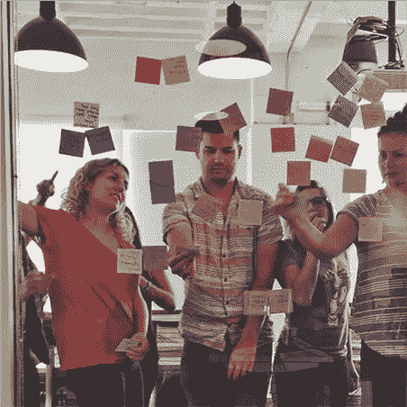
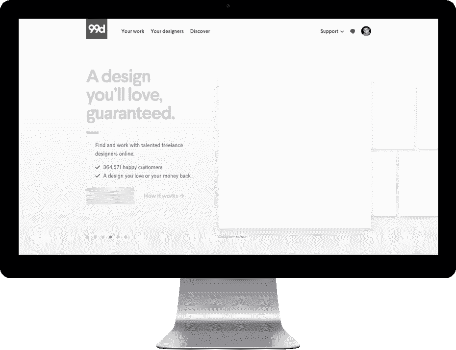
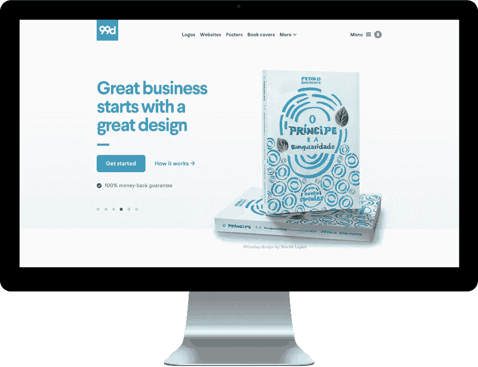
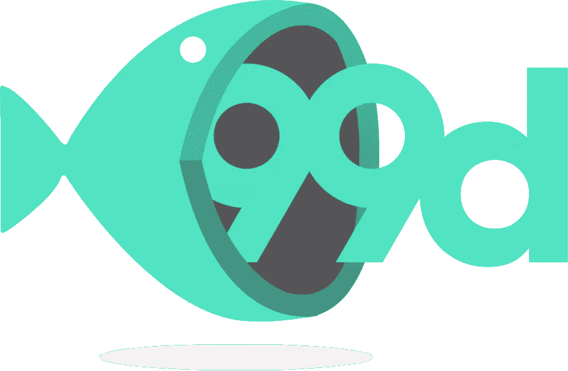
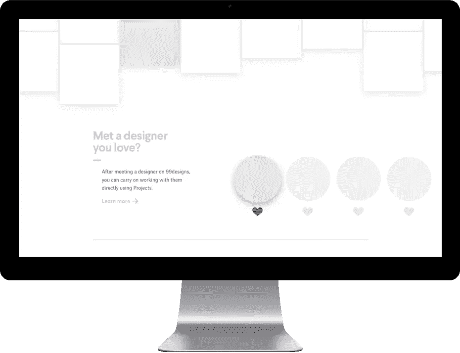
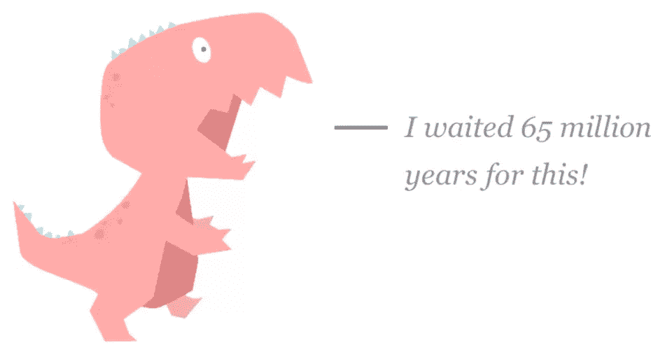
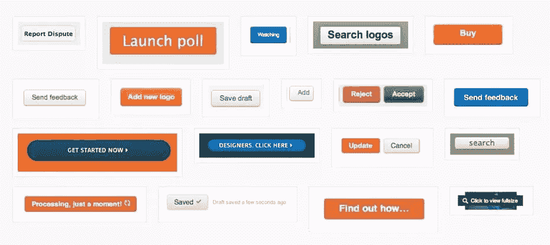
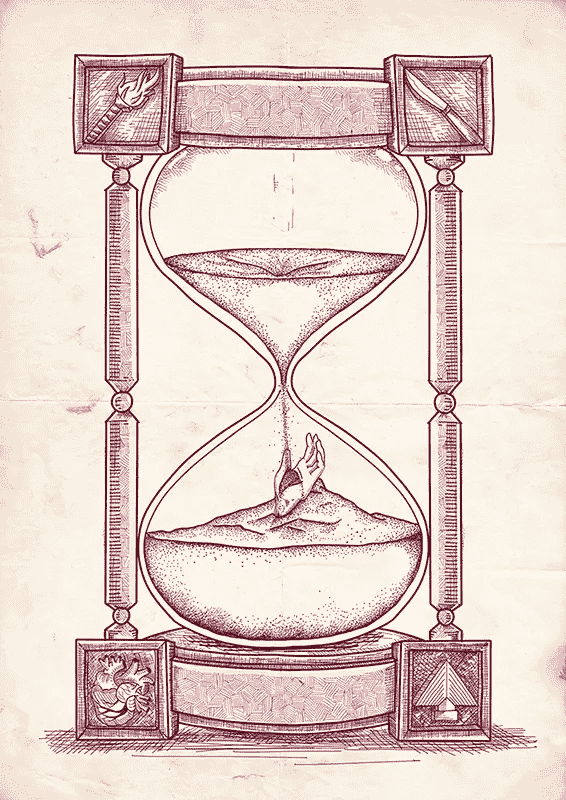
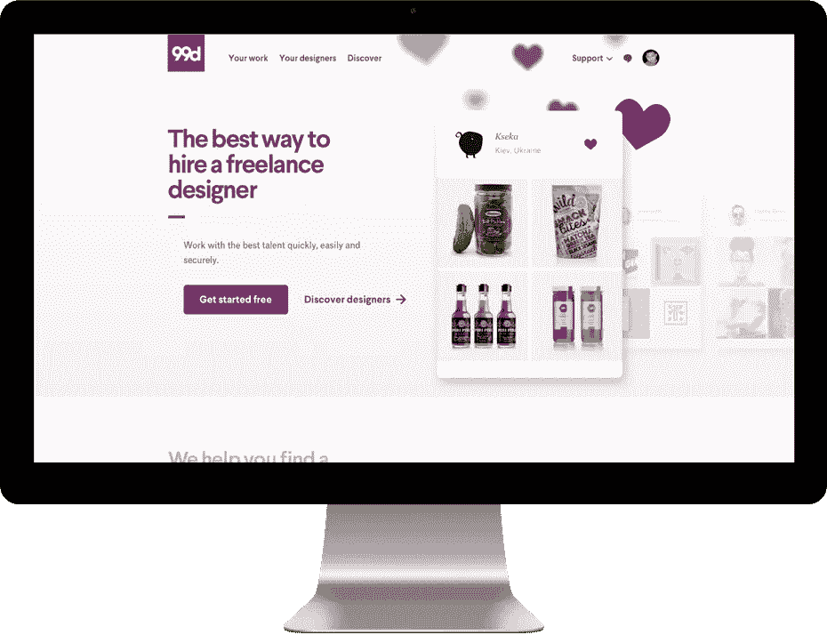

# 工程经理重塑品牌指南

> 原文：<https://www.sitepoint.com/engineering-guide-to-rebranding/>

这篇文章之前发表在 [99designs 博客](https://99designs.com/blog/inside-99designs/engineering-managers-guide-to-rebranding/?utm_source=partner&utm_medium=paid-referral&utm_campaign=sitepoint&utm_content=interview-post)上。想要最好的设计来改造你的企业吗？[考虑发起一场 99 设计的设计大赛！](https://99designs.com/launch/?utm_source=partner&utm_medium=paid-referral&utm_campaign=sitepoint&utm_content=interview-post)

每当一家公司推出品牌重塑，必不可少的是“我们是如何做到的”博客文章。[优步做到了](https://newsroom.uber.com/celebrating-cities-a-new-look-and-feel-for-uber/)， [AirBnB 做到了](http://blog.airbnb.com/belong-anywhere/)，[我们做到了](http://blog.airbnb.com/belong-anywhere/)。

是的，这些实际上是我们一些漂亮的员工在我们的办公室贴便利贴。你还会如何重塑品牌？

通常这些帖子会从“好看的人在玻璃墙上贴便利贴”直接跳到“在不知情的公众面前亮相”的阶段，完全跳过真正棘手的部分——一页一页地浏览公司网站(和其他资产)，将旧品牌变成新品牌。

如果你是一家初创公司的工程经理，你很有可能从未重塑过一个产品的品牌(因为工程师的平均任期比品牌的平均寿命要短)。如果你在海湾地区工作，更是如此，因为视觉风格没有归属悬崖。因此，让我们告诉你我们是如何做到的，然后深入探讨一些具体的技巧，告诉你如何做到。

### 我们的时间表

为了在一个合理的时间框架内讲述一个故事，我们已经将时间表缩短到只有要点，只有工程团队参与的时期。在此之前和之后，品牌和营销部门做了大量艰苦的工作，但从我们的角度来看，这是一个为期六个月的项目，其中三个月是大部分工作完成的时候。

*   **10 月:**我们被告知品牌重塑正在进行，他们希望在 EOY 之前上市。
*   **11 月:**设计签收，同时完成风格指南的编制；设计和建立资产特征翻转系统；草拟时间表并设定二月份首次展示的目标
*   **12 月:**app 开始构建；我们将旧页面转换为 Asimov(我们的组件系统)，如果页面已经是 Asimov，我们转换为新品牌
*   **一月:**造造造造造！删除不重要的、非品牌的或两者兼有的页面和产品。重新预测时间表，并在 3 月份设定硬性截止日期。
*   **2 月:**全公司协助 QA，继续开发
*   **3 月:**向客户推广，公关推广，拆除资产脚手架

作者 bo_rad

品牌重塑取得了巨大成功。我们在承诺的当天同时推出了 4 款左右的产品。自公司成立以来，我们第一次在网站的每个页面上实现了一致的外观和感觉。

作为最后一颗樱桃，当我们精简产品时，我们设法从我们的 monolith 中删除了至少 15 万行代码，并将大量营销内容移入我们的新 CMS。

### 选择您的构建和发布策略

基本上，您可以从三种策略中选择一种来构建和推广您的新外观和感觉:

1.  冻结所有功能开发，抓住每一个工程师，重新设计一切，在一场震撼和敬畏的大爆炸中出货
2.  **另一方面:**召集一个前端工程师的老虎队，在其他人一切如常的时候，在震撼和敬畏的大爆炸中进行品牌重塑
3.  **稍后完成:**重塑所有关键营销页面和漏斗前端流程，推迟其他流程重塑，直到它们自然出现并更新

我不能说任何特定的方法是最好的，但这里是每种方法的大致利弊。

#### “一次性”策略

优点:专注，团结团队，减少特性冻结带来的返工，更便宜的临时搭建。

**缺点:**昂贵、非专业人员参与的低效率阻碍了 BAU 的产品路线图。

#### “兼职”策略

优点:依靠专家效率更高。

**缺点:**BAU 的高风险&品牌重塑时间表相互阻碍或需要返工或两者兼而有之，设计范围可能膨胀而没有预算压力。

#### “以后再完成”策略

**优点:**最快&由于范围缩小，启动成本最低。

缺点:当顾客在网站上更换品牌时，不好的 UX，祝你在下一次重新设计前完成它。

作者 bo_rad

对我们来说，“一下子”是正确的选择。我们在“边上”模式下做了尽可能多的准备工作，但我们都齐心协力去做将产品从一个品牌转换到另一个品牌的实际工作。

我们选择这种方法有一系列原因:

*   同时拥有多个视觉标识的不一致的 UX 会破坏我们品牌的可信度。如果我们不亲身体验，就无法告诉顾客设计是商业的重要部分。
*   我们致力于让我们的工程团队成为“完整的团队”,让每个人都参与进来是一个加强文化的好机会，也是让我们的独立团队相互融合的好机会。
*   我们产品路线图上项目的平均长度比我们估计的重塑品牌所需的时间要短，任何与重塑品牌同时进行的项目都会使您面临昂贵的返工或规划开销的风险。
*   虽然 99designs.com 呈现为一个单一的统一网站，但它是由不同语言和大小的不同代码库的几个产品拼接而成的。这将简化我们的功能标志代码和我们的员工计划，使所有地方的变化一次。

主页的高保真样机设计

我马上想到了其他一些可能更适合特定策略的环境:

*   如果我们大一个数量级的话，就“以后再完成”。谷歌还不是 100%材料设计是有原因的。太多的人覆盖太多的领域，一个项目难以管理。
*   对于持续交付环境中的较小的、单一的团队或代码库来说,“在边上”是一个很好的选择。在这些情况下，并行开发对于管理和效率问题来说并不太具有挑战性。
*   如果你有更多的大爆炸部署模型(这对于 web 团队来说越来越少，但对于移动应用来说很常见)，那么“一次完成”会更适合较小的整体团队。要做“副业”，你需要一些密集的分支管理。

### 技术考虑

#### 内容语义命名

让未来的品牌重塑或重新设计变得更便宜、更容易的顶级技术技巧是为你的 CSS 和 HTML 采用某种基于组件的框架。我们使用名为 Asimov 的内部框架(构建在 Bower 之上)在应用程序之间共享 CSS 组件，并将 [BEM](https://en.bem.info/) 作为我们的命名和结构约定。我在过去的角色中也使用过[smacs](https://smacss.com/)取得了很好的成功。这篇关于 [BEM 和 SMACSS](https://www.sitepoint.com/bem-smacss-advice-from-developers/) 的文章是比较这两种方法的很好的指南。

在选择“一次完成”作为我们的方法时，我们已经大致确定了一个固定的范围(例如，我们要做多少页？全部)和固定预算(不完全是，但我们知道我们想要得到比 2016 年所做的品牌重塑更多的东西)。我们唯一可以利用的真正杠杆是重新设计的“深度”。

由阿尔维主义

为了使整个事情成为可能，我们的目标是尽可能只做 CSS 的重新设计。需要彻底重新设计的关键营销页面只是在完全独立的代码路径上从零开始构建。其他的一切仅仅是用新的 CSS 和资产重新包装。

这种选择——做一个有意义的重新设计，只是表面上的——只对我们可用，因为我们花了几年时间慢慢转向一个新的组件系统。在新设计需要标记变更的特殊情况下，我们找到了一种方法将结构变更移植到我们的旧品牌中，像往常一样部署到生产中，然后重新命名组件。

我们对 BEM 的训练有两方面的帮助。首先，BEM 对最小化级联的强调使得进行大范围的视觉改变更加安全，而不用太担心风格回归。第二，通过关注按目的命名组件(孩子们称之为内容-语义命名)而不是外观，帮助我们避免了任何[巴斯马蒂香米](https://twitter.com/nzkoz/status/538892801941848064)时刻。`.button--primary`和`.button--secondary`比`.big-green-button`和`.little-greyed-button`给你更多的灵活性。

我们以前有那么多按钮类型！

#### 构建、部署和功能翻转

我想提供的另一个技巧是不要给你的脚手架镀金。在 99designs，我们运行一个相对简单的连续交付管道——[一个 github flow](https://guides.github.com/introduction/flow/) 风格的开发过程——然后所有的主提交自动通过一个 [Buildkite 管道](https://buildkite.com/)，它构建并部署到 [AWS](https://aws.amazon.com/) 。我们每天部署我们的每一个产品很多次，当一些产品还没有准备好供公众消费时，我们就把它藏在一个[功能翻盖](https://99designs.com/tech-blog/blog/2012/03/01/feature-flipping/?utm_source=partner&utm_medium=paid-referral&utm_campaign=sitepoint&utm_content=interview-post)后面。我们的解决方案非常适合我们通常做的日常项目工作，但是不能一下子改变每个产品的每个页面上的所有内容。

最初的诱惑是尝试和推广我们的功能翻转系统来处理更广泛的变化，并将其在堆栈中向上移动一级，使其跨越所有产品。看看我们做这种工作的频率(即只有这一次)，这个解决方案没有通过成本/效益分析。虽然你的日常前端工作风格和方法对品牌重塑的效率有很大的影响，但支持全面重新设计的工具在产品周期的其余部分几乎没有任何好处。

相反，我们选择构建可能有效的最简单的东西:我们不断地将单一代码库交付到 HTML 层，并编译和发布两个不同的资产栈。这也使我们致力于“深入浅出”的品牌重塑政策。在选择管理策略的同时，您应该决定如何在技术上完成构建和发布，因为每一个都有一系列的权衡，并相互影响。因为我们知道我们可以停止影响后端的其他项目，并让所有的工程师来承担品牌重塑，我们需要最少的护栏来保持并行工作相互隔离。

双资产计划实际上是如何运作的，简单得几乎令人尴尬。脚手架搭建了几天，之后我们又很容易地拆除了它。在采用这种方法之前，我们用我们的资产原型进行了一次品牌重塑测试，让一切都变得没有喜剧色彩。太棒了。

我们还利用 [Buildkite 并行步骤](https://buildkite.com/docs/builds/parallelizing-builds)向我们的每个代码库添加第二个资产构建步骤，这将在我们现有资产的基础上分层任何具有品牌重塑工作的文件，并将它们捆绑到与我们的 web 代码一起部署的单独文件夹中。然后，我们在我们的资产路径帮助器上添加了一个小的垫片，它将根据 staff 可以设置的 cookie 在 assets 文件夹和 assets-reskin 之间切换。那块饼干是由一个按钮设定的，灵感来自[菲奥娜·泰(Fiona Tay)关于发展 Airbnb 品牌的演讲](https://www.youtube.com/watch?v=sM3oDSPK_tE)。

我们放入的最后一个工具是 staff UI 中的一个小部件(它出现在每个页面上)，它可以让任何用户知道一个页面是否“准备好进行 QA”。任何时候一个开发者完成一个页面，他们都会在某个不可见的地方留下一个`

`元素。

### 你的瀑布在我的敏捷里。你对我的瀑布很敏捷。

如果你的创业公司和我们的一样，在过去的几年里，你一直在做敏捷的、增量的、持续交付风格的开发。也就是说，你对如何驾驭一个在一次大爆炸中展开的长达数月的秘密项目的了解，几乎已经被遗忘了。

作者 kazoe

许多日常的敏捷过程不会推动你朝着固定的范围和预算前进，但是如果你试图大规模地回归瀑布技术，你会发现你没有安全地做这件事的支持基础设施(通常围绕 QA 过程和工具)。你最好的办法是尝试混合这些技术。我将根据我们的经验快速浏览一些流程提示和指南。

你应该有一个主[甘特图](https://en.wikipedia.org/wiki/Gantt_chart)来跟踪主要的工作项目和它们的依赖关系。我们刚刚使用了一个谷歌电子表格:行是所有产品或其他交叉任务的“页面”，列是工作日，单元格中的名称是谁在做什么。估算非常简单，我们最初从每个页面或组件中随机选取了几天，然后在项目进行到一半时——当我们有了真实的数据时——我们只是计算出完成的工作量和花费的时间，然后根据实际花费的时间进行重新预测。

品牌重塑的截止日期不是任意的。你基本上是在重新启动你的业务，并准备好所有合适的媒体和营销任务。不要觉得有义务过早地选择项目的截止日期，但当你接近品牌重塑的尾声时，你的估计需要转化为承诺，以便你的营销合作伙伴取得成功。确保你在时间表中预装了尽可能多的风险和艰苦工作，以避免最后几周的死亡行军。

### 实施设计:计划与返工。

不管是什么项目，总是很难在预先设计和迭代的实时设计之间找到平衡。不要太执着于任何一种方法。对于关键页面，如主页或我们的竞赛参赛作品页面，我们决定运行更传统的设计师草图模型管道，然后由开发人员实现，但对于我们的大多数页面，我们运行的方向相反。工程师将首先应用我们的风格指南中的新风格，然后迅速让 UX 审阅。从那时起，大部分设计方向将是口头的，没有内容的。如果在页面构建的早期，或者在 UX 评审期间，很明显页面需要更多的设计考虑，它将默认回到 comp-to-dev 工作流，通常导致开发工作的放弃。

初始项目设计

在那个过程中的开发返工可能看起来像是浪费，但是从更大的角度来看，它实际上节省了工作。我们节省了从不需要的设计排版(因为最初的转换已经足够好了),并把精力集中在需要的页面上。

除了选择两个不同的迭代循环之外，我们还有一个每日的开发-设计-产品同步会议，将会运行至少一个小时。在那次会议上，每个人都将全面审视一天的进展，确定任何主题和正在出现的贯穿各领域的问题，并共同决定我们是否需要重新审视过去的工作。通过在设计过程中加入一些不同的反馈机制，我们不仅在构建新品牌的过程中成功地发展了它，还确保了一切的一致性。

借用一句话，“永远不要浪费品牌重塑”。这是一个扩展团队的好机会。每个人都可以团结在共同的目标周围，由于工作的交叉性质，每个人都有机会与不同的人合作，而不是在常规工作中。

### 学问

从我们关心的所有措施来看，99designs 品牌重塑取得了巨大成功。尽管如此，我们确实在这个过程中学到了一些重要的经验(当你接受迭代过程时，这是可以预料的)。有两件事我会做得特别不同:

PANG3STU 设计

首先是**包括更多的原型制作和设备测试，然后**执行人员签署总体视觉识别。我们所有的早期设计签收都是基于 comps。在漂亮明亮的苹果视网膜显示屏上设计的构图。当我们最终在一台消费级 Windows 笔记本电脑上看到一个构建好的页面时，已经很晚了。在一些颜色渐变和字体选择之间，出于易读性的原因，我们不得不重新审视许多早期的设计决策。这在我们的时间表中并不是一个巨大的冲击，但与购买一台最低标准的笔记本电脑和早期做几个快速和肮脏的 HTML 模型的成本相比，它有点刺痛。

第二个是**在模型阶段**将 SEO 考虑放在最前面。当你沉浸在素描中时，“展示，不要说”是一种难以置信的诱惑。当你是一个设计市场，想把设计放在最前面和中心时，更是如此。虽然从纯用户驱动的角度来看，这是一个很好的选择，但谷歌机器人需要文字来了解你的品牌实际上是什么。如果谷歌不知道，你的客户也不会知道。我们在构建的后期也做到了这一点，但是(在过程的初始阶段)将你当前的页面与新设计迭代中所有副本的文本文件进行比较是非常简单的，因为 [Googlebot 获取了](https://www.google.com/webmasters/tools/googlebot-fetch)。如果它在数量或内容上完全不同，你需要更深入地探究潜在的影响。

### 不，太多了。让我总结一下。

唷，我们已经超过两千字了。我很确定自从大学以来我还没有打过这么多的英文。

重塑任何长期运营的在线业务都是一项艰巨的任务，任何精辟的总结都是过于简单化的表现。无论如何我会努力的。

*   在你的日常工作中使用一个好的、模块化的 CSS 框架或约定，当时机到来时，会使你的生活变得更容易
*   保持敏捷和瀑布技术的健康平衡，以便及时引入
*   选择一个相互支持的构建策略和技术框架
*   尽早处理困难和有风险的事情，让完成工作变得更容易

##### 如果你有任何关于品牌重塑的其他建议，你想分享的战争故事，或者你想让我们详细阐述的任何事情，请在下面评论。

## 分享这篇文章