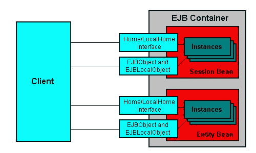
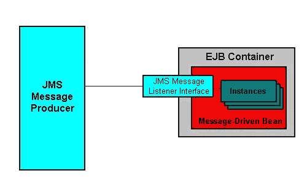

# 企业 JavaBeans:初级读本

> 原文：<https://www.sitepoint.com/enterprise-javabeans-primer/>

接近 J2EE 的企业开发人员常常难以理解企业 JavaBean s(EJB)的特性和实践。像 home 接口、消息驱动、实例管理和容器管理的持久性这样的术语经常被随意使用，并假设我们都知道这些术语是如何应用于我们的。

在本文中，我将开始澄清这些术语，并确定企业应用程序开发人员面临的一些问题，以及 EJB 如何帮助解决这些问题。

##### 什么是 EJB 技术？

EJB 技术为分布式应用程序定义了一个基于 Java 的、服务器端的、可重用的组件框架，它简化了集中管理的业务逻辑和声明式部署。听起来很重要，也很专业，不是吗？没多大帮助，是吗？让我们看看我是否能换一种说法:

*   EJB 是用 Java 编写的
*   EJB 通常在应用服务器环境中执行
*   EJB 可以重用
*   EJB 可以分布在许多机器上，就像在本地机器上一样被访问
*   EJB 由容器集中管理

那就好多了，不是吗？没有吗？好吧，让我们假设仍然有一些问题，让我们更深入地了解 EJB 如何解决实际问题。

EJB 规范和体系结构试图使远程、分布式、多层开发变得更加容易。它希望通过引入被称为企业 Java Bean (EJB)的概念来做到这一点。首先要注意的是，组件 EJB 的名称与规范 EJB 的名称相同。这类似于 JavaBeans 和 Java Bean 难题。理解这个难题最简单的方法是在提到规范时将 Java 和 Beans 放在一起，在提到组件时将它们分开。因此，远程规范变成了 Enterprise JavaBeans，远程组件变成了 Enterprise JavaBean s。本地规范变成了 Java Bean，本地组件变成了 Java Bean。

规范名称和组件名称非常相似，但这也是相似之处的终点。JavaBeans 规范和组件模型与企业 JavaBeans 和组件模型几乎没有共同之处。为了说明这一点，让我们看一下 EJB 的概念、组件以及它的运行和执行环境。

##### EJB 运行时环境

Enterprise JavaBean 是一个 Java 对象，它公开了许多接口，并在一个称为 EJB 容器的运行时环境中运行。Enterprise JavaBean 不能存在于 EJB 容器之外。事实上，EJB 集装箱和 EJB 之间的关系有时被称为控制反转(IoC)或“好莱坞原则”(不要打电话给我们，我们会打电话给你)。

EJB 容器是用于管理企业 beans 的运行时环境。容器托管和管理企业 bean 的方式与 Java servlet 引擎托管 Java servlet 的方式非常相似。EJB 容器实例化和控制企业 beans，并为它们提供系统级服务。

希望与企业 bean 交互的客户端应用程序不能直接访问企业 bean。相反，容器将 bean 与客户机应用程序隔离开来。
由 EJB 容器提供的服务
将从其创建企业 bean 对象的类和接口的程序员可以假设以下系统级服务将可从 EJB 容器获得:

*   bean 的事务管理
*   bean 的安全性
*   豆子的持久性
*   对 bean 的远程访问
*   bean 的生命周期管理
*   数据库-连接池
*   bean 的实例池

由于 EJB 容器为企业 bean 处理整个范围的基础设施服务级别服务，程序员可以专注于为企业 bean 编写业务逻辑。

##### 企业 Beans 的类型

EJB 体系结构定义了三种不同类型的企业 beans 会话 bean、实体 bean 和消息驱动 bean。会话 bean 和实体 bean 由企业 bean 客户端同步调用。消息驱动 bean(MDB)由消息容器调用，例如发布/订阅主题。

***会话豆***

会话 bean 代表单个客户端，不在客户端之间共享。客户端调用会话 bean 的方法，这些方法通过 EJB 容器被定向到企业 bean。会话 bean 为客户机执行业务逻辑，容器将控制权返回给客户机。会话 bean 不会跨多个会话保持不变。有两种类型的会话 beans:有状态和无状态。

*有状态会话 bean*

有状态会话 bean 在单个会话期间维护与一个客户端的会话状态。这意味着有状态会话 bean 可以在单个会话期间跨来自一个客户端的多次调用维护实例变量。

一旦客户端完成了与企业 bean 的交互，并且 EJB 容器删除了企业 bean，bean 的会话就结束了，并且 bean 的所有状态数据都被丢弃。

*无状态会话 bean*

无状态会话 bean 不会为每个单独的客户端维护会话状态。无状态会话 bean 的每次调用都应该被视为对一个全新对象实例的请求，因为任何实例变量状态都会在调用之间丢失。

无状态会话 beans 不会被 EJB 容器保存到二级存储中；因此，程序员必须认识到，对于每个客户机，所有数据在调用之间都是短暂的。无状态会话 bean 的瞬态特性允许 EJB 容器重用 bean 实例，因此通常会优化 bean 的性能。

***实体豆***

实体 bean 旨在表示持久存储中存在的实体的业务逻辑。实体 beans 与关系数据库具有一些相同的特性，例如:

*   实体 bean 是持久的——实体 bean 的状态存在于创建它的应用程序的生命周期之后，或者说，存在于 EJB 容器的生命周期之后。这意味着实体 bean 可以通过 EJB 容器恢复到其原始状态。
*   **实体 beans 允许共享访问**-它们可以由多个客户端共享。并发性由容器处理。
*   **实体 bean 有主键**-主键类用于标识实体 bean 的实例。主键包含查找持久实体所需的所有信息。
*   **实体 bean 可以参与关系**-本地接口已经被引入来管理 bean 之间的关系。
*   **实体 bean 可以参与事务**-由于多个客户端可以访问和更改数据，因此实体 bean 能够为其交互指定事务属性非常重要。在部署描述符中以声明方式指定事务属性；事务边界由容器处理。

实体 bean 隐含的对象关系映射要求实体 bean 负责在数据源中插入、更新、选择和删除数据。这个管理组件和数据源之间通信的过程称为持久性。换句话说，持久性是将信息写入外部数据源的过程。实体 bean 有两种类型的持久性:bean 管理的持久性(BMP)和容器管理的持久性(CMP)。我们将在下一节讨论这些。

*Bean 管理的持久性(BMP)*

使用 bean 管理的持久性(BMP)，程序员负责编写实体 bean 中的所有代码来访问数据源。BMP 为程序员提供了更多的灵活性，因为对数据源的所有访问都由程序员控制。

*容器管理的持久性(CMP)*

通过容器管理的持久性，EJB 容器处理实体 bean 所需的所有数据库访问。因此，bean 的数据访问代码没有耦合到特定的数据源。这将程序员从编写任何数据访问代码中解放出来，并允许实体 bean 部署在不同的容器中和/或针对不同的数据源。

***会话 Bean 和实体 Bean 的关系***

图 1 展示了客户端、EJB 容器、会话 bean 和实体 bean 之间的关系:


图 1

***消息驱动豆子***

消息驱动 bean (MDB)是一个企业 bean，它允许企业应用程序异步处理消息。MDB 的实例由 EJB 容器实例化，以充当消息侦听器。MDB 接收的消息可以由任何 JMS 兼容的消息发送器发送，例如启用 JMS 的发布/订阅主题。

与会话和实体 beans 不同，客户端程序不直接调用 MDB。相反，MDB 通过标准的回调方法 onMessage 从消息源接收调用。

onMessage 方法的单个参数是 javax.jms.Message 类型，由 MDB 程序员决定将 Message 对象转换为五种 jms 消息类型之一:TextMessage、ObjectMessage、MapMessage、BytesMessage 和 StreamMessage。

MDB 可以参与事务上下文，因为如果需要，可以回滚并重新提交或清除发送到 MDB 的消息。

图 2 说明了 JMS 消息生产者、EJB 容器和消息驱动 bean 之间的关系:


图二

##### EJB 解决什么问题？

当考虑 EJB 的可能用途时，您应该考虑 EJB 可以帮助解决的下列问题:

*   **可扩展性**企业 beans 可以透明地部署在许多不同的硬件平台上，因此它们可以根据需要分布，以利用可用的资源。
*   **事务支持**企业 beans 支持可跨操作系统移植的声明性事务模型。事务边界由 EJB 容器处理，事务本身可以由 EJB 容器处理。
*   **客户端位置透明性**-EJB 体系结构旨在对客户端程序隐藏 EJB 的位置。因此，可以在不预先知道目标 EJB 的位置的情况下开发 EJB 客户端程序。
*   **数据源可移植性**-实体 beans 可以通过将数据源访问细节留给 EJB 容器的方式进行编程。
*   **可重用性**—由于 EJB 架构促进了高度的组件化，业务逻辑可以编写一次，并根据需要轻松重用。
*   **异步消息传递**在需要异步通信的应用程序中，可以使用消息驱动 beans。

##### 编写和部署 EJB

以下四个步骤说明了开发和部署 EJB 的典型过程:

1.  为您的企业 bean 编写类和接口
2.  编写部署描述符
3.  将企业 bean 和相关文件打包到一个 jar 文件中
4.  部署 bean

会话 bean 和实体 bean 至少由三个类/接口组成:

**1。**扩展`javax.ejb.EJBObject`的接口(称为组件接口)，如下例所示:

```
package com.jeffhanson.ejb;   

import javax.ejb.EJBObject;   

import java.rmi.RemoteException;   

public interface SimpleMessenger extends EJBObject   

{   

  public String retrieveMessage() throws RemoteException;   

}
```

**2。**扩展`javax.ejb.EJBHome`的接口(称为 Home 接口)，如下例所示:

```
package com.jeffhanson.ejb;   

import java.rmi.RemoteException;   

import javax.ejb.CreateException;   

import javax.ejb.EJBHome;   

public interface SimpleMessengerHome extends EJBHome   

{   

  SimpleMessenger create() throws RemoteException, CreateException;   

}
```

**3。**实现`either javax.ejb.SessionBean`或`javax.ejb.EntityBean`的类(称为企业 Bean 类)，如下例所示:

```
package com.jeffhanson.ejb;    

import java.rmi.RemoteException;    

import javax.ejb.SessionBean;    

import javax.ejb.SessionContext;    

public class SimpleMessengerBean    

  implements SessionBean    

{    

  private SessionContext sessionCtx = null;    

  public String retrieveMessage()    

  {    

      return "Hello from SimpleMessengerBean ";    

  }    

  public void ejbCreate()    

  {    

  }    

  public void ejbRemove()    

  {    

  }    

  public void ejbActivate()    

  {    

  }    

  public void ejbPassivate()    

  {    

  }    

  public void setSessionContext(SessionContext sessionCtx)    

  {    

    this.sessionCtx = sessionCtx;    

  }    

}
```

***部署描述符***

要将 EJB 部署到 EJB 容器的环境中，必须向 EJB 容器提供一个部署描述符文件。部署描述符文件是一个名为 ejb-jar.xml 的 XML 文档，它指定了关于 bean 的信息，比如它的持久性类型和事务属性。您需要将 java 类和部署描述符打包到 JAR 或 EAR 文件中。

以下是典型部署描述符的示例:

```
<?xml version="1.0" encoding="UTF-8"?>    

<ejb-jar>    

  <description>A sample EJB</description>    

  <display-name>Simple Message EJB</display-name>    

  <enterprise-beans>    

    <session>    

      <ejb-name>SimpleMessenger</ejb-name>    

      <home>com.jeffhanson.ejb.SimpleMessengerHome</home>    

      <remote>com.jeffhanson.ejb.SimpleMessenger</remote>    

      <ejb-class>com.jeffhanson.ejb.SimpleMessengerBean</ejb-class>    

      <session-type>Stateless</session-type>    

      <transaction-type>Bean</transaction-type>    

    </session>    

  </enterprise-beans>    

</ejb-jar>
```

##### 摘要

接近 J2EE 的企业开发人员经常不得不面对诸如事务、远程访问、数据库可移植性和实例池等问题。EJB 有助于解决这些问题。

EJB 技术为分布式应用程序定义了一个基于 Java 的、服务器端的、可重用的组件框架，它简化了集中管理的业务逻辑和声明式部署。

EJB 规范和体系结构试图使远程、分布式、多层开发变得更加容易。它希望通过引入被称为企业 Java Bean (EJB)的概念来做到这一点。

Enterprise JavaBean 是一个公开了许多接口的 Java 对象，它在一个称为 EJB 容器的运行时环境中运行和执行。

EJB 容器是用于管理企业 beans 的运行时环境。容器托管和管理企业 bean 的方式与 Java servlet 引擎托管 Java servlet 的方式非常相似。EJB 容器实例化和控制企业 beans，并为它们提供系统级服务。

EJB 体系结构定义了三种不同类型的企业 beans 会话 bean、实体 bean 和消息驱动 bean。会话 bean 和实体 bean 由企业 bean 客户端同步调用。消息驱动 bean(MDB)由消息容器调用，例如发布/订阅主题。

当考虑 EJB 的可能用途时，您应该考虑 EJB 可以帮助解决的下列问题:可伸缩性、事务支持、客户机位置透明性、数据源可移植性、可重用性和异步消息传递。

在我们的下一篇文章中，我们将试图减轻你在建造你的第一个 EJB 时可能必须克服的任何恐惧。我们将一步一步地安装 J2EE SDK，编写、编译和部署简单的实体和会话 bean，以及使用它们的客户端 Web 应用程序。

## 分享这篇文章