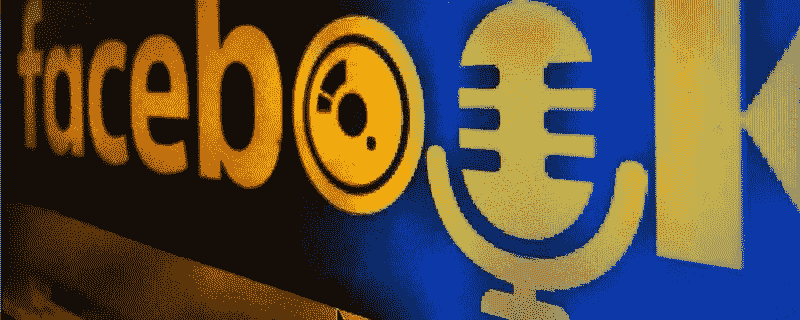
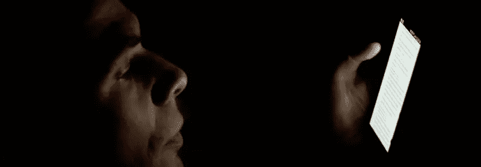

# 史诗般的 UX 失败了(以及我们可以吸取的教训)

> 原文：<https://www.sitepoint.com/epic-ux-fails/>

我们热爱设计、UX，以及一切能让科技让我们的生活变得更轻松的事物。我们希望激励和鼓励未来的设计师继续改善我们使用的所有设备和应用的用户体验。我们希望这些例子能通过描述这些“具有挑战性”的时刻来激励和帮助他人，当你想到*我希望它只是做 **x** 而不是 **y** …*

## 当 Windows 8 移除了开始按钮

作为一家公司，苹果通常被认为是一家创新的、以设计为导向的公司，但在许多方面他们都非常保守——尤其是在操作系统方面。十年前的 OS X 用户可能仍然会找到他们的最新版本。变化往往是小而渐进的。

另一方面，最近微软一直在改变他们的核心 user 通常以牺牲用户为代价。任何使用 Windows PC 的人从一开始就使用桌面和开始菜单作为导航任务和文件系统的中枢。

对于 Windows 8，微软设计了一个既可以点击*又可以触摸*的操作系统；但在这两种情况下，这种体验总的来说并不令人满意。通过删除开始菜单和默认的桌面屏幕，他们从那些多年来习惯于以特定方式打开应用程序和文件的用户那里拿走了地毯。

这一切都需要重新学习，甚至给最忠实的 Windows 粉丝带来了巨大的挫败感。值得庆幸的是，开始按钮在 8.1 中重新引入，但在此之前许多人已经降级到 Windows 7。

这是一个很好的例子，说明了以用户为代价开发一个新颖的新设计以及可能忽视用户测试的危险。

## 自动取款机:他们真的需要退卡吗，仅仅因为他们没有我要求的金额？

如果你不能给出要求的数量，那也没关系。就问我要新的金额。你不需要把我送回起点或者取消交易把卡还给我。

对于这样一个广泛使用的成熟用户界面，ATM 具有令人难以置信的不一致的用户体验，经常在同一交互中在键盘、侧装屏幕按钮和触摸屏控制之间切换。很难确切知道原因。是企业竞争击败了标准和 UI 一致性吗？还是金融机构在 UX 行动迟缓？

## 你知道我的名字，为什么不用它呢？

<small>图片来源:[奎因.安雅](https://www.flickr.com/photos/quinnanya/4464205726/)途经[Foter.com](http://foter.com/)/[CC BY-SA](http://creativecommons.org/licenses/by-sa/2.0/)</small>

回复“*亲爱的订户*”的公司。我最近在订阅《连线》杂志时遇到了一个问题。我和一个很好的家伙打了一场电子邮件网球，他帮我解决了一些事情。但是每封邮件都在我最后一封邮件的后面写着“亲爱的订户”。

一旦我得到我确认的帐户信息，我将取消我的订阅。

## 充满屏幕的手机弹出广告(没有容易找到的‘X’)

一些公司没有意识到他们正在与移动消费者对话，坚持让弹出广告占据手机的整个屏幕，你找不到最小化的“x”。我不确定这是技术上的失败还是商业决策，但这是一个让用户感到既无助又愚蠢的好方法。

## USB:提醒我哪条路是正确的向上的路(再一次)？

你试过多少次倒插 u 盘？我有 50%的时间这样做。

从表面上看，这似乎是一个小问题，直到你考虑到每天有几千万个 USB 设备被使用。计算每一次“插头故障”所浪费的时间，这将成为一个更重要的考虑因素。

当然，对于这种类型的问题，有一些成熟的解决方案。一百多年来，电源插座都有一个明显的插座方向，很难弄错。更好的是:设计一个插头，不管它是以哪种方式插入的(例如，闪电电缆)。

## 健忘的形式

在提交之前，不小心点击了后退按钮或者离开了一个很长的 web 表单，不得不再次输入所有内容。JavaScript 中的 localStorage 很容易避免这种情况。

这是一个杀手，在某种程度上把我们都逼疯了！

## 浏览器密码覆盖

通常，密码管理是一件好事，直到你遇到一个只要求一个字段的 web 表单，而你的浏览器试图将它保存为没有用户名的密码。确保你的“帮助”想法实际上没有伤害到你的用户。

## 项目范围蔓延和不当要求

不久前，一家大型保险网站花了 20 个月的时间围绕“移动优先”的原则开发了一个新网站，花费超过 18 万欧元(超过 20 万美元)。当该网站最终推出时，台式机/笔记本电脑的尺寸受到了手机/平板电脑尺寸的限制，因此台式机屏幕没有得到有效利用。

更糟糕的是，该网站的第一次发布甚至没有移动就绪！不到 12 个月后，一个全新的网站推出了。

## 技术失礼

一个主要的国际连锁酒店网站是使用 HTML5 早期推出的最新 HTML5 技术设计和开发的。它在光滑的酒店屏幕上看起来很棒，但在较小的移动设备上观看时，菜单和面板堆叠在一起，模糊了内容和功能。

更糟糕的是，在旧浏览器中，网站框架内会出现一个窗口，指示用户安装谷歌 Chrome 框架扩展来查看网站。

## 布局问题

当谷歌在 2012 年推出其算法的“页面布局”更新时，一家科技新闻网站对此进行了报道。他们的新闻文章的实际内容是在键盘上向下两页，在广告和大图片的下面…他们实际上仍然这样做…报告指出，这种做法将开始受到算法的惩罚。

## 为什么脸书想要我的麦克风和摄像机？

我仍然不知道为什么脸书想要使用我机器上的麦克风和摄像头，这样我就可以添加一个法国国旗覆盖图来回应巴黎袭击事件。一旦我在封面图片上添加了旗帜，我就不得不认真寻找如何关闭它们。

## “不那么数字化的家”

我知道一家公司在“数字家庭”上投入了大量资金。该项目的一位经理同意将他的家“升级”为数字化。一天晚上，他回到一所完全黑暗的房子里。在试图通过用户界面解决问题失败后，他求助于一名技术人员。又花了一个小时排除故障后，技术人员仍然没有找到问题。

<small>图片来源:[japanexperterna . se](https://www.flickr.com/photos/68532869@N08/17468693762/)via[视觉追捕](https://visualhunt.com/) / [CC BY-SA](http://creativecommons.org/licenses/by-sa/2.0/)</small>

最终，他发现灯泡烧了。第二天早上这个项目被搁置了。

小心，你发明的问题不会比你解决的问题多。

## 结论

所有这些有可能让我们发疯的事情的伟大之处在于，它们最终都是可变的。UX 设计师也是人，如果他们设计的东西让自己抓狂，他们通常会很快意识到这一点，更不用说世界其他地方了。

还记得不能从 PDF 文档中复制文本的日子吗？值得庆幸的是，我们现在所处的时代，道路上的颠簸通常可以很快被识别和修复。我们希望这篇文章能激励每个人，包括我们自己，继续为我们所有人打造越来越好的用户体验。

## 分享这篇文章