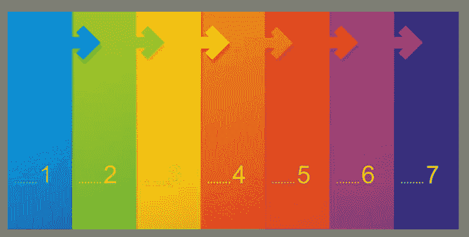
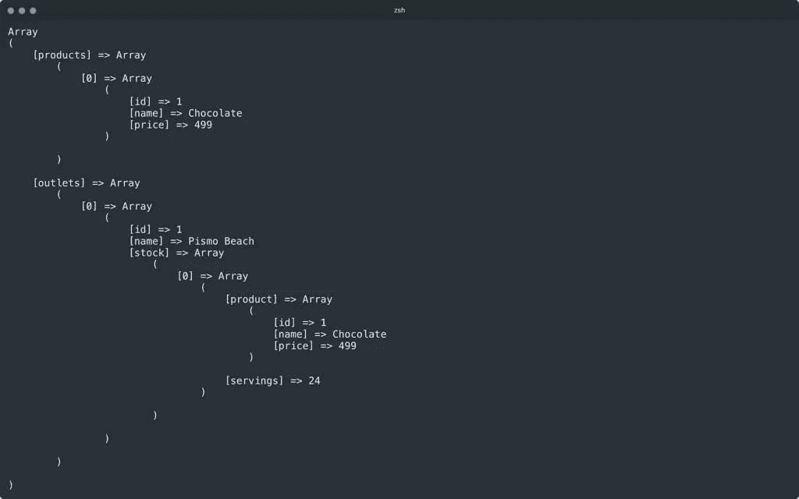

# 紧急情况下的活动采购

> 原文：<https://www.sitepoint.com/event-sourcing-in-a-pinch/>

让我们来谈谈活动采购。也许你听说过它，但是没有时间去参加一个会议或者读一本描述它的旧的书。这是我希望早点知道的话题之一，今天我将用我理解的方式向你们描述它。

*这段代码的大部分可以在 [GitHub](https://github.com/assertchris-tutorials/tutorial-php-event-sourcing-in-a-pinch) 上找到。我已经用 PHP `7.1`测试过了。*



我选择这个标题有几个原因。首先，我不认为自己是这方面的专家。为此，你很难找到比这些书的作者更好的导师，或者像 Mathias Verraes 这样的人。我要告诉你的只是冰山一角。如果你愿意，可以加点盐。

活动采购也是一个更大、更广泛的主题集的一部分；不严格地定义为领域驱动的设计。事件源是众多设计模式中的一种，您最好了解一下与 DDD 相关的其他模式。事实上，在不了解其他模式的好处的情况下，仅仅从 DDD 工具箱中挑选事件源通常不是一个好主意。

尽管如此，我认为这是一个迷人和有趣的练习，很少有人能很好地覆盖它。它特别适合那些尚未涉足 DDD 领域的开发人员。所以，如果你发现自己需要像活动采购这样的东西，但不知道或不了解 DDD 的其他地方，我希望这篇文章能帮助你。紧要关头。

## 共同语言

领域驱动设计最强烈的主题之一是需要一种通用语言。当您的客户决定他们需要一个新的应用程序时，他们正在考虑这会如何影响他们的冰淇淋销售。他们担心他们的顾客如何找到他们最喜欢的口味的冰淇淋，以及这将如何影响他们冰淇淋摊位的客流量。

你可能会想到网站用户和地理定位的销售点，但是这些词对你的客户来说并不一定意味着什么。虽然这可能需要一些时间，但最初，如果你们在谈论同一件事情时使用相同的词语，你与客户的沟通将会大大改善。

你还会发现，用客户理解的语言对整个系统建模，为你提供了一个防止范围变化的安全网。说起来容易多了；“您最初要求客户在发送发票之前购买冰淇淋(此处显示为代码和电子邮件)，但现在您要求先发送发票……”，而不是用只有您理解的语言/代码来描述他们要求的变化。

这并不是说你所有的代码都需要被客户理解，或者你必须使用类似于 [Behat](https://www.sitepoint.com/bdd-in-laravel-getting-started-with-behat-and-phpspec/) 的东西来进行集成测试。但是，至少，你应该像你的客户那样调用实体和动作。

这样做的另一个好处是，未来的开发人员将能够理解代码的意图(以及它如何应用于业务流程)，而不需要客户或项目经理的太多帮助。

我有点犹豫，但是当我们开始写代码时，这一点很重要。

## 存储状态与存储行为

我建立的大多数网站都有某种形式的 CRUD(创建、读取、更新和删除)数据库功能。这些操作是有意通用的，因为它们传统上映射到它们使用的底层关系数据库。

### 存储状态

我们甚至可能习惯于使用像[雄辩](https://www.sitepoint.com/modeling-aggregate-eloquent/)这样的东西:

```
$product = new Product();
$product->title = "Chocolate";
$product->cents_per_serving = 499;
$product->save();

$outlet = new Outlet();
$outlet->location = "Pismo Beach";
$outlet->save();

$outlet->products()->sync([
    $product->id => [
        "servings_in_stock" => 24,
    ],
]) 
```

对于客户网站上最基本的冰淇淋信息展示来说，这已经足够了。这就是我们多年来建立网站的方式。但是它有一个明显的弱点——我们不知道发生了什么让我们来到这里。

让我们想一想可能会影响数据如何到达这一点的一些事情:

*   我们什么时候开始卖“巧克力”的？许多对象关系映射器(ORM)库会添加像`created_at`和`updated_at`这样的字段，但这些只能告诉我们想知道的。
*   我们怎么会有那么多存货？我们收到快递了吗？我们送了一些吗？
*   当我们不再想卖“巧克力”时，或者当我们想把所有库存转移到另一个渠道时，我们的分析会发生什么？我们是否添加了一个布尔字段(到产品的表中)，以表明该产品不再销售，但应该保留在分析中？或者也许我们应该添加一个时间戳，这样我们就知道这一切是什么时候发生的…

### 存储行为

缺点是我们只知道现在的数据是什么样的。我们的数据就像照片，而我们想要的是视频。如果我们尝试不同的东西呢？

```
$events = [];

$events[] = new ProductInvented("Chocolate");
$events[] = new ProductPriced("Chocolate", 499);
$events[] = new OutletOpened("Pismo Beach");
$events[] = new OutletStocked("Pismo Beach", 24, "Chocolate");

store($events); 
```

这是存储相同的最终信息，但是每个步骤都是独立的。它们描述了顾客、商店、股票等的行为。

使用这种方法，我们可以更好地控制导致当前状态的事件的时间线。我们可以为库存赠品或产品停产添加事件:

```
$events = [];

$events[] = new OutletStockGivenAway(
    "Pismo Beach", 2, "Chocolate"
);

$events[] = new OutletDiscontinuedProduct(
    "Pismo Beach", "Chocolate"
);

store($events); 
```

这并不比存储状态更复杂，但它更能描述发生的事件。客户也很容易理解发生了什么。

当我们开始存储行为(而不是某个时间点的状态)时，我们就获得了轻松遍历事件的能力。就像我们穿越时空一样:

```
$lastWeek = Product::at("Chocolate", date("-1 WEEK"));
$yesterday = Product::at("Chocolate", date("-1 DAY"));

printf(
    "Chocolate increased, from %s to %s, in one week",
    $lastWeek->cents_per_serving,
    $yesterday->cents_per_serving
); 
```

…我们可以做到这一点，而无需任何额外的布尔/时间戳字段。我们可以回到已经存储的数据，并创建一种新的报告。那太有价值了！

### 那到底是哪个？

事件采购是这两方面的事情。它是关于将每个事件(可以认为是应用程序数据的每个变化)捕获为一个独立的、可重复的东西。它是将这些事件按照它们发生的时间顺序存储起来，这样我们就可以随意旅行到任何时间点。

它是关于理解如何将这个体系结构与以不同方式构建的其他系统接口，这意味着有一种方法来表示最新的应用程序数据状态。

这些事件只是附加的，这意味着我们不会从数据库中删除任何事件。而且，如果我们做得对，他们(以他们的名字和属性)描述他们对他们相关的业务和客户意味着什么。

## 制造事件

我们将使用类来描述事件。它们是有用的，简单的容器，我们可以定义；他们将帮助我们验证我们为每个事件输入的数据和获取的数据。

那些在事件采购方面有经验的人可能很想听听我是如何描述像总量这样的东西的。我有意避免使用行话——就像我避免区分模仿、重复、存根和伪造一样——如果我在教某人进行第一次测试的话。重要的是**想法**，而**事件采购背后的想法是记录行为。**

下面是我们可以用来模拟真实事件的抽象事件:

```
abstract class Event
{
    /**
     * @var DateTimeImmutable
     */
    private $date;

    protected function __construct()
    {
        $this->date = date("Y-m-d H:i:s");
    }

    public function date(): string
    {
        return $this->date;
    }

    abstract public function payload(): array;
} 
```

*这是出自`events.php`*

事件类简单真的很重要(在我看来)。使用 PHP 7 类型提示，我们可以验证用于定义事件的数据。一些简单的访问器将帮助我们再次获得重要的数据。

在这个类之上，我们可以定义我们想要记录的真实事件类型:

```
final class ProductInvented extends Event
{
    /**
     * @var string
     */
    private $name;

    public function __construct(string $name)
    {
        parent::__construct();

        $this->name = $name;
    }

    public function payload(): array
    {
        return [
            "name" => $this->name,
            "date" => $this->date(),
        ];
    }
} 
```

```
final class ProductPriced extends Event
{
    /**
     * @var string
     */
    private $product;

    /**
     * @var int
     */
    private $cents;

    public function __construct(string $product, int $cents)
    {
        parent::__construct();

        $this->product = $product;
        $this->cents = $cents;
    }

    public function payload(): array
    {
        return [
            "product" => $this->product,
            "cents" => $this->cents,
            "date" => $this->date(),
        ];
    }
} 
```

```
final class OutletOpened extends Event
{
    /**
     * @var string
     */
    private $name;

    public function __construct(string $name)
    {
        parent::__construct();

        $this->name = $name;
    }

    public function payload(): array
    {
        return [
            "name" => $this->name,
            "date" => $this->date(),
        ];
    }
} 
```

```
final class OutletStocked extends Event
{
    /**
     * @var string
     */
    private $outlet;

    /**
     * @var int
     */
    private $servings;

    /**
     * @var string
     */
    private $product;

    public function __construct(string $outlet, ↩
        int $servings, string $product)
    {
        parent::__construct();

        $this->outlet = $outlet;
        $this->servings = $servings;
        $this->product = $product;
    }

    public function payload(): array
    {
        return [
            "outlet" => $this->outlet,
            "servings" => $this->servings,
            "product" => $this->product,
            "date" => $this->date(),
        ];
    }
} 
```

注意我们是如何制作这些`final`？我们必须努力保持事件的简单，如果另一个开发人员来继承它们(不管出于什么原因)，它们就不再简单了。

我还发现如何隔离事件日期的定义、格式和可访问性也很有趣:通过将`$date`定义为 private 并要求子类通过`date`方法访问它。这可能有点过于保守，但它遵守了德米特的[定律，因为具体事件不需要知道日期是如何定义或格式化的，就可以使用它。](https://en.wikipedia.org/wiki/Law_of_Demeter)

有了这种隔离，我们可以更改整个系统的时区，或者更改为使用 UNIX 时间戳，并且我们只需要更改一行代码。

如果我们愿意牺牲性能(和运行时关联数组检查)或类型安全，我们可以省略这些类。

## 存储事件

让我们将这些事件存储在 SQLite 数据库中。我们可以为此使用 ORM，但是这可能是一个回顾 PDO 如何工作的好机会。

### 使用 PDO

通过 PDO 连接到任何支持的数据库的第一段代码是:

```
$connection = new PDO("sqlite::memory:");

$connection->setAttribute(
    PDO::ATTR_ERRMODE,
    PDO::ERRMODE_EXCEPTION
); 
```

*这是出自`sqlite-pdo.php`*

PDO 连接通常使用数据源名称(DSN)进行。这里我们将数据库类型定义为`sqlite`，将位置定义为内存中的数据库。这意味着脚本一完成，数据库就会消失。

将错误模式设置为在 SQL 错误发生时抛出异常也是一个好主意。这样我们就能立即得到错误的反馈。

如果你以前没有做过任何原始的 SQL 查询，接下来的这一点可能会令人困惑。[看看这篇关于 SQL 的精彩介绍](https://www.sitepoint.com/premium/books/jump-start-mysql)。

接下来，我们应该创建一些表格进行工作:

```
$statement = $connection->prepare("
    CREATE TABLE IF NOT EXISTS product (
        id INTEGER PRIMARY KEY AUTOINCREMENT,
        name TEXT
    )
");

$statement->execute(); 
```

*这是出自`sqlite-pdo.php`*

其中一个表将是我们生成和存储唯一产品标识符的地方。`CREATE TABLE`的确切语法在不同的数据库类型之间略有不同，您通常会在一个表中找到更多的列。

*了解数据库如何创建表的一个好方法是通过 GUI 创建一个表[，然后运行`SHOW CREATE TABLE my_new_table`。这将在所有 PDO 支持的数据库中生成`CREATE TABLE`语法。](https://www.sequelpro.com)*

预处理语句(使用`prepare`和`execute`)是执行 SQL 查询的推荐方式。当您需要传递查询参数时，它们甚至更有用:

```
$statement = $connection->prepare(
    "INSERT INTO product (name) VALUES (:name)"
);

$statement->bindValue("name", "Chocolate");
$statement->execute(); 
```

*这是出自`sqlite-pdo.php`*

绑定值被自动引用和转义，避免了最常见的 SQL 注入。我们还可以使用准备好的语句来返回行:

```
$row = $connection
    ->prepare("SELECT * FROM product")
    ->execute()->fetch(PDO::FETCH_ASSOC);

$rows = $connection
    ->prepare("SELECT * FROM product")
    ->execute()->fetchAll(PDO::FETCH_ASSOC); 
```

*这是出自`sqlite-pdo.php`*

假设我们使用的是`PDO::FETCH_ASSOC`类型，这些`fetch`和`fetchAll`方法将分别返回数组和数组或数组。

### 添加助手功能

正如你可能猜到的，直接使用 PDO 会导致许多不必要的重复。我发现创建几个助手函数很有用:

```
function connect(string $dsn): PDO
{
    $connection = new PDO($dsn);

    $connection->setAttribute(
        PDO::ATTR_ERRMODE,
        PDO::ERRMODE_EXCEPTION
    );

    return $connection;
}

function execute(PDO $connection, string $query, ↩
    array $bindings = []): array
{
    $statement = $connection->prepare($query);

    foreach ($bindings as $key => $value) {
        $statement->bindValue($key, $value);
    }

    $result = $statement->execute();

    return [$statement, $result];
}

function rows(PDO $connection, string $query, ↩
    array $bindings = []): array
{
    $executed = execute($connection, $query, $bindings);

    /** @var PDOStatement $statement */
    $statement = $executed[0];

    return $statement->fetchAll(PDO::FETCH_ASSOC);
}

function row(PDO $connection, string $query, ↩
    array $bindings = []): array
{
    $executed = execute($connection, $query, $bindings);

    /** @var PDOStatement $statement */
    $statement = $executed[0];

    return $statement->fetch(PDO::FETCH_ASSOC);
} 
```

*这是出自`sqlite-pdo-helpers.php`*

这与我们之前看到的代码非常相似。不过，它们比直接的 PDO 代码好用一点:

```
$connection = connect("sqlite::memory:");

execute(
    $connection,
    "CREATE TABLE IF NOT EXISTS product ↩
        (id INTEGER PRIMARY KEY AUTOINCREMENT,name TEXT)"
);

execute(
    $connection,
    "INSERT INTO product (name) VALUES (:name)",
    ["name" => "Chocolate"]
);

$rows = rows(
    $connection,
    "SELECT * FROM product"
);

$row = row(
    $connection,
    "SELECT * FROM product WHERE name = :name",
    ["name" => "Chocolate"]
); 
```

*这是出自`sqlite-pdo-helpers.php`*

你可能不喜欢为这些东西定义全局函数。它们就像你在 PHP 的黑暗时代看到的东西。但是它们非常简洁，并且易于使用！

它们甚至不难测试:

```
$fake = new class("sqlite::memory:") extends PDO
{
    private $valid = true;

    function prepare($statement, $options = null) {
        if ($statement !== "SELECT * FROM product") {
            $this->valid = false;
        }

        return $this;
    }

    function execute() {
        return;
    }

    function fetchAll() {
        if (!$this->valid) {
            throw new Exception();
        }

        return [];
    }
};

assert(connect("sqlite::memory:") instanceof PDO);
assert(is_array(rows($fake, "SELECT * FROM product"))); 
```

*这是出自`sqlite-pdo-helpers.php`*

我们并没有测试所有的辅助函数的变体，但是你已经明白了…

如果你还不明白，想要更深入地了解 PDO，请看这篇文章。

### 存储事件

让我们再来看看我们想要存储的事件:

```
$events = [];

$events[] = new ProductInvented("Chocolate");
$events[] = new ProductPriced("Chocolate", 499);
$events[] = new OutletOpened("Pismo Beach");
$events[] = new OutletStocked("Pismo Beach", 24, "Chocolate"); 
```

最简单的方法是为每种事件类型创建一个数据库表:

```
execute($connection, "
    CREATE TABLE IF NOT EXISTS product (
        id INTEGER PRIMARY KEY AUTOINCREMENT
    )
");

execute($connection, "
    CREATE TABLE IF NOT EXISTS event_product_invented (
        id INT,
        name TEXT,
        date TEXT
    )
");

execute($connection, "
    CREATE TABLE IF NOT EXISTS event_product_priced (
        product INT,
        cents INT,
        date TEXT
    )
");

execute($connection, "
    CREATE TABLE IF NOT EXISTS outlet (
        id INTEGER PRIMARY KEY AUTOINCREMENT
    )
");

execute($connection, "
    CREATE TABLE IF NOT EXISTS event_outlet_opened (
        id INT,
        name TEXT,
        date TEXT
    )
");

execute($connection, "
    CREATE TABLE IF NOT EXISTS event_outlet_stocked (
        outlet INT,
        servings INT,
        product INT,
        date TEXT
    )
"); 
```

*这是出自`storing-events.php`*

除了每个事件的表之外，我还添加了表来存储和生成产品和商店 id。每个事件表都有一个日期字段，其值由抽象的`Event`类生成。

真正神奇的事情发生在`store`和`storeOne`函数中:

```
function store(PDO $connection, array $events)
{
    foreach($events as $event) {
        storeOne($connection, $event);
    }
}

function storeOne(PDO $connection, Event $event)
{
    $payload = $event->payload();

    if ($event instanceof ProductInvented) {
        inventProduct(
            $connection,
            newProductId($connection),
            $payload["name"],
            $payload["date"]
        );
    }

    if ($event instanceof ProductPriced) {
        priceProduct(
            $connection,
            productIdFromName($connection, $payload["name"]),
            $payload["cents"],
            $payload["date"]
        );
    }

    if ($event instanceof OutletOpened) {
        openOutlet(
            $connection,
            newOutletId($connection),
            $payload["name"],
            $payload["date"]
        );
    }

    if ($event instanceof OutletStocked) {
        stockOutlet(
            $connection,
            outletIdFromName(
                $connection, $payload["outlet_id"]
            ),
            $payload["servings"],
            productIdFromName(
                $connection, $payload["product_id"]
            ),
            $payload["date"]
        );
    }
} 
```

*这是出自`storing-events.php`*

`store`功能只是一种便利。PHP 没有类型化数组的概念，所以我们可以添加运行时检查，或者使用`storeOne`的签名来验证我们只是试图存储`Event`子类实例。

我们可以通过`payload`方法获得特定的事件数据。这些数据会根据存储的事件类而有所不同，所以我们应该在确定要处理的事件类型后才使用键。

我们还使用了一些产品和商店助手方法。下面是它们的样子:

```
function newProductId(PDO $connection): int
{
    execute(
        $connection,
        "INSERT INTO product VALUES (null)"
    );

    return $connection->lastInsertId();
}

function inventProduct(PDO $connection, int $id, ↩
    string $name, string $date)
{
    execute(
        $connection,
        "INSERT INTO event_product_invented ↩
            (id, name, date) VALUES (:id, :name, :date)",
        ["id" => $id, "name" => $name, "date" => $date]
    );
}

function productIdFromName(PDO $connection, string $name): int
{
    $row = row(
        $connection,
        "SELECT * FROM event_product_invented ↩
            WHERE name = :name",
        ["name" => $name]
    );

    if (!$row) {
        throw new InvalidArgumentException("Product not found");
    }

    return $row["id"];
}

function priceProduct(PDO $connection, int $product, ↩
    int $cents, string $date)
{
    execute(
        $connection,
        "INSERT INTO event_product_priced ↩
            (product, cents, date) VALUES ↩
            (:product, :cents, :date)",
        ["product" => $product, "cents" => $cents, ↩
            "date" => $date]
    );
}

function newOutletId(PDO $connection): int
{
    execute(
        $connection,
        "INSERT INTO outlet VALUES (null)"
    );

    return $connection->lastInsertId();
}

function openOutlet(PDO $connection, int $id, ↩
    string $name, string $date)
{
    execute(
        $connection,
        "INSERT INTO event_outlet_opened (id, name, date) ↩
            VALUES (:id, :name, :date)",
        ["id" => $id, "name" => $name, "date" => $date]
    );
}

function outletIdFromName(PDO $connection, string $name): int
{
    $row = row(
        $connection,
        "SELECT * FROM event_outlet_opened ↩
            WHERE name = :name",
        ["name" => $name]
    );

    if (!$row) {
        throw new InvalidArgumentException("Outlet not found");
    }

    return $row["id"];
}

function stockOutlet(PDO $connection, int $outlet, ↩
    int $servings, int $product, string $date)
{
    execute(
        $connection,
        "INSERT INTO event_outlet_stocked ↩
            (outlet_id, servings, product_id, date) ↩
            VALUES (:outlet, :servings, :product, :date)",
        ["outlet" => $outlet, "servings" => $servings, ↩
            "product" => $product, "date" => $date]
    );
} 
```

*这是出自`storing-events.php`*

`inventProduct`、`priceProduct`、`openOutlet`和`stockOutlet`都是不言自明的。为了获得它们引用的 id，我们需要`newProductId`和`newOutletId`函数。这些函数插入空行，以便生成唯一的标识符并可以返回(使用`$connection->lastInsertId()`方法)。

你不必遵循同样的命名模式。事实上，就 DDD 而言，最好使用你和你的客户同意的定义产品核心概念的名称和模式。

我们可以使用类似于以下的模式来测试这些:

```
store($connection, [
    new ProductInvented("Cheesecake"),
]);

$row = row(
    $connection,
    "SELECT * FROM event_product_invented WHERE name = :name",
    ["name" => "Cheesecake"]
);

assert(!is_null($row)); 
```

*这是出自`storing-events.php`*

## 预测事件

正如我们所看到的，存储行为的方法给了我们一个前所未有的视角来看待我们数据的整个历史。不过，它不太适合渲染视图。正如我提到的，我们还需要一种方法来将事件源架构与其他不是以相同方式构建的系统连接起来。

这意味着我们需要能够告诉外界应用程序的最新状态是什么，就像我们将它存储在数据库中一样。这通常被称为投影，因为我们对所有事件进行排序，以向其他人显示最终状态。因此，在预测未来状态的[意义上，预测是基于当前的趋势](https://en.wikipedia.org/wiki/Forecasting)。

我认为事件采购新人面临的最大障碍之一是不知道如何将它实际应用到他们的情况中。如果我们不谈论如何很好地使用它，那么谈论事件源理论对我们没有帮助！

之前，我们看到了如下函数:

```
Product::at("Chocolate", date("-1 WEEK"));
// → ["id" => 1, "name" => "Chocolate", ...] 
```

理想情况下，我们也有这些方法:

```
Product::latest();
// → [["id" => 1, "name" => "Chocolate", ...], ...]

Product::latest("Chocolate");
// → ["id" => 1, "name" => "Chocolate", ...] 
```

首先，我们需要加载存储在数据库中的所有事件:

```
function fetch(PDO $connection): array {
    $events = [];

    $tables = [
        ProductInvented::class => "event_product_invented",
        ProductPriced::class => "event_product_priced",
        OutletOpened::class => "event_outlet_opened",
        OutletStocked::class => "event_outlet_stocked",
    ];

    foreach ($tables as $type => $table) {
        $rows = rows($connection, "SELECT * FROM {$table}");

        $rows = array_map(
            function($row) use ($connection, $type) {
                return $type::from($connection, $row);
            }, $rows
        );

        $events = array_merge($events, $rows);
    }

    usort($events, function(Event $a, Event $b) {
        return strtotime($a->date()) - strtotime($b->date());
    });

    return $events;
} 
```

*这是出自`projecting-events.php`*

这里发生了很多事情，让我们来分解一下:

1.  我们定义了一个事件表列表来获取行。
2.  我们获取每个类型/表的行，并将结果关联数组转换为事件的实例。
3.  我们使用每个事件的`date`,将它们按时间顺序排序。

我们需要将这些新的`from`方法添加到每个事件中:

```
abstract class Event
{
    // ...snip

    public function withDate(string $date): self
    {
        $new = clone $this;
        $new->date = $date;

        return $new;
    }

    abstract
    public
    static
    function
    from(PDO $connection, array $data);
} 
```

```
final class ProductInvented extends Event
{
    // ...snip

    public static function from(PDO $connection, array $data)
    {
        $new = new static(
            $data["name"]
        );

        return $new->withDate($data["date"]);
    }
} 
```

```
final class ProductPriced extends Event
{
    // ...snip

    public static function from(PDO $connection, array $data)
    {
        $new = new static(
            productNameFromId($connection, $data["product"]),
            $data["cents"]
        );

        return $new->withDate($data["date"]);
    }
} 
```

```
final class OutletOpened extends Event
{
    // ...snip

    public static function from(PDO $connection, array $data)
    {
        $new = new static(
            $data["name"]
        );

        return $new->withDate($data["date"]);
    }
} 
```

```
final class OutletStocked extends Event
{
    // ...snip

    public static function from(PDO $connection, array $data)
    {
        $new = new static(
            outletNameFromId($connection, $data["outlet"]),
            $data["servings"],
            productNameFromId($connection, $data["product"])
        );

        return $new->withDate($data["date"]);
    }
} 
```

*这是出自`events.php`*

我们还使用了几个新的全局函数:

```
function productNameFromId(PDO $connection, int $id): string {
    $row = row(
        $connection,
        "SELECT * FROM event_product_invented WHERE id = :id",
        ["id" => $id]
    );

    if (!$row) {
        throw new InvalidArgumentException("Product not found");
    }

    return $row["name"];
}

function outletNameFromId(PDO $connection, int $id): string {
    $row = row(
        $connection,
        "SELECT * FROM event_outlet_opened WHERE id = :id",
        ["id" => $id]
    );

    if (!$row) {
        throw new InvalidArgumentException("Outlet not found");
    }

    return $row["name"];
} 
```

*这是出自`projecting-events.php`*

我们需要这些`*NameFromId`和`*IdFromName`函数的原因是，我们希望使用实体名称创建和呈现事件，但是我们希望将它们作为外键存储在数据库中。这只是我的个人偏好，你可以自由定义/呈现/存储它们，只要对你有意义。

我们现在可以将事件列表转换成数据库行，然后再转换回来:

```
$events = [];

$events[] = new ProductInvented("Chocolate");
$events[] = new ProductPriced("Chocolate", 499);
$events[] = new OutletOpened("Pismo Beach");
$events[] = new OutletStocked("Pismo Beach", 24, "Chocolate");

store($connection, $events); // ← events stored in database
$stored = fetch($connection); // ← events loaded from database

assert(json_encode($events) === json_encode($stored)); 
```

现在，我们如何把它转换成有用的东西？我们需要再定义几个助手函数:

```
function project(PDO $connection, array $events): array {
    $entities = [
        "products" => [],
        "outlets" => [],
    ];

    foreach ($events as $event) {
        $entities = projectOne($connection, $entities, $event);
    }

    return $entities;
}

function projectOne(PDO $connection, array $entities, ↩
    Event $event): array
{
    if ($event instanceof ProductInvented) {
        $entities = projectProductInvented(
            $connection, $entities, $event
        );
    }

    if ($event instanceof ProductPriced) {
        $entities = projectProductPriced(
            $connection, $entities, $event
        );
    }

    if ($event instanceof OutletOpened) {
        $entities = projectOutletOpened(
            $connection, $entities, $event
        );
    }

    if ($event instanceof OutletStocked) {
        $entities = projectOutletStocked(
            $connection, $entities, $event
        );
    }

    return $entities;
} 
```

*这是出自`projecting-events.php`*

这段代码类似于我们用来存储事件的代码。对于每种类型的事件，我们修改实体的数组。在所有的事件都被计划之后，我们应该有最新的状态。以下是其他投影方法的样子:

```
function projectProductInvented(PDO $connection, ↩
    array $entities, ProductInvented $event): array
{
    $payload = $event->payload();

    $entities["products"][] = [
        "id" => productIdFromName($connection, $payload["name"]),
        "name" => $payload["name"],
    ];

    return $entities;
}

function projectProductPriced(PDO $connection, ↩
    array $entities, ProductPriced $event): array
{
    $payload = $event->payload();

    foreach ($entities["products"] as $i => $product) {
        if ($product["name"] === $payload["product"]) {
            $entities["products"][$i]["price"] = ↩
                $payload["cents"];
        }
    }

    return $entities;
}

function projectOutletOpened(PDO $connection, ↩
    array $entities, OutletOpened $event): array
{
    $payload = $event->payload();

    $entities["outlets"][] = [
        "id" => outletIdFromName($connection, $payload["name"]),
        "name" => $payload["name"],
        "stock" => [],
    ];

    return $entities;
}

function projectOutletStocked(PDO $connection, ↩
    array $entities, OutletStocked $event): array
{
    $payload = $event->payload();

    foreach ($entities["outlets"] as $i => $outlet) {
        if ($outlet["name"] === $payload["outlet"]) {
            foreach ($entities["products"] as $j => $product) {
                if ($product["name"] === $payload["product"]) {
                    $entities["outlets"][$i]["stock"][] = [
                        "product" => &$product,
                        "servings" => $payload["servings"],
                    ];
                }
            }
        }
    }

    return $entities;
} 
```

*这是出自`projecting-events.php`*

这些投影方法中的每一个都接受一种类型的事件，并对事件有效负载进行排序，以在`$entities`数组上做标记。



此时，我们可以使用我们创建的结构来填充网站。由于我们的投影器接受事件，我们甚至可以生成一个初始投影(在请求开始时)，然后在事件发生时将任何新事件应用于它们。

正如您可能猜到的，这不是查询数据库的最有效方式，只是为了呈现一个网站。如果您经常需要投影，最好定期投影事件，然后将结果结构存储在非规范化的数据库表中。

这样，当在应用程序中显示数据时，您可以捕获事件(通过 API 请求或表单发布之类的东西)，并且仍然可以查询“普通的”数据库表。

### 特别突出

到目前为止，我们已经看到了如何描述、存储和投影(到最新状态)。投影到特定的时间点只是调整投影函数的问题，这样它们就可以应用某个时间戳之前或之后的事件。

我们已经讨论了比我最初计划的多得多的内容，所以我将把最后一点留给你们作为练习。考虑如何对内容的草稿/工作和发布版本的传统(CMS 应用程序)模型进行建模。

## 摘要

如果你已经走了这么远。干得好！这是一个漫长的旅程，但我觉得值得。让我们知道你喜欢或不喜欢这个设计模式。如果你想了解更多关于活动采购(或一般的 DDD)的知识，一定要看看开头链接的书。

*满是数组的代码会变丑，快！我强烈推荐你[去看看亚当·瓦森的书，关于将循环代码重构为集合](https://adamwathan.me/refactoring-to-collections)。*

## 分享这篇文章