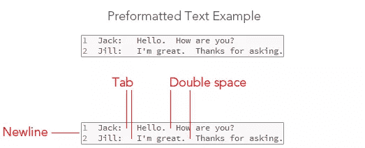

# 关于 HTML 的“pre”元素你需要知道的一切

> 原文：<https://www.sitepoint.com/everything-need-know-html-pre-element/>

HTML 的 [pre](https://reference.sitepoint.com/html/pre) 元素是显示格式化内容(如源代码)的一种简单且有语义的方式，但它确实有一些怪癖。让我们来谈谈这个元素是如何工作的，需要记住的潜在问题，以及一些增强它的基本技巧和诀窍。

## `<pre>`如何工作

在 HTML 文档中，`pre`元素代表*预格式化文本*。这意味着您的制表符缩进、双空格、换行符和其他排版格式将保留在`pre`元素中。

默认情况下，浏览器会使用等宽(或固定宽度)字体显示`pre`元素中的内容，比如 Courier 或 Monaco。这在显示代码时很典型，正如我们将看到的，这是`pre`元素的主要用途之一。

让我们看一个预格式化文本的例子。



如果你将同样的文本放在另一个元素中，比如说一个`div`，所有多余的空格、换行符和缩进都将被忽略。所以即使你的代码看起来像这样:

```
<div>
Jack:   Hello.  How are you?
Jill:   I'm great.  Thanks for asking.
</div>
```

浏览器会这样显示它:

见笔 [Div 元素忽略](http://codepen.io/SitePoint/pen/rzGpo/) [CodePen](http://codepen.io) 上 SitePoint ( [@SitePoint](http://codepen.io/SitePoint) )的空格。