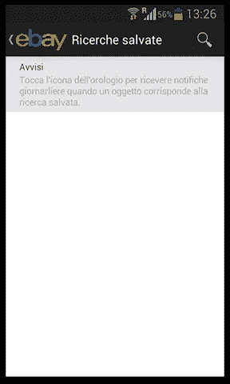
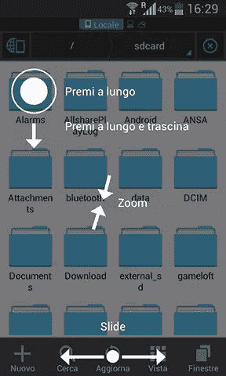
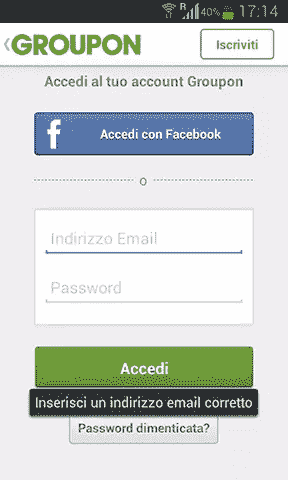
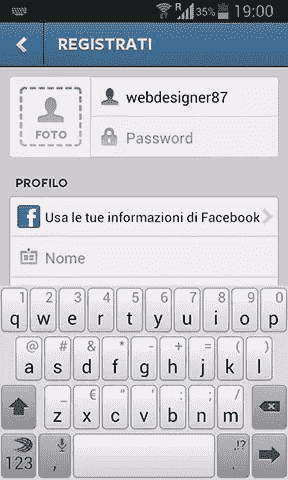

# 移动设计模式的例子:第 2 部分

> 原文：<https://www.sitepoint.com/examples-mobile-design-pattern-part-2/>

## 介绍

在这个致力于移动设计模式的迷你系列的第一篇文章中，我简要概述了它们是什么，以及在任何设计良好的移动应用程序中实现它们的重要性。

此外，我试图通过对市场上最知名、下载量最大的应用之一 Pinterest 的研究，展示一些应该考虑的模式，以使用户的体验愉快而轻松。

在这篇文章中，我概述了一些有用的技巧和窍门，可以更好地组织表单、图库和搜索功能。

在这篇新文章中，我们将关注用户邀请，并强调建议和反馈对于与移动应用程序交互的用户的重要性。

## 移动设计模式的例子:邀请

有多少次，你下载了一个智能手机应用程序，在第一次，不知道该怎么继续下去？我经常遇到这种情况，由于未能开发应用程序的潜力(无论它对我来说多么有效和有用)，唯一能做的就是卸载它，选择另一个功能大致相同但更直观的应用程序。

直观性:这是移动应用程序设计和开发背后的关键概念之一。

当你面对一个不直观的界面，不知道该做什么的时候，你需要什么来避免关闭和删除应用程序？一个简单明了的建议，可以引导你找到想要的功能。一份邀请。所以，从你当时作为用户和现在作为开发者的经验来看，难道你不认为这个小技巧将有助于留住你的用户，并确保他们不会在第一次启动后卸载你的应用程序吗？

现在，让我们开始看看如何改善用户的邀请体验。

邀请的模式有很多种，应该根据应用程序的内容、你的品味以及最重要的目标用户的偏好来选择。在最广泛使用的模式中，我们发现了对话框、提示、参观和视频演示，但是还有其他同样有效的模式可以影响直观的反应，例如透明性、持续邀请等等。

最常见和最广泛使用的是“对话框”模式和“提示”模式，它们给出第一个指示，并在交互开始时被删除。在这篇文章中，我没有机会详述所有邀请模式的例子，所以我决定分析我认为比刚才描述的这两种更有趣的模式。

### 图尔

浏览用于突出应用程序的主要特性，特别关注用户的观点。同样在这种情况下，Pinterest 应用程序为我们提供了这种模式的有效示例。

正如您从上图中看到的，您可以通过菜单项访问该教程，一旦完成，它允许我们通过三个简单的步骤了解如何使用该应用程序以及使用哪些按钮与之交互。Pinterest 之旅的特点是文案简洁，图形生动，导航方便。

### 持续邀请

持续邀请在屏幕上仍然可见。Ebay 应用程序的“保存的搜索”部分插入的消息就是这种情况，其中总有一条消息建议用户做什么，即“当一个对象匹配保存的搜索时，点击时钟图标接收每日通知”(在截图中，这是意大利语，对不起！)

即使是这种类型的邀请，信息也必须简短、清晰，最好是不同颜色和大小的文本，并带有一些视觉提示。

这正是最近最受欢迎和下载量最大的游戏之一《水果忍者》的主屏幕所做的事情。

在左上方，logo 下方，你找到了“切水果开始”的邀请，它是持久的，在游戏第一次开始后不会消失；此外，在你启动应用程序的几秒钟后，一只小手的图像会出现，它会建议你“切片”游戏图标以继续，这消除了所有的疑虑。

### 可发现的邀请

这是用于提示数据刷新的最常见模式；事实上，这种邀请是在执行滑动或轻击等常见手势时发现的。

想想脸书、Twitter 或 Google+主屏幕:我们现在都习惯于下拉刷新页面，在我们的个人资料上加载新闻，但我们是如何习惯的呢？简单地做，没有明确的信息。

### 透明邀请

这是一种在主屏幕上常见的模式，它处理位于屏幕提供商内容之上的透明层，以快速直观地解释如何在应用中移动，以及当屏幕被触摸和交互开始时，该层被移除。

这就是 ES 文件浏览器应用程序的情况，当用户在屏幕上点击时，指令“按下”、“按下并拖动”、“缩放”和“滑动”及其相关图标就会消失。

## 移动设计模式的例子:反馈

根据拉里·康斯坦丁和露西·洛克伍德的“反馈原则”(包含在他们的“[用户界面设计原则](http://en.wikipedia.org/wiki/Principles_of_user_interface_design "Principles of user interface design")”列表中)

> 设计应该通过用户熟悉的清晰、简洁和明确的语言，让用户了解相关的和用户感兴趣的动作或解释、状态或条件的变化以及错误或异常。

这是什么意思？这意味着用户必须知道并看到他们与正在使用的移动应用程序交互的结果。关于这个字段，有三个重要的例子你应该考虑:错误消息，确认和系统状态。

### 错误消息

该信息应始终清晰并指出问题所在(可能还会提出解决方案)。例如，如果用户没有输入有效的电子邮件地址或密码，就会出现 Groupon 错误消息(在这种情况下，请求的是有效的电子邮件地址)。

技巧是尽可能用彩色的屏幕消息代替模态对话框来显示错误。

### 确认消息

需要记住的一件重要的事情是，确认消息不应该阻碍页面的流动，所以当一个动作被执行时，一定要提供确认消息，但是不要打断用户的流动。

Instagram 的注册表单为我们提供了这种模式的绝佳范例。当用户选择一个名称时，如果该名称可用，相应的图标将变为绿色，如果不可用，则颜色为红色。这是一个很棒的系统，它使用随着时间的推移而巩固的惯例，使确认过程更快、更直观。

### 系统状况

对于系统状态通知，您可以使用消息、进度条、动画指示器或不同元素的组合。不要忘记包含一个取消按钮来停止长时间的操作:用户会非常感激的。

## 结论

在这篇文章中，你已经看到了市场上一些或多或少为人所知的应用程序的例子，它们是最常见的用于给出建议、发出邀请和提供反馈的移动模式。在下一篇也是最后一篇文章中，您将发现最常见的反模式，并理解为什么以及何时应该避免它们。

## 分享这篇文章