# 使用 TypeScript 1.5 在 Babylon.js 上试验 ECMAScript 6

> 原文：<https://www.sitepoint.com/experiment-ecmascript-6-babylon-js-typescript-1-5/>

本文是微软网站开发系列的一部分。感谢您对使 SitePoint 成为可能的合作伙伴的支持。

自从几年前发布 WebGL 开源游戏框架 [babylon.js](http://www.babylonjs.com/?WT.mc_id=16515-DEV-sitepoint-article51) 以来，我们(在社区的帮助下)一直在探索让它变得更好的方法。一年多前，我们决定改用 TypeScript，对此我非常高兴。关于这个决定的更多信息，请阅读[为什么我们决定从普通的 JavaScript 迁移到 TypeScript](http://blogs.msdn.com/b/eternalcoding/archive/2014/04/28/why-we-decided-to-move-from-plain-javascript-to-typescript-for-babylon-js.aspx/?WT.mc_id=16515-DEV-sitepoint-article51)

多亏了 TypeScript，我们已经能够**提高我们代码的质量**，**提高我们的生产率**并创造**我们引以为豪的神话般的游乐场**:[http://www.babylonjs-playground.com/](http://www.babylonjs-playground.com/?WT.mc_id=16515-DEV-sitepoint-article51)，它在浏览器中提供自动完成功能！我们也能够毫无困难地欢迎一些来自 C#背景和少量 JS 技能的新团队成员。但是感谢 TypeScript 编译器，我们也可以**测试未来，而不用重写一行代码！**

我们仍在使用 Visual Studio 和 TFS 编写 babylon.js，同时以常规方式将我们的代码推送到 [github repo](https://github.com/BabylonJS/Babylon.js/?WT.mc_id=16515-DEV-sitepoint-article51) 。通过将我们的项目升级到 [Visual Studio 2015 RTM](https://www.visualstudio.com/downloads/download-visual-studio-vs?CR_CC=200657563/?WT.mc_id=16515-DEV-sitepoint-article51) ，我们已经能够将其升级到 **TypeScript 1.5** 。

一旦完成，让我向你展示一下我有多快将 Babylon.js 从 ES5 升级到 ES6。右键单击您的项目，导航到“ **TypeScript Build** ”，将“ **ECMAScript version** ”从 ES5 切换到 ES6:

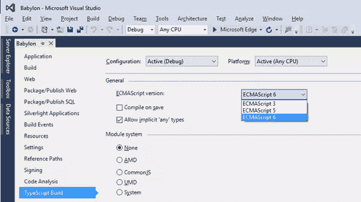

就是这样！

重新编译解决方案，现在就可以测试 ES6 的未来。

我在这里发布了一个 ES6 版的 babylonjs.com[让你玩玩。](http://www.babylonjs.com/indexES6.html?WT.mc_id=16515-DEV-sitepoint-article51)

## 微软 Edge 和 ES6

如果你对 ES6 感兴趣，我推荐观看这个构建会话:[快速和可伸缩应用的 JavaScript 新特性](https://channel9.msdn.com/Events/Build/2015/2-763/?WT.mc_id=16515-DEV-sitepoint-article51)。

你会注意到，你需要一个非常新的现代浏览器，如微软 Edge，才能执行这个演示和代码。微软 Edge 和 Firefox 41 是目前 ES6 支持最先进的浏览器。你可以在这里查看你目前的浏览器 ES6 支持[。](http://kangax.github.io/compat-table/es6/?WT.mc_id=16515-DEV-sitepoint-article51)

在 Windows 10 上的 [Microsoft Edge(内部版本 10240)](https://dev.modern.ie/platform/changelog/?utm_source=SitePoint&utm_medium=article51&utm_campaign=SitePoint) 中启动它，您将获得以下结果:

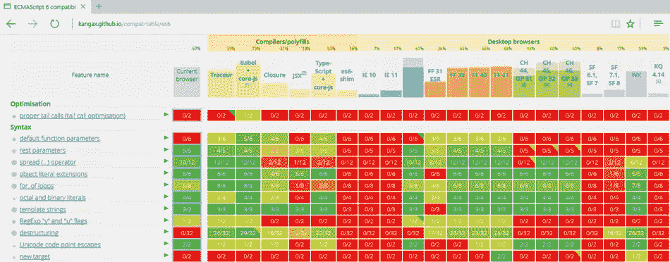

中支持 67%的 ES6 特性，在 Firefox 41 中支持 68%的**特性。这些结果令人印象深刻！**

不过，如果你在 MS Edge 中启动 Babylon.js 的 [ES6 版本，你会在 F12 中看到一些错误:](http://www.babylonjs.com/indexES6.html?WT.mc_id=16515-DEV-sitepoint-article51)

让我们导航到 babylon.math.js 来检查错误。我们在这里坠落:

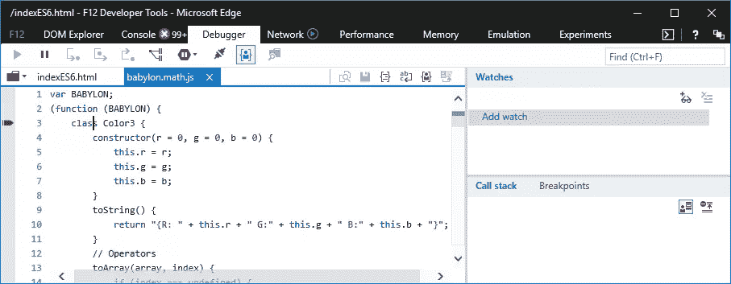

生产尚不支持“**类**”关键字。这是因为规范最近发生了变化，因此所有的浏览器都将其置于一个标志之后。

要启用它，导航到 MS Edge 中的“**关于:标志**”和“**启用实验 JavaScript 特性**

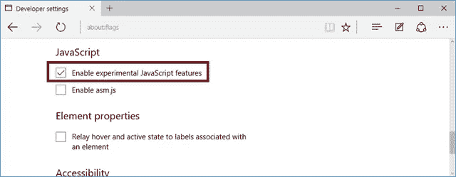

如果你现在再次运行 ES6 兼容工具:[http://kangax.github.io/compat-table/es6/](http://kangax.github.io/compat-table/es6/?WT.mc_id=16515-DEV-sitepoint-article51)，你现在会看到 **[MS Edge 跳到 81%的 ES6 特性](https://dev.modern.ie/platform/status/?utm_source=SitePoint&utm_medium=article51&utm_campaign=SitePoint/?filter=f3f0000bf&search=es6/)** 支持。它现在支持 class，super &生成器:

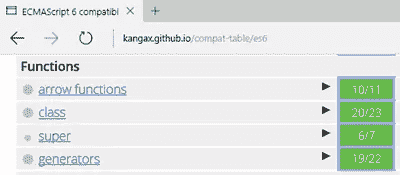

要让这个演示在 Firefox 或 Chrome 上运行，你可能需要一个夜间版本。

## 是时候在 F12 中使用它了

现在微软 Edge 已经配置好了，导航到:[http://www.babylonjs.com/indexES6.html/](http://www.babylonjs.com/indexES6.html?WT.mc_id=16515-DEV-sitepoint-article51)和**在一个单独的窗口中打开 F12** 。在“**调试器**选项卡中，打开“ **babylon.gamepadCamera.js** ”，在“超级”代码行设置一个**断点**:

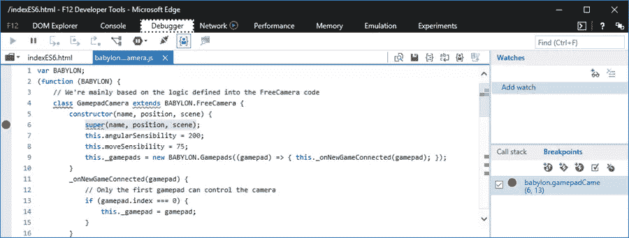

启动“**公馆**演示，将摄像头切换到“**游戏手柄摄像头**”:

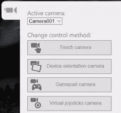

您将按照预期正确地插入代码:

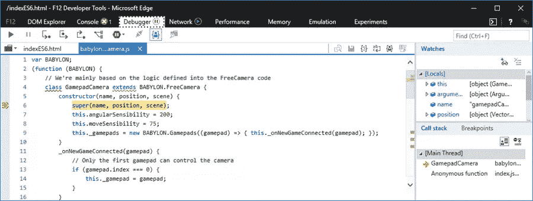

按 **F11** 跳转到扩展类( **BABYLON。自由摄像机**):

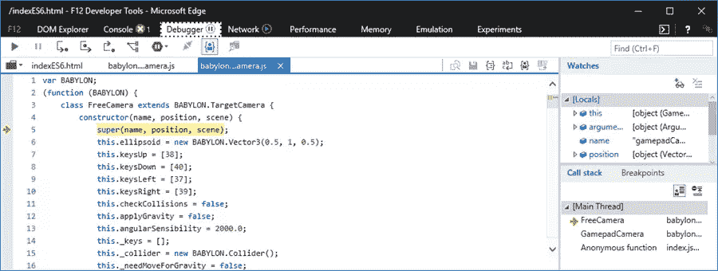

您目前正在调试 ES6 代码！是不是很酷？:-)

在“**调试器**选项卡中，打开“**Babylon . virtual joystick . js**，在箭头函数内的第 78 行设置断点:

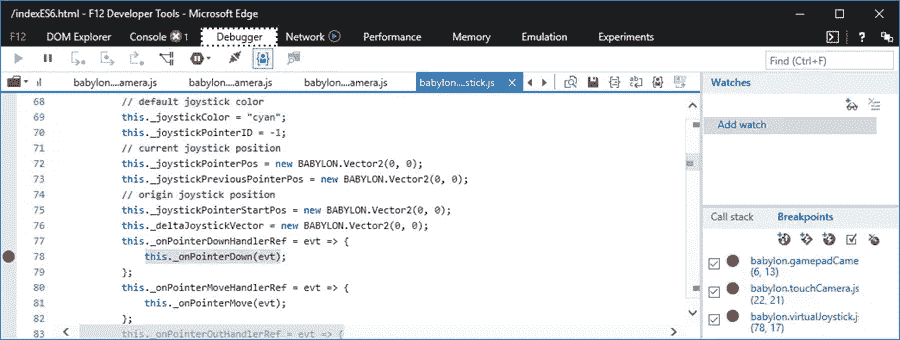

将摄像头切换到“**虚拟操纵杆摄像头**”，触摸屏幕或左键点击，即可调试箭头功能:

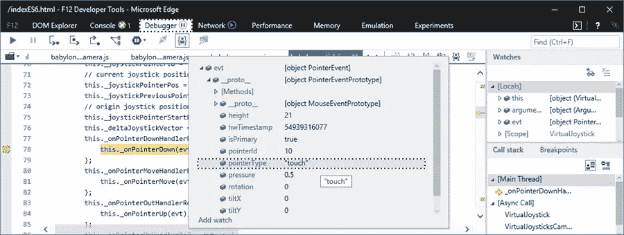

现在，假设您想要**编辑 ECMAScript 6 代码**来改善您的调试体验。进入**实验**选项卡，启用**编辑 JavaScript** 选项:

重启浏览器。现在，在前面的句柄“`*let foo = 'test'*`”上添加这行代码，并再次执行前面的操作:

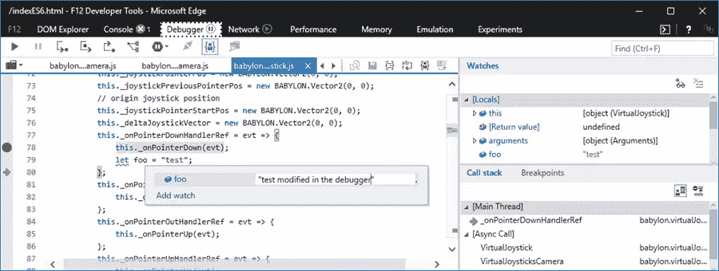

好吧，让我们回顾一下。这个演示使用的是: **ECMAScript 6 带类，超级&箭头函数，WebGL，Web 音频，Gamepad API 和指针事件**。谢谢 Babylon.js，谢谢 TypeScript &谢谢微软 Edge！；-)

如果你对我们在 F12 中所做的其他改进感兴趣，可以看看这篇文章:[宣布 Windows 10 中 F12 开发者工具的最新改进](http://blogs.windows.com/msedgedev/2015/07/21/announcing-the-latest-improvements-for-the-f12-developer-tools-in-windows-10/?WT.mc_id=16515-DEV-sitepoint-article51)

## JavaScript 的更多实践

这篇文章是微软技术倡导者的 web 开发系列的一部分，内容涉及实用的 JavaScript 学习、开源项目和互操作性最佳实践，包括[微软 Edge](http://blogs.windows.com/msedgedev/2015/05/06/a-break-from-the-past-part-2-saying-goodbye-to-activex-vbscript-attachevent/?WT.mc_id=16515-DEV-sitepoint-article51) 浏览器和新的 [EdgeHTML 渲染引擎](http://blogs.windows.com/msedgedev/2015/02/26/a-break-from-the-past-the-birth-of-microsofts-new-web-rendering-engine/?WT.mc_id=16515-DEV-sitepoint-article51)。

我们鼓励您使用 [dev.modern.IE](http://dev.modern.ie/tools/?utm_source=SitePoint&utm_medium=article51&utm_campaign=SitePoint) 上的免费工具跨浏览器和设备进行测试，包括 Windows 10 的默认浏览器 Microsoft Edge:

*   [扫描你的网站，寻找过时的库、布局问题和可访问性](http://dev.modern.ie/tools/staticscan/?utm_source=SitePoint&utm_medium=article51&utm_campaign=SitePoint)
*   [在 Mac、Linux 和 Windows 上使用虚拟机](http://dev.modern.ie/tools/vms/windows/?utm_source=SitePoint&utm_medium=article51&utm_campaign=SitePoint)
*   [在您自己的设备上远程测试 Microsoft Edge](https://remote.modern.ie/?utm_source=SitePoint&utm_medium=article51&utm_campaign=SitePoint)
*   [GitHub 编码实验室:跨浏览器测试和最佳实践](https://github.com/deltakosh/interoperable-web-development/?WT.mc_id=16515-DEV-sitepoint-article51)

来自我们的工程师和布道者的关于 Microsoft Edge 和 Web 平台的深入技术学习:

*   【2015 年微软 Edge 网络峰会(对新浏览器、新支持的网络平台标准以及来自 JavaScript 社区的演讲嘉宾有何期待)
*   哇，我可以在 Mac 电脑上测试 Edge & IE 浏览器& Linux！(来自雷伊·班戈)
*   [在不破坏网络的情况下推进 JavaScript】(来自 Christian Heilmann)](http://channel9.msdn.com/Events/WebPlatformSummit/2015/Advancing-JavaScript-without-breaking-the-web/?WT.mc_id=16515-DEV-sitepoint-article51)
*   使网络正常工作的边缘渲染引擎(Jacob Rossi)

http://dev.modern.ie/tools/vms/windows/?utm_source=SitePoint&utm_medium=article50&utm_campaign=SitePoint

*   [用 WebGL 释放 3D 渲染](https://channel9.msdn.com/Events/WebPlatformSummit/2015/Unleash-3D-rendering-with-WebGL-and-Microsoft-Edge/?WT.mc_id=16515-DEV-sitepoint-article51)(来自大卫·卡图赫，包括[伏龙。JS](http://vorlonjs.com/?WT.mc_id=16515-DEV-sitepoint-article51) 和 [babylonJS](http://babylonjs.com/?WT.mc_id=16515-DEV-sitepoint-article51) 项目)
*   [托管网络应用和网络平台创新](https://channel9.msdn.com/Events/WebPlatformSummit/2015/Hosted-web-apps-and-web-platform-innovations/?WT.mc_id=16515-DEV-sitepoint-article51)(来自律师奶爸和基里尔·赛克谢诺夫，包括[流形。JS](http://manifold.js.com/?WT.mc_id=16515-DEV-sitepoint-article51) 项目)

更多面向网络平台的免费跨平台工具和资源:

*   [适用于 Linux、MacOS 和 Windows 的 Visual Studio 代码](https://code.visualstudio.com/?WT.mc_id=16515-DEV-sitepoint-article51)
*   [用节点编码。JS](https://www.microsoftvirtualacademy.com/en-US/training-courses/building-apps-with-node-js-jump-start-8422/?WT.mc_id=16515-DEV-sitepoint-article51) 和[在 Azure 上免费试用](https://azure.microsoft.com/en-us/pricing/free-trial/?WT.mc_id=16515-DEV-sitepoint-article51)

## 分享这篇文章