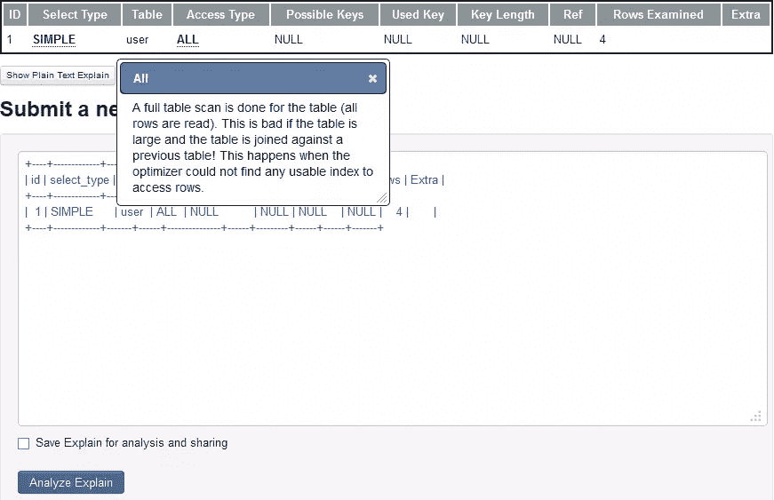

# 如何解释您的 SQL 解释查询

> 原文：<https://www.sitepoint.com/explain-sql-explain-queries/>

酷孩子可能已经迁移到 NoSQL，但对我们大多数人来说，关系数据库仍然是日常 web 开发的重要部分。我也愿意打赌关系数据库在十年后还会存在。尽管我们很熟悉，但 SQL 语法是一门黑暗的艺术。唯一懂 SQL 的人是那个留着胡子穿着凉鞋的奇怪家伙，他在你办公室的角落里自言自语。其他所有人都使用这种力量，并花费大量令人沮丧的时间漫无目的地查看破碎的选择查询。

MySQL 和 MariaDB 提供了一个有用的`EXPLAIN`命令，可以分析您的查询并检测潜在的性能问题:

*   `EXPLAIN`描述如何处理`SELECT`，包括关于`JOINS`的信息。
*   `EXPLAIN EXTENDED`提供附加信息并估计由条件过滤的表格行数。

该命令简单地添加到查询的开头，例如

```
EXPLAIN SELECT * FROM `user`;
```

输出结果:

```
+----+-------------+-------+------+---------------+------+---------+------+------+-------+
| id | select_type | table | type | possible_keys | key  | key_len | ref  | rows | Extra |
+----+-------------+-------+------+---------------+------+---------+------+------+-------+
|  1 | SIMPLE      | user  | ALL  | NULL          | NULL | NULL    | NULL |    4 |       |
+----+-------------+-------+------+---------------+------+---------+------+------+-------+
```

呃— *这是什么意思？*

幸运的是，MariaDB 的好心人提供了一个有用的分析器来解释你的解释:
[【https://mariadb.org/explain_analyzer/】T2](https://mariadb.org/explain_analyzer/)

您可以将结果表粘贴到**中，提交一个新的解释**并点击**分析**按钮…



点击任何带下划线的粗体文本，了解关于`EXPLAIN`结果的更多信息。

## 提取解释表

不幸的是，提取一个`EXPLAIN`表可能有点棘手。如果您使用的是 mysql >命令行界面，结果可以包装为:

```
+----+-------------+-------+------+---------------+------+---------+------+-----
-+-------------+
| id | select_type | table | type | possible_keys | key  | key_len | ref  | rows
 | Extra       |
+----+-------------+-------+------+---------------+------+---------+------+-----
-+-------------+
|  1 | SIMPLE      | user  | ALL  | NULL          | NULL | NULL    | NULL |    4
 | Using where |
+----+-------------+-------+------+---------------+------+---------+------+-----
-+-------------+
```

除非您首先删除必要的换行符，否则直接从控制台复制到分析器是行不通的。您可以增加控制台窗口的宽度，但不能保证每个结果都适合。

更好的替代方法是将结果输出到一个文本文件，并从那里复制`EXPLAIN`表。如果您使用 MySQL 命令行，`tee`命令会将所有控制台输出重定向到一个命名文件，例如

```
mysql> tee out.txt
```

*(注意，即使在 Windows 上，文件路径也应该使用“/”正斜杠。)*

或者，您可以在启动 mysql 时使用\T 命令行参数:

```
> mysql \T "out.txt"
```

或者，如果您觉得特别勇敢，您可以使用一个命令将所有解释输出定向到一个文件:

```
> mysql -u [dbuser] -p[dbpass] -e "[query]" > out.txt
```

其中:

*   `[dbuser]`是数据库用户的名字
*   `[dbpass]`是数据库用户的密码(在-p 和密码之间没有空格)
*   `[query]`是 SQL 语句，例如`USE mydatabase; EXPLAIN SELECT * FROM mytable;`

在这种情况下，输出文件名路径应该使用您的操作系统标准，即 Windows 上的“\”，Mac 或 Linux 上的“/”。

[**解释分析器**](https://mariadb.org/explain_analyzer/) 是一个用简单英语解释解释的伟大工具。你很快就会成为团队中的 SQL 大师…开始留胡子吧。

## 分享这篇文章