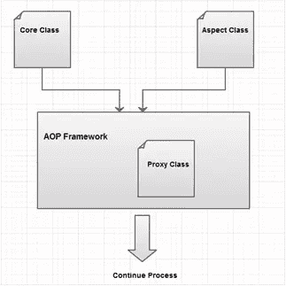

# 用 CodeIgniter 探索面向方面编程，第 2 部分

> 原文：<https://www.sitepoint.com/explore-aspect-oriented-programming-with-codeigniter-2/>

在本系列的前一部分中，我们学习了什么是面向方面编程(AOP ),以及重要的 AOP 术语的含义。在这一部分中，我将使用实例解释为什么我们需要 AOP，以及如何使用 CodeIgniter 框架将 AOP 行为添加到您的 PHP 应用程序中。

## 跨领域的实际问题

首先，让我们看看几乎每个 web 应用程序中都存在的一些横切关注点。

### 记录

日志记录是 web 应用程序中最基本的功能之一，因为它允许我们跟踪代码执行流程。当一个 bug 出现在一个实际的应用程序中时，我们不能改变任何代码来识别 bug。日志文件通常是找到这些错误的唯一可用资源。

将日志消息写入文件或数据库是最常用的方法。根据应用程序的类型和记录的逻辑，写入日志的信息可能会有所不同。值得注意的一般要点是进入函数、从函数返回以及返回时出错。

```
<?php
function addPost() {
    $log->writeToLog("Entering addPost");
    // Business Logic
    $log->writeToLog("Leaving addPost");
}
```

如果我们从 AOP 的角度来考虑，上述情况相当于 advices 之前和之后。因此，around advice 最适合日志记录。

### 认证和授权

身份验证是在系统内部识别用户合法性的过程。我们通常使用基本级别的用户名和密码进行身份验证。授权是验证对系统中特定部分的访问的过程。我们需要在许多应用程序中同时应用身份验证和授权。

```
<?php
function addPost() {
    $authentication->validateAuthentication($user);
    $authorization->validateAccess($user);
    // business logic
}
```

在业务逻辑的开始，通常需要身份验证和授权。首先，用户应该登录到系统，然后他应该有必要的权限添加帖子。这些都是跨领域的关注，因为它们必须适用于某些方法。我们需要 AOP 上下文中的认证和授权的事前通知。

### 事务管理

事务管理确保数据库中数据的一致性和完整性。考虑这样一种情况，您有多个依赖函数，它们将数据保存到单个进程中的数据库中。如果一个函数失败，而其他函数成功执行，您的数据库将会损坏。因此，在每个应用程序中使用事务处理是很重要的。

```
<?php
function addPost() {
    $tx->beginTransaction();
    try{
        // Business logic
        $tx->commit();
    }
    catch (Exception $e) {
        $tx->rollback();
    }
}
```

当所有的函数调用都成功完成时，我们提交数据，如果有什么失败，我们进行回滚操作。在 AOP 上下文中，将分别在建议之前、建议之后和抛出建议之后。之前和之后的建议在大多数 AOP 框架中都很常见。抛出后的建议可以在高级 AOP 框架中找到。

## AOP 如何工作

AOP 在 PHP 社区中仍然不流行，但是全功能的 AOP 框架对于像 JAVA 这样的语言是可用的。在 AOP 中，一边是核心业务逻辑类，另一边是方面。这些方面可以在编译时或运行时应用于核心类。像 AspectJ 这样的框架在编译时应用 AOP。由于 PHP 是一种解释语言，我们不必担心在编译时应用 AOP，因此在运行时应用 AOP 更有意义。



正如您所看到的，核心逻辑和横切关注点是使用两个 PHP 类分开的。然后 AOP 框架在运行时结合核心类和方面类，并创建一个动态代理类。动态类包含实际方法类前后的通知函数调用。

将方面与核心逻辑结合起来通常使用两种技术:基于 XML 的配置和基于注释的配置。

在基于 XML 的配置中，应用横切关注点的所有 AOP 规则都记录在一个 XML 文件中。

在基于注释的配置中，规则是使用注释与实际方法一起定义的。我们可以使用预定义的文档注释结构来替换 PHP 中的注释。

## 为什么选择 CodeIgniter

您可能想知道为什么我选择 CodeIgniter 来解释 AOP，因为它不提供对 AOP 功能的任何支持。我这样做是为了从头开始创建基本的 AOP 功能，以帮助您更好地理解概念和过程。如果我选择一个支持 AOP 的框架，那么我只能解释规则结构和它是如何工作的。因为你不了解基础知识，所以你不能将你的知识应用到新的 AOP 框架中。因为我们在这里从头开始创建一切，你将能够毫无困难地适应任何新的框架，或者甚至有一天创建你自己的 AOP 框架。

CodeIgniter 钩子是促使我选择这个特定框架的另一个原因。当一个方法被调用时，你必须创建代理类。在 AOP 框架中，这个过程是不可见的，而且非常复杂，很难解释。CodeIgniter 挂钩允许我们在某些预定义的挂钩点触发定制代码。利用这一点，我们可以在每次方法调用时触发定制代码，从而执行 AOP 功能。我不会创建代理类，因为创建这样的功能需要大量的编码，超出了本教程的范围。

## 使用 CodeIgniter 挂钩

CodeIgniter 网站解释说，hooks 特性“提供了一种在不侵入核心文件的情况下进入和修改框架内部工作的方法。”您可以通过将配置文件中的参数`enable_hooks`设置为 true 来启用钩子。

有一些预定义的钩子点可用，但是我只打算解释我们的应用程序所必需的钩子。它们是:

*   `pre_controller`–在调用任何控制器之前立即调用
*   `post_controller`–在控制器完全执行后立即调用

让我们设置一个钩子来调用定制代码。

```
<?php
$hook["pre_controller"] = array(
    "class"    => "AOPCodeigniter", 
    "function" => "applyBeforeAspects", 
    "filename" => "AOPCodeigniter.php", 
    "filepath" => "hooks"
);
```

将上述代码放在`config` 目录下的`hooks.php`文件中。然后在`application/hooks`文件夹中创建`AOPCodeigniter` 类。现在，每次发出请求时，类的'`applyBeforeAspects()`'方法将在实际控制器方法之前被调用。这将使我们能够将 before advices 与核心逻辑结合起来(在实际的 AOP 框架中，这将使用代理类来完成)。

我们可以使用以下代码以与上述代码相同的方式应用 after advices:

```
<?php
$hook["post_controller"] = array(
    "class"    => "AOPCodeigniter", 
    "function" => "applyAfterAspects", 
    "filename" => "AOPCodeigniter.php", 
    "filepath" => "hooks"
);
```

## 摘要

在本系列的这一部分中，我们已经学习了如何根据真实项目的实际场景来确定 AOP 的使用范围，并且我已经介绍了 CodeIgniter 作为创建基本 AOP 功能的上下文。现在我们已经完成了理论部分，在下一部分中，我将向您展示如何使用 XML 和基于注释的方法来创建您自己的规则结构，以及如何处理这些规则来应用建议。

图片 via[Fotolia](http://us.fotolia.com/?utm_source=sitepoint&utm_medium=website_link&utm=campaign=sitepoint "Royalty Free Stock Photos at Fotolia.com")

## 分享这篇文章