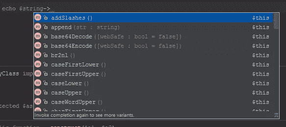

# 探索 Webiny 框架:StdLib 组件

> 原文：<https://www.sitepoint.com/exploring-webiny-framework-stdlib-component/>

有一句关于开发人员职业周期的谚语:

1.  不使用框架
2.  发现框架
3.  编写自己的框架
4.  不使用框架

当然，第 4 点指的是新发现的使用 Composer 从各种经过战斗考验的第三方组件中[构建自己的框架](https://www.sitepoint.com/build-php-framework-symfony-components/)的能力。

我们都知道 PHP 生态系统中并不缺少框架，所以最近看到另一个框架的出现让我很惊讶。


这个框架被称为 [Webiny](https://www.webiny.com/webiny-framework/) ，虽然充满了他们认为必要的车轮改造，但其中有一些真正有趣的组件值得一看。在这篇介绍性的文章中，我们不会把重点放在整个框架上，而是放在它最基本的组件上 StdLib。

## 网页安全

不，不是那个“性病”。StdLib 代表标准库，是该框架所有其他子组件的核心。这有点像给一个随机的 PHP 项目添加一两个依赖项，在你知道发生了什么之前，Symfony/Yaml 不知何故已经在那里了。

除此之外，StdLib 像之前的许多其他工具一样，通过在顶部添加一个流畅的面向对象接口和一些助手方法，使得处理标量变得非常简单。例如，有一个轻量级的 URLObject，它包含一些处理重定向、方案、端口等的帮助方法。除了帮助使用 OO 包装器，这个库还提供了一些基本的验证、帮助构建其他 Webiny 组件的方法、一个简单的单例特性等等。

StdLib 与众不同的地方在于，它是作为一组[特征](https://www.sitepoint.com/using-traits-in-php-5-4/)实现的——这是现代 PHP 开发中很少使用的部分。例如，前面提到的 URLObject 是这样实例化的:`$this->url('https://www.webiny.com/');`，因为 StdObject 特征被添加到任何需要该功能的类中。Webiny 框架的大多数其他组件也是作为 Traits 实现的，因为它们具有隔离的性质——团队选择这种方法是为了简化类的层次结构，目的是尽可能减少扩展。

StdLib 可以作为一个独立的[包](https://github.com/Webiny/stdlib)使用，可以直接克隆或者[【合成】](https://packagist.org/packages/webiny/std-lib)，也可以作为[整个框架](https://github.com/Webiny/Framework)的一部分拉进来。让我们看看它提供什么，好吗？

## 特征

在内部，StdLib 由两个子库组成。一个是[异常](https://github.com/Webiny/StdLib/tree/master/Exception)集，只有当你打算构建额外的 Webiny 组件时才使用(在以后的教程中会有更多的介绍)。另一个是 [StdObject](https://github.com/Webiny/StdLib/tree/master/StdObject) lib，它包含了我们之前讨论过的功能。

除此之外，库包含利用这些子库的特征。

### 组件特征

ComponentTrait 只有在构建额外的 Webiny 组件时才有用——这是我们暂时不会涉及的。现在，我们跳过它。

### 工厂装载列车

FactoryLoaderTrait 在调用动态定义的类实例时非常有用。例如:

```
$className = 'myNameSpace\myClass';
$argument1 = 'Hello';
$argument2 = 'World';
$mustBe = 'myNameSpace\mySubClass';
```

要用参数“Hello”和“World”实例化`myClass`,同时确保实例属于`mySubClass`类型，可以采用以下两种方法:

```
// standard PHP

try {
    $instance = new $className($argument1, $argument2);
    if (!($instance instanceof $mustBe)) {
        throw new Exception("Instances don't match!");
    }
} catch (Exception $e) {
    // Handle exception
}
```

```
// FactoryLoaderTrait approach

try {
    $instance = $this->factory($className, $mustBe, [$argument1, $argument2]);
} catch (Exception $e) {
    // Handle exception
}
```

可以看到，第二种方式稍微短一点。当然，这种特性的有用性是值得怀疑的，尤其是考虑到动态类名并不是人们应该经常使用的东西，但是当您考虑到这种特性可以给整个组织/框架带来的标准化水平时，好处就变得显而易见了。这种特性的方法只不过是动态类实例化中的“编码标准”,但它可能是一种有价值的方法。

### 单线铁路

这个 [SingletonTrait](https://github.com/Webiny/StdLib/blob/master/SingletonTrait.php) 立即将你的类变成一个 singleton。关于单例的“坏”本质，网络上有广泛的讨论——不仅仅是像这些的[古书，甚至我们自己的一些](https://blogs.msdn.com/b/scottdensmore/archive/2004/05/25/140827.aspx)[旧帖子也讨论了这个](https://www.sitepoint.com/whats-so-bad-about-the-singleton/)——但是万一你需要一个，又找不到合适的 DI 容器实现来代替，它就在这里。

要记住的一件事是`__construct`冲突。这个特殊的特征没有实现它自己的`__construct`方法，这意味着它既可以用于有自己的方法的类，也可以用于没有自己的方法的类，不像[和其他一些解决方案](https://stackoverflow.com/questions/7104957/building-a-singleton-trait-with-php-5-4)，但这也意味着如果你选择使用这个特征，你应该调整你的类的构造函数以适应单例模式。

如果你不熟悉单身人士，这篇文章可能会对你有所帮助。

在这个实现中值得一提的另一件事是，trait 实现了一个公共的`init`方法和一个受保护的`_init`方法，在实例创建后按这个顺序执行。

这很有用，因为你可以用它作为创建后的初始化机制来进一步设置你的 singleton 实例，而不必依赖于它的构造函数——也许你的类已经有了一个定义好的构造函数，你所需要的就是把它变成一个 singleton，但是 singleton 模式的工作还需要一些调整？非常适合`init`。

### StdLibTrait

该特征是 StdObjectTrait 和 ValidatorTrait 的组合。StdLibTrait 本身包含一些 json 编码和解码帮助器(目前还很简单),以及一个 serialize 和 unserialize 方法，它们做的事情与 PHP 的对应部分基本相同。这可能是替代使用 Symfony 的序列化器作为战场测试和多格式支持组件的地方。

### 验证特征

从 ValidatorTrait 开始，它是一个简单的用于检查类型的原生 PHP 方法的集合，但是经过了重写，因此它们是类的一部分。我不确定这背后的原因，因为 API 仍然几乎完全相同(`self::isArray()` vs `is_array()`)，但我假设它与保持组件的可扩展性有关——能够更新这些本机方法而不必在整个库范围内更改 API 保证是一个无价的好处。

在一部分中，验证器使用 StdObjectWrapper，它是 StdObject 子库的一部分——它使用 Webiny OO 包装标量和 url 格式来提供检查这些类型的流畅接口。

### StdObjectTrait

这是 StdLib 组件的核心，[主要部分](https://github.com/Webiny/StdLib/tree/master/StdObject)。它为使用该特征的类提供了通过适当的帮助器方法生成 ArrayObject、UrlObject、StringObject 和 DateTimeObject 实例的能力。

#### StringObject

可以说是最简单的，这个对象允许你使用字符串作为对象。

```
$string = $this->str("My string");
```

该实例本身将包含一个编码常量(默认为 UTF8)和一些助手方法，如`length`、`wordCount`和`subStringCount`，所有这些方法都非常有用，此外还有一些原生 PHP 函数再次被打包到类方法中。通过一个所有 StdObjects 通用的`ManipulatorTrait`,`StringObject`也可以访问改变它的方法——`trim`是最熟悉的一个，但也具有那些用于追加、前置、添加斜线等等的功能。

这种方法的一个巨大优势不仅在于能够链接对 string 对象的调用，还在于这种接口为您的 IDE 提供了自动完成功能:



```
$string = $this->str("This is a string");
echo $string->hash()->padLeft(45, "testing");
```

在一行中，我们散列字符串并用单词“testing”填充它左边的剩余字符槽，直到有 45 个字符。结果是`testif72017485fbf6423499baf9b240daa14f5f095a1`。没有比这更简单的了，而且可读性极强。

作为另一个例子，请看文档中的这个:

```
$string = new StringObject('Some test string.');
$string->caseUpper()->trimRight('.')->replace(' test'); // SOME STRING
```

当然，该对象实现了`__toString`方法，因此它可以直接作为字符串使用。巧合的是，StdLib 中的所有其他对象也实现了这个方法，并且可以直接打印，产生您希望它们的非对象对应物生成的输出。

公开的方法太多了，无法一一列举，所以看一看文件中的[就可以了解所有这些方法。](https://github.com/Webiny/StdLib/blob/master/StdObject/StringObject/ManipulatorTrait.php)

### 数组对象

与 StringObject 类似，ArrayObject 为数组操作提供了一个简单的接口。自然地，它是迭代友好的，所以你可以像遍历任何带有 foreach 的数组一样遍历它，就像一个原生数组一样。

```
$array = new ArrayObject(['one', 'two', 'three']);
$array->first(); // StringObject 'one'
$array->append('four')->prepend('zero'); // ['zero', 'one', 'two', 'three', 'four']
```

注意，从这种数组格式获取元素会产生 StdObjects，而不是实际的标量。返回值将总是属于`StdObjectAbstract`类型。字符串产生 StringObject，数组产生 ArrayObject，而数字，奇怪的是，有点不一致且一致地产生一个`StdObjectWrapper`的实例，其`_value`属性设置为实际数字。如果元素是一个类，那么这个类也会被包装器包装起来。例如:

```
$array = $this->arr([1, "2", new myClass(1, 2)]);
var_dump($array->last());
```

这给了我们:


我不确定我对此有什么感觉。一方面，这是超级一致的，确保我们总是以某种形式得到`StdObjectWrapper`,但另一方面，如果我在处理一组类，我不能不关心这个包装器。当然，有一种方法可以从任何 Webiny StdLib 对象中获取实际值——每个对象都有一个`val`方法，该方法提取其中包含的底层值。

通过使用这个特性，数组可以获得各种各样的操纵方法，见[操纵器](https://github.com/Webiny/StdLib/blob/master/StdObject/ArrayObject/ManipulatorTrait.php)。我发现可链接级别语法特别有用——通过使用`key1.key2.key3`作为索引，可以进入多维数组，节省了大量时间:

```
$array = [
            'k1' => 'test',
            'k2' => [
                'k3' => [
                    'k4' => 'deepest'
                ]
            ]
        ];

$a = new ArrayObject($array);
$a->keyNested('k2.k3.k4', 'webiny');
$a->keyNested('k2.k3.k5', 'anotherElement');

echo $a->keyNested('k2.k3.k4'); // webiny
echo $a->keyNested('k2.k3.k5'); // anotherElement
```

#### URLObject

URL 对象在这里是为了使处理 URL 语法更容易。它支持一些常见的响应代码、处理查询参数的方法、端口和其他变量，并且还可以通过一行可靠的代码轻松地[操作](https://github.com/Webiny/StdLib/blob/master/StdObject/UrlObject/ManipulatorTrait.php)–切换出方案、主机、域等。

奇怪的是，URLObject 并没有扩展 StringObject。对我来说，扩展是有意义的，因为在这种情况下，它们本质上都是字符串，前者将受益于后者的操作方法。还有更好的 URL 操作库，所以我看不出使用这个有什么好处。我想到的一个例子是优秀的 PHP 联盟 URL 库 T1，它完成了所有这些工作，还有更多的优点，它经过了全面的测试，并由十几个非常有能力的开发人员积极维护。

#### 日期时间对象

最后，还有 DateTimeObject。由于助手方法层出不穷，DateTime 对象为 PHP 的本机 DateTime 类提供了一个更流畅、更自然的接口，并帮助您处理与时间相关的问题:

```
$dt = new DateTimeObject('3 months ago');
echo $dt; // 2013-02-12 17:00:36
$dt->add('10 days')->sub('5 hours'); // 2013-02-22 12:00:36
```

就其本身而言，如果您已经在项目中使用 StdLib，DateTimeObject 特性是非常方便的，但是对于任何更复杂的日期时间操作，我会推荐添加了一些[周期](https://period.thephpleague.com/)的 [Carbon](https://github.com/briannesbitt/Carbon) 。

这并不是说 DateTimeObject 没有它的用途——它支持默认时区、各种形状和大小的简单日期格式输出、作为周期的更简单替代方案的简单和容易的差异、人类可读的“X 时间前”输出、不同时区的偏移等等。

## 结论

通过这样做，Webiny 框架确保了没有开发人员进入项目来处理原生 PHP 类型。它们都有自己合适的包装器，并且它们的行为完全符合开发人员的要求。这是否过于雄心勃勃？也许吧。但我认为这是一种有趣的方法，类似于在开始一个项目之前定义一个编码标准——在开发的进一步阶段遇到的问题将完全是特定于领域的，从长远来看，最有可能节省时间。我在这里看到的唯一一个大缺点是不得不`use`在你想给 StdObject 提供支持的每一个类中使用这个特征。

Webiny 项目是一个雄心勃勃且有趣的项目。该框架的范围令人印象深刻，其组件覆盖的范围也很广——但是它们是否真的有必要，我将让您来决定。如果你很好奇为什么我如此关注这个框架以至于需要一个帖子(或几个)，这是因为我喜欢尝试新事物，但也因为我对它有一点贡献，我很好奇他们能把它带到哪里。

在未来的一些帖子中，我们将会看到更多的 Webiny 组件，甚至会构建一个带有框架的事件驱动的示例应用程序，以进行适当的旋转并评估其有效性。在此之前，我鼓励你尝试一下它的各个方面，并告诉我们你的经历。

## 分享这篇文章