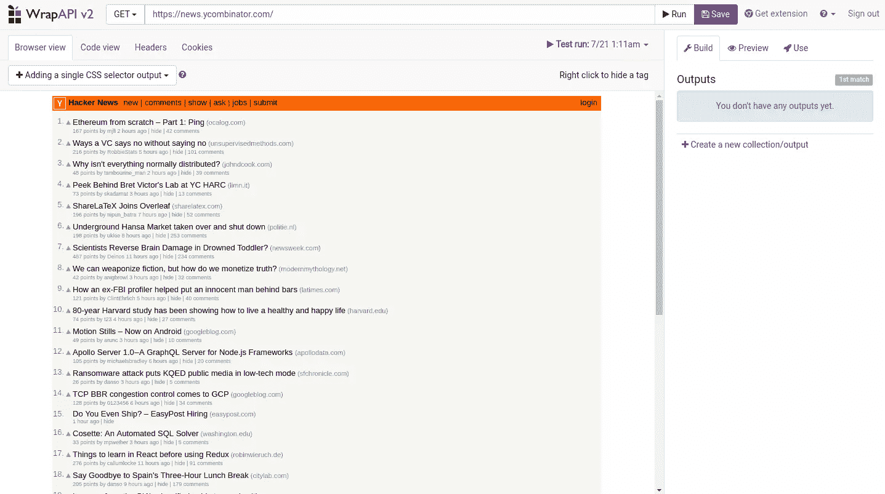
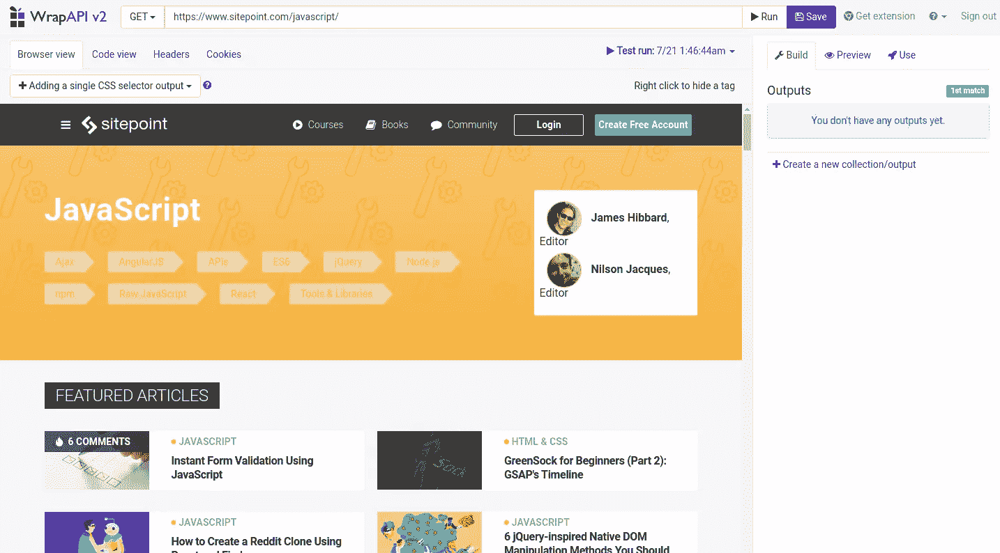
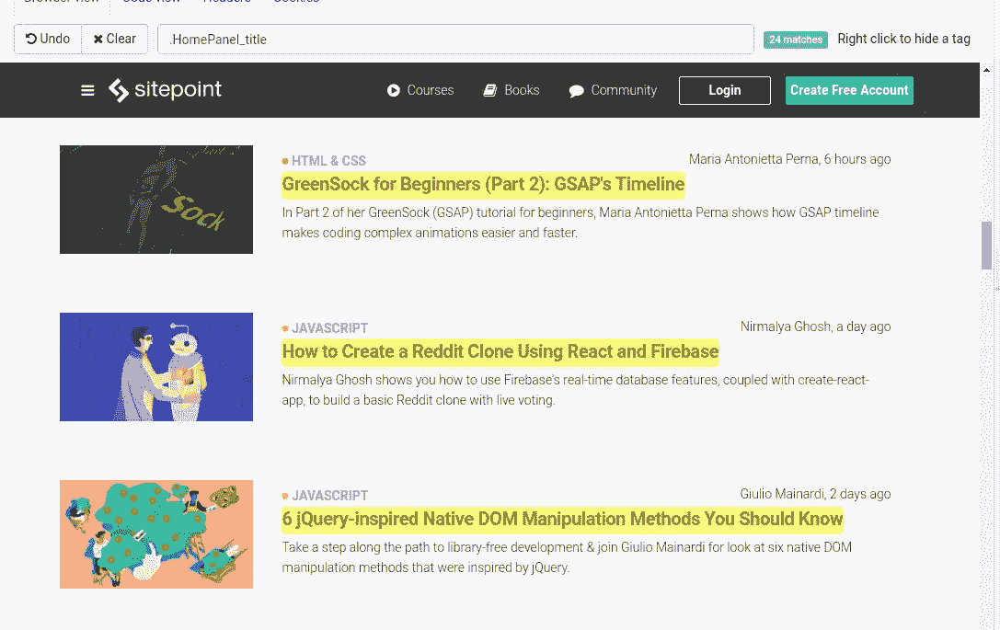
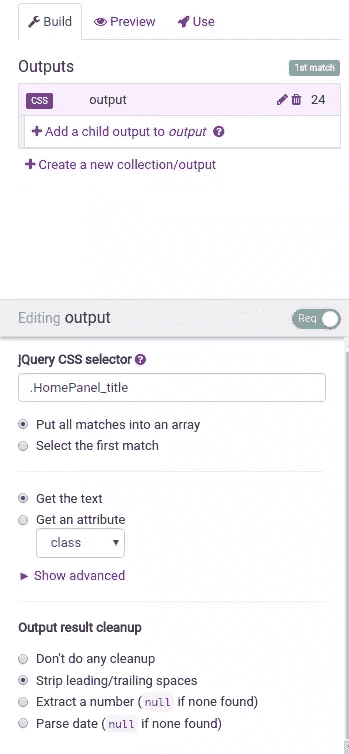
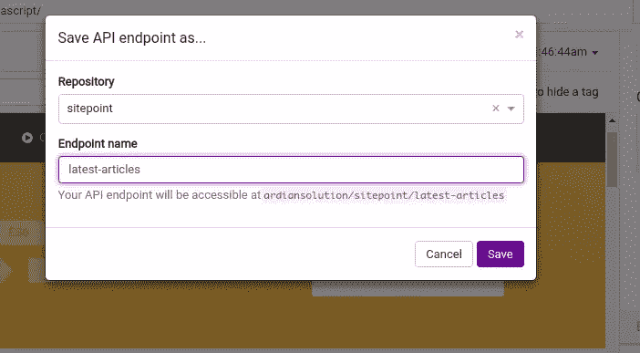
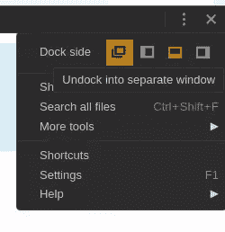
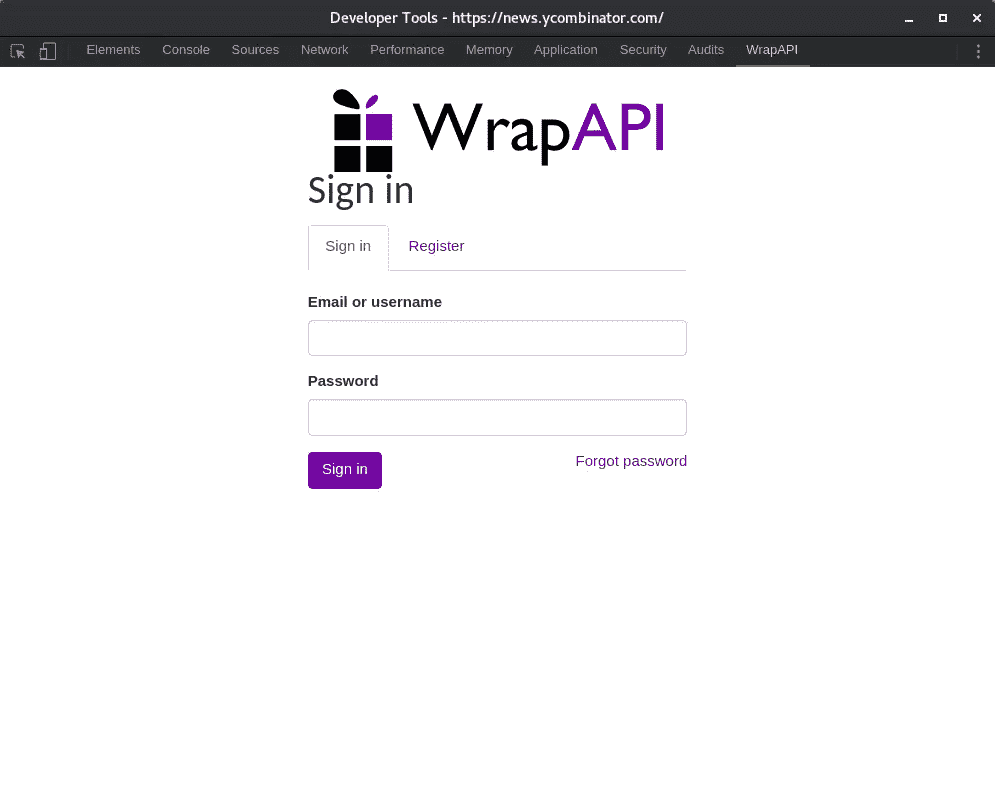
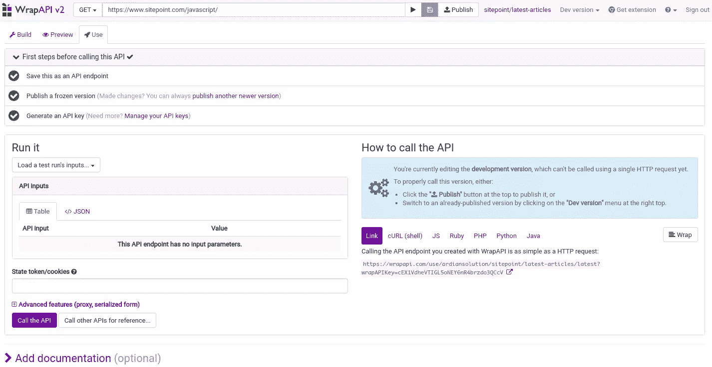
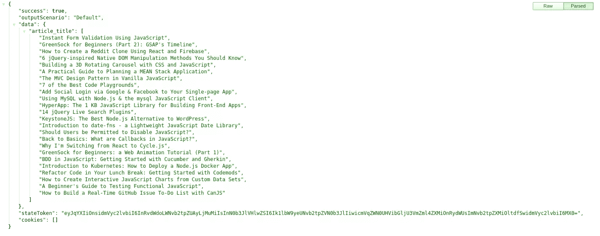

# 用 WrapAPI 提取网站数据和创建 API

> 原文：<https://www.sitepoint.com/extracting-website-data-creating-apis-wrapapi/>

今天，我们使用的几乎所有服务都有某种 API。一些 web 应用程序甚至仅从 API 点构建，被传递到某种前端视图。如果你是一个提供 API 的服务的消费者，你有时会需要更多的特性或者发现 API 所能提供的限制。在本文中，我们将介绍一个对 API 消费者和创建者都有用的服务。

我总是说，如果有一个 web 界面，你可以在它上面构建你自己的 API。WrapAPI 试图让这个过程变得更简单。如果您熟悉 web 抓取/爬行(或从网站提取数据)的过程，您将会看到 WrapAPI 的神奇之处。

WrapAPI 提供了一项服务，允许您轻松地从网站中提取信息，并从数据中创建 API。它提供了一种简单、互动的方式来选择你想要得到的信息。只需点击几下，你就可以让你的 API 上线了。

为了跟随这个教程，我建议你去[wrapapi.com](https://wrapapi.com/)创建一个账户。

## 如何避开 WrapAPI

在 WrapAPI 网站上，您将看到您可以立即开始构建您的项目——尽管，除非您创建一个帐户，否则您的工作不会被保存。

注册后，点击**尝试构建 API** 按钮。

你会看到一个类似浏览器的界面。在网站的顶部，我们看到了一个地址栏。作为一个例子，WrapAPI 使用了黑客新闻(`https://news.ycombinator.com/`)。如果您点按 URL 以将其更改为其他内容，您将看到更多与您要提出的请求相关的选项。我们将使用默认选项，只将 URL 改为`https://www.sitepoint.com/javascript/`。我们只讨论了 **GET** 方法，因为在这个例子中我们只想获取数据。

在地址栏下面有四个按钮，为您提供关于您正在查看的站点的不同信息。**浏览器视图**显示您从浏览器访问的网站。**代码视图**显示站点的源代码。 **Headers** 显示你从服务器得到的响应。如果你想知道从服务器得到什么样的响应，这是很有用的:它给你像 HTTP 状态码(200，404，400 等)这样的信息。)，内容类型，web 服务器等等。您还可以直接从构建器中查看请求的**cookie**。

## 获取数据

到目前为止，您应该能够在**浏览器视图**框架中看到 SitePoint。

让我们创建一个非常简单的 API，向我们显示 JavaScript 频道的最新文章标题。如果您将鼠标悬停在标题、图像或站点中的任何其他元素上，您会注意到覆盖它的选择颜色。让我们向下滚动一点，到**最新**文章部分。将鼠标悬停在其中一篇文章的标题上，然后单击该标题。您会注意到，它不会切换到我们单击的特定链接。我们看到该部分中的每个标题都被突出显示。WrapAPI 猜测这些都是我们想要的标题。有时，它也可以选择我们不想要的网站部分。当 CSS 类选择器没有被很好地定义或被站点中的其他元素使用时，通常就是这种情况。

除了 CSS 选择器之外，WrapAPI 还支持正则表达式、JSON 选择器、头、cookies、表单输出以及更多选项。你可以一起使用它们，并提取你想要的东西。在这个例子中，我们将只使用 CSS 选择器。

在界面的右侧，您会看到三个选项卡。让我们看看当前的**构建**选项卡。 **Outputs** 将向我们显示选择器(在我们的例子中是 CSS 选择器)，你将得到更多关于你想要选择的细节。我们只对提取标题感兴趣，标题是文本。关于清理结果输出有更多的选项，但是我们不会深入讨论这些细节。如果你想创建另一个选择器，选择描述，作者，日期等。，只需点击**创建一个新的采集/输出**。命名你的选择器也很重要，因为如果你在站点中使用多个选择器，这将会更容易。通过单击铅笔图标，您可以编辑您的选择器。

**Preview** 选项卡将显示我们的数据在 JSON 中的表示，您可能会对 API 的外观有所了解。如果你对结果满意，你可以点击**保存**按钮来保存 API 的一个版本。

您需要输入 API 的存储库和端点名称。它帮助你管理和组织你的 API。最终，这也将成为 API 名称的一部分。输入信息后，您将返回到构建器。我们的 API 被保存了，但是现在我们需要测试并发布它。

**提示**:

*   如果站点有分页(上一页/下一页)，可以使用查询字符串选项。(更多关于那个[这里](https://wrapapi.com/#/docs/Inputs)。)
*   正确命名您的选择器，因为它们将是 JSON 输出的一部分。

### WrapAPI Chrome 扩展

WrapAPI chrome 扩展是创建 API 的另一种方式。它可以让你捕捉你用 Chrome 发出的请求。这对于使用 JavaScript (Ajax)调用数据的站点非常有用，对于支持登录的站点也非常有用。你可以从 Chrome web [商店](https://chrome.google.com/webstore/detail/wrapapi/fmnddkfmloenccahfiaflnkpngndkafm)安装它。

这一次，让我们使用黑客新闻。访问您想要获取数据的站点，然后按照下列步骤操作:

1.  打开 Chrome DevTools，导航到最右边的 WrapAPI 标签。

2.  将其移至一个单独的窗口。

    

3.  使用您的 WrapAPI 凭据登录。

    

4.  准备好之后，按下**开始捕获请求**按钮。

5.  刷新您正在使用的主选项卡。

    

    1.  选择您想要制作成 API 的请求(使用`GET`)。

    2.  点击**保存到 API 端点**并将其保存到存储库中。

    3.  最后，单击链接:**单击此处使用它来定义这个 API 端点的输入和输出…**

您将被重定向到构建器，以便提取数据。使用这种方法的好处是，您可以绕过登录页面，使用您已经分配的 cookies。

## 发布 API

在发布我们的 API 之前，我们必须冻结它。选择一个版本号，比如 0.0.1，就可以了。请注意，您对 API 所做的任何更改，都必须作为新版本冻结，同时增加版本号。简单描述你的 API 是关于什么的，或者如果它是一个更新，它包含了什么变化。最后按**发布**。

发布前的最后一步是生成一个密钥。点击**生成 API 密钥**。

全绿？这一定意味着我们已经成功地完成了发布我们的 API 所需的步骤，这几乎是正确的。最后一步是点击 URL 栏后顶部的**发布**按钮。您已经可以看到可以用来测试 API 的不同编程语言。我将使用带有扩展的浏览器，以更好的方式呈现 JSON。

这是我们最后的 API:

## 结论

不到一分钟，我们就能够从一个简单的 web 界面创建一个 API。

有些事情你应该考虑一下。从网站上抓取/提取数据有时会对网站上的内容产生法律影响。如果你碰巧使用一个网站作为你的 API 的服务，考虑请求许可使用那个内容，特别是当它作为 API 分发的时候。

WrapAPI 提供了一些非常棒且易于使用的特性，但它们不是没有代价的。免费和社区账户是免费的，但是你只能创建公共 API，并且每个月有 30，000 个 API 调用的限制。有几个[定价计划](https://wrapapi.com/#/pricing)。你总是可以创建自己的 API 和刮刀，但是如果你缺乏技能，或者没有时间，那么也许 WrapAPI 是你可能想要尝试的东西。

## 分享这篇文章