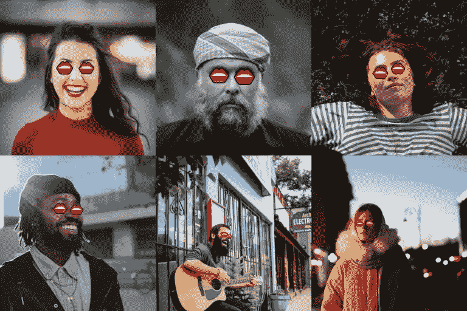

# 基于 Face-api.js 的网络人脸检测

> 原文：<https://www.sitepoint.com/face-api-js-face-detection/>

网络浏览器变得日益强大。网站和网络应用程序的复杂性也在增加。几十年前需要超级计算机的操作现在可以在智能手机上运行。其中之一就是人脸检测。

检测和分析面部的能力非常有用，因为它使我们能够添加巧妙的特征。想象一下自动模糊面部(像谷歌地图一样)，平移和缩放网络摄像头以聚焦人物(像微软团队)，验证护照，添加愚蠢的过滤器(像 Instagram 和 Snapchat)等等。但是在我们做这些之前，我们首先需要找到那张脸！

[Face-api.js](https://github.com/justadudewhohacks/face-api.js) 是一个库，它使开发人员能够在他们的应用程序中使用人脸检测，而不需要机器学习的背景。

本教程的代码可以在 [GitHub](https://github.com/sitepoint-editors/demo-face-api-js) 上找到。

## 基于机器学习的人脸检测

探测物体，比如人脸，是相当复杂的。想想看:也许我们可以编写一个程序，扫描像素来找到眼睛、鼻子和嘴。这是可以做到的，但是考虑到许多因素，要做到完全可靠实际上是不可能的。想想光线条件，面部毛发，各种各样的形状和颜色，化妆，角度，面具等等。

然而，神经网络擅长处理这类问题，可以推广到大多数(如果不是全部)情况。我们可以使用 TensorFlow.js(一个流行的 JavaScript 机器学习库)在浏览器中创建、训练和使用神经网络。然而，即使我们使用现成的、预先训练好的模型，我们仍然会对向 TensorFlow 提供信息并解释输出的本质有所了解。如果你对机器学习的技术细节感兴趣，请查看“[用 Python 进行机器学习的初级读本](https://www.sitepoint.com/machine-learning-python-primer/)”。

输入 face-api.js，它将所有这些都封装到一个直观的 api 中。我们可以传递一个`img`、`canvas`或`video` DOM 元素，库将返回一个或一组结果。js 可以检测人脸，但也可以估计人脸中的各种东西，如下所示。

*   **人脸检测**:获取一张或多张人脸的边界。这有助于确定图片中人脸的位置和大小。
*   **人脸地标检测**:获取眉毛、眼睛、鼻子、嘴巴和嘴唇、下巴的位置和形状。这可以用于确定面向方向或在特定区域投影图形，如鼻子和嘴唇之间的小胡子。
*   **面部识别**:确定照片中的人是谁。
*   **面部表情检测**:从一张脸上获取表情。请注意，里程可能因不同的文化而异。
*   **年龄和性别检测**:从人脸获取年龄和性别。请注意，对于“性别”分类，它将一张脸分类为女性化或男性化，这不一定会揭示他们的性别。

在你使用这些超越实验的东西之前，请注意人工智能擅长放大偏见。性别分类对双性化的人很管用，但是它不能检测我的非双性朋友的性别。它在大多数情况下可以识别白人，但经常无法检测有色人种。

在使用这项技术时要非常慎重，并且要和不同的测试团队一起进行彻底的测试。

## 装置

我们可以通过 npm 安装 face-api.js:

```
npm install face-api.js 
```

然而，为了跳过构建工具的设置，我将通过 unpkg.org 包含 UMD 包:

```
/* globals faceapi */
import 'https://unpkg.com/face-api.js@0.22.2/dist/face-api.min.js'; 
```

之后，我们需要从库的仓库中下载正确的[预训练模型。确定我们想从人脸中了解什么，并使用](https://github.com/justadudewhohacks/face-api.js/tree/master/weights)[可用模型部分](https://github.com/justadudewhohacks/face-api.js#models)来确定需要哪些模型。一些功能适用于多个模型。在这种情况下，我们必须在带宽/性能和准确性之间做出选择。比较各种可用模型的文件大小，并选择您认为最适合您的项目的模型。

不确定您需要哪些型号供您使用？您可以稍后返回到这一步。当我们在没有加载所需模型的情况下使用 API 时，将会抛出一个错误，指出库需要哪个模型。


我们现在准备使用[face-API . js API](https://github.com/justadudewhohacks/face-api.js#high-level-api)。

## 例子

让我们造些东西吧！

对于下面的例子，我将用这个函数从 [Unsplash 源](https://source.unsplash.com)加载一个随机图像:

```
function loadRandomImage() {
  const image = new Image();

  image.crossOrigin = true;

  return new Promise((resolve, reject) => {
    image.addEventListener('error', (error) => reject(error));
    image.addEventListener('load', () => resolve(image));
    image.src = 'https://source.unsplash.com/512x512/?face,friends';
  });
} 
```

### 裁剪图片

你可以在附带的 [GitHub repo](https://github.com/sitepoint-editors/demo-face-api-js/blob/main/scripts/1-image-crop.js) 中找到这个演示的代码。

首先，我们必须选择并加载模型。要裁剪图像，我们只需要知道人脸的边界框，所以人脸检测就够了。我们可以使用两种模型来做到这一点:SSD Mobilenet v1 模型(略低于 6MB)和微型人脸检测器模型(低于 200KB)。假设准确性无关紧要，因为用户也可以选择手动裁剪。此外，让我们假设访问者在慢速互联网连接上使用该功能。因为我们的重点是带宽和性能，我们将选择更小的微型人脸检测器模型。

下载模型后，我们可以加载它:

```
await faceapi.nets.tinyFaceDetector.loadFromUri('/models'); 
```

我们现在可以加载一个图像并将其传递给 Face-API . js。`faceapi.detectAllFaces`默认使用 SSD Mobilenet v1 模型，因此我们必须显式传递`new faceapi.TinyFaceDetectorOptions()`来强制它使用微型人脸检测器模型。

```
const image = await loadRandomImage();
const faces = await faceapi.detectAllFaces(image, new faceapi.TinyFaceDetectorOptions()); 
```

变量`faces`现在包含一个结果数组。每个结果都有一个`box`和`score`属性。分数表示神经网络对结果确实是人脸的置信度。`box`属性包含一个带有人脸坐标的对象。我们可以选择第一个结果(或者我们可以使用`faceapi.detectSingleFace()`，但是如果用户提交一张集体照片，我们希望在裁剪后的图片中看到他们所有人。为此，我们可以计算一个自定义边界框:

```
const box = {
  // Set boundaries to their inverse infinity, so any number is greater/smaller
  bottom: -Infinity,
  left: Infinity,
  right: -Infinity,
  top: Infinity,

  // Given the boundaries, we can compute width and height
  get height() {
    return this.bottom - this.top;
  },

  get width() {
    return this.right - this.left;
  },
};

// Update the box boundaries
for (const face of faces) {
  box.bottom = Math.max(box.bottom, face.box.bottom);
  box.left = Math.min(box.left, face.box.left);
  box.right = Math.max(box.right, face.box.right);
  box.top = Math.min(box.top, face.box.top);
} 
```

最后，我们可以创建一个画布并显示结果:

```
const canvas = document.createElement('canvas');
const context = canvas.getContext('2d');

canvas.height = box.height;
canvas.width = box.width;

context.drawImage(
  image,
  box.left,
  box.top,
  box.width,
  box.height,
  0,
  0,
  canvas.width,
  canvas.height
); 
```

[https://codesandbox.io/embed/festive-breeze-1xlo2?fontsize=14&initialpath=%2F1-image-crop.html&module=%2F1-image-crop.html&theme=dark&view=preview](https://codesandbox.io/embed/festive-breeze-1xlo2?fontsize=14&initialpath=%2F1-image-crop.html&module=%2F1-image-crop.html&theme=dark&view=preview)

## 放置表情符号

你可以在附带的 [GitHub repo](https://github.com/sitepoint-editors/demo-face-api-js/blob/main/scripts/2-emoji-eyes.js) 中找到这个演示的代码。

为什么不找点乐子呢？我们可以制作一个过滤器，将嘴表情符号(👄)在所有的眼睛上。为了找到眼睛的标志，我们需要另一个模型。这一次，我们关心的是准确性，所以我们使用 SSD Mobilenet v1 和 68 点人脸地标检测模型。

同样，我们需要首先加载模型和图像:

```
await faceapi.nets.faceLandmark68Net.loadFromUri('/models');
await faceapi.nets.ssdMobilenetv1.loadFromUri('/models');

const image = await loadRandomImage(); 
```

为了获得地标，我们必须将`withFaceLandmarks()`函数调用追加到`detectAllFaces()`中，以获得地标数据:

```
const faces = await faceapi
  .detectAllFaces(image)
  .withlandmarks(); 
```

和上次一样，`faces`包含了一个结果列表。除了脸部所在的位置，每个结果还包含地标点的原始列表。为了得到每个特征的正确的界标，我们需要分割点的列表。因为点数是固定的，所以我选择硬编码指数:

```
for (const face of faces) {
  const features = {
    jaw: face.landmarks.positions.slice(0, 17),
    eyebrowLeft: face.landmarks.positions.slice(17, 22),
    eyebrowRight: face.landmarks.positions.slice(22, 27),
    noseBridge: face.landmarks.positions.slice(27, 31),
    nose: face.landmarks.positions.slice(31, 36),
    eyeLeft: face.landmarks.positions.slice(36, 42),
    eyeRight: face.landmarks.positions.slice(42, 48),
    lipOuter: face.landmarks.positions.slice(48, 60),
    lipInner: face.landmarks.positions.slice(60),
  };

  // ...
} 
```

现在我们终于可以找点乐子了。有这么多选择，但是让我们用嘴表情符号遮住眼睛(👄).

首先，我们必须确定表情符号应该放在哪里，应该画多大。要做到这一点，让我们编写一个助手函数，从任意一组点创建一个盒子。盒子里装着我们需要的所有信息:

```
function getBoxFromPoints(points) {
  const box = {
    bottom: -Infinity,
    left: Infinity,
    right: -Infinity,
    top: Infinity,

    get center() {
      return {
        x: this.left + this.width / 2,
        y: this.top + this.height / 2,
      };
    },

    get height() {
      return this.bottom - this.top;
    },

    get width() {
      return this.right - this.left;
    },
  };

  for (const point of points) {
    box.left = Math.min(box.left, point.x);
    box.right = Math.max(box.right, point.x);

    box.bottom = Math.max(box.bottom, point.y);
    box.top = Math.min(box.top, point.y);
  }

  return box;
} 
```

现在我们可以开始在图片上画表情符号了。因为我们必须对两只眼睛都这样做，所以我们可以将`feature.eyeLeft`和`feature.eyeRight`放在一个数组中，并对它们进行迭代，以对每只眼睛执行相同的代码。剩下的就是在画布上画表情符号了！

```
for (const eye of [features.eyeLeft, features.eyeRight]) {
  const eyeBox = getBoxFromPoints(eye);
  const fontSize = 6 * eyeBox.height;

  context.font = `${fontSize}px/${fontSize}px serif`;
  context.textAlign = 'center';
  context.textBaseline = 'bottom';

  context.fillStyle = '#000';
  context.fillText('👄', eyeBox.center.x, eyeBox.center.y + 0.6 * fontSize);
} 
```

请注意，我使用了一些神奇的数字来调整字体大小和确切的文本位置。因为表情符号是 unicode，而且网络上的排版很奇怪(至少对我来说)，我只是调整数字，直到它们看起来差不多为止。更可靠的替代方法是使用图像作为覆盖图。

[https://codesandbox.io/embed/festive-breeze-1xlo2?fontsize=14&initialpath=%2F2-emoji-eyes.html&module=%2F2-emoji-eyes.html&theme=dark&view=preview](https://codesandbox.io/embed/festive-breeze-1xlo2?fontsize=14&initialpath=%2F2-emoji-eyes.html&module=%2F2-emoji-eyes.html&theme=dark&view=preview)



## 结束的

js 是一个非常棒的库，它使得人脸检测和识别变得非常容易。不需要熟悉机器学习和神经网络。我喜欢能够实现的工具，这绝对是其中之一。

根据我的经验，网络上的人脸识别会降低性能。我们必须在带宽和性能或准确性之间做出选择。较小的模型肯定不太准确，会在我之前提到的一些因素中漏掉一张脸，比如光线不足或当脸被面具覆盖时。

微软 Azure、谷歌云，可能还有其他企业都在云中提供人脸检测。因为我们避免下载大型模型，基于云的检测避免了繁重的页面负载，随着它的频繁改进，往往会更准确，甚至可能因为优化的硬件而更快。如果你需要高度的准确性，你可能会想要研究一个你觉得舒服的计划。

我绝对推荐使用 face-api.js 进行爱好项目、实验，也许是 MVP。

## 分享这篇文章