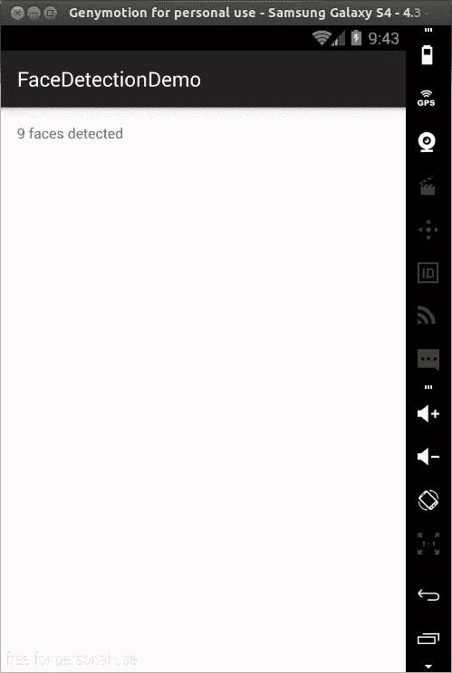
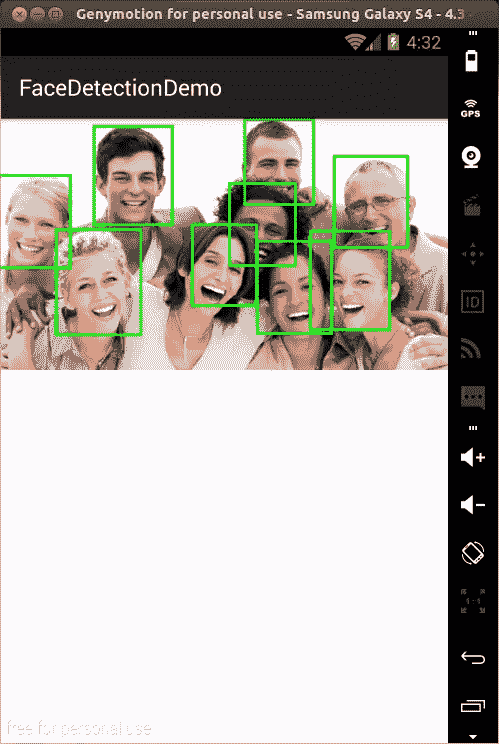
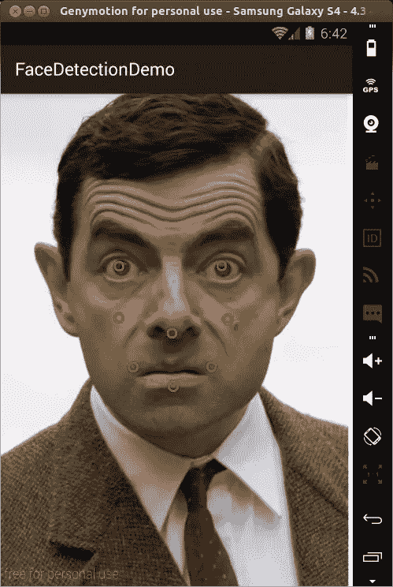
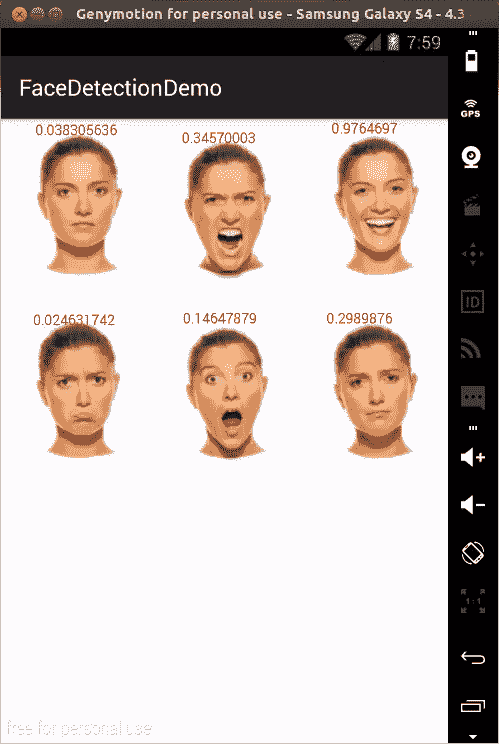

# 使用 Google Play 服务在 Android 中进行人脸检测

> 原文：<https://www.sitepoint.com/face-detection-in-android-with-google-play-services/>

这是 SitePoint 系列文章的第一部分，涵盖了构成 Google Play 服务的 API 库。本系列的每一篇文章都是独立的，所以你不必阅读其他文章来理解。

我们将讨论的 Google Play 服务 API 包括:

*   人脸检测
*   条形码扫描器
*   位置和背景
*   分析学
*   AdMob
*   地图
*   身份
*   玩游戏服务

## 移动视觉 API 简介

最近发布的 Google Play Services 7.8 增加了新的[移动视觉 API](https://developers.google.com/vision/?hl=en)，它提供了一个在照片和视频中查找对象的框架。该框架包括检测器，用于定位和描述图像或视频帧中的视觉对象，以及事件驱动 API，用于跟踪这些对象在视频中的位置。

目前，移动视觉 API 包括面部和条形码检测器，可以单独或一起应用。在这篇文章中，我们将看看 [Face API](https://developers.google.com/vision/face-detection-concepts) ，它可以在图像、直播流和视频中找到人脸。它可以找到并跟踪诸如眼睛、鼻子和嘴之类的面部标志的位置，并提供关于面部特征状态的信息，例如眼睛是否睁开、是否微笑等等。

### 注意

要运行该应用程序，你应该有一台运行 Android 2.3(姜饼)或更高版本并包含谷歌 Play 商店的设备。这意味着除非你已经在虚拟设备上安装了 [Google Apps](http://wiki.rootzwiki.com/Google_Apps#Universal_Packages_2) ，否则你将无法在模拟器上测试代码。默认的 Android 模拟器不支持在设备上安装谷歌应用程序，但如果你使用像 [Genymotion](https://www.genymotion.com/#!/) 这样的模拟器，你将能够(尽管团队[停止支持谷歌应用程序](https://plus.google.com/u/0/+GenymotionEmulator/posts/jNF8Kwu5p1c))。

## 人脸检测

人脸检测并不是 Android 上的新功能。以前可以使用[面部检测器进行面部检测。Android API level 1 中引入的 Face](http://developer.android.com/reference/android/media/FaceDetector.Face.html) API。移动视觉 API 提供的人脸检测框架就是这个 API 的改进。

你应该注意到，目前，Google Face API 只提供人脸检测功能，不提供人脸识别功能。它可以检测图像或视频中人脸的存在，但不能确定两张脸是否对应同一个人。它可以从位置逐帧的变化中推断出连续视频帧中的人脸是同一人脸。如果人脸离开视野并重新进入，它不会被识别为以前检测到的人脸。

为了开始使用 API，创建一个名为*facedectitiondemo*的新项目，在 Android Studio 项目创建向导的下一个屏幕中选择默认值，选择 API level 15。移动视觉 API 向后兼容所有支持 Google Play 服务的设备(即 Android 2.3 姜饼及更高版本)。

在这里找到[完成的项目。](https://github.com/sitepoint-editors/Android-Face-Recognition/blob/master/completed_project)

将以下依赖项添加到 *build.gradle(Module: app)* 文件中。

```
compile 'com.google.android.gms:play-services:7.8.0'
```

同步 gradle 文件，Gradle 控制台可能会要求您下载库。

[下载](https://github.com/sitepoint-editors/Android-Face-Recognition/tree/master/assets)我们将在教程中使用的图片。

在 *res* 文件夹中，新建一个 Android 资源目录。将其目录名设置为 *raw* ，并将资源类型也设置为 *raw* 。将 3 个下载的图像粘贴到这个 *res/raw* 目录。

在*MainActivity.java*中改变`onCreate(Bundle)`方法，如图所示。

```
@Override
protected void onCreate(Bundle savedInstanceState) {
    super.onCreate(savedInstanceState);
    setContentView(R.layout.activity_main);

    InputStream stream = getResources().openRawResource(R.raw.image01);
    Bitmap bitmap = BitmapFactory.decodeStream(stream);

    FaceDetector detector = new FaceDetector.Builder(getApplicationContext())
            .setTrackingEnabled(false)
            .build();

    // Create a frame from the bitmap and run face detection on the frame.
    Frame frame = new Frame.Builder().setBitmap(bitmap).build();
    SparseArray<Face> faces = detector.detect(frame);

    TextView faceCountView = (TextView) findViewById(R.id.face_count);
    faceCountView.setText(faces.size() + " faces detected");

    detector.release();

}
```

向生成的`activity_main.xml`文件中的`TextView`添加一个`id`，如图所示。

```
android:id="@+id/face_count"
```

运行应用程序，你应该会看到在图像中找到的脸的数量。



实际上，如果你运行了这个应用程序，你可能会得到一个错误的结果。我们很快就会知道为什么，首先让我们看看刚刚运行的代码。

我们首先从标签为*image01.jpg*的图像中创建一个`Bitmap`。然后，我们创建一个检测器，用于在提供的图像中查找人脸。`FaceDetector`是通过一个相关的构建器类创建的，指定了相关的检测选项。在上面的例子中，我们将跟踪设置为`false`,建议用于检测不相关的单独图像(与视频或一系列连续拍摄的静止图像相反)。对于不相关的单个图像的检测，这将给出更准确的结果。对于连续图像(如实时视频)的检测，跟踪可提供更准确(更快)的结果。

面部检测器可以运行低分辨率图像(例如 320×240)。在低分辨率图像上运行人脸检测比高分辨率图像更快。请记住，在较低的分辨率下，面部检测器可能会因为细节较少而错过一些较小的面部。

然后，我们从位图创建一个帧，并在该帧上同步运行人脸检测。

接下来，我们在视图布局中更改`TextView`的文本，并检测面数。

使用完检测器后，释放它以释放本机资源。

第一次在设备上运行使用 Face API 的应用程序时， [GMS](https://developers.google.com/android/reference/com/google/android/gms/common/package-summary) 会将原生库下载到设备上。通常这在应用程序第一次运行之前就完成了。但是如果下载尚未完成，那么检测人脸的调用将不会检测到任何人脸。所以你可能已经运行了应用程序，并得到了 <q>0 张检测到的面孔</q>的输出。

您可以使用`isOperational()`来检查所需的本地库是否可用，如果不可用，就采取一些措施，比如通知用户。例如，你可以做如下的事情。

```
if (!detector.isOperational()) {
    Toast.makeText(this, "Face detector dependencies are not yet available.", Toast.LENGTH_SHORT).show();
}
```

下载完成后，检测器将自动运行。如果你在应用程序中得到错误的人脸数量，再次运行它应该会给出正确的数量。

更好的解决方案是将 vision 功能依赖项添加到项目的 *AndroidManifest.xml* 文件中，以指示安装程序应该在应用程序安装时下载依赖项。

将以下内容作为`application`标签的子标签添加到清单文件中。

```
<meta-data android:name="com.google.android.gms.vision.DEPENDENCIES" android:value="face"/>
```

如果您之前在应用程序中使用过 Google Play 服务，您可能会习惯于将以下内容添加到清单文件中，该文件设置了您的应用程序使用的 Google Play 服务的版本号。[但是从 Google Play 服务的 7.0 版本开始，如果你使用的是 Gradle，它会自动包含在内](https://plus.google.com/+IanLake/posts/8ewDRqGUFyp)。

```
<meta-data android:name="com.google.android.gms.version" android:value="@integer/google_play_services_version"/>
```

为了获得检测到的人脸的视觉效果，我们将创建一个自定义视图来显示图像，并在其上绘制以指示包含人脸的区域。

创建一个名为`CustomView`的扩展`View`的类。如图所示修改它(代码基于谷歌示例 [FaceView](https://github.com/googlesamples/android-vision/blob/master/visionSamples/photo-demo/app/src/main/java/com/google/android/gms/samples/vision/face/photo/FaceView.java) )。

```
package com.echessa.facedetectiondemo;

import android.content.Context;
import android.graphics.Bitmap;
import android.graphics.Canvas;
import android.graphics.Color;
import android.graphics.Paint;
import android.graphics.Rect;
import android.util.AttributeSet;
import android.util.SparseArray;
import android.view.View;

import com.google.android.gms.vision.face.Face;

/**
 * Created by echessa on 8/31/15.
 */
public class CustomView extends View {

    private Bitmap mBitmap;
    private SparseArray<Face> mFaces;

    public CustomView(Context context, AttributeSet attrs) {
        super(context, attrs);
    }

    /**
     * Sets the bitmap background and the associated face detections.
     */
    void setContent(Bitmap bitmap, SparseArray<Face> faces) {
        mBitmap = bitmap;
        mFaces = faces;
        invalidate();
    }

    /**
     * Draws the bitmap background and the associated face landmarks.
     */
    @Override
    protected void onDraw(Canvas canvas) {
        super.onDraw(canvas);
        if ((mBitmap != null) && (mFaces != null)) {
            double scale = drawBitmap(canvas);
            drawFaceRectangle(canvas, scale);
        }
    }

    /**
     * Draws the bitmap background, scaled to the device size.  Returns the scale for future use in
     * positioning the facial landmark graphics.
     */
    private double drawBitmap(Canvas canvas) {
        double viewWidth = canvas.getWidth();
        double viewHeight = canvas.getHeight();
        double imageWidth = mBitmap.getWidth();
        double imageHeight = mBitmap.getHeight();
        double scale = Math.min(viewWidth / imageWidth, viewHeight / imageHeight);

        Rect destBounds = new Rect(0, 0, (int)(imageWidth * scale), (int)(imageHeight * scale));
        canvas.drawBitmap(mBitmap, null, destBounds, null);
        return scale;
    }

    /**
     * Draws a rectangle around each detected face
     */
    private void drawFaceRectangle(Canvas canvas, double scale) {
        Paint paint = new Paint();
        paint.setColor(Color.GREEN);
        paint.setStyle(Paint.Style.STROKE);
        paint.setStrokeWidth(5);

        for (int i = 0; i < mFaces.size(); ++i) {
            Face face = mFaces.valueAt(i);
            canvas.drawRect((float)(face.getPosition().x * scale),
                (float)(face.getPosition().y * scale),
                (float)((face.getPosition().x + face.getWidth()) * scale),
                (float)((face.getPosition().y + face.getHeight()) * scale),
                paint);
        }
    }

}
```

上面覆盖了视图的`onDraw()`方法，并调用了`drawFaceRectangle()`,它在每个检测到的人脸周围绘制了一个矩形。

如图所示，更改`activity_main.xml`。

```
<RelativeLayout xmlns:android="http://schemas.android.com/apk/res/android"
            xmlns:tools="http://schemas.android.com/tools"
            android:layout_width="match_parent"
            android:layout_height="match_parent"
            tools:context=".MainActivity">

    <com.echessa.facedetectiondemo.CustomView
        android:id="@+id/customView"
        android:layout_width="match_parent"
        android:layout_height="match_parent" />

</RelativeLayout>
```

在上面的代码中，我们移除了之前的`TextView`并创建了一个自定义视图的组件。

在`MainActivity`中修改`onCreate(Bundle)`，如图所示。

```
@Override
protected void onCreate(Bundle savedInstanceState) {
    super.onCreate(savedInstanceState);
    setContentView(R.layout.activity_main);

    InputStream stream = getResources().openRawResource(R.raw.image01);
    Bitmap bitmap = BitmapFactory.decodeStream(stream);

    FaceDetector detector = new FaceDetector.Builder(getApplicationContext())
            .setTrackingEnabled(false)
            .build();

    // Create a frame from the bitmap and run face detection on the frame.
    Frame frame = new Frame.Builder().setBitmap(bitmap).build();
    SparseArray<Face> faces = detector.detect(frame);

    CustomView overlay = (CustomView) findViewById(R.id.customView);
    overlay.setContent(bitmap, faces);

    detector.release();

}
```

上面我们实例化了一个`CustomView`对象并调用它的`setContent()`方法，传入位图和检测到的人脸数组。

运行应用程序，你应该会看到一个绿色矩形标记每个检测到的脸。



## 陆标

地标是面部中感兴趣的点。左眼、右眼和鼻底都是界标的例子。人脸 API 提供了在检测到的人脸上寻找地标的能力。

在`MainActivity`中，修改创建`FaceDetector`的语句，如图所示。

```
FaceDetector detector = new FaceDetector.Builder(getApplicationContext())
            .setTrackingEnabled(false)
            .setLandmarkType(FaceDetector.ALL_LANDMARKS)
            .build();
```

仍然在`onCreate()`中，更改打开资源文件的语句，如图所示。

```
InputStream stream = getResources().openRawResource(R.raw.image02);
```

这里我们用*image02.jpg*代替*image01.jpg*。可以使用相同的图像，但是由于 image01.jpg 的*包含更多的人脸，当我们标记所有检测到的地标时，将会有很多标记。image02.jpg*包含一个面，因此更适合这个用途。

将以下功能添加到`CustomView`。

```
/**
 * Draws a small circle for each detected landmark, centered at the detected landmark position.
 *
 * Note that eye landmarks are defined to be the midpoint between the detected eye corner
 * positions, which tends to place the eye landmarks at the lower eyelid rather than at the
 * pupil position.
 */
private void drawFaceAnnotations(Canvas canvas, double scale) {
    Paint paint = new Paint();
    paint.setColor(Color.GREEN);
    paint.setStyle(Paint.Style.STROKE);
    paint.setStrokeWidth(5);

    for (int i = 0; i < mFaces.size(); ++i) {
        Face face = mFaces.valueAt(i);
        for (Landmark landmark : face.getLandmarks()) {
            int cx = (int) (landmark.getPosition().x * scale);
            int cy = (int) (landmark.getPosition().y * scale);
            canvas.drawCircle(cx, cy, 10, paint);
        }
    }

}
```

以上迭代通过检测到的面部上的界标，并在界标的点处画出标记。

在`onDraw()`中调用上面的方法，而不是`drawFaceRectangle()`函数。

```
drawFaceAnnotations(canvas, scale);
```

运行应用程序，你应该会看到检测到的面部不同的地标。地标标记眼睛、鼻子、嘴和脸颊。



## 分类

分类决定了某个面部特征是否存在。例如，可以根据人脸的眼睛是睁开还是闭上来对人脸进行分类。再比如脸是不是在笑。

要检测面部特征，更改在`MainActivity`中创建`FaceDetector`的语句，如下所示。

```
FaceDetector detector = new FaceDetector.Builder(getApplicationContext())
            .setTrackingEnabled(false)
            .setLandmarkType(FaceDetector.ALL_LANDMARKS)
            .setClassificationType(FaceDetector.ALL_CLASSIFICATIONS)
            .build();
```

如果你不打算使用地标，你可以去掉`setLandmarkType`选项。这将有助于提高处理速度。

仍然在`onCreate()`中，改变使用的图像。

```
InputStream stream = getResources().openRawResource(R.raw.image03);
```

在`CustomView`中，将以下函数添加到类中。

```
/**
 * Detects characteristics of a face
 */
private void detectFaceCharacteristics(Canvas canvas, double scale) {
    Paint paint = new Paint();
    paint.setColor(Color.RED);
    paint.setStyle(Paint.Style.FILL);
    paint.setStrokeWidth(1);
    paint.setTextSize(25.0f);

    for (int i = 0; i < mFaces.size(); ++i) {
        Face face = mFaces.valueAt(i);
        float cx = (float)(face.getPosition().x * scale);
        float cy = (float) (face.getPosition().y * scale);
        canvas.drawText(String.valueOf(face.getIsSmilingProbability()), cx, cy + 10.0f, paint);
    }
}
```

我们使用`drawText()`在画布上绘制文本。我们使用`face.getIsSmilingProbability()`,它返回一个介于 0 和 1 之间的值，给出了人脸微笑的概率

在`onDraw()`中调用这个函数，而不是调用`drawFaceAnnotations()`。

```
detectFaceCharacteristics(canvas, scale);
```

运行这个应用程序，你应该会看到不同面孔的微笑概率。如你所见，右上方咧着嘴笑的脸概率最高。



## 人脸跟踪

人脸跟踪将人脸检测扩展到视频序列。任何出现在视频中的人脸都可以被追踪。也就是说，在连续视频帧中检测到的面部可以被识别为同一个人。请注意，这不是一种人脸识别形式，这种机制只是基于视频序列中人脸的位置和运动进行推理。我们不会在本教程中讨论这个，但是你可以[阅读官方指南以获得更多信息](https://developers.google.com/vision/)。

## 结论

我们已经了解了 Face API 的一些特性。要了解有关移动视觉 API 的更多信息，您可以在此处找到使用 API [的示例应用的代码。](https://github.com/googlesamples/android-vision)

## 分享这篇文章