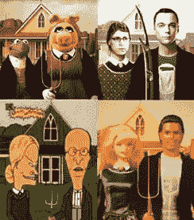

# 脸书、布偶团和帕丽斯·希尔顿有什么共同点？

> 原文：<https://www.sitepoint.com/facebook-friends-icon/>

你可能知道这张图片。

这是由[格兰特·伍德](http://www.americangothichouse.net/about/the-artist/) (1930)创作的美国哥特式——20 世纪最容易辨认的图像之一。

即使你认不出原作，你也有可能至少看过其中的一个仿制品。从《芭比与肯》到《洛基恐怖秀》,从帕丽斯·希尔顿到《辛普森一家》,你会看到这种形象被广泛引用——事实上，在此不胜枚举。

### 那么，为什么它经常被引用呢？

提线木偶，生活大爆炸，比维斯&大头鱼&芭比&肯

美国哥特式是“标志性”形象的定义。这个意象大胆、简单且易于解析——是两个人和房子。虽然从技术上来说，这是一幅“美术作品”，但它的构成几乎像个孩子——就像一个符号或路标。

但尽管如此简单，我们还是情不自禁地从中获取了许多额外的信息。

我们大概猜测:

*   这些人住在那栋房子里。
*   他们很可能是一对已婚夫妇(尽管有些人认为这个女人是个女儿)。
*   他们穿着传统的农家服装。我们可能会期望他们是虔诚的、坚韧的和保守的。
*   女人被男人遮住了一部分，看向别处，避开了我们的目光。她身后的门廊上有精心照料的鲜花。
*   男的比较高，稍微站在女的前面，称霸三分之二的框架。他拿着一把看起来很锋利的干草叉，和我们进行冷静的眼神交流。

画家清楚地表明了这幅画中的老板是谁。这不仅仅是一张照片，而是一个小故事。

### 脸书哥特式？

界面图标是他们自己的小图标艺术品，通常比美国哥特式更简单。图标设计的技巧在于尽可能地去除无关的细节。然而，无论细节如何，最终都会更有说服力——它也讲述了一个故事。

直到最近，脸书也有了自己的微型艺术品，模仿了伍德的原创杰作。呼应美国哥特式，脸书朋友图标描绘你的朋友作为一个小女人的影子略高的男子。

好友图标(带干草叉)

我承认我在这里临时加了一个干草叉有点恶作剧。但即使没有它，美国哥特式的“视觉回声”仍然清晰可见。

或者它的 ***就是*** 。

最近，脸书设计师凯特琳·温纳注意到了这个问题，并着手进行调整。上个月，她在一个很棒的媒体帖子中记录了自己的过程。

成功的符号和图标的一个问题是，它们变得如此无处不在，以至于我们不再真正地 ***看到*** 它们——至少用新鲜的眼光。凯特琳正试图改变这种状况。

> 作为这个项目的结果，我对象征主义保持高度警惕。我试着质疑所有的图标，尤其是那些感觉最熟悉的图标。例如，公文包是‘工作’的最佳象征吗？

原始好友图标与更新图标

这是一个聪明的方法。一方面，凯特琳对非常小的图像做了非常微妙的改变。另一方面，这是一张每天呈现给全球十亿用户的图片。这是一个巨大的影响——比可口可乐、迪士尼或国际足联这样的巨擘影响更广。

有时候，最细微的事情最能说明问题。

*[原载](https://go.sitepoint.com/t/ViewEmail/y/BC45DCBE445BB161)于 [SitePoint 设计简讯](https://www.sitepoint.com/newsletter/)。*

## 分享这篇文章