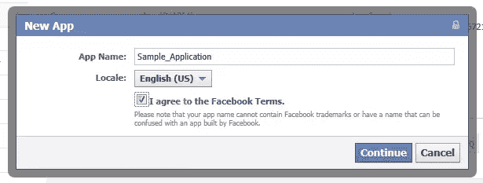
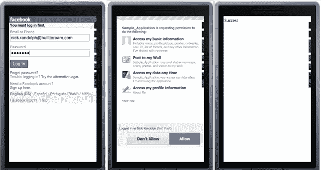
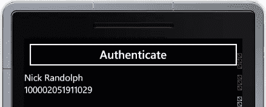

# Windows Phone 7 应用程序中的脸书

> 原文：<https://www.sitepoint.com/facebook-in-a-windows-phone-7-app/>

在上一篇文章“[在 Windows Phone 应用程序中使用 Windows Live ID](https://www.sitepoint.com/using-windows-live-id-in-a-windows-phone-7-app/)”中，您看到了如何验证用户身份并从 Windows Live 中检索他们的个人资料。脸书还使用 OAuth 2 允许第三方应用程序验证脸书数据并与之交互。在这篇文章中，你将了解脸书的实现，以及如何从你的 Windows Phone 应用程序中将状态更新发送回脸书。

### 步骤 1:创建脸书应用程序

打开网页浏览器，进入[脸书开发者页面](http://developer.facebook.com)。为了创建应用程序，您需要使用一组脸书凭据登录。同样，我们建议创建一个专用的脸书帐户来管理您的应用程序。

点击应用选项卡，然后点击创建新应用按钮。系统会提示您输入关于您正在创建的应用程序的信息(图 1)。请记住，当用户授权您的应用程序访问他们的脸书帐户时，他们会看到这些信息中的大部分。


[](https://www.sitepoint.com/wp-content/uploads/2011/07/sp0009_01.png)

图 1

一旦你点击“继续”按钮，你将被提示完成一个验证码风格的挑战，然后被分配一个应用 ID 和应用密码(图 2)。


[](https://www.sitepoint.com/wp-content/uploads/2011/07/sp0009_02.png)

图 2

### 步骤 2:创建外壳 Windows Phone 应用程序

为了说明使用脸书进行身份验证的过程，我们将使用一个与之前使用 Windows Live ID 进行身份验证的应用程序类似的应用程序。同样，我们有一个`WebBrowser`控件、一个用于触发认证过程的`Button`控件和两个用于显示用户信息的`TextBlock`控件。

```
<phone:PhoneApplicationPage x:Class="FacebookSampleApp.MainPage"

    xmlns:x="http://schemas.microsoft.com/winfx/2006/xaml"
    xmlns:phone="clr-namespace:Microsoft.Phone.Controls;assembly=Microsoft.Phone">
    <Grid>
        <StackPanel x:Name="LayoutRoot" Background="Transparent">
            <Button Content="Authenticate" Click="AuthenticateClick" />
            <TextBlock x:Name="UserNameText" />
            <TextBlock x:Name="UserIdText" />
        </StackPanel>
        <phone:WebBrowser x:Name="AuthenticationBrowser" Visibility="Collapsed"  
                                                Navigated="BrowserNavigated" IsScriptEnabled="True" />
    </Grid>
</phone:PhoneApplicationPage>
```

### 步骤 3:创建登录 URL

这一步包括构建正确的 URL 来导航`WebBrowser`控件，以便用户可以登录脸书。URL 由许多元素组成:

*   基本网址:`http://www.facebook.com/dialog/oauth`
*   查询字符串参数:
    *   客户端 ID:分配给您刚刚创建的脸书应用程序的应用程序 ID
    *   响应类型:要使用的认证类型(我们将使用“令牌”)
    *   作用域:宿主应用程序请求访问的用户帐户部分
    *   重定向 URL:身份验证完成后，浏览器将重定向到的 URL。在这种情况下，我们将使用脸书托管的富客户端返回 URL，`http://www.facebook.com/connect/login_success.html`。
    *   Display:确定登录提示的样式。使用“触摸”以获得触摸驱动设备的最有用界面。

这一步唯一的技巧是确保所有的参数都被正确地连接起来，并进行适当的 URL 编码。

```
var uriParams = new Dictionary<string, string>() {
                        {"client_id", "<your_app_id>"},
                        {"response_type", "token"},
                        {"scope", "user_about_me, offline_access, publish_stream"},
                        {"redirect_uri", "http://www.facebook.com/connect/login_success.html"},
                        {"display", "touch"}
                    };

StringBuilder urlBuilder = new StringBuilder();
foreach (var current in uriParams) {
    if (urlBuilder.Length>0) {
        urlBuilder.Append("&amp;");
    }
            var encoded = HttpUtility.UrlEncode(current.Value);
            urlBuilder.AppendFormat("{0}={1}", current.Key, encoded);
}
var loginUrl= "http://www.facebook.com/dialog/oauth?" + urlBuilder.ToString();
```

此处定义的范围元素请求应用程序访问配置文件信息的权限(“user_about_me”)，持久化访问令牌(“offline_access”)和发布状态更新(“publish_stream”)。

### 步骤 4:提示用户登录

为了让用户登录，您所要做的就是将`WebBrowser`控件导航到您刚刚创建的`loginUrl`控件。在这个应用程序中，你还需要显示`WebBrowser`控件。

```
AuthenticationBrowser.Navigate(new Uri(loginUrl));
AuthenticationBrowser.Visibility = Visibility.Visible;
```

### 步骤 5:用户登录并批准应用程序

用户将看到许多屏幕，提示他们输入凭证，然后将请求的权限授予应用程序(图 3)。


[](https://www.sitepoint.com/wp-content/uploads/2011/07/sp0009_031.png)

图 3

### 步骤 6:提取访问令牌

在图 3 中，最后一个图像是重定向 URI，在隐藏`WebBrowser`控件之前，您的应用程序应该解析该页面的 URI 查询字符串并提取访问令牌。

```
public string AccessToken { get; set; }
private void BrowserNavigated(object sender, NavigationEventArgs e) {
    if (string.IsNullOrEmpty(e.Uri.Fragment)) return;
    if (e.Uri.AbsoluteUri.Replace(e.Uri.Fragment,"")==
         "http://www.facebook.com/connect/login_success.html") {
        string text = HttpUtility.HtmlDecode(e.Uri.Fragment).TrimStart('#');
        var pairs = text.Split('&amp;');
        foreach (var pair in pairs) {
            var kvp = pair.Split('=');
            if (kvp.Length == 2) {
                if (kvp[0] == "access_token") {
                    AccessToken = kvp[1];
                    MessageBox.Show("Access granted");
                }
            }
        }

        if (string.IsNullOrEmpty(AccessToken)) {
            MessageBox.Show("Unable to authenticate");
        }

        AuthenticationBrowser.Visibility = System.Windows.Visibility.Collapsed;
    }
}
```

### 步骤 7:从脸书访问内容

您收到的访问令牌应仅用于与脸书互动，而不应用于唯一识别当前用户。要访问用户信息，包括唯一标识符，您应该通过脸书图形 API 请求他们的配置文件信息。Graph API 请求从基本 URL`https://graph.facebook.com`开始，在它后面附加一个反映所请求数据的路径。在配置文件信息的情况下，您只需将`/me`附加到基本 url。下面的代码演示了如何制作一个`HttpWebRequest`来从脸书检索配置文件信息。

```
private void RequestUserProfile() {
    var profileUrl = string.Format("https://graph.facebook.com/me?access_token={0}",  
                                                           HttpUtility.UrlEncode(AccessToken));

    var request = HttpWebRequest.Create(new Uri(profileUrl));
    request.Method = "GET";
    request.BeginGetResponse(result => {
              try {
                  var resp = (result.AsyncState as HttpWebRequest).EndGetResponse(result);
                  using (var strm = resp.GetResponseStream()) {
                      var serializer = new DataContractJsonSerializer(typeof (FacebookProfile));
                      var profile = serializer.ReadObject(strm) as FacebookProfile;
                      this.Dispatcher.BeginInvoke(
                          (Action<FacebookProfile>) ((user) => {
                                                      this.UserIdText.Text = user.Id;
                                                      this.UserNameText.Text = user.Name;
                                                                                                    }), profile);
                                            }
              }
              catch (Exception ex) {
                  this.Dispatcher.BeginInvoke( () => 
                      MessageBox.Show("Unable to attain profile information"));
              }
          }, request);
}

[DataContract]
public class FacebookProfile {
    [DataMember(Name="id")]
    public string Id { get; set; }
    [DataMember(Name="name")]
    public string Name { get; set; }
}
```

最终输出是出现在相关的`TextBlock`控件中的用户名和 ID(图 4)。


[](https://www.sitepoint.com/wp-content/uploads/2011/07/sp0009_04.png)

图 4

### 步骤 8:发布状态更新

为了请求配置文件信息，您对配置文件路径`/me`执行了 GET 操作。为了更新用户的状态，您需要在`/me/feed`发布到状态源。与 GET 操作相反，在 GET 操作中，访问令牌是作为 URL 参数传递的，而在 POST 操作中，所有参数都被指定为请求主体中的表单参数。下面的代码演示了如何使用`HttpWebRequest`发布状态更新。

```
private void PostStatusUpdate(string status, Action<bool, Exception> callback) {
    var request = HttpWebRequest.Create("https://graph.facebook.com/me/feed");
    request.Method = "POST";
    request.ContentType = "application/x-www-form-urlencoded";
    request.BeginGetRequestStream((reqResult) => {
        using (var strm = request.EndGetRequestStream(reqResult))
        using (var writer = new StreamWriter(strm)) {
            writer.Write("access_token=" + AccessToken);
            writer.Write("&amp;message=" + HttpUtility.UrlEncode(status));
        }

        request.BeginGetResponse((result) => {
            try {
                var response = request.EndGetResponse(result);
                using (var rstrm = response.GetResponseStream()) {
                    var serializer = new DataContractJsonSerializer(typeof(FacebookPostResponse));
                    var postResponse = serializer.ReadObject(rstrm) as FacebookPostResponse;
                    callback(true, null);
                }
            }
            catch (Exception ex) {
                callback(false, ex);
            }
        }, null);
    }, null);
}

[DataContract]
public class FacebookPostResponse {
    [DataMember(Name = "id")]
    public string Id { get; set; }
}
```

为了允许用户指定他们的新状态，让我们向用户界面添加一个文本框和一个按钮:

```
<TextBox x:Name="StatusText" />
<Button Content="Post Status Update" Click="PostUpdateClick" />
```

`PostUpdateClick`方法将依次调用`PostStatusUpdate`方法，传入`TextBox`的值。

```
private void PostUpdateClick(object sender, RoutedEventArgs e) {
    PostStatusUpdate(this.StatusText.Text, (success,ex)=> {
        this.Dispatcher.BeginInvoke(() => {
            if (success &amp;&amp; ex == null) {
                MessageBox.Show("Status updated");
            }
            else {
                MessageBox.Show("Unable to update status");
            }
        });
    });
}
```

在这篇文章中，你看到了如何通过脸书认证，以及如何与脸书图形 API 交互来检索和更新数据。脸书包含大量关于用户、他们的朋友和他们的社交活动的数据，其中大部分可以通过 Graph API 访问。然而，需要注意的是:脸书和其他社交网络一样，有更新 API 的习惯，偶尔也会更新 API 的使用政策。确保您开发的应用程序对变化具有弹性，并能优雅地处理 API 变化可能导致的任何异常。更多信息可通过[脸书开发者门户](http://developers.facebook.com)和[脸书图形 API](https://developers.facebook.com/docs/reference/api/) 文档获得。

## 分享这篇文章